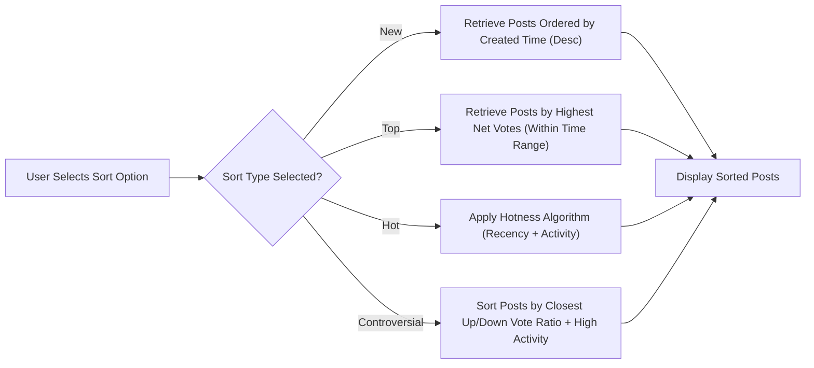
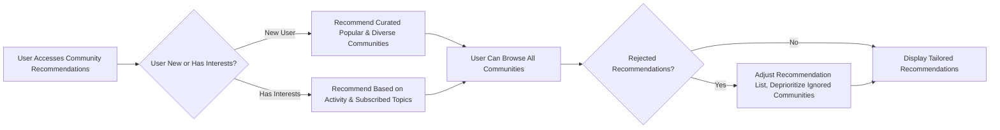

# Sorting, Discovery, and Recommendation Business Requirements for Reddit-like Community Platform

## 1. Introduction & Scope

This document details the business requirements for sorting, discovering, recommending, and searching posts, comments, and communities for a Reddit-like community platform. It defines the business intent and observable user experience for all core content ranking, discovery, and recommendation workflows. All requirements adopt the EARS format for clarity and testability. No technical implementation approaches, database schemas, or API specifications are included; this is a business requirements document for development and QA teams.

## 2. Sorting Logic

### 2.1 Overview

Users interact with core content through various sort orders (Hot, New, Top, Controversial), each serving a unique angle of discoverability and user engagement. Sorting applies to both posts and comments within communities.

#### 2.2 Definitions of Sorting Orders (Business Meaning)
- **New**: Most recent content at the top, rewarding freshness.
- **Top**: Content with the highest net votes or karma for a given time period, rewarding popularity.
- **Hot**: Content trending based on recency, vote activity, and engagement rate, surfacing timely discussions.
- **Controversial**: Content generating significant debate, measured by a mix of votes and vote balance.

### 2.3 Sorting Order Requirements (EARS Format)

#### 2.3.1 New Sort
- THE platform SHALL provide "New" sorting for posts and comments, displaying items by most recent creation timestamp (descending).
- WHEN a user selects "New" sorting in any community or for global content, THE platform SHALL return posts/comments ordered by creation time, newest first.
- IF no posts/comments exist for a given filter, THEN THE platform SHALL present an empty state message.

#### 2.3.2 Top Sort
- THE platform SHALL provide "Top" sorting for posts and comments within a community and globally.
- WHEN a user selects "Top", THE platform SHALL display posts/comments with the highest net voting score within a specified time range.
- WHERE a time range (e.g., "Top Today", "Top Week", "Top All Time") is specified, THE platform SHALL restrict considered content to that period.
- IF two or more items have an identical top voting score, THEN THE platform SHALL order them by most recent creation date first.
- THE platform SHALL support the following "Top" time ranges: Today, This Week, This Month, This Year, All Time.

#### 2.3.3 Hot Sort
- THE platform SHALL provide "Hot" sorting to highlight timely and trending posts and comments based on business-defined criteria combining recency and activity.
- WHEN a user selects "Hot" sorting, THE platform SHALL rank content by a business-defined algorithm prioritizing recent items, high and rapid voting, and engagement.
- THE platform SHALL ensure recent posts can surface even with relatively fewer net votes if activity is spiking.
- THE platform SHALL NOT allow older posts to indefinitely dominate "Hot" without continued active engagement.
- IF two posts have identical hotness score, THEN THE platform SHALL display the more recently created post first.

#### 2.3.4 Controversial Sort
- THE platform SHALL provide "Controversial" sorting for posts and comments, surfacing content with both high positive and negative voting activity (i.e., lots of upvotes and downvotes, and a close vote balance).
- WHEN a user selects "Controversial", THE platform SHALL display items where the ratio of upvotes to downvotes is close to 1:1, and the total volume of votes exceeds a business-defined threshold.
- WHERE items have similar controversy scores, THE platform SHALL order by most recent creation time.

#### 2.3.5 General Sorting Business Constraints
- THE system SHALL enable users to sort posts and comments by any of the above options wherever applicable (global feed, within a community).
- WHERE a sort is not available (e.g., no controversial posts), THE platform SHALL inform users clearly (empty state).
- WHERE users have set a default sort preference (e.g., always see "New"), THE platform SHALL remember this and apply it automatically on subsequent visits.

### 2.4 Table: Supported Sort Orders & Criteria

| Sort Order      | Business Criteria                                | Available For                  |
|-----------------|--------------------------------------------------|-------------------------------|
| New             | Most recent creation time                        | Posts, Comments, Global/Community |
| Top             | Highest net votes in chosen time range           | Posts, Comments, Global/Community |
| Hot             | Trending: Recent + High/Rapid Vote Activity      | Posts, Comments, Global/Community |
| Controversial   | High debate (votes both up and down, close score)| Posts, Comments, Global/Community |

### 2.5 Time Ranges for Top/Hot
- THE platform SHALL support business-selected time ranges: Today, This Week, This Month, This Year, All Time for "Top" (and, where relevant, "Hot").
- THE platform SHALL include a clear indicator of the active time range for users.

## 3. Community Discovery & Recommendations

### 3.1 Overview
Enabling users to discover new communities is essential for long-term engagement. Recommendations must be fair, diverse, and based on both user interests and wider community health.

### 3.2 Community Recommendation Requirements (EARS)

- WHEN a user has no subscriptions or is new to the platform, THE platform SHALL recommend a curated set of popular, active, and diverse communities.
- WHEN a user demonstrates interests (subscriptions, vote/activity history), THE platform SHALL recommend communities with similar themes, overlapping members, or related active discussions.
- WHERE a user repeatedly rejects or ignores certain recommendations, THE platform SHALL deprioritize those communities from future suggestions.
- THE platform SHALL NOT recommend communities with no recent activity or those marked as private/restricted unless the user is a member or has explicit invitation.
- IF a user is banned or suspended from a community, THEN THE platform SHALL NOT recommend that community to them.
- THE platform SHALL NOT recommend communities based on personal user data unrelated to on-platform actions or interests.
- THE system SHALL provide a public, always-available list for users to browse all communities, searchable with advanced filtering (see Section 4).
- THE platform SHALL aim to ensure diversity in community recommendations, including both popular and emerging topics.

### 3.3 Algorithmic Fairness & Abuse Prevention
- THE platform SHALL not allow community moderators or administrators to directly boost their own communities in organic recommendation lists.
- THE platform SHALL regularly review and rotate recommended communities to include a balance of new/emerging and established groups.

### 3.4 Business Rules for Featured or Sponsored Communities
- WHERE explicit business arrangements exist (e.g., sponsored communities), THE platform SHALL display them distinctly from organic recommendations and clarify their nature to the user.

## 4. Search and Filtering Business Rules

### 4.1 Supported Search Patterns (Business Constraints)

- THE platform SHALL support keyword-based search for communities, posts, and comments.
- THE platform SHALL allow search results to be filtered by community, post type (text, link, image), author, and date range.
- WHEN a user searches for content, THE platform SHALL match keywords against the title, body, tags, and relevant metadata.
- THE system SHALL prioritize results by relevancy, with options to override by sort order (New, Top, etc.).
- THE system SHALL highlight matched terms in the search results.
- WHERE no results are found, THE system SHALL display a clear message and recommend alternate search strategies or popular content.
- THE platform SHALL support partial search (substring matching) and autocorrect for common misspellings.
- IF a user submits an empty query, THEN THE system SHALL return trending communities and top posts as default suggestions.

### 4.2 Filtering Options (Business Perspective)

- THE system SHALL support filters for:
  - Community (by name or tag)
  - Content type (text, link, image)
  - Author (username)
  - Date/time ranges
  - Post status (active, removed, reported)
- WHERE filter options are not applicable (e.g., no images exist), THE system SHALL not display those filter choices.

### 4.3 User Experience Constraints

- THE system SHALL ensure that applying filters or changing search parameters updates results instantly, without unnecessary delay.
- THE system SHALL save user’s most recent search and filter settings to streamline subsequent searches.
- THE system SHALL show the active filters and provide a simple way to clear all filters at any time.

## 5. Edge Cases & Exception Handling

- IF a community or post counted in recommendations is deleted or becomes private, THEN THE system SHALL immediately exclude it from results and recommendations.
- IF a user has exceeded the rate limits for search or filter attempts, THEN THE platform SHALL notify the user to slow down and recover gracefully after a cooldown period.
- WHEN content is flagged or reported for abuse, THE system SHALL temporarily deprioritize or hide it from organic ranking and search until reviewed.
- IF a user attempts to access a restricted sort, search form, or filter (e.g., not authorized), THEN THE system SHALL present a clear message why access is denied.

## 6. Mermaid Diagrams Illustrating Discovery & Sorting Flows

### 6.1 Sorting Flow for Posts

### 6.2 Community Recommendation Flow

## 7. Summary Table of Business Rules for Sorting, Discovery, and Recommendations

| Area            | Rule Summary                                                                    |
|-----------------|---------------------------------------------------------------------------------|
| Sorting         | Users can sort content by New, Top (by range), Hot, Controversial; clear tiebreakers and defaults, with empty states handled. |
| Recommendations | New users get curated picks; active users get personalized, interest-based communities. Recommendations rotated for fairness. |
| Search/Filtering| Supports keyword, advanced filter by type, community, author, time; with real-time update and feedback for edge cases.         |
| Abuse/Edge      | Hidden content when flagged, deny rate-limited or unauthorized access, never promote deleted/private/reported items.           |

---

This document describes only the business requirements for sorting, discovery, and recommendation features. Technical implementation (database design, API design, algorithm specifics) is left to the development team’s discretion.