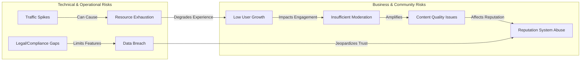

# Risks and Constraints for the Community Platform

## 1. Business and Technical Risks

### 1.1 Business Risks
- WHEN user adoption does not meet targets, THE platform SHALL face sustainability challenges affecting growth and monetization.
- WHEN reliance on user-generated content (UGC) is key, THE platform SHALL risk engagement dips due to content stagnation or poor quality.
- WHEN moderating public content, THE platform SHALL be exposed to risks from inappropriate, illegal, or offensive material, challenging reputation and legal standing.
- WHEN trust or privacy is breached (e.g., data leaks, misuse of user profiles), THE platform SHALL risk user loss and regulatory penalties.

### 1.2 Product Risks
- WHEN feature scope expands beyond initial core, THE development team SHALL risk delivery delays and increased complexity.
- WHEN platform policy is unclear or poorly enforced, THE user experience SHALL be inconsistent, leading to churn or backlash.
- WHEN reporting or moderation features are insufficient, THE system SHALL risk spreading harmful or unwanted content.

### 1.3 Technical Risks
- WHEN traffic spikes beyond forecasted levels, THE infrastructure SHALL risk degraded response times or outages.
- WHEN user input sanitization is insufficient, THE system SHALL risk vulnerability to XSS, injection, and related attacks.
- WHEN data integrity checks are missing, THE system SHALL risk corrupt or inconsistent user profiles, karma, or voting state.
- WHEN core algorithms for ranking (hot/new/top/controversial) are not rigorously tested, THE post order may be unfair, unpredictable, or abusable.
- WHEN image posting features are present, THE system SHALL risk storage overruns or abuse (e.g., large files, inappropriate media).

## 2. Operational Constraints

### 2.1 Legal and Regulatory Limits
- WHEN operating in multiple jurisdictions, THE system SHALL comply with local and international data privacy laws (e.g., GDPR) for user data and interaction logs.
- WHEN hosting user-uploaded images or content, THE system SHALL enforce copyright protections and content takedown processes.
- WHERE users are minors, THE platform SHALL have processes to comply with COPPA or region-specific child-protection regulations.
- WHEN users report inappropriate content, THE platform SHALL ensure timely review and necessary action in accordance with governing laws.

### 2.2 System Boundaries
- THE platform SHALL limit individual image upload sizes and total storage per user/community to prevent excessive consumption of resources.
- THE system SHALL throttle and rate-limit actions (posting, voting, reporting) to prevent spam or automated abuse.
- IF community names, post titles or profile fields exceed predefined character or format limits, THEN THE platform SHALL reject the input and inform the user.
- WHEN new features are proposed, THE development team SHALL ensure minimal impact on system performance and maintainability.

### 2.3 User-Related Constraints
- THE registration process SHALL require verification (e.g. via email).
- THE system SHALL restrict community creation or moderation to verified users with minimum karma or tenure.
- WHEN a user is banned, THE system SHALL revoke access fully and record the ban reason/audit log for administrators.

## 3. Growth Challenges

### 3.1 Scalability Risks
- WHEN the platform's user base grows rapidly, THE backend and database infrastructure SHALL need horizontal scalability to remain performant.
- WHEN the number of active communities increases, THE system SHALL require efficient community lookup/search mechanisms.
- WHEN concurrent posting, voting, and commenting increase, THE system SHALL optimize data handling for real-time experience.

### 3.2 Community Management
- WHEN communities are user-managed, THE risk of inactive, abandoned, or poorly-moderated groups increases, reducing overall user experience.
- WHEN moderators are insufficient or absent, THE system SHALL risk delayed response to reports and rule violations.
- WHEN subscription logic is inefficient at scale, THE system SHALL face delays in user feed calculations.

### 3.3 Reputation and Moderation Scaling
- WHEN the karma system is abused (e.g. by bots or coordinated voting), THE integrity of reputation scores SHALL be undermined.
- WHEN automated or community moderation is lacking, THE platform SHALL struggle to enforce rules at scale.

## 4. Mitigation Strategies

### 4.1 Business & Product Risk Mitigation
- THE product team SHALL develop an initial minimum viable feature set and prioritize features for clarity and on-time delivery.
- THE platform SHALL allow rapid reporting and effective moderation as first-class features.
- THE system SHALL provide transparent community guidelines and disclosure of policies during registration and on all community pages.
- THE platform SHALL engage users through onboarding prompts, community recommendations, and automated content suggestions to encourage early activity.

### 4.2 Technical Risk Mitigation
- THE backend team SHALL monitor all API response times and error rates, ensuring automated scaling and alerting.
- THE system SHALL implement robust input validation, file type/size checks, and rate-limiting across all user-facing endpoints.
- THE system SHALL log all voting and karma modifications with audit trails to support troubleshooting and prevent abuse.
- THE development team SHALL regularly conduct security reviews, vulnerability scanning, and unit/integration testing, particularly for ranking and voting algorithms.
- THE infrastructure SHALL be designed with horizontal scaling and redundancy in mind from the start.

### 4.3 Operational and Regulatory Mitigation
- THE platform SHALL maintain a clear privacy policy, visible takedown/DMCA process, and quick channels for abuse or copyright claims.
- THE system SHALL enable moderators and admins to manage reports and provide resolution feedback, ensuring compliance with both internal policy and legal requirements.
- THE system SHALL keep user, post, and activity logs securely and with respect for retention policies required by law.

### 4.4 Growth and Community Management Mitigation
- THE platform SHALL require minimum tenure or karma for community creation or moderator powers to ensure trustworthy actors.
- THE admin team SHALL proactively flag and review communities at risk of being abandoned or inactive.
- THE platform SHALL employ reputation and anti-abuse algorithms to detect unusual voting or posting patterns and escalate for manual review.
- THE system SHALL offer moderation toolkits, training for community leaders, and optional onboarding for moderators.

## Mermaid Diagram: Platform Risk Landscape

## Conclusion
THE intended Reddit-like platform SHALL be proactively managed to mitigate foreseeable business, technical, operational, and growth risks. Continuous monitoring, policy clarity, security best practices, and scalability planning are mandatory to maintain platform health, growth, and compliance.