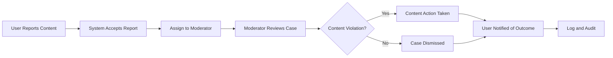

# Security, Privacy, and Compliance Business Requirements

## Introduction
This document defines the security, privacy, and legal compliance expectations for the communityPlatform system, providing business requirements and workflows to protect user data, prevent abuse, and ensure regulatory alignment. It is intended for backend developers, system architects, and compliance or security professionals responsible for implementing enterprise-grade backend controls for a Reddit-like community platform.

## User Data Protection and Privacy

### Data Privacy Principles
- THE system SHALL minimize the collection and retention of user personal data, restricting it to what is necessary for platform operation.
- WHEN user data is collected (e.g., during registration, content submission, reporting), THE system SHALL inform users about what data is required and how it will be used in clear language.
- THE system SHALL obtain user consent for all processing of personal information not strictly required for primary service delivery.
- THE system SHALL store passwords only using secure, one-way cryptographic hashes, and SHALL NEVER store plaintext passwords.

### User Control and Rights
- WHEN a user requests account deletion, THE system SHALL irreversibly remove all personally identifiable information (PII) and SHALL anonymize remaining contributions, except where legal obligations (such as deal with authorities or legal holds) require retention.
- WHEN a user requests to download their personal data, THE system SHALL provide all PII stored about that user in a machine-readable format within 30 days.
- WHEN a user changes their privacy settings, THE system SHALL immediately enforce updated visibility and exposure of their PII and content, as defined by the new settings.

### Data Access and Retention
- THE system SHALL restrict access to personal, sensitive, or identifying information strictly to authorized users/roles, logging all access and modifications for audit.
- THE system SHALL retain user personal data only as long as required for legitimate business or legal needs and SHALL automatically purge it (including backup copies) after the retention period expires.

### Data Security Measures
- WHEN transmitting or storing any sensitive information, THE system SHALL use state-of-the-art encryption.
- IF unauthorized access or breach is detected, THEN THE system SHALL notify affected users and administrators without undue delay, consistent with applicable laws.

### Error Handling & Exceptions
- IF a data subject right (e.g., deletion, rectification) cannot be processed due to legal conflict/shutdown, THEN THE system SHALL notify the user with a clear justification and escalation process.

## Content Moderation Workflow

### Reporting and Review
- WHEN any user submits a report against content for violating guidelines, THE system SHALL accept the report and assign it to the appropriate community moderator.
- WHEN a moderator receives a report, THE system SHALL provide access to case context and content history, including previous actions and reporter anonymity.
- THE system SHALL log all moderation actions, including removals, suspensions, and appeals, with actor, timestamp, reason, and affected content.

#### Flow Diagram

### Escalation and Appeals
- WHEN a moderator is uncertain about community guideline applicability or receives a high-severity report (e.g., legal risk, physical threats), THE system SHALL escalate the report to an administrator for final resolution.
- WHEN a user content removal or sanction occurs, THE system SHALL offer the affected user an appeals process within defined time limits.
- IF a user wins their appeal, THEN THE system SHALL restore any sanctioned content where legally and technically feasible.

## Abuse and Spam Prevention

### Account and Content Abuse
- WHEN an account exhibits automated, high-frequency, or unusual activity (e.g., mass posting, mass upvoting, or reporting), THE system SHALL temporarily restrict the account and flag for moderator review.
- IF duplicate or highly similar content is repeatedly posted in a short timeframe, THEN THE system SHALL require a CAPTCHA or other proof of human presence before accepting further posts.
- WHEN a user attempts to manipulate karma or voting (e.g., vote brigading, sockpuppeting), THE system SHALL detect the behavior and adjust the impact of their votes accordingly (up to discounting or nullifying them).
- THE system SHALL enforce minimum account reputation and/or age rules for sensitive actions (e.g., posting in certain communities, reporting, downvoting) to deter spam/abuse.
- THE system SHALL block users or IP addresses after repeated failed authentication or abuse attempts, subject to rate limits and legal requirements.
- IF a banned or muted user attempts restricted actions, THEN THE system SHALL prevent these actions and inform the user of their restriction status and duration.

### Spam Filtering and Automation
- THE system SHALL use automated spam detection (e.g., keyword analysis, behavioral heuristics, user reports) to pre-filter content, flagging suspicious submissions for moderator review.
- WHEN spam or abusive content is detected, THE system SHALL remove or quarantine it immediately, subject to post-action moderator review.

### Error Handling Scenarios
- IF false positives or wrongful blocks occur (e.g., legitimate user blocked for spam), THEN THE system SHALL provide a clear and timely appeal or restoration workflow.

## Compliance with Applicable Laws

### General Data Protection Regulation (GDPR)
- THE system SHALL provide users in the EU full access to personal data records, the right to withdrawal of consent, and irreversible deletion ("right to be forgotten") as required by GDPR.
- WHEN receiving a data subject request from an EU user, THE system SHALL fulfill the request or provide a compliant denial explanation within one month.

### Digital Millennium Copyright Act (DMCA)
- WHEN receiving a DMCA takedown notice, THE system SHALL remove identified content within statutory timelines and promptly notify affected users.
- WHEN a counter-notification is received, THE system SHALL follow DMCA procedures for content restoration, unless overruled by a court order.

### Children's Online Privacy Protection Act (COPPA)
- THE system SHALL prohibit users under the threshold age (e.g., under 13 in the US) from registering or submitting content, and SHALL not knowingly collect information from those users.

### Other Jurisdictions
- THE system SHALL comply with user data, privacy, and reporting laws of other major jurisdictions in which service is offered, maintaining documentation to demonstrate compliance.

### Law Enforcement and Legal Holds
- WHEN presented with valid court or law enforcement orders, THE system SHALL comply with data preservation or disclosure requirements, limiting sharing to only what is legally necessary and logging all access.

## Summary Table: Key Security, Privacy, and Compliance Requirements

| Requirement Category        | Business Rule Example                                                                                 |
|----------------------------|------------------------------------------------------------------------------------------------------|
| Data Access Control         | Only authorized personnel (e.g., moderators, admins) can access sensitive or reported user data       |
| Personal Data Deletion      | Users can request PII deletion at any time; platform must purge and anonymize residual content       |
| Moderation Logging          | Every moderation action, report, sanction, or appeal must be logged with reason and timestamp        |
| Automated Spam Filtering    | All content scanned for spam; suspicious posts are flagged or removed for moderator review            |
| Regulatory Compliance       | System supports GDPR, DMCA, COPPA requirements for transparency, access, and deletion rights         |
| User Appeal Mechanisms      | Users are notified of sanctions and can appeal within business-defined time windows                  |
| Law Enforcement Handling    | Data provided to authorities only with lawful order, with minimal scope and full audit logging        |

## Cross-References
For additional details, please refer to:
- [User Actor and Permissions Reference](./05-user-actors.md)
- [Primary User Journey Scenarios](./06-primary-user-journeys.md)
- [Secondary and Exceptional Scenarios Document](./07-secondary-exceptional-scenarios.md)

---

*This document defines business requirements only. All technical implementations, such as architecture, APIs, or database design, are at the discretion of the development team.*
