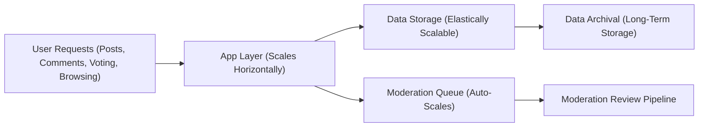
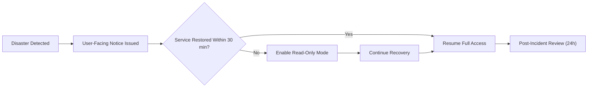

# Performance, Scalability, and Business Continuity Requirement Analysis Report

## 1. Expected Performance Benchmarks

THE community platform SHALL offer a seamless experience with minimal wait times for core business flows (registration, posting, browsing, voting, commenting, subscription management, reporting) across all business actors including users, moderators, and administrators. All requirements are specified as business-facing, testable measures.

**Page Loads and General Browsing**
- WHEN a user opens any community or post feed, THE system SHALL return the first page of results within 1 second in 95% of all access attempts under normal usage.
- WHEN a user searches for communities, posts, or users, THE system SHALL return results within 2 seconds for 95% of queries.

**Registration and Authentication**
- WHEN a new or returning user submits login credentials, THE system SHALL process credentials and respond with authentication success or failure within 2 seconds for at least 99% of attempts.
- WHEN an account is created, THE system SHALL send the verification email within 30 seconds.

**Posting and Commenting**
- WHEN a user submits a post or comment, THE system SHALL acknowledge creation and update the community feed and user profile within 1 second for 95% of submissions.
- WHEN users edit or delete their content, THE system SHALL process changes and reflect updates in all visible locations within 1 second for 95% of actions.

**Voting and Karma Updates**
- WHEN a user votes on any post or comment, THE system SHALL update the displayed score and the author's karma within 1 second for 95% of cases and maintain backend consistency within 3 seconds in all circumstances.

**Image Uploads**
- WHEN a user uploads an image (max 10MB), THE system SHALL display upload progress and confirm completion or error within 5 seconds for 99% of cases.
- WHEN an image upload fails, THE system SHALL display an actionable error and allow reattempts without loss of other entered data.

**Profile and Subscription Management**
- WHEN a user changes subscription status (subscribe or unsubscribe), THE user's preference SHALL be persisted and reflected in their personalized content feed instantly (on next page load or refresh).
- WHEN viewing any user profile (posts, comments, karma), THE system SHALL show all relevant data within 2 seconds for 95% of requests.

**Business Uptime and Reliability Standards**
- THE system SHALL maintain at least 99.9% service availability for core user actions over rolling 30-day windows, except during clearly scheduled maintenance.
- WHEN critical maintenance is scheduled, THE platform SHALL notify all users 24 hours in advance, except for urgent security or infrastructure emergencies.

## 2. Scalability Requirements

**Community, User, and Content Scale**
- THE system SHALL support registration of no fewer than 10 million users and monthly activity from 100 million unique visitors, providing all business features without degradation below performance benchmarks.
- THE system SHALL support at least 100,000 distinct communities with continuous organic creation and growth without manual limits.
- WHEN a single community exceeds 1 million members or accumulates over 500,000 posts, THE system SHALL still deliver all core performance service levels for browsing, posting, voting, and moderation.

**Content Submission and Interaction Volume**
- THE system SHALL allow up to 1,000 new posts per minute and up to 10,000 comments per minute platform-wide, keeping all feeds and profile views current in real time.
- WHEN a post or topic becomes viral or trending, THE system SHALL ensure logged-in users experience no service degradation when posting, voting, or commenting.
- THE system SHALL accommodate a minimum of 100 TB of user-generated image uploads and a minimum of 10 years of content and account history for all business scenarios, without manual archiving.

**Voting, Reporting, and Moderation Events**
- WHEN voting surges to 1,000 votes per minute platform-wide, THE system SHALL reflect voting and karma changes in real time within defined performance benchmarks.
- WHEN reporting surges to 100,000 new content reports in a single hour, THE system SHALL queue, process, and escalate reports for moderators and administrators while keeping all core user experiences uninterrupted for all business actors.

**Diagram: High-Level Scalability Flow**

## 3. Capacity Planning (Business Terms)

**Baseline Operations and Growth Forecasts**
- THE system SHALL launch with business capacity for at least 100,000 monthly active users and automatically scale up by 3x within 30 days of a business decision to stimulate growth, with zero downtime.
- WHEN business triggers indicate user or content surges (e.g., viral expansion, regional launches), THE system SHALL expand compute, storage, and moderation resources preemptively and without delays to the user experience.
- WHEN launching a new region, THE system SHALL provide local content delivery and failover redundancy within 4 hours of the business launch signal.

**Service Upgrades**
- THE system SHALL support planned business upgrades (hardware/customer-facing features) with zero downtime via staged rollouts and automatic fallback.
- All upgrades and service expansions SHALL produce no negative impact on ongoing user actions or data retention.

**Monitoring and Alerting**
- THE platform SHALL provide real-time, business-accessible dashboards of all key service metrics, including active users, post/comment rates, trending community growth, moderation backlog, and voting throughput.
- WHEN p95 latency for posting, voting, or search exceeds 2 seconds, or error rates for critical flows exceed 0.1%, THE system SHALL alert business operations and automatically throttle non-essential batch jobs until service recovers.

## 4. Business Continuity and Disaster Recovery

**Backups and Data Protection**
- THE system SHALL maintain daily, offsite, encrypted backups for all critical user, content, and moderation data. A minimum of 30 historical backup snapshots SHALL always be available for recovery.
- WHEN a data corruption or loss is detected, THE system SHALL fully restore all user and community data from the latest healthy backup within 2 hours for 99% of recovery events, with business priority on active communities.
- THE system SHALL keep full data redundancy across geographically separate zones to ensure failover is possible in case of regional incidents.

**Disaster Recovery and Fallback**
- WHEN a core service outage occurs, THE system SHALL publish a user-facing status page within 15 minutes, update users regularly, and provide read-only access within 30 minutes whenever possible.
- WHEN an unplanned incident disrupts service for more than 30 minutes, THE system SHALL enable a "read-only" mode for browsing, with clear notice to all users, until full write capability is restored.
- WHEN a major recovery concludes, THE team SHALL deliver a business-oriented post-incident review within 24 hours to all relevant stakeholders, with learnings and improved mitigation steps.

**Diagram: Disaster and Business Continuity Workflow**

## 5. Summary Table: Key Performance, Scalability & Continuity Requirements

| Requirement Area           | Business Rule/Benchmark                                       |
|---------------------------|---------------------------------------------------------------|
| Page Load & Search        | <= 2s p95 (most interactions, all users/feeds)                |
| Registration/Login        | <= 2s for 99% of auth events                                  |
| Post/Comment/Vote Write   | <= 1s for 95% of submissions                                  |
| Image Upload              | <= 5s for files up to 10MB (99% cases)                        |
| Uptime SLA                | >= 99.9% core features, 30d window                            |
| User & Community Scale    | 10M users, 100M unique visitors/mo, 100K+ communities         |
| Posting/Commenting Scale  | 1,000 posts/min, 10,000 comments/min, no manual archive needed|
| Moderation Event Surge    | 100K reports/hr handled, no block for other users             |
| Data Backup               | Daily encrypted offsite, 30d retention, 2h recovery p99       |
| Disaster Fallback         | Status page in 15 min, read-only mode if >30 min outage       |
| Recovery Communication    | Post-incident review sent within 24hr to stakeholders         |

---

All requirements are formulated in business terms and represent the business expectations for the platform’s developers, SRE, operations, and product teams. Technical implementation, solution architecture, and APIs are at the discretion of the backend development team and are not specified here. This document alone is comprehensive and actionable for delivering business-grade performance, scale, and continuity for the community platform.