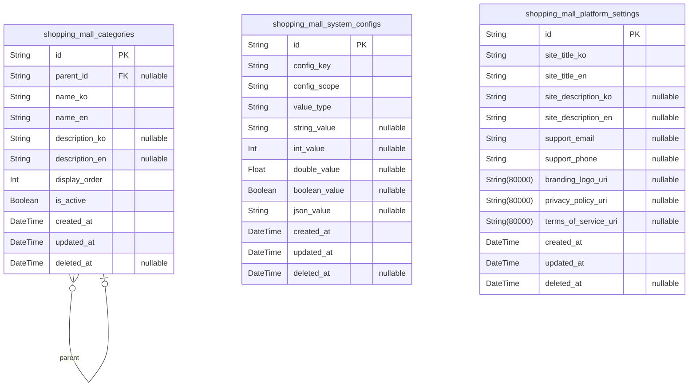
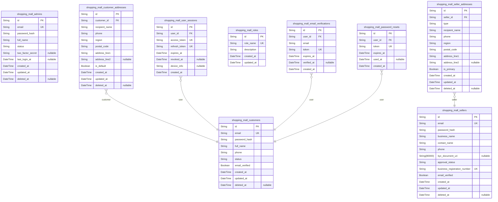
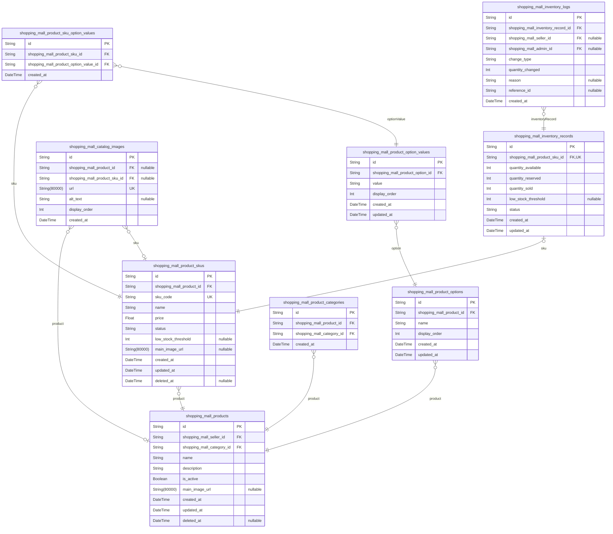
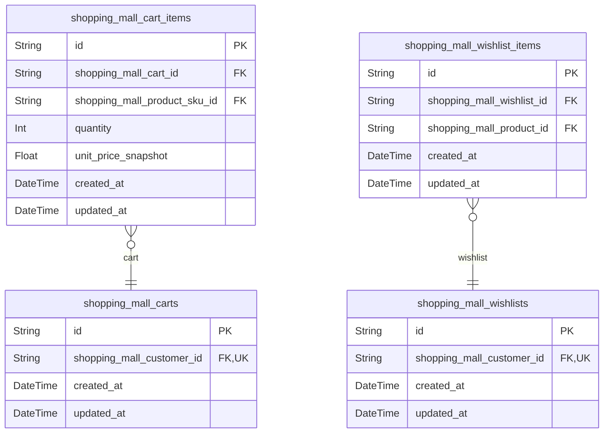
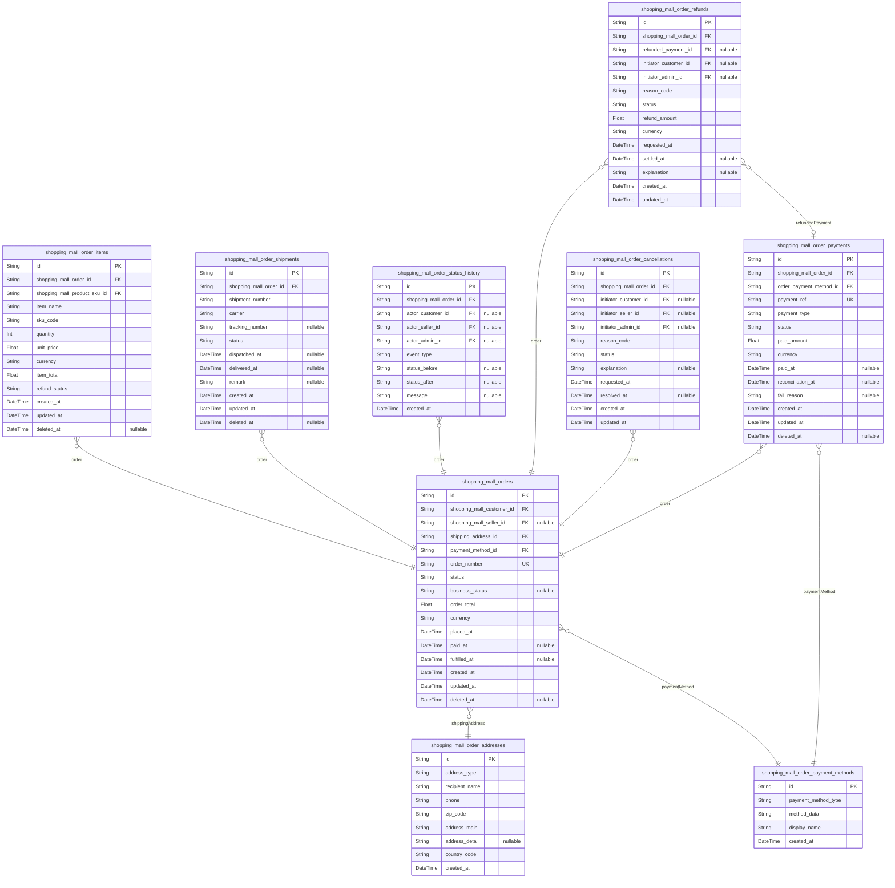
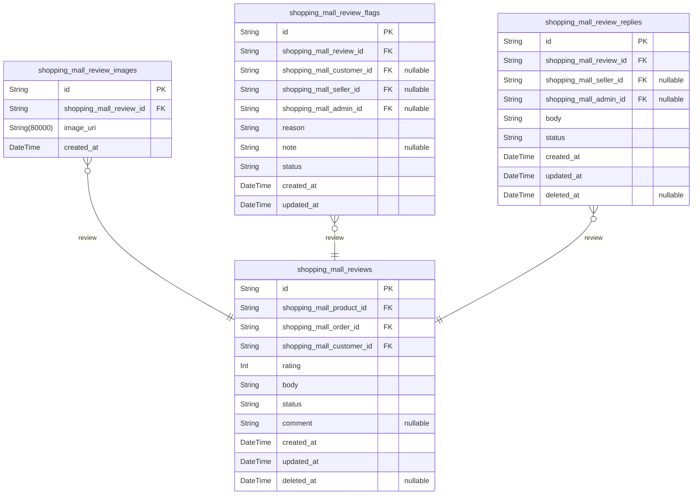
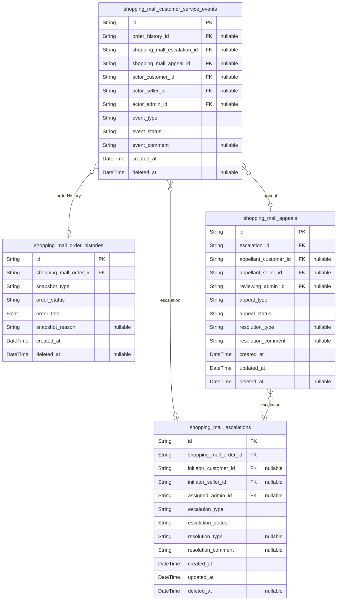
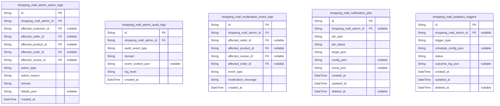
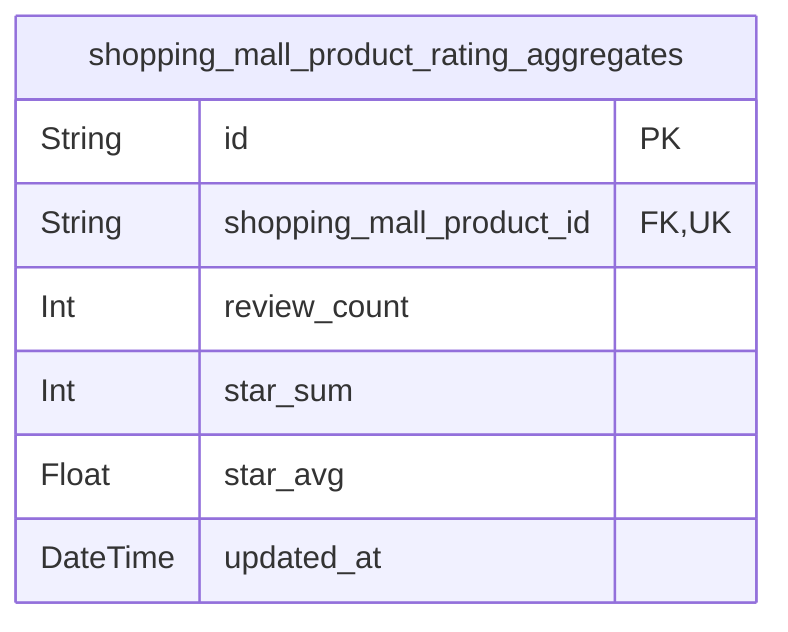

# Prisma Markdown

> Generated by [`prisma-markdown`](https://github.com/samchon/prisma-markdown)

- [Systematic](#systematic)
- [Actors](#actors)
- [Catalog](#catalog)
- [Shopping](#shopping)
- [Orders](#orders)
- [Reviews](#reviews)
- [CustomerService](#customerservice)
- [Admin](#admin)
- [default](#default)

## Systematic

### `shopping_mall_categories`

Hierarchical category tree table for organizing all products,
collections, and search facets. Supports multilingual category
names/descriptions. Self-referencing for parent/child, root categories
have null parent_id. Used platform-wide for all systems referencing
categories (products, catalogs, navigation, admin tools). Enforces unique
category names within a parent for each language. Fast text search and
hierarchical queries supported. All changes trigger global cache
invalidation. [shopping_mall_categories.id](#shopping_mall_categories).

Properties as follows:

- `id`: Primary Key.
- `parent_id`
  > Optional parent category's [shopping_mall_categories.id](#shopping_mall_categories). Root
  > categories have null parent_id.
- `name_ko`
  > Category name in Korean. Required for localization support. Unique within
  > parent category.
- `name_en`
  > Category name in English. Required for localization support. Unique
  > within parent category.
- `description_ko`
  > Category description in Korean. Optional for longer text or category
  > explanation.
- `description_en`
  > Category description in English. Optional for longer text or category
  > explanation.
- `display_order`
  > Ordering index for display in navigation, 0-based. Allows admin sorting
  > of sibling categories.
- `is_active`
  > Whether the category is active/enabled across platform. Inactive disables
  > all subcategories and associated products.
- `created_at`: Creation timestamp.
- `updated_at`: Last update timestamp (for cache invalidation, reindex triggers).
- `deleted_at`: Soft-delete timestamp. Null if not deleted.

### `shopping_mall_system_configs`

System configuration key-value store for all dynamic runtime settings and
feature toggles. Managed directly by platform admins via API or
dashboard. Every config is uniquely identified by a (key, scope) pair,
supports value typing for safe retrieval, and audit trails for changes.
Used for feature flags, 3rd party credentials, rate limits, operational
switches, and critical platform customizations. No cross-domain
dependencies. [shopping_mall_system_configs.id](#shopping_mall_system_configs).

Properties as follows:

- `id`: Primary Key.
- `config_key`
  > System-wide unique config key (case-insensitive, e.g. 'enable_payments',
  > 'max_cart_size').
- `config_scope`
  > Config scope (e.g., 'global', 'payment', 'product', 'review').
  > Modularizes config space. Required for namespacing.
- `value_type`
  > Stored value type for this config (e.g., 'string', 'int', 'boolean',
  > 'json'). Used for proper dynamic retrieval.
- `string_value`
  > String value for configs whose data type is string. Nullable for
  > non-string/configs.
- `int_value`
  > Int value for configs whose data type is integer. Nullable for
  > non-integer/configs.
- `double_value`
  > Double value for configs whose data type is double (e.g. percentages,
  > rates). Nullable for non-double/configs.
- `boolean_value`
  > Boolean value for configs whose data type is boolean or feature-toggle.
  > Nullable for non-boolean/configs.
- `json_value`
  > JSON-encoded string for configs with structured data. Nullable for
  > non-json/configs.
- `created_at`: Creation timestamp.
- `updated_at`: Last update timestamp.
- `deleted_at`: Soft-delete timestamp. Null if not deleted.

### `shopping_mall_platform_settings`

Global platform-wide settings. Used for static-but-editable metadata
(site title, description, support info), branding, and legal policies.
Not as dynamic as configs—edited via admin and rarely changed. Acts as
reference for platform-wide UI/SEO/meta/branding, not for runtime
toggles. Directly editable only by admins. No business or domain
dependencies. [shopping_mall_platform_settings.id](#shopping_mall_platform_settings).

Properties as follows:

- `id`: Primary Key.
- `site_title_ko`: Platform/site title for Korean version.
- `site_title_en`: Platform/site title for English version.
- `site_description_ko`: Platform/site description for Korean version, used for SEO and UI.
- `site_description_en`: Platform/site description for English version, used for SEO and UI.
- `support_email`: Customer support email address.
- `support_phone`: Customer support phone number (for display in UI/policy).
- `branding_logo_uri`: Public URI to primary branding logo image file.
- `privacy_policy_uri`: URI to privacy policy legal document (public).
- `terms_of_service_uri`: URI to terms of service legal document (public).
- `created_at`: Creation timestamp.
- `updated_at`: Last update timestamp.
- `deleted_at`: Soft-delete timestamp. Null if not deleted.

## Actors

### `shopping_mall_customers`

Primary table for regular customers of the shopping mall. Stores core
authentication credentials, profile attributes, account verification
status, and soft deletion tracking. Supports independent customer
onboarding, profile management, and login/authentication workflows.

Properties as follows:

- `id`: Primary Key.
- `email`
  > Customer's unique login email address, used for authentication and
  > communications.
- `password_hash`
  > BCrypt hash of the customer's authentication password. Never store plain
  > text passwords.
- `full_name`: Customer's displayable full name for orders and account management.
- `phone`: Customer's main phone number for account verification and notifications.
- `status`
  > Current account status (e.g., active, suspended, pending_verification,
  > etc.).
- `email_verified`: Whether the customer has completed email verification.
- `created_at`: Timestamp of customer registration.
- `updated_at`: Timestamp of latest customer profile update.
- `deleted_at`: Timestamp marking soft deletion (if account is deleted or withdrawn).

### `shopping_mall_sellers`

Primary table for sellers. Stores core authentication, profile,
business/KYC information, approval state, and operational status. Enables
independent onboarding and management for marketplace sellers.

Properties as follows:

- `id`: Primary Key.
- `email`: Unique email for seller login/authentication.
- `password_hash`: BCrypt hash of seller's password.
- `business_name`: Formal business entity name of the seller.
- `contact_name`: Individual's name for seller account contacts and support.
- `phone`: Seller's primary contact phone number.
- `kyc_document_uri`: URI to uploaded KYC document (business registration, ID, etc.).
- `approval_status`
  > Account approval/verification status: pending, approved, rejected,
  > suspended, etc.
- `business_registration_number`: Legal registration number for seller's business entity.
- `email_verified`: Whether the seller's email has been verified.
- `created_at`: Date/time seller account was created.
- `updated_at`: Date/time of last update to the seller account.
- `deleted_at`: Timestamp for soft deletion, if seller is removed from platform.

### `shopping_mall_admins`

Primary table for platform administrators. Manages credentials,
permissions, 2FA secrets, and key profile/audit attributes. Required for
secure, auditable admin platform access with multi-factor authentication.

Properties as follows:

- `id`: Primary Key.
- `email`: Admin's unique email address for login and communications.
- `password_hash`: BCrypt hash of admin's password.
- `full_name`: Admin's name for audit and dashboard tracking.
- `status`: Admin account status (active, disabled, suspended, etc.).
- `two_factor_secret`
  > Secret key for TOTP-based two-factor auth. Encrypted and stored securely;
  > required for login flows.
- `last_login_at`: Timestamp of administrator's last successful login.
- `created_at`: Admin account creation timestamp.
- `updated_at`: Last updated timestamp for the admin profile.
- `deleted_at`: Timestamp of logical deletion, if account is removed.

### `shopping_mall_customer_addresses`

Stores addresses managed by customers for shipping, billing, and
delivery. Linked to individual customers. Not a standalone business
entity; supports multiple addresses per customer, with default/primary
flag and region info.

Properties as follows:

- `id`: Primary Key.
- `customer_id`: Belonged customer's [shopping_mall_customers.id](#shopping_mall_customers)
- `recipient_name`: Name of the individual receiving the shipment.
- `phone`: Contact number for delivery at address.
- `region`: Administrative region (e.g., city, province, district).
- `postal_code`: Postal or ZIP code for the address.
- `address_line1`: First line of the address (street/number).
- `address_line2`: Second line of address, optional (apartment, unit, etc.).
- `is_default`: Whether this is the customer's default address.
- `created_at`: Date/time address entry was created.
- `updated_at`: Date/time of last change to the address entry.
- `deleted_at`: Timestamp of logical deletion, if address is removed.

### `shopping_mall_seller_addresses`

Sellers' addresses for business, returns, or shipping. Managed per
seller, supports multiple addresses with type (e.g., business, shipping,
return) and region. Not independently managed by users.

Properties as follows:

- `id`: Primary Key.
- `seller_id`: Belonged seller's [shopping_mall_sellers.id](#shopping_mall_sellers)
- `type`: Address type: business, shipping, or return.
- `recipient_name`: Recipient or company name for this address.
- `phone`: Contact number for this address.
- `region`: Geographic/administrative area (city, province, etc.).
- `postal_code`: ZIP/postal code of the address.
- `address_line1`: Primary address line (street/number).
- `address_line2`: Secondary address line (apartment/suite etc.), optional.
- `is_primary`: Whether this address is the primary business address for seller.
- `created_at`: Timestamp of creation.
- `updated_at`: Timestamp of last update.
- `deleted_at`: Timestamp of soft deletion/removal.

### `shopping_mall_roles`

System-wide role definitions. Stores all role types supported on the
platform (customer, seller, admin, plus future extensible values),
isolated for controlled assignment to user entities.

Properties as follows:

- `id`: Primary Key.
- `role_name`: Role key in uppercase (e.g. CUSTOMER, SELLER, ADMIN, ...).
- `description`: Explanation of platform permissions for the role.
- `created_at`: Timestamp of role creation.
- `updated_at`: Timestamp of last modification.

### `shopping_mall_user_sessions`

Active and historical user sessions for authentication. Tracks current
session, refresh token, and optional device metadata for each logged user
or admin. Used for revoking sessions/security audit.

Properties as follows:

- `id`: Primary Key.
- `user_id`
  > ID of associated customer, seller, or admin. Can reference any actor.
  > Application-level logic controls correct FK.
- `access_token`: Opaque JWT access token for this session.
- `refresh_token`: Refresh token string issued for session prolongation.
- `expires_at`: Session expiry timestamp.
- `revoked_at`: Time of manual or automatic session revocation, if any.
- `device_info`: Client device, browser, or IP information (for auditing/oauth, optional).
- `created_at`: Session creation timestamp.

### `shopping_mall_email_verifications`

Active or historical email verification records. Used for initial signup,
change of email, and re-verification flows. Contains token and expiry per
user; managed at the authentication layer.

Properties as follows:

- `id`: Primary Key.
- `user_id`
  > FK to verified user (may reference customer, seller, or admin table
  > logic).
- `email`: Email address subject to verification process.
- `token`: Opaque/secure verification token for email activation.
- `expires_at`: Date/time when verification expires.
- `verified_at`: Timestamp when verification was successfully completed.
- `created_at`: Verification record creation time.

### `shopping_mall_password_resets`

Password reset tokens generated upon user request. Supports secure
token-based password recovery, with expiry tracking and single-use
enforcement. Not directly user-managed.

Properties as follows:

- `id`: Primary Key.
- `user_id`
  > FK to account requesting password reset (customer/seller/admin by app
  > logic).
- `token`: Secure, random password reset token.
- `expires_at`: Date/time when password reset token expires.
- `used_at`: Timestamp the token was used for password reset.
- `created_at`: Record creation date/time.

## Catalog

### `shopping_mall_products`

Represents an individual product for sale in the shopping mall. A product
belongs to a seller and is assigned to a leaf category. Each product can
have multiple SKUs/variants, options, option values, and images. Product
status (active, disabled) is managed here. {@link
shopping_mall_product_skus}, [shopping_mall_product_categories](#shopping_mall_product_categories),
[shopping_mall_catalog_images](#shopping_mall_catalog_images) support this entity.

Properties as follows:

- `id`: Primary Key.
- `shopping_mall_seller_id`: Reference to product's seller. [shopping_mall_sellers.id](#shopping_mall_sellers)
- `shopping_mall_category_id`
  > Reference to category this product is assigned to (must be leaf). {@link
  > shopping_mall_categories.id}
- `name`: Product display name.
- `description`: Long description of the product.
- `is_active`: Whether the product is currently active and listed.
- `main_image_url`: Primary display image for this product.
- `created_at`: Record creation timestamp.
- `updated_at`: Record last update timestamp.
- `deleted_at`: Timestamp for soft deletion; null if not deleted.

### `shopping_mall_product_skus`

Represents a sellable product variant (SKU) with a unique combination of
option values, price, status, and inventory. SKUs are linked to products
and maintain their own images and inventory records. Options and values
are connected via [shopping_mall_product_sku_option_values](#shopping_mall_product_sku_option_values).

Properties as follows:

- `id`: Primary Key.
- `shopping_mall_product_id`: Reference to parent product. [shopping_mall_products.id](#shopping_mall_products)
- `sku_code`: Business-unique identifier for this SKU (e.g. GTIN, or logical code).
- `name`: Display name for this SKU (e.g., 'Red L').
- `price`: Sell price for this SKU.
- `status`: SKU status such as 'active', 'inactive', 'blocked', etc.
- `low_stock_threshold`: Custom low-stock warning threshold for this SKU.
- `main_image_url`: Primary SKU image URL, used in option selection.
- `created_at`: Creation timestamp for SKU record.
- `updated_at`: Last update timestamp for SKU record.
- `deleted_at`: Soft delete timestamp for SKU, if applicable.

### `shopping_mall_product_options`

Defines an option/attribute for a product (e.g., color, size). Each
option belongs to a product and can have multiple values. Used to
generate variant combinations. {@link
shopping_mall_product_option_values} reference this.

Properties as follows:

- `id`: Primary Key.
- `shopping_mall_product_id`: Parent product for this option. [shopping_mall_products.id](#shopping_mall_products)
- `name`: Option display name (e.g. 'Color').
- `display_order`: Ordering of options for presentation.
- `created_at`: Created time for option.
- `updated_at`: Last updated time for option.

### `shopping_mall_product_option_values`

Lists available values for a given product option. (e.g., 'Red', 'XL' for
Color and Size). Tied to one parent option. Used in SKU-option mapping.

Properties as follows:

- `id`: Primary Key.
- `shopping_mall_product_option_id`: Parent option for this value. [shopping_mall_product_options.id](#shopping_mall_product_options)
- `value`: Display value for this option (e.g., 'Red').
- `display_order`: Ordering among sibling values for UI.
- `created_at`: Created time for value.
- `updated_at`: Updated time for value.

### `shopping_mall_product_sku_option_values`

Junction table mapping a SKU to its chosen option values (e.g., SKU1 =
Red, Size L). Supports M:N between SKUs and option values. Each row
uniquely defines a SKU's configuration for one option.

Properties as follows:

- `id`: Primary Key.
- `shopping_mall_product_sku_id`: The owning SKU. [shopping_mall_product_skus.id](#shopping_mall_product_skus)
- `shopping_mall_product_option_value_id`
  > The selected option value linked to this SKU. {@link
  > shopping_mall_product_option_values.id}
- `created_at`: Mapping creation timestamp.

### `shopping_mall_catalog_images`

Images for products or product SKUs. Each image links either to a product
or SKU. Used for catalog/gallery display. Images are uploaded and managed
only through parent product/SKU.

Properties as follows:

- `id`: Primary Key.
- `shopping_mall_product_id`: Product this image belongs to. [shopping_mall_products.id](#shopping_mall_products)
- `shopping_mall_product_sku_id`
  > SKU this image belongs to, if applicable. {@link
  > shopping_mall_product_skus.id}
- `url`: Image CDN URL.
- `alt_text`: Alternative text for the image, for accessibility.
- `display_order`: Order for gallery sorting.
- `created_at`: Upload timestamp.

### `shopping_mall_product_categories`

Links a product to a category. Used to normalize product-category
assignment and support many-to-one or future expansion (e.g.
multi-category products). Each link references a single product and a
single category (leaf). Admin control propagates via category.

Properties as follows:

- `id`: Primary Key.
- `shopping_mall_product_id`: Linked product. [shopping_mall_products.id](#shopping_mall_products)
- `shopping_mall_category_id`
  > Linked category (must be a leaf category). {@link
  > shopping_mall_categories.id}
- `created_at`: Time of assignment.

### `shopping_mall_inventory_records`

Tracks SKU-level inventory state, including quantities available,
reserved, and sold. Supports custom low-stock threshold per SKU. Each
inventory record belongs to a SKU, and is updated as stock moves between
states (available, reserved, sold, blocked, out_of_stock). Linked to the
SKU and product. Used for stock display and order validation.

Properties as follows:

- `id`: Primary Key.
- `shopping_mall_product_sku_id`
  > SKU whose inventory is being tracked. {@link
  > shopping_mall_product_skus.id}
- `quantity_available`: Inventory available for sale.
- `quantity_reserved`: Quantity reserved (e.g. pending orders).
- `quantity_sold`: Cumulative quantity sold for reporting.
- `low_stock_threshold`: Low stock notification threshold.
- `status`
  > Inventory status such as 'in_stock', 'reserved', 'blocked',
  > 'out_of_stock'.
- `created_at`: Inventory record creation timestamp.
- `updated_at`: Last update timestamp for record.

### `shopping_mall_inventory_logs`

Audit trail of inventory adjustments per SKU. Records manual/admin/seller
increases or decreases, related order, actor id (seller or admin),
adjustment quantity/reason, and timestamp. Critical for preventing
out-of-sync state and supporting rollback/debugging.

Properties as follows:

- `id`: Primary Key.
- `shopping_mall_inventory_record_id`
  > The inventory record this log pertains to. {@link
  > shopping_mall_inventory_records.id}
- `shopping_mall_seller_id`
  > The seller who performed the inventory change (if applicable). {@link
  > shopping_mall_sellers.id}
- `shopping_mall_admin_id`
  > The admin who performed the inventory change (if applicable). {@link
  > shopping_mall_admins.id}
- `change_type`
  > Type of inventory change (increase, decrease, block, unblock, correction,
  > etc.).
- `quantity_changed`: Quantity changed in this log entry (+/-).
- `reason`
  > Reason for the adjustment (manual, purchase, refund, system correction,
  > etc.).
- `reference_id`: Optional reference to related order/event (e.g. order id).
- `created_at`: Timestamp when log was recorded.

## Shopping

### `shopping_mall_carts`

Represents a customer's shopping cart before order placement. Each
customer can have only one active cart at a time, holding zero or more
cart items. The cart persists for abandoned sessions and is restored on
user login. Related to [shopping_mall_customers](#shopping_mall_customers).

Properties as follows:

- `id`: Primary Key.
- `shopping_mall_customer_id`
  > Belonged customer's [shopping_mall_customers.id](#shopping_mall_customers). Represents cart
  > ownership by a customer. Must be unique per customer.
- `created_at`: Timestamp when this cart was created (initial assignment or first use).
- `updated_at`: Timestamp of the last modification of this cart or its items.

### `shopping_mall_cart_items`

Line items within a shopping cart, each referencing a product SKU, and
storing quantity and unit price at the time of cart insertion. Always
managed through its parent cart. Related to [shopping_mall_carts](#shopping_mall_carts),
[shopping_mall_product_skus](#shopping_mall_product_skus).

Properties as follows:

- `id`: Primary Key.
- `shopping_mall_cart_id`: Cart containing this item. References [shopping_mall_carts.id](#shopping_mall_carts).
- `shopping_mall_product_sku_id`
  > Referenced product SKU. Foreign key to {@link
  > shopping_mall_product_skus.id}.
- `quantity`
  > Number of units of this SKU in the cart (must be at least 1, up to
  > business-configured maximum).
- `unit_price_snapshot`
  > Unit price of the SKU at the time the item was added to cart. Used for
  > price consistency and historical context. Not adjusted after addition.
- `created_at`: Timestamp when this cart item was created.
- `updated_at`: Timestamp when this cart item was last modified (quantity updated, etc.).

### `shopping_mall_wishlists`

Saved wishlist for a customer. Each customer may have one wishlist,
containing wishlist items (not specific SKUs). Managed independently of
cart. Related to [shopping_mall_customers](#shopping_mall_customers).

Properties as follows:

- `id`: Primary Key.
- `shopping_mall_customer_id`
  > Wishlist owner. References [shopping_mall_customers.id](#shopping_mall_customers). Must be
  > unique per customer.
- `created_at`: Timestamp when wishlist was created.
- `updated_at`: Timestamp of last modification or addition/removal of items.

### `shopping_mall_wishlist_items`

Line items within a customer's wishlist, linking wishlist to products
(not SKUs). Managed as subsidiary of wishlist entity. Enforces uniqueness
per (wishlist, product) pair. Related to [shopping_mall_wishlists](#shopping_mall_wishlists)
and [shopping_mall_products](#shopping_mall_products).

Properties as follows:

- `id`: Primary Key.
- `shopping_mall_wishlist_id`
  > Wishlist this item belongs to. References {@link
  > shopping_mall_wishlists.id}.
- `shopping_mall_product_id`
  > Product reference for wishlist item. References {@link
  > shopping_mall_products.id}.
- `created_at`: Timestamp when this product was added to the wishlist.
- `updated_at`: Timestamp of last update to this wishlist item.

## Orders

### `shopping_mall_orders`

Main order header table representing the root transaction for customer
purchases. Each order records customer, (optional) seller, overall
status, pricing summary, key dates, and links to full audit and lifecycle
trail. Core business entity for CRUD operations. References related
entities: shopping_mall_customers, shopping_mall_sellers,
shopping_mall_order_addresses, shopping_mall_order_payment_methods. Audit
fields support recovery and traceability across lifecycles.

Properties as follows:

- `id`: Primary Key.
- `shopping_mall_customer_id`: Belonged customer's [shopping_mall_customers.id](#shopping_mall_customers).
- `shopping_mall_seller_id`
  > Optional seller ref for marketplace cases; null for multi-seller split
  > orders. References [shopping_mall_sellers.id](#shopping_mall_sellers).
- `shipping_address_id`
  > Snapshot of shipping address at time of order creation. References {@link
  > shopping_mall_order_addresses.id}.
- `payment_method_id`
  > Snapshot of payment method at time of order. References {@link
  > shopping_mall_order_payment_methods.id}.
- `order_number`: Globally unique business order number (external/public facing).
- `status`
  > Current order status (e.g., pending, paid, processing, shipped,
  > delivered, cancelled).
- `business_status`: Order workflow or business state (e.g., hold, review, escalated).
- `order_total`
  > Total price for entire order (including item total, shipping fee,
  > discount applied, etc.).
- `currency`: Currency code (e.g., USD, KRW).
- `placed_at`: Timestamp when order was placed by customer.
- `paid_at`: Timestamp when payment was completed (if completed).
- `fulfilled_at`: Timestamp when order fully fulfilled (shipped/delivered, if applicable).
- `created_at`: Record creation timestamp.
- `updated_at`: Record last modification timestamp.
- `deleted_at`: Soft-deletion timestamp if record is logically deleted.

### `shopping_mall_order_items`

Items table detailing specific SKUs and quantities included in an order.
One-to-many from shopping_mall_orders. Each row references a purchased
SKU, pricing, quantity, item-level refund/cancellation state. Always
managed through parent order. References shopping_mall_order,
shopping_mall_product_skus.

Properties as follows:

- `id`: Primary Key.
- `shopping_mall_order_id`: Parent order's [shopping_mall_orders.id](#shopping_mall_orders).
- `shopping_mall_product_sku_id`: Purchased SKU's [shopping_mall_product_skus.id](#shopping_mall_product_skus).
- `item_name`
  > Display name of the product/SKU at time of purchase (for history,
  > snapshot).
- `sku_code`: SKU business code/string.
- `quantity`: Units purchased for this SKU.
- `unit_price`: Unit price at time of purchase.
- `currency`: Currency code for the item pricing.
- `item_total`: Item-level total (quantity * unit price less discounts, if any).
- `refund_status`
  > Item-level refund/cancellation state. E.g., none, pending, refunded,
  > cancelled.
- `created_at`: Record creation timestamp.
- `updated_at`: Record last modification timestamp.
- `deleted_at`: Soft-deletion timestamp if record is logically deleted.

### `shopping_mall_order_shipments`

Tracks individual shipments for an order (may be multiple if split
fulfillment). References order and contains carrier, tracking, status,
and key shipment events. Supports sub-order (split shipment) for
multi-seller cases. Always subsidiary to parent order.

Properties as follows:

- `id`: Primary Key.
- `shopping_mall_order_id`: Parent order's [shopping_mall_orders.id](#shopping_mall_orders).
- `shipment_number`
  > Business code for shipment/sub-shipment. Uniquely identifies shipment
  > within order.
- `carrier`: Carrier name (logistics partner, e.g., CJ, FedEx, Sagawa).
- `tracking_number`: Carrier-provided tracking number.
- `status`
  > Current shipment status (e.g., pending, shipped, in_transit,
  > out_for_delivery, delivered, returned, cancelled).
- `dispatched_at`: Timestamp when shipment was dispatched/handed to carrier.
- `delivered_at`: Timestamp when shipment was delivered.
- `remark`: Seller/admin comments, special instructions or internal notes.
- `created_at`: Record creation timestamp.
- `updated_at`: Record last modification timestamp.
- `deleted_at`: Soft-deletion timestamp if record is logically deleted.

### `shopping_mall_order_status_history`

Transactional timeline of order status/state changes over lifecycle
(e.g., placed, paid, shipped, delivered, cancelled, returned). Supports
audit, review, and order history trace. Each event links to parent order
and optionally actor (customer, seller, admin).

Properties as follows:

- `id`: Primary Key.
- `shopping_mall_order_id`: Parent order's [shopping_mall_orders.id](#shopping_mall_orders).
- `actor_customer_id`
  > Event initiator's customer id (if actioned by customer, optional).
  > References [shopping_mall_customers.id](#shopping_mall_customers).
- `actor_seller_id`
  > Event initiator's seller id (if actioned by seller, optional). References
  > [shopping_mall_sellers.id](#shopping_mall_sellers).
- `actor_admin_id`
  > Event initiator's admin id (if actioned by admin, optional). References
  > [shopping_mall_admins.id](#shopping_mall_admins).
- `event_type`
  > Type of order event (placed, status_change, cancel_requested,
  > refund_requested, shipment_updated, etc).
- `status_before`: Order status before transition (for audit/history).
- `status_after`: Order status after transition (for audit/history).
- `message`: Event comment, explanation, or internal note for audit.
- `created_at`: Timeline event creation timestamp.

### `shopping_mall_order_payments`

Payment records tied to an order: captures attempted/actual payments,
retries, refunds, payment gateway responses, and reconciliation. Possible
for multi/partial payments per order. References parent order and payment
method snapshot. Subsidiary entity managed via order actions.

Properties as follows:

- `id`: Primary Key.
- `shopping_mall_order_id`: Parent order's [shopping_mall_orders.id](#shopping_mall_orders).
- `order_payment_method_id`
  > Payment method used (payment method snapshot). References {@link
  > shopping_mall_order_payment_methods.id}.
- `payment_ref`: External payment processor/gateway reference/transaction id.
- `payment_type`: Payment method type (e.g., card, bank_transfer, paypal, toss).
- `status`: Payment current status (authorized, captured, failed, refunded, pending).
- `paid_amount`: Amount that was paid (for this payment event).
- `currency`: Currency code.
- `paid_at`: Timestamp of payment success (if success).
- `reconciliation_at`: When payment record reconciled with external/bank/accounting records.
- `fail_reason`
  > Failure cause/detail if payment was not successful (from gateway or
  > business rule).
- `created_at`: Record creation timestamp.
- `updated_at`: Record update timestamp.
- `deleted_at`: Soft delete timestamp for logical deletion.

### `shopping_mall_order_cancellations`

Cancellation requests/events for orders. Includes state, reason, status
(pending/approved/denied), actors, timestamps, and audit. Each references
parent order and, optionally, linked payment/refund/reason. Critical for
compliance and business event auditing. Subsidiary entity.

Properties as follows:

- `id`: Primary Key.
- `shopping_mall_order_id`: Parent order's [shopping_mall_orders.id](#shopping_mall_orders).
- `initiator_customer_id`
  > Customer who requested the cancellation (nullable if not a
  > customer-initiated event). References [shopping_mall_customers.id](#shopping_mall_customers).
- `initiator_seller_id`
  > Seller who initiated or handled cancellation, if relevant. References
  > [shopping_mall_sellers.id](#shopping_mall_sellers).
- `initiator_admin_id`
  > Admin who handled or initiated the cancellation. References {@link
  > shopping_mall_admins.id}.
- `reason_code`
  > Business reason code for cancellation (customer_request, fraud_suspected,
  > oos, seller_failure, etc.).
- `status`
  > Current cancellation request status (pending, approved, denied,
  > completed, etc.).
- `explanation`
  > Explanation or justification text for this cancellation event (optional,
  > for audit/appeal).
- `requested_at`: Timestamp when cancellation was requested.
- `resolved_at`: Timestamp when cancellation resolved/closed.
- `created_at`: Record creation timestamp.
- `updated_at`: Record last modification timestamp.

### `shopping_mall_order_refunds`

Refund events for orders or specific items. Each entry records refund
request, approval/denial, status, payout, linkage to payments if
relevant. Required for financial, compliance, and customer-service audit.
Subsidiary under parent order but may reference payments/items for
detail.

Properties as follows:

- `id`: Primary Key.
- `shopping_mall_order_id`: Parent order's [shopping_mall_orders.id](#shopping_mall_orders).
- `refunded_payment_id`
  > Order payment this refund event is against/reference. References {@link
  > shopping_mall_order_payments.id}.
- `initiator_customer_id`: Customer who requested the refund (nullable if admin-driven).
- `initiator_admin_id`: Admin who approved/denied/handled this refund event, if any.
- `reason_code`
  > Business reason code for refund (customer_cancel, failed_delivery,
  > defective, overcharge, goodwill, etc).
- `status`
  > Current refund event status (pending, approved, denied, completed,
  > failed, etc).
- `refund_amount`: Amount refunded by this event (partial/full allowed).
- `currency`: Currency code.
- `requested_at`: When refund was requested.
- `settled_at`: When refund was settled or completed (payout occurred).
- `explanation`: Free-text explanation for audit and escalations.
- `created_at`: Record creation timestamp.
- `updated_at`: Record last update timestamp.

### `shopping_mall_order_addresses`

Order-level snapshot of address used for shipping and/or billing at order
time. Ensures point-in-time accuracy regardless of later address edits or
deletions by customer. Used for legal/audit/compliance and accurate
historical recordkeeping. Subsidiary to order, referenced by order header
and possibly by shipments.

Properties as follows:

- `id`: Primary Key.
- `address_type`: Type: shipping or billing or both (string code).
- `recipient_name`: Recipient's full name at time of order.
- `phone`: Recipient's phone number/contact at time of order.
- `zip_code`: Postal code.
- `address_main`: Main address (street, city, etc).
- `address_detail`: Detailed address/apt/suite/floor, etc.
- `country_code`: ISO country code at time of order.
- `created_at`: Record creation timestamp.

### `shopping_mall_order_payment_methods`

Snapshot of specific payment method used at order time (for audit and
accurate replay). Stores payment method info as of order placement.
References from orders and order_payments to ensure point-in-time method
data. Subsidiary only, never accessed independently.

Properties as follows:

- `id`: Primary Key.
- `payment_method_type`: Type of method (e.g., card, bank_transfer, paypal, virtual_account).
- `method_data`
  > JSON or encoded data for this payment method at time of order (e.g.,
  > masked card, bank name, etc).
- `display_name`: Masked or obfuscated display for UI (e.g., Visa ****1234).
- `created_at`: Record creation timestamp.

## Reviews

### `shopping_mall_reviews`

Main entity for product reviews. Each review is authored by a customer
after purchasing a product, linked to both the product and order for
verification (only 1 review per (customer, product, order)). Contains
star rating (1-5), review body, status for moderation (pending, approved,
rejected, hidden), and supports soft deletion. Related entities include
review images, review replies (seller/admin), and flags for abuses.
Moderation audit is handled via status and timestamps. Used for
aggregation in [shopping_mall_product_rating_aggregates](#shopping_mall_product_rating_aggregates).

Properties as follows:

- `id`: Primary Key.
- `shopping_mall_product_id`
  > Belonged product's [shopping_mall_products.id](#shopping_mall_products). Required for
  > aggregation and display.
- `shopping_mall_order_id`
  > Order verifying purchase [shopping_mall_orders.id](#shopping_mall_orders). Needed to
  > enforce 1 review per (customer, product, order).
- `shopping_mall_customer_id`
  > Review author's [shopping_mall_customers.id](#shopping_mall_customers). For verification,
  > reward, and audit.
- `rating`: Star rating, integer 1-5.
- `body`: Main review body provided by the author. Text, 10-2000 characters.
- `status`
  > Review moderation status: 'pending', 'approved', 'rejected', or 'hidden'.
  > Decides visibility and eligibility for aggregation/reward.
- `comment`
  > Optional public moderation/admin/seller comment on the review. Used for
  > rejected/hidden explanations. Optional.
- `created_at`: Review creation timestamp (for audit and timeline sorting).
- `updated_at`: Last update timestamp. Audit and concurrency control.
- `deleted_at`
  > Soft delete flag for review retraction or admin takedown. Allows recovery
  > for audits.

### `shopping_mall_review_images`

Images attached to a product review. Allows multiple (up to 5) image
files per review, each referencing uri. Managed as a subsidiary entity,
only via review CRUD. Used for moderation of review content. Links only
to reviews.

Properties as follows:

- `id`: Primary Key.
- `shopping_mall_review_id`: Parent review's [shopping_mall_reviews.id](#shopping_mall_reviews).
- `image_uri`: URI for the attached image file. Required.
- `created_at`: Image attachment creation time (for audit).

### `shopping_mall_review_flags`

Flags for abuse/reported content on reviews. Created by users, sellers,
or admins to signal moderation. Each flag links to one review and,
optionally, to the actor (user, seller, admin). Includes status (open,
resolved, rejected), reason, internal note/comment, and audit timestamps
for moderation flow. Managed by admins for policy and moderation process
tracking.

Properties as follows:

- `id`: Primary Key.
- `shopping_mall_review_id`: Targeted review's [shopping_mall_reviews.id](#shopping_mall_reviews).
- `shopping_mall_customer_id`: Flag submitted by this customer (optional if submitted by seller/admin).
- `shopping_mall_seller_id`: Flag submitted by seller (optional).
- `shopping_mall_admin_id`: Flag submitted by admin (optional, e.g. moderation or policy violation).
- `reason`
  > Reason code or short description why review is flagged for moderation
  > (e.g., 'abuse', 'spam', 'policy_violation').
- `note`: Optional internal note for admin handling, moderation, or escalation.
- `status`
  > Flag workflow state: 'open', 'resolved', or 'rejected'. Determines
  > whether moderation is still pending or closed.
- `created_at`: Flag creation timestamp (for audit and timeline).
- `updated_at`: Last status/note update timestamp. Required for process audit.

### `shopping_mall_review_replies`

Seller or admin's public reply to a product review. Linked to one review
and the actor (seller or admin). Only one reply per review per responder
(enforced by unique index). Includes reply body, visibility status, soft
delete (deleted_at) and audit timestamps. Managed through moderation
flows and displayed with the review to the customer.

Properties as follows:

- `id`: Primary Key.
- `shopping_mall_review_id`: Parent review's [shopping_mall_reviews.id](#shopping_mall_reviews).
- `shopping_mall_seller_id`: Reply author, seller (optional if admin replies).
- `shopping_mall_admin_id`: Reply author, admin (optional if seller replies).
- `body`: Reply text. Displayed publicly with the review for transparency.
- `status`
  > Reply visibility status: 'public', 'hidden'. Decides if reply is visible
  > to all or only in moderation workflows.
- `created_at`: Reply creation timestamp.
- `updated_at`: Last reply update timestamp.
- `deleted_at`
  > Soft delete for retracted/taken down replies. Allows audit, hidden from
  > user but recoverable.

## CustomerService

### `shopping_mall_order_histories`

Historical, immutable snapshot of order data at key customer service
milestones for audit, compliance, and reporting. Stores key attributes
from the original order at the time of notable customer service events
(e.g., cancellation, refund, dispute) to support investigation,
reconstruct timelines, and enforce retention policies. Related to {@link
shopping_mall_orders}.

Properties as follows:

- `id`: Primary Key.
- `shopping_mall_order_id`: Belonged order's [shopping_mall_orders.id](#shopping_mall_orders).
- `snapshot_type`
  > Type of the customer service event prompting the snapshot (e.g.,
  > 'cancellation', 'refund', 'escalation', 'appeal').
- `order_status`: Order status at the time of the snapshot (copied for audit context).
- `order_total`
  > Order amount at the time of event (may include applied
  > refunds/cancellation).
- `snapshot_reason`
  > Business reason or comment associated with this history entry (e.g.,
  > system-generated, admin note, case user update).
- `created_at`: Timestamp of the snapshot creation for auditing.
- `deleted_at`
  > Soft delete. Indicates record logically removed for data retention, but
  > not physically deleted.

### `shopping_mall_customer_service_events`

Timeline log of customer service activities related to orders,
escalations, or appeals. Records discrete events (e.g., case created,
investigation, communication, admin action) in sequence for audit,
reporting, and rebuilding the complete service journey. Related to one of
shopping_mall_order_histories, shopping_mall_escalations, or
shopping_mall_appeals depending on event context.

Properties as follows:

- `id`: Primary Key.
- `order_history_id`
  > Related order history's [shopping_mall_order_histories.id](#shopping_mall_order_histories), if
  > event is directly tied to order audit.
- `shopping_mall_escalation_id`
  > Related escalation's [shopping_mall_escalations.id](#shopping_mall_escalations), if event is
  > part of an escalation process.
- `shopping_mall_appeal_id`
  > Related appeal's [shopping_mall_appeals.id](#shopping_mall_appeals), if event is part of an
  > appeal process.
- `actor_customer_id`
  > Actor customer's [shopping_mall_customers.id](#shopping_mall_customers), if the event was
  > performed by a customer.
- `actor_seller_id`
  > Actor seller's [shopping_mall_sellers.id](#shopping_mall_sellers), if the event was
  > performed by a seller.
- `actor_admin_id`
  > Actor admin's [shopping_mall_admins.id](#shopping_mall_admins), if the event was performed
  > by an admin.
- `event_type`
  > Type/category of the service event (e.g., 'case-open', 'message',
  > 'investigation', 'resolution', 'appeal-filed', etc).
- `event_status`
  > Status of this event (e.g., in-progress, resolved, pending, escalated).
  > Reflects business workflow.
- `event_comment`
  > Business comment or event details. Free text, may contain user/admin
  > message or reason for audit.
- `created_at`: Timestamp of the event creation for timeline ordering and reporting.
- `deleted_at`
  > Soft delete. Indicates record logically removed for data retention
  > purposes.

### `shopping_mall_escalations`

Primary case file for escalated customer service requests, such as
disputes, complex complaints, or cases requiring admin/special handling.
Escalation is opened when regular service or user workflow is
insufficient to resolve an issue. Tied to specific orders and one or more
actors (customer, seller, admin) with independent case lifecycle for
searching, filtering, and resolution tracking.

Properties as follows:

- `id`: Primary Key.
- `shopping_mall_order_id`: Subject order's [shopping_mall_orders.id](#shopping_mall_orders).
- `initiator_customer_id`
  > Initiator customer's [shopping_mall_customers.id](#shopping_mall_customers), if case opened
  > by customer.
- `initiator_seller_id`
  > Initiator seller's [shopping_mall_sellers.id](#shopping_mall_sellers), if case opened by
  > seller.
- `assigned_admin_id`
  > Assigned admin's [shopping_mall_admins.id](#shopping_mall_admins) overseeing/owning this
  > escalation.
- `escalation_type`
  > Type or reason for the escalation (e.g., 'payment dispute', 'order not
  > received', 'refund delay').
- `escalation_status`
  > Current status of the escalation case (e.g., pending, in-review,
  > resolved, closed, escalated-to-admin).
- `resolution_type`
  > Outcome or method of case closure/resolution (e.g., 'refund-issued',
  > 'denied', 'order-resent', 'goodwill-credit').
- `resolution_comment`: Comment or explanation about resolution, for audit/postmortem/review.
- `created_at`: Timestamp of case creation.
- `updated_at`: Timestamp of last update in escalation case for workflow tracking.
- `deleted_at`: Soft delete. Indicates case logically removed for data retention.

### `shopping_mall_appeals`

Primary record for appeals on escalated customer service cases or
admin/seller actions already taken. Represents user's attempt to seek
additional review or override of prior decision. Linked to previous
escalation, relevant actors, and independent case lifecycle. Allows
independent searching, filtering, and tracking for reporting and
compliance.

Properties as follows:

- `id`: Primary Key.
- `escalation_id`: Related escalation's [shopping_mall_escalations.id](#shopping_mall_escalations) being appealed.
- `appellant_customer_id`
  > Appellant customer's [shopping_mall_customers.id](#shopping_mall_customers), if a customer
  > files the appeal.
- `appellant_seller_id`
  > Appellant seller's [shopping_mall_sellers.id](#shopping_mall_sellers), if a seller files
  > the appeal.
- `reviewing_admin_id`: Admin's [shopping_mall_admins.id](#shopping_mall_admins) reviewing/owning this appeal.
- `appeal_type`
  > Type or nature of the appeal (e.g., 'refund denied', 'order closure
  > challenge', 'policy review request').
- `appeal_status`
  > Current status of the appeal (e.g., pending, under review, resolved,
  > dismissed, accepted, rejected).
- `resolution_type`
  > Outcome/method of appeal closure or review (e.g., 'refund-granted',
  > 'upheld-denial', 'manual override').
- `resolution_comment`: Commentary on final appeal result, admin reason, or outcome note.
- `created_at`: Timestamp when appeal was filed.
- `updated_at`: Timestamp for last status update or workflow transition in appeal.
- `deleted_at`: Soft delete. Indicates appeal logically removed for data retention policy.

## Admin

### `shopping_mall_admin_action_logs`

Records all administrative actions performed on the platform (approvals,
bans, suspensions, overrides, etc.) for compliance, transparency, and
audit purposes. Each log links to the acting admin ({@link
shopping_mall_admins}), the affected entity (customer, seller, product,
order, or review), with domain information embedded. Used for
investigation, reporting, and full platform accountability.

Properties as follows:

- `id`: Primary Key.
- `shopping_mall_admin_id`: Acting admin's [shopping_mall_admins.id](#shopping_mall_admins).
- `affected_customer_id`: Affected customer's [shopping_mall_customers.id](#shopping_mall_customers), if applicable.
- `affected_seller_id`: Affected seller's [shopping_mall_sellers.id](#shopping_mall_sellers), if applicable.
- `affected_product_id`: Affected product's [shopping_mall_products.id](#shopping_mall_products), if applicable.
- `affected_order_id`: Affected order's [shopping_mall_orders.id](#shopping_mall_orders), if applicable.
- `affected_review_id`: Affected review's [shopping_mall_reviews.id](#shopping_mall_reviews), if applicable.
- `action_type`
  > Type of admin action (e.g., approval, ban, suspend, override, edit,
  > restore, etc.).
- `action_reason`: Reason for the admin action. Required for compliance and audit.
- `domain`
  > Domain or entity type affected (customer, seller, product, order, review,
  > system, etc.)
- `details_json`
  > Serialized JSON with structured context for the action: pre/post values,
  > audit context.
- `created_at`: Timestamp of log creation (action performed).

### `shopping_mall_admin_audit_logs`

Long-retention, immutable logs of all critical platform-wide
administrative actions/events for compliance, investigations, and
regulatory review. Covers logins, permission grants, system settings
changes, configuration edits, and explicit admin actions. Linked to
admin, domain object, event type, and holds full context for audits.

Properties as follows:

- `id`: Primary Key.
- `shopping_mall_admin_id`: Acting admin's [shopping_mall_admins.id](#shopping_mall_admins) who triggered the event.
- `audit_event_type`: Type of audit event (login, permission_grant, system_setting, etc.).
- `domain`
  > Domain of admin action (platform, user_management, orders, products,
  > etc.).
- `event_context_json`
  > Serialized JSON context for the event, including before/after states if
  > applicable.
- `log_level`: Audit log level (info, warning, critical, etc.).
- `created_at`: Time of admin action/sensitive event for audit record.

### `shopping_mall_moderation_event_logs`

Logs for all moderation and exception events on platform entities
(products, reviews, sellers, orders). Used for operational review,
moderation queue tracking, and disciplinary records. Linked to admin who
performed moderation, the affected entity (by foreign key), event type,
and holds a message/reason for the moderation action.

Properties as follows:

- `id`: Primary Key.
- `shopping_mall_admin_id`: Admin who performed the moderation ([shopping_mall_admins.id](#shopping_mall_admins)).
- `affected_seller_id`: Affected seller ([shopping_mall_sellers.id](#shopping_mall_sellers)), if relevant.
- `affected_product_id`: Affected product ([shopping_mall_products.id](#shopping_mall_products)), if relevant.
- `affected_review_id`: Affected review ([shopping_mall_reviews.id](#shopping_mall_reviews)), if relevant.
- `affected_order_id`: Affected order ([shopping_mall_orders.id](#shopping_mall_orders)), if relevant.
- `event_type`
  > Moderation event type (flag, removal, approval, annotation, warning,
  > escalation, etc.).
- `moderation_message`: Admin-provided message or reason for the moderation or exception action.
- `created_at`: Event creation timestamp.

### `shopping_mall_notification_jobs`

Records for scheduled or executed platform notification jobs (email, SMS,
push, in-app), including job config, status, retries, targeting, and
results. Used for monitoring, failure re-processing, and notification
delivery audit. Linked to admin or system if scheduled via dashboard.

Properties as follows:

- `id`: Primary Key.
- `shopping_mall_admin_id`
  > Admin who scheduled/triggered the notification job ({@link
  > shopping_mall_admins.id}), if applicable.
- `job_type`: Type of notification job (email, sms, push, in_app, etc.).
- `job_status`: Job execution status (pending, running, success, failed, cancelled).
- `target_json`
  > Serialized JSON array of target entity references (user IDs, segments,
  > topics, etc.).
- `config_json`
  > Serialized job configuration details (template, schedule, retry logic,
  > etc.).
- `result_json`
  > Serialized result (success/failure logs, per-recipient status, error
  > details).
- `created_at`: Job creation timestamp.
- `updated_at`: Timestamp of last job update (status, retries, etc.).
- `deleted_at`: Soft deletion time for eventual cleanup, if needed.

### `shopping_mall_analytics_triggers`

Platform-level scheduled analytics or reporting triggers for dashboards,
exports, or periodic aggregation. Each record represents a logical
analytics run, trigger, or export job, with schedule config, status, and
outcome logs. Enables comprehensive monitoring and diagnostics of
analytics functions, linked to scheduling admin if set manually.

Properties as follows:

- `id`: Primary Key.
- `shopping_mall_admin_id`
  > Admin who configured/scheduled the analytics trigger ({@link
  > shopping_mall_admins.id}), if applicable.
- `trigger_type`
  > Analytics or aggregation trigger type (dashboard_update, report_export,
  > data_rebuild, etc.).
- `schedule_config_json`: Serialized JSON for trigger schedule and config.
- `status`: Trigger/job status (pending, running, success, failed, cancelled).
- `outcome_log_json`: JSON log of analytics results or errors.
- `created_at`: Trigger/job creation timestamp.
- `updated_at`: Trigger/job last updated timestamp.
- `deleted_at`: Soft deletion time for archival/cleanup, if applicable.

## default

### `shopping_mall_product_rating_aggregates`

Materialized view for fast product rating display and search. Stores
denormalized product-level aggregates (count, sum, average rating,
updated timestamp). Refreshed after review changes for high-performance
product listing/sorting. One per product. Not user-editable. Only
denormalized data present; business logic recalculates this table after
every review change. Hidden from most documentation and APIs.

Properties as follows:

- `id`: Primary Key.
- `shopping_mall_product_id`
  > Target product's [shopping_mall_products.id](#shopping_mall_products). Unique (one rating
  > aggregate per product).
- `review_count`
  > Total number of published reviews for this product. Updates on approval
  > or deletion.
- `star_sum`: Sum of all published review star ratings for average calculation.
- `star_avg`
  > Cached average rating (star_sum / review_count). Recalculated by review
  > triggers. Used for sorting/listing optimizations.
- `updated_at`
  > Timestamp when aggregate was last recalculated (for cache invalidation
  > and audit).
