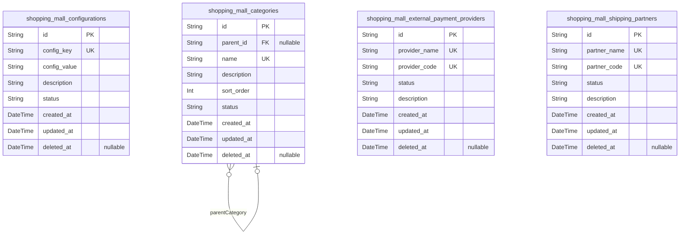
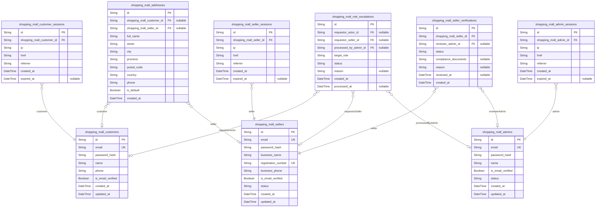
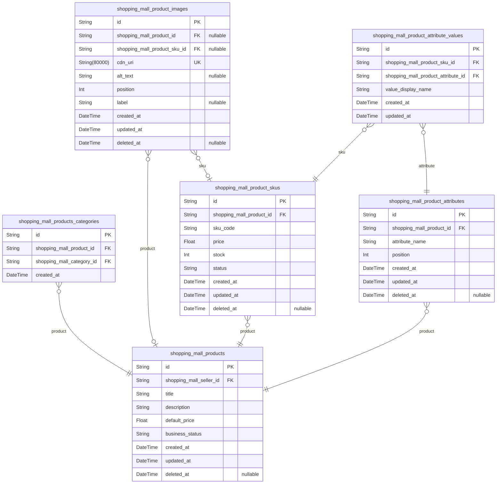
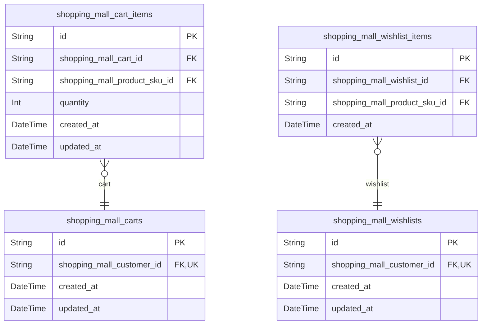
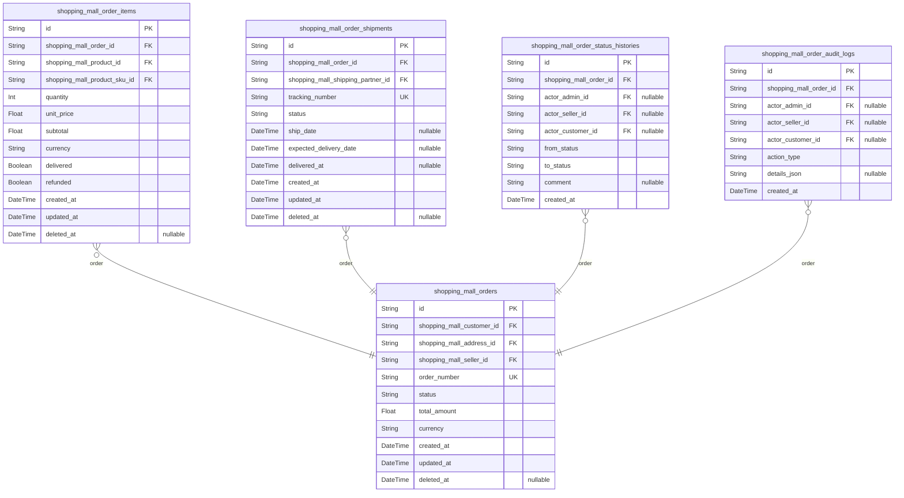
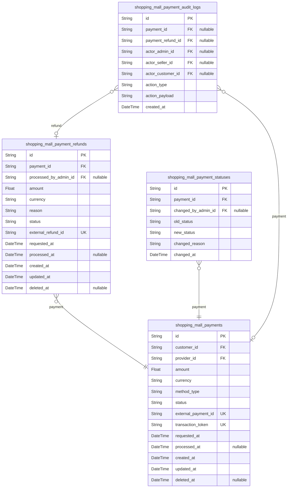
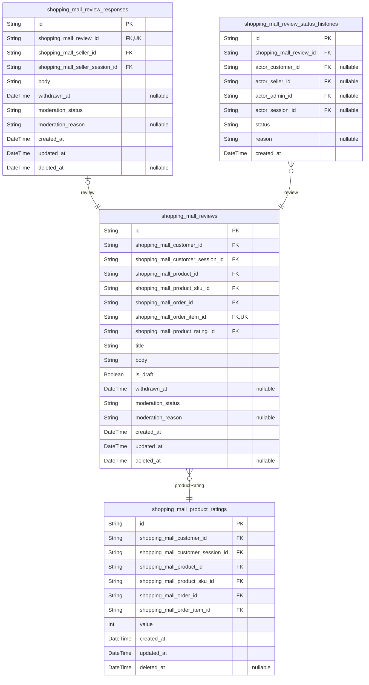
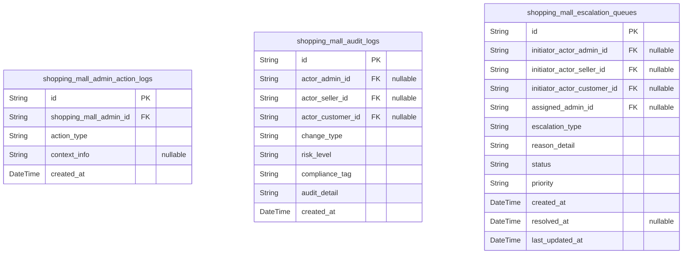
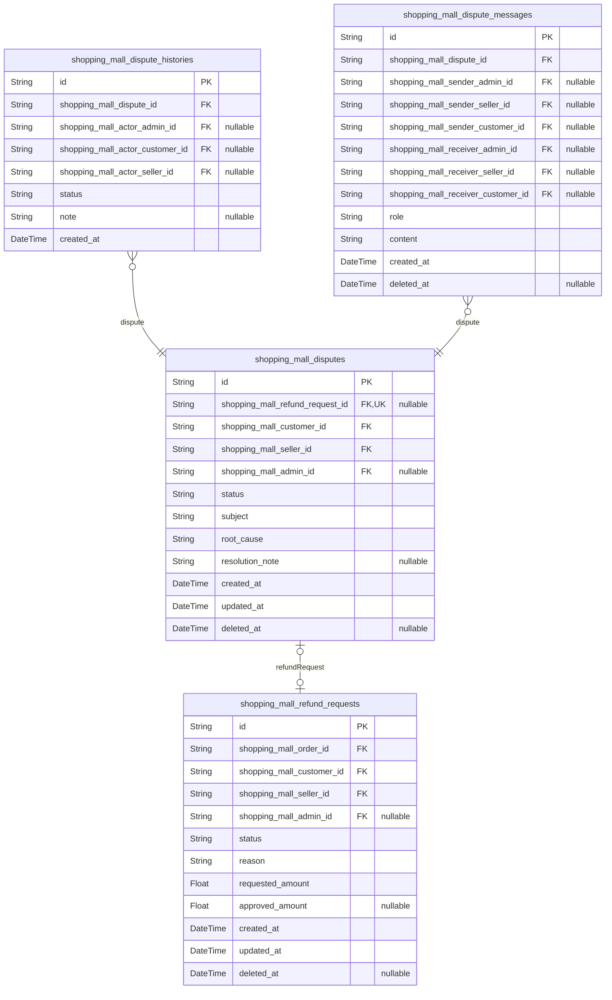
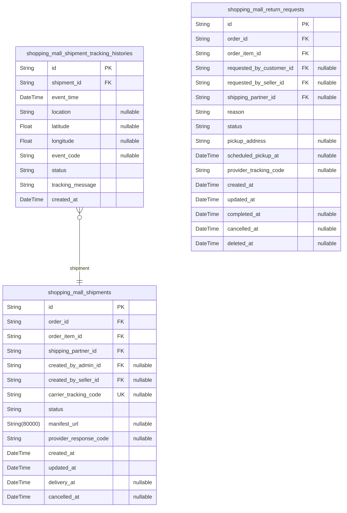

# Prisma Markdown

> Generated by [`prisma-markdown`](https://github.com/samchon/prisma-markdown)

- [Systematic](#systematic)
- [Actors](#actors)
- [Catalog](#catalog)
- [Carts](#carts)
- [Orders](#orders)
- [Payments](#payments)
- [Reviews](#reviews)
- [Admin](#admin)
- [RefundsDisputes](#refundsdisputes)
- [Logistics](#logistics)

## Systematic

```mermaid
erDiagram
"shopping_mall_configurations" {
  String id PK
  String config_key UK
  String config_value
  String description
  String status
  DateTime created_at
  DateTime updated_at
  DateTime deleted_at "nullable"
}
"shopping_mall_categories" {
  String id PK
  String parent_id FK "nullable"
  String name UK
  String description
  Int sort_order
  String status
  DateTime created_at
  DateTime updated_at
  DateTime deleted_at "nullable"
}
"shopping_mall_external_payment_providers" {
  String id PK
  String provider_name UK
  String provider_code UK
  String status
  String description
  DateTime created_at
  DateTime updated_at
  DateTime deleted_at "nullable"
}
"shopping_mall_shipping_partners" {
  String id PK
  String partner_name UK
  String partner_code UK
  String status
  String description
  DateTime created_at
  DateTime updated_at
  DateTime deleted_at "nullable"
}
"shopping_mall_categories" }o--o| "shopping_mall_categories" : parentCategory
```

### `shopping_mall_configurations`

Platform-wide configuration entries managing system parameters, feature
flags, and constants.

Allows admin-only CRUD of key-value structured settings that control
feature toggles, global options, or business parameters for the entire
shopping mall backend. Heavily referenced by all modules, with audit and
soft deletion required for traceability.

Properties as follows:

- `id`: Primary Key.
- `config_key`
  > Unique configuration key name, used in service and API lookup.
  > Recommended to namespace with prefixes by category or domain.
- `config_value`
  > String or JSON-serialized value. Raw storage; business logic interprets
  > entry per config_key.
- `description`
  > Detailed explanation of the configuration's role and effect for admin
  > reference.
- `status`: active, inactive, or deprecated—for admin gating and safe rollout/testing.
- `created_at`: Timestamp of row creation (audit trail).
- `updated_at`: Last mutation timestamp.
- `deleted_at`: Soft delete marker for removed/legacy entries.

### `shopping_mall_categories`

Product and navigation category taxonomy, supporting arbitrarily deep
nesting via self-referencing parent_id.

Each category row is used for user browsing, search filters, and system
reference. Parent categories have parent_id = null. Admins manage
category CRUD and soft delete for cross-domain stability.

Properties as follows:

- `id`: Primary Key.
- `parent_id`
  > Self-foreign key for category hierarchy—null for root categories.
  > Cascades to build full tree structure.
- `name`: Unique category name, as seen in UIs and for API reference.
- `description`
  > Long-form description of purpose and coverage for admin/merchandiser
  > context.
- `sort_order`: Ordering for navigation and display; lower values first.
- `status`: active/inactive/deprecated for admin approval or programmatic use.
- `created_at`: Audit trail—creation moment.
- `updated_at`: Last admin/edit update.
- `deleted_at`: Soft delete for safe deactivation.

### `shopping_mall_external_payment_providers`

Registered external payment providers for all enabled checkout flows and
payment methods.

Defines all payment gateways/platforms (e.g., Stripe, Toss, PayPal)
integrated by admin and referenced in order/payment tables. Directly
managed by admins for status, audit, and usable methods in commerce
flows. CRUD enabled via admin tools; uses status and soft delete to
manage reconfiguration and deprecation safely. Uniquely keyed by
provider_name and provider_code.

Properties as follows:

- `id`: Primary Key.
- `provider_name`: Display name as shown in checkout UIs—unique for each provider.
- `provider_code`
  > System integration key/code—unique for backend mapping and API
  > orchestration.
- `status`: active/inactive/deprecated—controls available methods/platforms in UX.
- `description`: Legal/business context and integration notes for provider.
- `created_at`: Creation timestamp (for audit).
- `updated_at`: Last update (admin/edit context).
- `deleted_at`: Soft delete—row remains for historical audit/logging.

### `shopping_mall_shipping_partners`

Official platform registry for logistics/shipping partners in buyer and
seller flows.

All partners that can be used for order shipments, available for admin
CRUD and for use in shipment, order, or tracking-related tables via FKs.
Managed for status and audit; supports deprecation via soft delete but
keeps historical/inactive partners visible for audit and referencing
legacy data.

Properties as follows:

- `id`: Primary Key.
- `partner_name`: Display name (UI/reference); unique.
- `partner_code`: Integration code for backend (system use); unique.
- `status`: active/inactive/deprecated—admin only control.
- `description`: Business and operational info about the partner.
- `created_at`: Creation moment (audit).
- `updated_at`: Mutation/audit update time.
- `deleted_at`: Soft delete for legacy/decommissioned partners.

## Actors

```mermaid
erDiagram
"shopping_mall_customers" {
  String id PK
  String email UK
  String password_hash
  String name
  String phone
  Boolean is_email_verified
  DateTime created_at
  DateTime updated_at
}
"shopping_mall_customer_sessions" {
  String id PK
  String shopping_mall_customer_id FK
  String ip
  String href
  String referrer
  DateTime created_at
  DateTime expired_at "nullable"
}
"shopping_mall_sellers" {
  String id PK
  String email UK
  String password_hash
  String business_name
  String registration_number UK
  String business_phone
  Boolean is_email_verified
  String status
  DateTime created_at
  DateTime updated_at
}
"shopping_mall_seller_sessions" {
  String id PK
  String shopping_mall_seller_id FK
  String ip
  String href
  String referrer
  DateTime created_at
  DateTime expired_at "nullable"
}
"shopping_mall_admins" {
  String id PK
  String email UK
  String password_hash
  String name
  Boolean is_email_verified
  String status
  DateTime created_at
  DateTime updated_at
}
"shopping_mall_admin_sessions" {
  String id PK
  String shopping_mall_admin_id FK
  String ip
  String href
  String referrer
  DateTime created_at
  DateTime expired_at "nullable"
}
"shopping_mall_addresses" {
  String id PK
  String shopping_mall_customer_id FK "nullable"
  String shopping_mall_seller_id FK "nullable"
  String full_name
  String street
  String city
  String province
  String postal_code
  String country
  String phone
  Boolean is_default
  DateTime created_at
}
"shopping_mall_seller_verifications" {
  String id PK
  String shopping_mall_seller_id FK
  String reviewer_admin_id FK "nullable"
  String status
  String compliance_documents "nullable"
  String reason "nullable"
  DateTime reviewed_at "nullable"
  DateTime created_at
}
"shopping_mall_role_escalations" {
  String id PK
  String requestor_actor_id FK "nullable"
  String requestor_seller_id FK "nullable"
  String processed_by_admin_id FK "nullable"
  String target_role
  String status
  String reason "nullable"
  DateTime created_at
  DateTime processed_at "nullable"
}
"shopping_mall_customer_sessions" }o--|| "shopping_mall_customers" : customer
"shopping_mall_seller_sessions" }o--|| "shopping_mall_sellers" : seller
"shopping_mall_admin_sessions" }o--|| "shopping_mall_admins" : admin
"shopping_mall_addresses" }o--o| "shopping_mall_customers" : customer
"shopping_mall_addresses" }o--o| "shopping_mall_sellers" : seller
"shopping_mall_seller_verifications" }o--|| "shopping_mall_sellers" : seller
"shopping_mall_seller_verifications" }o--o| "shopping_mall_admins" : reviewerAdmin
"shopping_mall_role_escalations" }o--o| "shopping_mall_customers" : requestorActor
"shopping_mall_role_escalations" }o--o| "shopping_mall_sellers" : requestorSeller
"shopping_mall_role_escalations" }o--o| "shopping_mall_admins" : processedByAdmin
```

### `shopping_mall_customers`

Registered customer account representing a buyer on the platform.

Holds personal and authentication data, including email for login,
password hash, and registration status. Is the actor for all end-customer
business flows. Each customer can maintain multiple addresses, and all
cart, wish, and order histories are tied to this entity. A unique email
is required per customer. Authentication audit enabled via related
session table. Soft delete is omitted by business policy (hard delete
only via admin action).

Properties as follows:

- `id`: Primary Key.
- `email`
  > Customer's email address used for authentication and communication. Must
  > be unique across all customers.
- `password_hash`
  > Bcrypt hash of the customer's login password. Used for secure
  > authentication; plain passwords are never stored.
- `name`: Customer's legal full name for identification and order fulfillment.
- `phone`: Customer's primary phone number for order and support contacts.
- `is_email_verified`: Indicates whether the customer has completed email verification.
- `created_at`: Account creation timestamp in UTC.
- `updated_at`: Last time customer record was updated.

### `shopping_mall_customer_sessions`

Session token records for authenticated customer logins.

Tracks each web or mobile login, holding the session's connection context
for audit and security. Linked to customers via customer_id, with
composite index for fetch. Expired sessions denote logouts or security
expiry. No extra metadata is included for device/user-agent; only core
IP/href/referrer for compliance. Subsidiary stance to customer records;
maintains audit trail.

Properties as follows:

- `id`: Primary Key.
- `shopping_mall_customer_id`
  > References the customer owning this session. {@link
  > shopping_mall_customers.id}.
- `ip`: IP address for the client initiating the session.
- `href`: Original connection URL when the session was created.
- `referrer`: Referrer URL for the session's origin context.
- `created_at`: Session creation timestamp in UTC.
- `expired_at`: Session expiration UTC time; null if currently active.

### `shopping_mall_sellers`

Registered seller account with legal business identity and verification
status.

Holds core authentication and business contact information including
unique email, password hash, business name, registration number, status,
and compliance flag. Only verified sellers can onboard products. Each
seller may have multiple addresses linked by the addresses table. Seller
dashboards and product/inventory are strictly partitioned by this entity.

Properties as follows:

- `id`: Primary Key.
- `email`
  > Seller's unique login email. Used for authentication and main point of
  > contact.
- `password_hash`
  > Bcrypt hash of the seller's login password. Plaintext passwords are never
  > stored.
- `business_name`
  > Legal business name of the seller. Required for all compliance and public
  > catalog exposure.
- `registration_number`
  > Government-issued business registration or license number. Used for KYC
  > and compliance.
- `business_phone`: Official business contact phone number for support and notifications.
- `is_email_verified`: Indicates whether seller has verified their email address.
- `status`
  > Seller account status: pending, approved, rejected, suspended, etc., as
  > enforced by admin and business workflow.
- `created_at`: Account creation timestamp in UTC.
- `updated_at`: Last time seller account was updated.

### `shopping_mall_seller_sessions`

Authenticated session records for sellers accessing their dashboard or API.

Logs each session for audit and security tracking. Linked to sellers by
seller_id. Key attributes are connection metadata: IP, href, and
referrer. Session expiry supports both manual logout and automatic
timeout. All business-side actions are traced back to session for
compliance. Subsidiary to sellers.

Properties as follows:

- `id`: Primary Key.
- `shopping_mall_seller_id`: References seller owning this session. [shopping_mall_sellers.id](#shopping_mall_sellers).
- `ip`: IP address for this session's origin.
- `href`: Source URL of the session creation event.
- `referrer`: Referrer URL for context at login.
- `created_at`: Session creation timestamp.
- `expired_at`: Session expiry datetime, or null if still active.

### `shopping_mall_admins`

Platform administrator account with root governance permissions.

Stores admin authentication, contact details, and activation status.
Admin creation and updates are allowed only by other admins as per strict
business rules. Used for all high-privilege actions including dispute,
refund, platform configuration, and moderation. Email is unique per
admin.

Properties as follows:

- `id`: Primary Key.
- `email`
  > Unique email for authentication and notification. Required for all admin
  > communication.
- `password_hash`: Admin's password hash for login authentication. Never holds plaintext.
- `name`: Admin's full name for auditing, contact, and action logs.
- `is_email_verified`: Indicates whether admin email was verified/activated.
- `status`: Admin account status; defines access: active, suspended, revoked, etc.
- `created_at`: Datetime when admin account was created.
- `updated_at`: Datetime when last updated.

### `shopping_mall_admin_sessions`

Session logs for each authenticated admin dashboard/API login.

Every instance records IP, entry URL, and referrer for each session.
Session expiry signals logout/invalidation. Indexed by admin_id for audit
purposes. Subsidiary to admin with strict linkage; key for compliance and
oversight.

Properties as follows:

- `id`: Primary Key.
- `shopping_mall_admin_id`: Admin user associated to this session. [shopping_mall_admins.id](#shopping_mall_admins).
- `ip`: Originating IP address for this admin session.
- `href`: Access URL at session start.
- `referrer`: Referrer URL when login occurred.
- `created_at`: Session created at timestamp.
- `expired_at`: Session expiration datetime, or null if still active.

### `shopping_mall_addresses`

Address book entry for shipping, billing, or business association for any
user actor.

Each record details the full structured address: full name, street, city,
province/state, postal code, country, and phone. Customer addresses are
required; sellers may also have addresses for business documentation.
Each address is linked to either a customer or a seller (never both),
with at least one being non-null. Each user can hold up to 10 addresses.
Optionally flagged as the default address. Soft deletes not
supported—records are permanent unless directly erased.

Properties as follows:

- `id`: Primary Key.
- `shopping_mall_customer_id`
  > FK to owning customer, if this is a customer address. Nullable if belongs
  > to a seller. [shopping_mall_customers.id](#shopping_mall_customers).
- `shopping_mall_seller_id`
  > FK to owning seller, if this is a seller address. Nullable if owned by a
  > customer. [shopping_mall_sellers.id](#shopping_mall_sellers).
- `full_name`: Recipient's name for shipping or billing purposes.
- `street`: Street address, including building/unit number as applicable.
- `city`: City for the address.
- `province`: Province, state, or administrative region.
- `postal_code`: ZIP/postal code formatted by country.
- `country`: Country name in ISO standard or local language.
- `phone`: Contact phone number for delivery issues.
- `is_default`: Indicates if this is the actor's default address.
- `created_at`: Address creation timestamp.

### `shopping_mall_seller_verifications`

KYC/business verification status records for each seller actor.

Stores the state and reason for seller verification processing (e.g.,
pending, approved, rejected) and reviewer/admin audit trail. Contains all
compliance documents and correspondence references submitted by the
seller. Required for permission to list products. Each seller has one or
more verifications over time, all records append-only. Status, reviewer,
and all timestamps included for workflow traceability.

Properties as follows:

- `id`: Primary Key.
- `shopping_mall_seller_id`: Seller under verification. [shopping_mall_sellers.id](#shopping_mall_sellers).
- `reviewer_admin_id`
  > Admin who reviewed or verified this record. {@link
  > shopping_mall_admins.id}.
- `status`
  > Verification status: pending, approved, rejected, under_review,
  > needs_more_info, etc.
- `compliance_documents`
  > Documentation references or IDs for KYC or compliance. May be null during
  > initial request.
- `reason`
  > Notes explaining state, rejection, or administrative requirements. May be
  > null if not needed.
- `reviewed_at`: Datetime when this record was reviewed/decisioned.
- `created_at`: Record creation timestamp.

### `shopping_mall_role_escalations`

Records of all privilege/role escalation requests and admin actions for
platform actors.

Each record represents a direct request or admin-initiated alteration for
increased privileges, e.g., customer-to-seller, seller-to-admin. Stores
requestor, target role/status, current processing status, admin/actor
attribution, processed result, and action logs for audit. Enables strict
privilege boundary enforcement under supervision. Full append-only audit
maintained.

Properties as follows:

- `id`: Primary Key.
- `requestor_actor_id`
  > FK to customer, if requestor is a customer. May be null for seller/admin
  > escalations. [shopping_mall_customers.id](#shopping_mall_customers).
- `requestor_seller_id`
  > FK to seller, if requestor is a seller. Nullable for customer/admin
  > initiated. [shopping_mall_sellers.id](#shopping_mall_sellers).
- `processed_by_admin_id`
  > Admin who processed/escalated this event if applicable. {@link
  > shopping_mall_admins.id}.
- `target_role`: Role requested by the escalator (customer, seller, admin, etc.).
- `status`
  > Escalation status: pending, approved, rejected, under_review, revoked,
  > etc.
- `reason`: Notes, justification, or admin comments for this role change request.
- `created_at`: Role escalation request creation timestamp.
- `processed_at`: Datetime when request was processed/decisioned.

## Catalog

```mermaid
erDiagram
"shopping_mall_products" {
  String id PK
  String shopping_mall_seller_id FK
  String title
  String description
  Float default_price
  String business_status
  DateTime created_at
  DateTime updated_at
  DateTime deleted_at "nullable"
}
"shopping_mall_products_categories" {
  String id PK
  String shopping_mall_product_id FK
  String shopping_mall_category_id FK
  DateTime created_at
}
"shopping_mall_product_skus" {
  String id PK
  String shopping_mall_product_id FK
  String sku_code
  Float price
  Int stock
  String status
  DateTime created_at
  DateTime updated_at
  DateTime deleted_at "nullable"
}
"shopping_mall_product_images" {
  String id PK
  String shopping_mall_product_id FK "nullable"
  String shopping_mall_product_sku_id FK "nullable"
  String(80000) cdn_uri UK
  String alt_text "nullable"
  Int position
  String label "nullable"
  DateTime created_at
  DateTime updated_at
  DateTime deleted_at "nullable"
}
"shopping_mall_product_attributes" {
  String id PK
  String shopping_mall_product_id FK
  String attribute_name
  Int position
  DateTime created_at
  DateTime updated_at
  DateTime deleted_at "nullable"
}
"shopping_mall_product_attribute_values" {
  String id PK
  String shopping_mall_product_sku_id FK
  String shopping_mall_product_attribute_id FK
  String value_display_name
  DateTime created_at
  DateTime updated_at
}
"shopping_mall_products_categories" }o--|| "shopping_mall_products" : product
"shopping_mall_product_skus" }o--|| "shopping_mall_products" : product
"shopping_mall_product_images" }o--o| "shopping_mall_products" : product
"shopping_mall_product_images" }o--o| "shopping_mall_product_skus" : sku
"shopping_mall_product_attributes" }o--|| "shopping_mall_products" : product
"shopping_mall_product_attribute_values" }o--|| "shopping_mall_product_skus" : sku
"shopping_mall_product_attribute_values" }o--|| "shopping_mall_product_attributes" : attribute
```

### `shopping_mall_products`

Top-level catalog entity representing a unique product offered on the
platform.

Each product record defines the core business information for listing in
the marketplace, including title, description, price, and owner seller
reference (as a foreign key to sellers in another domain component
already created). Products are assigned to one or more categories via a
separate mapping table. Multiple variant SKUs and images are associated
with each product, reflecting available purchase options and media
assets. The product table includes status fields (e.g., draft, published,
archived), audit fields for full lifecycle traceability (created,
updated, deleted times), and is the anchor point for all product
filtering, search, and analytics.

Soft delete is supported for recovery and moderation workflows.

Properties as follows:

- `id`: Primary key.
- `shopping_mall_seller_id`
  > Owning seller for this product. References the {@link
  > shopping_mall_sellers.id}.
- `title`: Public product name, shown in catalog and search results.
- `description`
  > Detailed product description, with rich text and formatting if allowed by
  > system.
- `default_price`
  > Default display price for product overview (actual purchase price may be
  > per SKU/variant).
- `business_status`
  > Workflow status string; valid values: draft, published, archived,
  > blocked, pending_approval, etc.
- `created_at`: UTC timestamp for product creation.
- `updated_at`: UTC timestamp for last modification of this product.
- `deleted_at`
  > Soft delete marker; null if product is active, set when product is
  > deleted/archived.

### `shopping_mall_products_categories`

Junction table mapping multi-category assignments for each product.

Associates each product with one or more marketplace categories,
supporting hierarchical or multi-category navigation, search, and
filtering. Each row represents the membership of a single product in a
single category. Indexes support efficient filtering and common lookup
patterns.

Properties as follows:

- `id`: Primary key.
- `shopping_mall_product_id`: Mapped catalog product. References [shopping_mall_products.id](#shopping_mall_products).
- `shopping_mall_category_id`
  > Assigned marketplace category. References {@link
  > shopping_mall_categories.id}.
- `created_at`: UTC timestamp for mapping creation.

### `shopping_mall_product_skus`

Individual SKU (Stock Keeping Unit) for a specific variant or option of a
catalog product.

Each SKU represents a unique variant of a product (e.g., color, size,
option combinations), with independent inventory, price, and status. SKUs
are linked to the parent product and to their attribute values (via
subsidiary mapping table). Inventory, per-SKU pricing, out-of-stock
flags, and barcode/business reference codes are managed here. SKUs are
included in search and filtering.

Audit, status, and soft delete fields support traceability, operation,
and moderation.

Properties as follows:

- `id`: Primary key.
- `shopping_mall_product_id`
  > Parent catalog product for this SKU. References {@link
  > shopping_mall_products.id}.
- `sku_code`: Unique business SKU/barcode identifier within a product scope.
- `price`: Sale price for this variant (overrides product default price if present).
- `stock`: Inventory units available for this SKU.
- `status`: Workflow status for SKU (e.g., active, out_of_stock, archived, draft).
- `created_at`: UTC timestamp for SKU creation.
- `updated_at`: UTC timestamp for last SKU change.
- `deleted_at`: Soft delete flag: null if active, set when archived/deleted.

### `shopping_mall_product_images`

Image/media asset records associated with products or SKUs.

Each row stores a single image file or media asset for a specific product
or SKU. Images support position-based ordering (e.g., main image, gallery
order), alt text for accessibility, CDN/URI reference, and a label for
internal management. Can attach images directly to product or specific
SKU using foreign key, but never both at the same time (business logic
ensures this).

Audit fields and soft delete are included for digital asset lifecycle.

Properties as follows:

- `id`: Primary key.
- `shopping_mall_product_id`
  > Product that this image is associated with. Nullable if this is a
  > SKU-specific image.
- `shopping_mall_product_sku_id`
  > SKU variant this image is associated with. Nullable if this is a
  > product-level image.
- `cdn_uri`: CDN or publicly accessible URI for the image media.
- `alt_text`: Accessibility/text alternative for the image, shown on error/load fail.
- `position`
  > Image display position ordering for carousels/galleries. Lower values
  > displayed first.
- `label`: System/business management label (not shown to end users).
- `created_at`: UTC timestamp for asset creation.
- `updated_at`: UTC timestamp for any update to asset.
- `deleted_at`: Soft delete marker: null if active, set when removed/archived.

### `shopping_mall_product_attributes`

Dictionary of attribute types supported for variant construction in the
catalog (e.g., color, size, material, option labels).

Defines the allowed attributes for SKUs under each product, managed
separately from global attributes. Provides structure and display name
for each attribute type, supports ordering in variant selection UIs, and
ties to allowed values in the mapping table. Each attribute is linked to
exactly one product.

Audit and soft delete fields for traceability.

Properties as follows:

- `id`: Primary key.
- `shopping_mall_product_id`
  > Product for which this attribute is used. References {@link
  > shopping_mall_products.id}.
- `attribute_name`
  > Logical name for this attribute (e.g., color, size); visible in variant
  > picker.
- `position`: Display order for attribute in UI context. Lower appears first.
- `created_at`: UTC timestamp for attribute creation.
- `updated_at`: UTC timestamp for last update of attribute.
- `deleted_at`: Soft delete marker: null if active, set for attribute removal.

### `shopping_mall_product_attribute_values`

Link table mapping (for each SKU) the value of a particular attribute
(e.g., red for color, XL for size) in variant construction.

Each row records the value of an attribute for a specific SKU, allowing
the flexible definition of multi-attribute variants per SKU. Enables full
filter and product option selection. Provides value name/label, audit
fields, and supports multiple values per attribute/SKU mapping.

Properties as follows:

- `id`: Primary key.
- `shopping_mall_product_sku_id`
  > SKU instance for which this attribute value is defined. References {@link
  > shopping_mall_product_skus.id}.
- `shopping_mall_product_attribute_id`
  > Corresponding attribute type for this value. References {@link
  > shopping_mall_product_attributes.id}.
- `value_display_name`: Renderable text for value (e.g., 'Red', 'XL', 'Matte').
- `created_at`: UTC timestamp for value mapping creation.
- `updated_at`: UTC timestamp for any value update.

## Carts

```mermaid
erDiagram
"shopping_mall_carts" {
  String id PK
  String shopping_mall_customer_id FK,UK
  DateTime created_at
  DateTime updated_at
}
"shopping_mall_cart_items" {
  String id PK
  String shopping_mall_cart_id FK
  String shopping_mall_product_sku_id FK
  Int quantity
  DateTime created_at
  DateTime updated_at
}
"shopping_mall_wishlists" {
  String id PK
  String shopping_mall_customer_id FK,UK
  DateTime created_at
  DateTime updated_at
}
"shopping_mall_wishlist_items" {
  String id PK
  String shopping_mall_wishlist_id FK
  String shopping_mall_product_sku_id FK
  DateTime created_at
}
"shopping_mall_cart_items" }o--|| "shopping_mall_carts" : cart
"shopping_mall_wishlist_items" }o--|| "shopping_mall_wishlists" : wishlist
```

### `shopping_mall_carts`

Customer shopping cart root entity.

Each cart is directly associated with an authenticated customer and
serves as the persistent container for all shopping intents. Only one
active cart exists per customer, preventing duplication. Carts are
required for all add-to-cart and checkout flows, ensuring end-to-end
state tracking and inventory validation within the platform. All items in
the cart are managed through subsidiary cart item records. Deleted or
checked-out carts are explicitly removed from the system.

Properties as follows:

- `id`: Primary key.
- `shopping_mall_customer_id`: Linked customer. References [shopping_mall_customers.id](#shopping_mall_customers).
- `created_at`: Cart creation timestamp.
- `updated_at`: Last updated timestamp for cart state.

### `shopping_mall_cart_items`

Individual item records within a shopping cart.

Each record represents a single SKU in a customer's cart, including the
desired quantity. Cart items are always associated with a parent cart and
directly reference the intended product SKU. Only one cart item is
allowed per SKU, per cart; duplicates are prevented by a composite unique
constraint. This design enforces clean inventory operations, ensures
correct add/remove/update logic, and supports multi-SKU carts. Cart items
are always managed as part of their cart lifecycle.

Properties as follows:

- `id`: Primary key.
- `shopping_mall_cart_id`: Parent cart reference. [shopping_mall_carts.id](#shopping_mall_carts).
- `shopping_mall_product_sku_id`: Target SKU. [shopping_mall_product_skus.id](#shopping_mall_product_skus).
- `quantity`
  > Desired quantity for this SKU in the cart. Must be positive and less than
  > or equal to available inventory.
- `created_at`: Cart item creation timestamp.
- `updated_at`: Last modified timestamp.

### `shopping_mall_wishlists`

Customer wishlist root entity for persistent product interest.

Each wishlist is owned by a single customer and contains items
representing SKUs the customer is interested in but does not intend to
purchase immediately. Each customer has at most one wishlist. Wishlists
persist through account sessions and device changes, helping customers
track and later revisit interesting products. Items in the wishlist are
managed as subsidiary records.

Properties as follows:

- `id`: Primary key.
- `shopping_mall_customer_id`: Linked customer. References [shopping_mall_customers.id](#shopping_mall_customers).
- `created_at`: Wishlist creation timestamp.
- `updated_at`: Last update timestamp for the wishlist.

### `shopping_mall_wishlist_items`

Individual wishlist items attached to a customer's wishlist.

Each wishlist item represents a product SKU the customer is interested in
saving for later. Items are linked both to the parent wishlist and the
referenced SKU. No duplicate SKUs are allowed within a single wishlist,
ensured by composite unique constraint. This enables efficient wishlist
management and migration to cart flows when the customer decides to
purchase. Item addition and removal is always managed as part of the
wishlist lifecycle.

Properties as follows:

- `id`: Primary key.
- `shopping_mall_wishlist_id`: Parent wishlist. References [shopping_mall_wishlists.id](#shopping_mall_wishlists).
- `shopping_mall_product_sku_id`
  > SKU referenced by this wishlist item. {@link
  > shopping_mall_product_skus.id}.
- `created_at`: Wishlist item creation timestamp.

## Orders

```mermaid
erDiagram
"shopping_mall_orders" {
  String id PK
  String shopping_mall_customer_id FK
  String shopping_mall_address_id FK
  String shopping_mall_seller_id FK
  String order_number UK
  String status
  Float total_amount
  String currency
  DateTime created_at
  DateTime updated_at
  DateTime deleted_at "nullable"
}
"shopping_mall_order_items" {
  String id PK
  String shopping_mall_order_id FK
  String shopping_mall_product_id FK
  String shopping_mall_product_sku_id FK
  Int quantity
  Float unit_price
  Float subtotal
  String currency
  Boolean delivered
  Boolean refunded
  DateTime created_at
  DateTime updated_at
  DateTime deleted_at "nullable"
}
"shopping_mall_order_shipments" {
  String id PK
  String shopping_mall_order_id FK
  String shopping_mall_shipping_partner_id FK
  String tracking_number UK
  String status
  DateTime ship_date "nullable"
  DateTime expected_delivery_date "nullable"
  DateTime delivered_at "nullable"
  DateTime created_at
  DateTime updated_at
  DateTime deleted_at "nullable"
}
"shopping_mall_order_status_histories" {
  String id PK
  String shopping_mall_order_id FK
  String actor_admin_id FK "nullable"
  String actor_seller_id FK "nullable"
  String actor_customer_id FK "nullable"
  String from_status
  String to_status
  String comment "nullable"
  DateTime created_at
}
"shopping_mall_order_audit_logs" {
  String id PK
  String shopping_mall_order_id FK
  String actor_admin_id FK "nullable"
  String actor_seller_id FK "nullable"
  String actor_customer_id FK "nullable"
  String action_type
  String details_json "nullable"
  DateTime created_at
}
"shopping_mall_order_items" }o--|| "shopping_mall_orders" : order
"shopping_mall_order_shipments" }o--|| "shopping_mall_orders" : order
"shopping_mall_order_status_histories" }o--|| "shopping_mall_orders" : order
"shopping_mall_order_audit_logs" }o--|| "shopping_mall_orders" : order
```

### `shopping_mall_orders`

Represents the primary order entity for all purchases made on the platform.

Captures the high-level details of each order submitted by a customer,
including references to the customer placing the order, the shipping
address, and relevant payment and seller information. Orders serve as the
anchor for all associated items, shipments, status changes, and audit
logs. Multiple items and shipments may be related to one order,
reflecting multi-SKU, multi-seller, and split-shipment scenarios. This
model is independently managed and forms the primary lifecycle entity for
all order operations. All temporal fields support robust audit trails and
soft deletion as needed.

Properties as follows:

- `id`: Primary key.
- `shopping_mall_customer_id`: References the purchasing customer. [shopping_mall_customers.id](#shopping_mall_customers).
- `shopping_mall_address_id`: The delivery address for this order. [shopping_mall_addresses.id](#shopping_mall_addresses).
- `shopping_mall_seller_id`
  > Main seller responsible for this order (single-seller context). {@link
  > shopping_mall_sellers.id}.
- `order_number`
  > Platform-unique business order number, used for external references and
  > customer support. Example: ORD202500001.
- `status`
  > Current platform order status: e.g., pending, paid, cancelled, shipped,
  > delivered, refunded.
- `total_amount`
  > Final order total amount including all items, taxes, shipping, and
  > discounts if any.
- `currency`: Currency code (ISO 4217). E.g., USD, KRW.
- `created_at`: Order creation timestamp.
- `updated_at`: Last update timestamp for this order.
- `deleted_at`: Soft deletion timestamp; null if order is active.

### `shopping_mall_order_items`

Stores the breakdown of each order into per-SKU, per-product items.

Each record represents a unique product/SKU that is part of a given
order, allowing complete normalization of order contents for inventory,
fulfillment, analytics, and post-order processing. This model enables
accurate tracking of quantities, price per SKU, refunds at item level,
and inventory movements. Items are grouped under their parent order but
retain individual references for fulfillment and shipment attachment.

Properties as follows:

- `id`: Primary key.
- `shopping_mall_order_id`: Parent order to which this item belongs. [shopping_mall_orders.id](#shopping_mall_orders).
- `shopping_mall_product_id`: The ordered product. [shopping_mall_products.id](#shopping_mall_products).
- `shopping_mall_product_sku_id`
  > The specific SKU (variant) purchased. {@link
  > shopping_mall_product_skus.id}.
- `quantity`: Number of units of this SKU ordered.
- `unit_price`: Unit price at time of order for this SKU (discounts included, if any).
- `subtotal`
  > Subtotal before order-level adjustments for this item (quantity ×
  > unit_price).
- `currency`: Currency code (ISO 4217). E.g., USD, KRW.
- `delivered`: True if this item has been marked as delivered in fulfillment tracking.
- `refunded`: True if this item has been refunded through returns/workflow.
- `created_at`: Order item creation timestamp.
- `updated_at`: Order item last update timestamp.
- `deleted_at`: Soft deletion timestamp; null if active.

### `shopping_mall_order_shipments`

Represents a shipment or fulfillment batch associated with one or more
items in an order.

Tracks the logistics information for each discrete shipment
event—supporting split orders, multi-package delivery, and real-time
tracking for both customers and sellers. Shipments reference the order,
designated shipping partner, external tracking information, shipped and
expected delivery dates, and status. This table enables precise
management of complex fulfillment and last-mile delivery workflows.

Properties as follows:

- `id`: Primary key.
- `shopping_mall_order_id`: Order associated with this shipment. [shopping_mall_orders.id](#shopping_mall_orders).
- `shopping_mall_shipping_partner_id`: Linked shipping partner. [shopping_mall_shipping_partners.id](#shopping_mall_shipping_partners).
- `tracking_number`
  > Shipping partner/tracking-provided unique tracking number for this
  > shipment.
- `status`: Shipment status: e.g., pending, shipped, in_transit, delivered, returned.
- `ship_date`
  > Date the shipment was handed to logistics partner; null if not yet
  > shipped.
- `expected_delivery_date`: Expected or promised delivery date; may be null if unknown.
- `delivered_at`: Timestamp of confirmed arrival; null if not delivered.
- `created_at`: Shipment creation timestamp.
- `updated_at`: Last update timestamp for this shipment.
- `deleted_at`: Soft deletion timestamp; null if shipment is active.

### `shopping_mall_order_status_histories`

Historical log of all order status transitions and major business state
changes for audit and workflow compliance.

Each entry represents a snapshot of the order's state at a point in time,
retaining the entire status, comment, actor (user/admin/system), and
timestamp. Enables strict traceability for business, legal, and
operational purposes.

Properties as follows:

- `id`: Primary key.
- `shopping_mall_order_id`
  > Order associated with this status transition. {@link
  > shopping_mall_orders.id}.
- `actor_admin_id`
  > Admin who performed this action, if applicable. {@link
  > shopping_mall_admins.id}.
- `actor_seller_id`
  > Seller who performed this action, if applicable. {@link
  > shopping_mall_sellers.id}.
- `actor_customer_id`
  > Customer who performed this action, if applicable. {@link
  > shopping_mall_customers.id}.
- `from_status`: Previous status before transition.
- `to_status`: New status after transition.
- `comment`: Optional business or workflow comment entered by the actor or system.
- `created_at`: Timestamp of this status transition.

### `shopping_mall_order_audit_logs`

Append-only audit log recording every significant action or update along
the lifecycle of orders.

Includes irreversible change events, actor, timestamp, action details,
context, and (optionally) snapshot data for business process compliance
and security. Ensures all activity affecting order lifecycle can be
traced for investigation and legal defense. Not intended for deletion or
modification post-recording.

Properties as follows:

- `id`: Primary key.
- `shopping_mall_order_id`: Order associated with this audit event. [shopping_mall_orders.id](#shopping_mall_orders).
- `actor_admin_id`
  > Admin who performed this action, if applicable. {@link
  > shopping_mall_admins.id}.
- `actor_seller_id`
  > Seller who performed this action, if applicable. {@link
  > shopping_mall_sellers.id}.
- `actor_customer_id`
  > Customer who performed this action, if applicable. {@link
  > shopping_mall_customers.id}.
- `action_type`
  > Type of audited action (e.g., status_change, address_update,
  > refund_initiated).
- `details_json`: Optional serialized details/context for this action in JSON form.
- `created_at`: Timestamp (UTC) when this audit event was recorded.

## Payments

```mermaid
erDiagram
"shopping_mall_payments" {
  String id PK
  String customer_id FK
  String provider_id FK
  Float amount
  String currency
  String method_type
  String status
  String external_payment_id UK
  String transaction_token UK
  DateTime requested_at
  DateTime processed_at "nullable"
  DateTime created_at
  DateTime updated_at
  DateTime deleted_at "nullable"
}
"shopping_mall_payment_refunds" {
  String id PK
  String payment_id FK
  String processed_by_admin_id FK "nullable"
  Float amount
  String currency
  String reason
  String status
  String external_refund_id UK
  DateTime requested_at
  DateTime processed_at "nullable"
  DateTime created_at
  DateTime updated_at
  DateTime deleted_at "nullable"
}
"shopping_mall_payment_statuses" {
  String id PK
  String payment_id FK
  String changed_by_admin_id FK "nullable"
  String old_status
  String new_status
  String changed_reason
  DateTime changed_at
}
"shopping_mall_payment_audit_logs" {
  String id PK
  String payment_id FK "nullable"
  String payment_refund_id FK "nullable"
  String actor_admin_id FK "nullable"
  String actor_seller_id FK "nullable"
  String actor_customer_id FK "nullable"
  String action_type
  String action_payload
  DateTime created_at
}
"shopping_mall_payment_refunds" }o--|| "shopping_mall_payments" : payment
"shopping_mall_payment_statuses" }o--|| "shopping_mall_payments" : payment
"shopping_mall_payment_audit_logs" }o--o| "shopping_mall_payments" : payment
"shopping_mall_payment_audit_logs" }o--o| "shopping_mall_payment_refunds" : refund
```

### `shopping_mall_payments`

Primary payment record for all customer orders processed by the shopping
mall platform.

Represents an initiated or completed payment against one or more orders.
Stores amounts, currency, payment method type, status, and provider
references. Tracks external payment provider transaction IDs, internal
tokens, and acts as the main business entity for all financial flows
within the system.

Captures associated actor (customer or seller) and references the payment
provider integration. Interaction with refunds, status tracking, and
audit log tables are mediated by this entity. Soft deletion supported for
audit and compliance.

Properties as follows:

- `id`: Primary Key.
- `customer_id`
  > References the customer making the payment. {@link
  > shopping_mall_customers.id}.
- `provider_id`
  > References the external payment provider through which payment is
  > processed. [shopping_mall_external_payment_providers.id](#shopping_mall_external_payment_providers).
- `amount`: Decimal amount of the payment, in the currency indicated.
- `currency`: ISO 4217 currency code for the transaction (e.g., USD, KRW, EUR).
- `method_type`: Type of payment method used (e.g., card, e-wallet, bank_transfer, etc).
- `status`
  > Current payment status. Values include: initiated, pending, authorized,
  > rejected, completed, refunded, failed.
- `external_payment_id`
  > Payment transaction identifier assigned by the external payment provider.
  > Used for reconciliation and callbacks.
- `transaction_token`: Opaque unique token for idempotent processing; generated by system.
- `requested_at`: Timestamp when payment was initially requested.
- `processed_at`
  > Timestamp of payment provider processor's definitive result
  > (success/failure/refund).
- `created_at`: Creation timestamp.
- `updated_at`: Last modification timestamp.
- `deleted_at`: Soft delete timestamp. Null when active.

### `shopping_mall_payment_refunds`

Record of all payment refunds issued through the platform, referencing
both the original payment and payment provider response.

Stores refund reason, processed amount, status, and external identifiers.
Allows detailed audit and reporting of all refund events for compliance
and business review.

Each refund is linked to a payment and has temporal tracking for request,
processing, and finalization. Soft delete allows for audit-log recovery
but prohibits actual data destruction.

Properties as follows:

- `id`: Primary Key.
- `payment_id`
  > References the original payment record being refunded. {@link
  > shopping_mall_payments.id}.
- `processed_by_admin_id`
  > If refunded manually or escalated, references the admin actor who
  > performed the refund. Nullable; null if system or automated refund.
- `amount`
  > Amount refunded (fully or partially), in the same currency as the
  > original payment.
- `currency`: ISO 4217 currency code for the refund.
- `reason`
  > Reason provided for the refund (e.g., cancellation, item not delivered,
  > pricing error, admin corrective action, etc).
- `status`
  > Refund status. E.g.: requested, pending, processing, completed, failed,
  > rejected.
- `external_refund_id`
  > Refund transaction identifier from the payment provider, for traceability
  > and provider-side reconciliation.
- `requested_at`: Timestamp when refund was requested.
- `processed_at`: Timestamp when refund processing completed, failed, or was finalized.
- `created_at`: Creation timestamp.
- `updated_at`: Last modification timestamp.
- `deleted_at`: Soft delete timestamp. Null when active.

### `shopping_mall_payment_statuses`

Represents immutable status snapshots for all payment transactions,
capturing the historical state changes for auditing and compliance.

Each row documents state change events (pending, authorized, failed,
refunded, completed, etc.), who/what triggered the change, and the time
of transition. Not directly manageable by users; created by payment
system or admin actors for a given payment lifecycle.

Properties as follows:

- `id`: Primary Key.
- `payment_id`
  > Reference to payment whose status is being transitioned. {@link
  > shopping_mall_payments.id}.
- `changed_by_admin_id`
  > References admin who directly triggered payment status change. Nullable;
  > null if automated/system actor.
- `old_status`: Previous payment status value prior to this status change.
- `new_status`
  > The new status applied as a result of this transition (e.g., pending,
  > authorized, completed, failed, refunded, etc).
- `changed_reason`
  > Reason or reference for the status transition, e.g., 'provider callback',
  > 'manual review', 'automatic escalation'.
- `changed_at`: Status change event timestamp.

### `shopping_mall_payment_audit_logs`

Immutable audit log record for all system or manual actions affecting
payment records within the payment component.

Captures details of actions such as payment/reversal/refund events,
provider callbacks, admin interventions, or system escalations for
forensic review and compliance purposes. Includes timestamp, actor,
action type, raw payload, and references to affected payment or refund
entities when relevant.

This table is not directly user-managed and is intended for admin and
auditor review only.

Properties as follows:

- `id`: Primary Key.
- `payment_id`
  > Link to payment affected by this action (if relevant). Nullable for
  > generic audit entries.
- `payment_refund_id`
  > Link to specific refund record affected (if relevant). Nullable for
  > payment-only or system events.
- `actor_admin_id`
  > Admin who performed the action, when applicable. Nullable if triggered by
  > system.
- `actor_seller_id`
  > Seller actor responsible for the action, when applicable. Nullable if
  > triggered by other roles or system.
- `actor_customer_id`
  > Customer actor responsible for the action, when applicable. Nullable if
  > triggered by other roles or system.
- `action_type`
  > Type of action performed (e.g., payment_created, payment_updated,
  > refund_requested, provider_callback, admin_override, escalation, etc).
- `action_payload`
  > Raw payload log of the event or API call (JSON-encoded for callbacks,
  > requests, responses, etc).
- `created_at`: Log creation timestamp; matches event time, always immutable.

## Reviews

```mermaid
erDiagram
"shopping_mall_reviews" {
  String id PK
  String shopping_mall_customer_id FK
  String shopping_mall_customer_session_id FK
  String shopping_mall_product_id FK
  String shopping_mall_product_sku_id FK
  String shopping_mall_order_id FK
  String shopping_mall_order_item_id FK,UK
  String shopping_mall_product_rating_id FK
  String title
  String body
  Boolean is_draft
  DateTime withdrawn_at "nullable"
  String moderation_status
  String moderation_reason "nullable"
  DateTime created_at
  DateTime updated_at
  DateTime deleted_at "nullable"
}
"shopping_mall_review_responses" {
  String id PK
  String shopping_mall_review_id FK,UK
  String shopping_mall_seller_id FK
  String shopping_mall_seller_session_id FK
  String body
  DateTime withdrawn_at "nullable"
  String moderation_status
  String moderation_reason "nullable"
  DateTime created_at
  DateTime updated_at
  DateTime deleted_at "nullable"
}
"shopping_mall_product_ratings" {
  String id PK
  String shopping_mall_customer_id FK
  String shopping_mall_customer_session_id FK
  String shopping_mall_product_id FK
  String shopping_mall_product_sku_id FK
  String shopping_mall_order_id FK
  String shopping_mall_order_item_id FK
  Int value
  DateTime created_at
  DateTime updated_at
  DateTime deleted_at "nullable"
}
"shopping_mall_review_status_histories" {
  String id PK
  String shopping_mall_review_id FK
  String actor_customer_id FK "nullable"
  String actor_seller_id FK "nullable"
  String actor_admin_id FK "nullable"
  String actor_session_id FK "nullable"
  String status
  String reason "nullable"
  DateTime created_at
}
"shopping_mall_reviews" }o--|| "shopping_mall_product_ratings" : productRating
"shopping_mall_review_responses" |o--|| "shopping_mall_reviews" : review
"shopping_mall_review_status_histories" }o--|| "shopping_mall_reviews" : review
```

### `shopping_mall_reviews`

Product reviews submitted by customers for products they have purchased,
per order item/SKU.

Each review is created by a verified customer and is always linked to a
specific order item and product SKU, ensuring that only actual purchases
can generate reviews. The review includes rating reference, summary, body
text, moderation status, withdrawal tracking, and full traceability to
the session and customer for audit and abuse prevention. Reviews can
exist in draft, published, or withdrawn states and are subject to content
moderation.

Soft-deletion is supported, with moderation and withdrawal tracked via
status history. This model is central to product feedback, search, and
moderation workflows.

Properties as follows:

- `id`: Primary key.
- `shopping_mall_customer_id`
  > Reference to the customer who authored the review. {@link
  > shopping_mall_customers.id}.
- `shopping_mall_customer_session_id`
  > Session during which the review was created. {@link
  > shopping_mall_customer_sessions.id}.
- `shopping_mall_product_id`: Product that the review is about. [shopping_mall_products.id](#shopping_mall_products).
- `shopping_mall_product_sku_id`: SKU of the product reviewed. [shopping_mall_product_skus.id](#shopping_mall_product_skus).
- `shopping_mall_order_id`
  > Order in which this review's product was purchased. {@link
  > shopping_mall_orders.id}.
- `shopping_mall_order_item_id`
  > Specific order item this review is linked to. {@link
  > shopping_mall_order_items.id}.
- `shopping_mall_product_rating_id`
  > Rating record for this review and SKU. {@link
  > shopping_mall_product_ratings.id}.
- `title`: Short summary/title of the review. Required for all published reviews.
- `body`
  > Body text of the review. Minimum 10 characters, maximum 1000. Editable by
  > customer within allowed window.
- `is_draft`: Indicates if the review is a draft (not yet published).
- `withdrawn_at`
  > Timestamp if the customer withdraws the review (soft delete for
  > user-initiated removal).
- `moderation_status`: Current moderation status (e.g., pending, approved, rejected, flagged).
- `moderation_reason`
  > Optional field indicating the reason for rejection or flagging during
  > moderation.
- `created_at`: DateTime when the review was created.
- `updated_at`
  > Last update time for this review (includes customer edits and moderator
  > actions).
- `deleted_at`: Soft delete marker (for platform/admin removal or purge).

### `shopping_mall_review_responses`

Seller responses to customer reviews, visible alongside the original review.

Each response is created by the seller of the product reviewed, providing
clarification, acknowledgment, or additional information in response to
customer feedback. Each response is linked to the specific review and the
seller account.

Full traceability to session and seller is maintained for auditing. Only
one response is allowed per review; responses can be edited or withdrawn
by seller or admin. Moderation is supported via status and reason fields.

Properties as follows:

- `id`: Primary key.
- `shopping_mall_review_id`
  > Unique link to the review being responded to. One response per review.
  > [shopping_mall_reviews.id](#shopping_mall_reviews).
- `shopping_mall_seller_id`: Seller who wrote the response. [shopping_mall_sellers.id](#shopping_mall_sellers).
- `shopping_mall_seller_session_id`
  > Session during which the response was written. {@link
  > shopping_mall_seller_sessions.id}.
- `body`: Textual response from seller. Minimum 10, maximum 1000 characters.
- `withdrawn_at`: Timestamp if seller withdraws or deletes their response.
- `moderation_status`: Current moderation status for the response.
- `moderation_reason`: Optional reason for moderation action (rejection/flagging).
- `created_at`: When the response was created.
- `updated_at`: Last updated time.
- `deleted_at`: Soft delete marker (for admin/content removal).

### `shopping_mall_product_ratings`

Standalone product rating entity tied to a specific customer and product
SKU.

Stores the numeric (1–5 stars) rating value that a verified customer
assigns to a product SKU as part of their review. Enforces the rule that
each customer can rate each product SKU only once (per completed
purchase). Ratings are referenced in reviews for search and aggregation;
this separation allows display of rating stats even for unreviewed
purchases and efficient rating aggregation per product/SKU.

Audit trail includes customer and session for verification. Only allows
update by the original customer within the edit window.

Properties as follows:

- `id`: Primary key.
- `shopping_mall_customer_id`: Customer who provided the rating. [shopping_mall_customers.id](#shopping_mall_customers).
- `shopping_mall_customer_session_id`
  > Session when the rating was submitted. {@link
  > shopping_mall_customer_sessions.id}.
- `shopping_mall_product_id`: Product being rated. [shopping_mall_products.id](#shopping_mall_products).
- `shopping_mall_product_sku_id`: SKU of the rated product. [shopping_mall_product_skus.id](#shopping_mall_product_skus).
- `shopping_mall_order_id`: Order associated with this rating. [shopping_mall_orders.id](#shopping_mall_orders).
- `shopping_mall_order_item_id`
  > Specific order item this rating applies to. {@link
  > shopping_mall_order_items.id}.
- `value`: Numeric rating value (1–5 stars).
- `created_at`: Timestamp of rating creation.
- `updated_at`: Last update time for rating.
- `deleted_at`: Soft delete marker (if rating is removed or replaced).

### `shopping_mall_review_status_histories`

Snapshot table recording all moderation, withdrawal, and status events
for a given review.

Each record represents a point-in-time event (such as publication,
rejection, flagging, withdrawal) with full traceability to the actor
(customer, seller, admin) and session responsible for the change. This
enables a comprehensive audit history for each review, covering all
moderation workflow steps and supporting business auditability and
dispute resolution.

Designed as append-only for integrity, with immutable event data and
related descriptions.

Properties as follows:

- `id`: Primary key.
- `shopping_mall_review_id`
  > The review affected by this status event. {@link
  > shopping_mall_reviews.id}.
- `actor_customer_id`
  > Optional: Customer who performed this action (if actor is a customer).
  > [shopping_mall_customers.id](#shopping_mall_customers).
- `actor_seller_id`
  > Optional: Seller who performed this action (if actor is a seller). {@link
  > shopping_mall_sellers.id}.
- `actor_admin_id`
  > Optional: Admin who performed this action (if actor is an admin). {@link
  > shopping_mall_admins.id}.
- `actor_session_id`
  > Optional: Session in which the action was triggered. Session type matches
  > the actor type. [shopping_mall_admin_sessions.id](#shopping_mall_admin_sessions).
- `status`
  > New status set for the review (e.g., created, published, rejected,
  > flagged, withdrawn, deleted).
- `reason`
  > Optional explanation for status change (e.g., admin notes or moderation
  > reasoning).
- `created_at`: Timestamp when the status event occurred.

## Admin

```mermaid
erDiagram
"shopping_mall_admin_action_logs" {
  String id PK
  String shopping_mall_admin_id FK
  String action_type
  String context_info "nullable"
  DateTime created_at
}
"shopping_mall_audit_logs" {
  String id PK
  String actor_admin_id FK "nullable"
  String actor_seller_id FK "nullable"
  String actor_customer_id FK "nullable"
  String change_type
  String risk_level
  String compliance_tag
  String audit_detail
  DateTime created_at
}
"shopping_mall_escalation_queues" {
  String id PK
  String initiator_actor_admin_id FK "nullable"
  String initiator_actor_seller_id FK "nullable"
  String initiator_actor_customer_id FK "nullable"
  String assigned_admin_id FK "nullable"
  String escalation_type
  String reason_detail
  String status
  String priority
  DateTime created_at
  DateTime resolved_at "nullable"
  DateTime last_updated_at
}
```

### `shopping_mall_admin_action_logs`

Record of every privileged or system-level action performed by admin
actors across the platform.

Captures the immutable trace of all administrative actions, including
user modifications, order overrides, dispute resolutions, and escalated
interventions. Provides detailed attribution with actor, target entity,
action type, and optional contextual notes.
Crucial for compliance audits, forensic analysis, dispute defense, and
role-based access tracing. Each entry includes timestamp, responsible
admin (FK), contextual references (which may be user, seller, order,
product, etc.), and a required action category/type for grouped analysis.

Properties as follows:

- `id`: Primary Key.
- `shopping_mall_admin_id`: Admin actor responsible for action. [shopping_mall_admins.id](#shopping_mall_admins).
- `action_type`
  > Categorical type of admin action (e.g., user_suspend, order_refund,
  > role_escalate, config_change). Enables grouped analysis of actions.
- `context_info`
  > Optional JSON-encoded or text data providing additional context (object
  > state, request params, results, etc.).
- `created_at`: Time the admin action was performed.

### `shopping_mall_audit_logs`

Comprehensive audit log capturing sensitive and high-privilege platform
events affecting compliance-relevant data.

Logs changes and accesses for critical operations (e.g., user PII
changes, financial record updates, permission modifications, and security
events). Includes full actor attribution, audit-relevant target entity,
change type, risk classification, compliance tag, and immutable create
timestamp.
Indispensable for regulatory reviews, incident response, and integrity
verification of privileged or risky operations.

Properties as follows:

- `id`: Primary Key.
- `actor_admin_id`
  > Admin actor responsible for audited event. Nullable if external system or
  > automated (system process). [shopping_mall_admins.id](#shopping_mall_admins).
- `actor_seller_id`
  > Seller actor if the audited event is seller-performed. Nullable if not
  > relevant. [shopping_mall_sellers.id](#shopping_mall_sellers).
- `actor_customer_id`
  > Customer actor if the event was customer-performed. Nullable if not
  > relevant. [shopping_mall_customers.id](#shopping_mall_customers).
- `change_type`
  > Nature of audited change (e.g., access, update, delete,
  > permission_change, data_export).
- `risk_level`
  > Risk classification by business/policy (e.g., low, medium, high,
  > critical).
- `compliance_tag`
  > Compliance tag or business rule identifier justifying audit entry (e.g.,
  > GDPR_ARTICLE5, PCI_LOG, SOX_ACCESS).
- `audit_detail`
  > Detailed info about the change; may be structured JSON or plain text
  > depending on event type.
- `created_at`: Timestamp when audit entry was recorded.

### `shopping_mall_escalation_queues`

Business escalation event or platform dispute record requiring
human/admin intervention, mediator assignment, or compliance workflow.

Captures unresolved or problematic events (customer complaints, seller
issues, refund or return exceptions, policy breaches) that are in process
or require investigation. Each entry tracks the initiating actor,
responsible role/queue (e.g., admin, compliance), current status,
escalation reason, priority, and resolution timestamps. Supports advanced
filtering by status, queue, reason, and time for operational management
and workflow automation.

Properties as follows:

- `id`: Primary Key.
- `initiator_actor_admin_id`
  > ID of admin initiator for cases started by an admin. Nullable if not
  > applicable. [shopping_mall_admins.id](#shopping_mall_admins).
- `initiator_actor_seller_id`
  > ID of seller initiator for cases started by a seller. Optional if not
  > applicable. [shopping_mall_sellers.id](#shopping_mall_sellers).
- `initiator_actor_customer_id`
  > ID of customer initiator for cases started by a customer. Optional if not
  > applicable. [shopping_mall_customers.id](#shopping_mall_customers).
- `assigned_admin_id`
  > ID of assigned admin handling the escalation. Null if auto/unassigned.
  > [shopping_mall_admins.id](#shopping_mall_admins).
- `escalation_type`
  > Business category for escalation (e.g., refund_dispute, policy_violation,
  > compliance_check, complaint, delivery_exception).
- `reason_detail`
  > Detailed explanation of why the event is escalated. Full business context
  > for review.
- `status`
  > Current state in workflow (e.g., open, investigating, resolved, closed,
  > rejected, admin_pending, compliance_review).
- `priority`
  > Priority classification for triage (e.g., low, normal, high, urgent,
  > critical).
- `created_at`: Timestamp when escalation was created.
- `resolved_at`: Time when escalation was closed/resolved (nullable until resolved).
- `last_updated_at`: Time of last update (status/assignment change, message, etc.).

## RefundsDisputes

```mermaid
erDiagram
"shopping_mall_refund_requests" {
  String id PK
  String shopping_mall_order_id FK
  String shopping_mall_customer_id FK
  String shopping_mall_seller_id FK
  String shopping_mall_admin_id FK "nullable"
  String status
  String reason
  Float requested_amount
  Float approved_amount "nullable"
  DateTime created_at
  DateTime updated_at
  DateTime deleted_at "nullable"
}
"shopping_mall_disputes" {
  String id PK
  String shopping_mall_refund_request_id FK,UK "nullable"
  String shopping_mall_customer_id FK
  String shopping_mall_seller_id FK
  String shopping_mall_admin_id FK "nullable"
  String status
  String subject
  String root_cause
  String resolution_note "nullable"
  DateTime created_at
  DateTime updated_at
  DateTime deleted_at "nullable"
}
"shopping_mall_dispute_histories" {
  String id PK
  String shopping_mall_dispute_id FK
  String shopping_mall_actor_admin_id FK "nullable"
  String shopping_mall_actor_customer_id FK "nullable"
  String shopping_mall_actor_seller_id FK "nullable"
  String status
  String note "nullable"
  DateTime created_at
}
"shopping_mall_dispute_messages" {
  String id PK
  String shopping_mall_dispute_id FK
  String shopping_mall_sender_admin_id FK "nullable"
  String shopping_mall_sender_seller_id FK "nullable"
  String shopping_mall_sender_customer_id FK "nullable"
  String shopping_mall_receiver_admin_id FK "nullable"
  String shopping_mall_receiver_seller_id FK "nullable"
  String shopping_mall_receiver_customer_id FK "nullable"
  String role
  String content
  DateTime created_at
  DateTime deleted_at "nullable"
}
"shopping_mall_disputes" |o--o| "shopping_mall_refund_requests" : refundRequest
"shopping_mall_dispute_histories" }o--|| "shopping_mall_disputes" : dispute
"shopping_mall_dispute_messages" }o--|| "shopping_mall_disputes" : dispute
```

### `shopping_mall_refund_requests`

Customer-initiated refund requests for orders or items within the
shopping mall platform.

Each record represents a formal refund request made by a customer for an
eligible order or order item. The table tracks request reasons, status,
requested and actual refund amounts, associated actors (customer, seller,
admin), and links to any associated dispute. It is integral to the
resolution workflow for cancellations, returns, or disputes. All changes
and outcomes are auditable and support regulatory compliance.

Properties as follows:

- `id`: Primary Key.
- `shopping_mall_order_id`
  > Foreign key linking refund request to the affected order. {@link
  > shopping_mall_orders.id}.
- `shopping_mall_customer_id`
  > Customer who submitted the refund request. {@link
  > shopping_mall_customers.id}.
- `shopping_mall_seller_id`
  > Seller responsible for the transaction in dispute. {@link
  > shopping_mall_sellers.id}.
- `shopping_mall_admin_id`
  > Admin involved in processing or decision for this refund request, if
  > applicable. Nullable. [shopping_mall_admins.id](#shopping_mall_admins).
- `status`
  > Current status of the refund request (pending, approved, rejected,
  > cancelled, processing, refunded). Maintains workflow state.
- `reason`: Customer's reason for refund request, provided at submission.
- `requested_amount`: Monetary amount requested for refund by the customer.
- `approved_amount`
  > Amount approved for refund by admin or seller after review. Nullable
  > until decision.
- `created_at`: Timestamp when refund request was created.
- `updated_at`: Timestamp of last modification (status update, note, etc.).
- `deleted_at`
  > Timestamp for soft-deletion. Nullable: present only if entity is
  > logically deleted.

### `shopping_mall_disputes`

Dispute cases arising from refund requests, order problems, or other
escalated issues involving customers, sellers, or admins.

Each row represents a distinct dispute, tracking its origin (linked
refund request if applicable), actor roles, status, subject, root cause,
resolution notes, and all necessary context to drive resolution workflow.
Supports escalation, decision, and full audit trail for compliance and
platform governance.

Properties as follows:

- `id`: Primary Key.
- `shopping_mall_refund_request_id`
  > Original refund request linked to this dispute, if applicable. Nullable.
  > [shopping_mall_refund_requests.id](#shopping_mall_refund_requests).
- `shopping_mall_customer_id`: Customer involved in the dispute. [shopping_mall_customers.id](#shopping_mall_customers).
- `shopping_mall_seller_id`: Seller involved in the dispute. [shopping_mall_sellers.id](#shopping_mall_sellers).
- `shopping_mall_admin_id`
  > Admin handling or mediating the dispute. Nullable. {@link
  > shopping_mall_admins.id}.
- `status`
  > Dispute status: open, investigating, resolved, rejected, escalated,
  > closed.
- `subject`
  > Short, business-driven description of the dispute's subject (e.g.,
  > 'Non-delivery', 'Item not as described').
- `root_cause`
  > Primary cause or issue leading to the dispute, as assessed by actors or
  > admin.
- `resolution_note`
  > Final resolution details or decision note from admin. Nullable until
  > decision.
- `created_at`: Timestamp of dispute creation.
- `updated_at`: Last updated timestamp.
- `deleted_at`: Soft-deletion timestamp. Nullable.

### `shopping_mall_dispute_histories`

Append-only historical audit log of all significant status changes and
actions performed during the dispute lifecycle.

Each record captures a snapshot of status, involved actors, timestamps,
and relevant notes whenever the dispute transitions through workflow
stages. Enables full traceability for compliance, security, and
retrospective analytics.

Properties as follows:

- `id`: Primary Key.
- `shopping_mall_dispute_id`
  > Dispute associated with this historical snapshot. {@link
  > shopping_mall_disputes.id}.
- `shopping_mall_actor_admin_id`: Admin responsible for this action (may be null if action by other actor).
- `shopping_mall_actor_customer_id`: Customer responsible for this action (may be null if other actor).
- `shopping_mall_actor_seller_id`: Seller responsible for this action (may be null if other actor).
- `status`: Dispute status at this point in history.
- `note`: Additional note or reason attached to this status/event. Nullable.
- `created_at`: Timestamp when this history record was created.

### `shopping_mall_dispute_messages`

All direct messages exchanged between actors (customer, seller, admin)
within the context of a specific dispute.

Each row represents an individual message, including sender/receiver,
message content, role, temporal data, and linkage to the dispute.
Supports threaded, auditable communication as part of the escalation and
negotiation process.

Properties as follows:

- `id`: Primary Key.
- `shopping_mall_dispute_id`
  > Link to parent dispute for this message. {@link
  > shopping_mall_disputes.id}.
- `shopping_mall_sender_admin_id`: Admin user who sent this message (nullable if another actor).
- `shopping_mall_sender_seller_id`: Seller who sent this message (nullable if another actor).
- `shopping_mall_sender_customer_id`: Customer who sent this message (nullable if another actor).
- `shopping_mall_receiver_admin_id`: Admin user receiving this message (nullable if another actor).
- `shopping_mall_receiver_seller_id`: Seller who received this message (nullable if another actor).
- `shopping_mall_receiver_customer_id`: Customer who received this message (nullable if another actor).
- `role`: Role of sender (admin, seller, customer) for easy filtering.
- `content`: Body of the message as exchanged within the dispute.
- `created_at`: Timestamp when message was sent.
- `deleted_at`: Soft-deletion timestamp. Present only if message is logically deleted.

## Logistics

```mermaid
erDiagram
"shopping_mall_shipments" {
  String id PK
  String order_id FK
  String order_item_id FK
  String shipping_partner_id FK
  String created_by_admin_id FK "nullable"
  String created_by_seller_id FK "nullable"
  String carrier_tracking_code UK "nullable"
  String status
  String(80000) manifest_url "nullable"
  String provider_response_code "nullable"
  DateTime created_at
  DateTime updated_at
  DateTime delivery_at "nullable"
  DateTime cancelled_at "nullable"
}
"shopping_mall_shipment_tracking_histories" {
  String id PK
  String shipment_id FK
  DateTime event_time
  String location "nullable"
  Float latitude "nullable"
  Float longitude "nullable"
  String event_code "nullable"
  String status
  String tracking_message
  DateTime created_at
}
"shopping_mall_return_requests" {
  String id PK
  String order_id FK
  String order_item_id FK
  String requested_by_customer_id FK "nullable"
  String requested_by_seller_id FK "nullable"
  String shipping_partner_id FK "nullable"
  String reason
  String status
  String pickup_address "nullable"
  DateTime scheduled_pickup_at "nullable"
  String provider_tracking_code "nullable"
  DateTime created_at
  DateTime updated_at
  DateTime completed_at "nullable"
  DateTime cancelled_at "nullable"
  DateTime deleted_at "nullable"
}
"shopping_mall_shipment_tracking_histories" }o--|| "shopping_mall_shipments" : shipment
```

### `shopping_mall_shipments`

Shipment records for order fulfillment and logistics event tracking.

Captures all shipment detail for order items shipped via any integrated
partner, including references to orders, order items, the selected
carrier, label/tracking numbers, shipping status, and API/provider result
codes. Used for both platform-initiated and manual shipments by sellers
or admins.

Provides full auditability with actor attribution (who
created/updated/cancelled), label/manifest data, and timestamps for each
shipment event.

Properties as follows:

- `id`: Primary key.
- `order_id`
  > Order this shipment is part of. References {@link
  > shopping_mall_orders.id}.
- `order_item_id`
  > Specific item in the order that this shipment fulfills. References {@link
  > shopping_mall_order_items.id}.
- `shipping_partner_id`
  > Shipping/logistics provider handling this shipment. References {@link
  > shopping_mall_shipping_partners.id}.
- `created_by_admin_id`
  > Admin who created this shipment record, if automated. Nullable; present
  > if admin assigned the carrier.
- `created_by_seller_id`
  > Seller who created or fulfilled this shipment, if not auto-assigned.
  > Nullable; present if the seller itself handed off to carrier.
- `carrier_tracking_code`
  > Carrier-assigned or external shipment/tracking code/number for reference
  > to shipping label or manifest. Nullable for shipments where code is not
  > yet issued.
- `status`
  > Current shipment status. Valid values: pending, ready, picked_up,
  > in_transit, delivered, cancelled, returned. Status transitions follow
  > fulfillment and return lifecycle rules.
- `manifest_url`
  > Optional download URI for shipping label or manifest provided by the
  > carrier. Nullable if not supported.
- `provider_response_code`
  > Last received status code/result from the API provider
  > (success/fail/integration result, if any). Nullable if no API call made
  > yet.
- `created_at`: Timestamp when the shipment record was created.
- `updated_at`: Timestamp of the last update to the shipment record.
- `delivery_at`
  > Timestamp when the shipment was marked as delivered by the carrier or
  > customer. Nullable if not yet delivered.
- `cancelled_at`: Timestamp if/when this shipment was cancelled. Nullable if not cancelled.

### `shopping_mall_shipment_tracking_histories`

Chronological tracking updates and carrier event logs for each shipment.

Captures a complete, append-only history of carrier-side/warehouse-side
shipment updates from dispatch to delivery. All status changes, tracking
location events, and relevant carrier messages with actors, timestamps,
geo-coordinates, provider event codes, and free-form tracking text are
stored here.

Serves as an audit trail and full shipment journey visibility for
platform users and admins. Accessible only via the parent shipment, never
directly edited or deleted by users.

Properties as follows:

- `id`: Primary key.
- `shipment_id`
  > Shipment that this tracking event belongs to. References {@link
  > shopping_mall_shipments.id}.
- `event_time`: Timestamp of the tracking event as provided by the carrier or system.
- `location`
  > Reported location (e.g., city, depot, or delivery point) for this event.
  > Nullable if not provided by carrier.
- `latitude`: Latitude coordinate attached to the event, if available. Nullable.
- `longitude`: Longitude coordinate attached to the event, if available. Nullable.
- `event_code`
  > Provider-specific event code (e.g., OUT_FOR_DELIVERY, DELIVERED, HELD,
  > etc.). Nullable for free-form events.
- `status`
  > Status code at this event step (e.g., pending, in_transit, delivered,
  > exception, returned). Used for shipment status timeline.
- `tracking_message`
  > Full carrier or system-provided message as shown to both admins and
  > customers for shipment progress updates.
- `created_at`: Timestamp when this tracking event record was created in the platform DB.

### `shopping_mall_return_requests`

Return, pickup, and shipment reverse logistics request records.

Captures customer- or seller-initiated requests to return or pick up
delivered items, including reason, status, actor attribution, scheduled
pickup, and all carrier/shipment integration info. Enables tracking of
the full lifecycle of returns from customer submission to carrier pickup,
delivery to warehouse, and completion/cancellation.

Return requests are linked to specific order items and can be referenced
in refund or dispute management. All requested actions are audit-trailed
including user/actor IDs and timestamps for resolution.

Properties as follows:

- `id`: Primary key.
- `order_id`
  > Order this return request refers to. References {@link
  > shopping_mall_orders.id}.
- `order_item_id`
  > Order item being returned or picked up. References {@link
  > shopping_mall_order_items.id}.
- `requested_by_customer_id`
  > Customer requesting the return or pickup. Nullable if request was not
  > customer-initiated.
- `requested_by_seller_id`
  > Seller requesting return/pickup (for defective goods, etc.). Nullable if
  > not applicable.
- `shipping_partner_id`
  > Shipping partner assigned to the return/pickup. Nullable until carrier is
  > selected.
- `reason`
  > Free-form reason for return or pickup provided by the actor (customer,
  > seller, or admin). Displayed in detail views and tracking.
- `status`
  > Current status of the return/pickup request. Valid values: pending,
  > approved, scheduled, picked_up, delivered, completed, rejected,
  > cancelled. Required for workflow state machine.
- `pickup_address`
  > Address where the item should be picked up (defaults to order delivery
  > address if omitted). Nullable if carrier not yet assigned.
- `scheduled_pickup_at`
  > Scheduled date/time for the carrier to pick up the item (timezone:
  > Asia/Seoul). Nullable if not scheduled yet.
- `provider_tracking_code`
  > Tracking code or RMA from the shipping partner for this pickup/return.
  > Nullable until assigned.
- `created_at`: Timestamp when the return request was created.
- `updated_at`: Timestamp of last update to the return request record.
- `completed_at`
  > Timestamp when this return/pickup request was fully completed (goods
  > delivered to warehouse/refund processed). Nullable until finished.
- `cancelled_at`
  > Timestamp if/when this return/pickup request was cancelled. Nullable if
  > not cancelled.
- `deleted_at`
  > Nullable; when present, marks this record as soft deleted, for
  > audit/history recovery.
