# Prisma Markdown

> Generated by [`prisma-markdown`](https://github.com/samchon/prisma-markdown)

- [Systematic](#systematic)
- [Actors](#actors)
- [Catalog](#catalog)
- [Inventory](#inventory)
- [CartWishlist](#cartwishlist)
- [Orders](#orders)
- [Refunds](#refunds)
- [Tracking](#tracking)
- [Reviews](#reviews)
- [AdminOps](#adminops)
- [Policy](#policy)
- [default](#default)

## Systematic

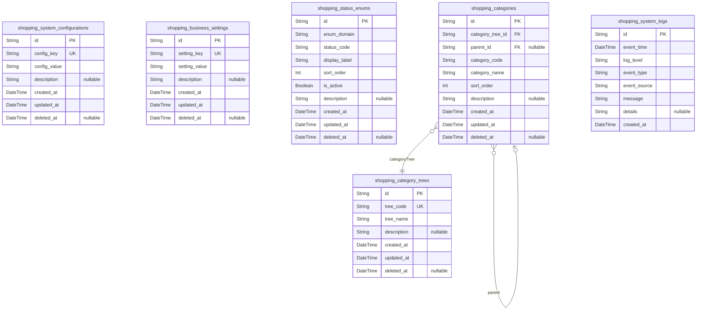
```mermaid
erDiagram
"shopping_system_configurations" {
  String id PK
  String config_key UK
  String config_value
  String description "nullable"
  DateTime created_at
  DateTime updated_at
  DateTime deleted_at "nullable"
}
"shopping_business_settings" {
  String id PK
  String setting_key UK
  String setting_value
  String description "nullable"
  DateTime created_at
  DateTime updated_at
  DateTime deleted_at "nullable"
}
"shopping_status_enums" {
  String id PK
  String enum_domain
  String status_code
  String display_label
  Int sort_order
  Boolean is_active
  String description "nullable"
  DateTime created_at
  DateTime updated_at
  DateTime deleted_at "nullable"
}
"shopping_category_trees" {
  String id PK
  String tree_code UK
  String tree_name
  String description "nullable"
  DateTime created_at
  DateTime updated_at
  DateTime deleted_at "nullable"
}
"shopping_categories" {
  String id PK
  String category_tree_id FK
  String parent_id FK "nullable"
  String category_code
  String category_name
  Int sort_order
  String description "nullable"
  DateTime created_at
  DateTime updated_at
  DateTime deleted_at "nullable"
}
"shopping_system_logs" {
  String id PK
  DateTime event_time
  String log_level
  String event_type
  String event_source
  String message
  String details "nullable"
  DateTime created_at
}
"shopping_categories" }o--|| "shopping_category_trees" : categoryTree
"shopping_categories" }o--o| "shopping_categories" : parent
```

### `shopping_system_configurations`

Platform-wide key/value configuration entries for system-level settings
(URL, SMTP, feature flags, etc). These are needed for initialization,
seeding, and global runtime parameterization. Each config is uniquely
keyed and soft deletable for historical reference.

Properties as follows:

- `id`: Primary Key.
- `config_key`
  > Unique system configuration key (case-insensitive, e.g.
  > 'core.smtp_server').
- `config_value`: Configuration value, serialized as text (JSON or plain values).
- `description`: Documentation of what this config controls.
- `created_at`: Configuration creation timestamp.
- `updated_at`: Configuration last modification timestamp.
- `deleted_at`: Configuration deletion timestamp (soft delete).

### `shopping_business_settings`

Global business policy and operational settings for the shopping
platform: currency, supported regions, tax policy, regulatory flags, etc.
Used for deployment-wide logic, onboarding, and migration. Only one row
per setting type/key is permitted. No coupling to business actors.

Properties as follows:

- `id`: Primary Key.
- `setting_key`: Business setting key (e.g., 'currency', 'country', 'tax_region').
- `setting_value`
  > Arbitrary string data for the setting value (could serialize as JSON for
  > compound).
- `description`: Description of this setting.
- `created_at`: Row creation timestamp.
- `updated_at`: Row last update timestamp.
- `deleted_at`: Row deletion time (soft delete).

### `shopping_status_enums`

Centralized status code/enum definitions for use across the platform
(orders, reviews, payments, etc). Enables reference-integrity, decouples
code from hardcoded enums, and allows runtime editing of business states.
Soft deletable for historical tracking.

Properties as follows:

- `id`: Primary Key.
- `enum_domain`
  > Domain/entity scope for this status enum (such as 'order', 'review',
  > 'payment').
- `status_code`: Exact status code (e.g., 'pending', 'paid', 'failed', case-insensitive).
- `display_label`: Human-readable label to display for this status in UIs.
- `sort_order`: Ordering value for deterministic sequence in dropdowns or reports.
- `is_active`
  > Whether this status code is currently in active use (business logic
  > toggle).
- `description`: Comment or description for this enum value.
- `created_at`: Time when the enum was created.
- `updated_at`: When this row was last updated.
- `deleted_at`: Soft delete timestamp for enum deprecation.

### `shopping_category_trees`

Root node definition for each independent category tree or taxonomy used
by the platform (e.g., shop main categories, secondary/auxiliary trees
for brands, etc). Not tied to actors or transactions. Implements unique
category tree code per taxonomy.

Properties as follows:

- `id`: Primary Key.
- `tree_code`
  > Unique category tree code for this taxonomy (case-insensitive, e.g.,
  > 'main', 'brand')
- `tree_name`: English/official display name for this category tree.
- `description`: Business context for the category tree usage/role.
- `created_at`: Tree creation timestamp.
- `updated_at`: Tree update timestamp.
- `deleted_at`: Soft delete timestamp.

### `shopping_categories`

One row per category node in any registered category tree. Supports
multi-level hierarchical structure via optional parent relationship. Used
only for classification and system-level grouping – never directly
coupled to transactions or business actors. Category code and tree ID
must be unique per tree.

Properties as follows:

- `id`: Primary Key.
- `category_tree_id`: Belonged category tree's [shopping_category_trees.id](#shopping_category_trees) (required).
- `parent_id`: Parent category's [shopping_categories.id](#shopping_categories) (nullable for root).
- `category_code`
  > Unique code for this category node, lowercase, unique per tree (e.g.
  > 'womens_dresses').
- `category_name`: Display name for this category node.
- `sort_order`: Order among siblings for deterministic tree display.
- `description`: Optional category notes or usage documentation.
- `created_at`: Category creation time.
- `updated_at`: Category update time.
- `deleted_at`: Category deletion (soft delete).

### `shopping_system_logs`

System-wide append-only audit or operational logs. Used for tracking
system events, errors, administrative actions, migrations, or audit
trails. Not tied to user/business actor context. Full-text search enabled
for efficient diagnostics.

Properties as follows:

- `id`: Primary Key.
- `event_time`: Timestamp for when the log event was generated.
- `log_level`: Severity or log level (e.g., 'info', 'warn', 'error', 'fatal').
- `event_type`
  > Type/category of log event (e.g., 'system_init', 'migration',
  > 'admin_action').
- `event_source`: Origin/source of the event (module, subsystem, service name).
- `message`: Summary log message.
- `details`
  > Optional event details, stack trace, or contextual metadata (potentially
  > JSON-encoded).
- `created_at`: Log row creation time (for durability trace).

## Actors

```mermaid
erDiagram
"shopping_customers" {
  String id PK
  String email UK
  String password_hash
  String name
  String phone
  Boolean is_active
  DateTime deleted_at "nullable"
  DateTime created_at
  DateTime updated_at
}
"shopping_customer_sessions" {
  String id PK
  String shopping_customer_id FK
  String ip
  String href
  String referrer
  DateTime created_at
  DateTime expired_at "nullable"
}
"shopping_customer_addresses" {
  String id PK
  String shopping_customer_id FK
  String address_line1
  String address_line2 "nullable"
  String city
  String state
  String postal_code
  String country
  Boolean is_primary
  String phone
  String recipient_name
  DateTime created_at
  DateTime updated_at
  DateTime deleted_at "nullable"
}
"shopping_sellers" {
  String id PK
  String email UK
  String password_hash
  String display_name
  String contact_phone
  String status
  DateTime deleted_at "nullable"
  DateTime created_at
  DateTime updated_at
}
"shopping_seller_sessions" {
  String id PK
  String shopping_seller_id FK
  String ip
  String href
  String referrer
  DateTime created_at
  DateTime expired_at "nullable"
}
"shopping_seller_business_infos" {
  String id PK
  String shopping_seller_id FK,UK
  String legal_entity_name
  String registration_number
  String representative_name
  String support_contact
  String bank_account_number
  DateTime created_at
  DateTime updated_at
}
"shopping_seller_addresses" {
  String id PK
  String shopping_seller_id FK
  String address_line1
  String address_line2 "nullable"
  String city
  String state
  String postal_code
  String country
  Boolean is_return_address
  Boolean is_primary
  String phone
  DateTime created_at
  DateTime updated_at
  DateTime deleted_at "nullable"
}
"shopping_admins" {
  String id PK
  String email UK
  String password_hash
  String name
  String role
  String status
  DateTime deleted_at "nullable"
  DateTime created_at
  DateTime updated_at
}
"shopping_admin_sessions" {
  String id PK
  String shopping_admin_id FK
  String ip
  String href
  String referrer
  DateTime created_at
  DateTime expired_at "nullable"
}
"shopping_user_emails" {
  String id PK
  String shopping_customer_id FK "nullable"
  String shopping_seller_id FK "nullable"
  String email UK
  Boolean is_verified
  Boolean is_primary
  DateTime created_at
  DateTime updated_at
  DateTime deleted_at "nullable"
}
"shopping_password_resets" {
  String id PK
  String shopping_customer_id FK "nullable"
  String shopping_seller_id FK "nullable"
  String shopping_admin_id FK "nullable"
  String request_email
  String reset_code UK
  DateTime expires_at
  DateTime consumed_at "nullable"
  DateTime created_at
  DateTime updated_at
}
"shopping_customer_sessions" }o--|| "shopping_customers" : customer
"shopping_customer_addresses" }o--|| "shopping_customers" : customer
"shopping_seller_sessions" }o--|| "shopping_sellers" : seller
"shopping_seller_business_infos" |o--|| "shopping_sellers" : seller
"shopping_seller_addresses" }o--|| "shopping_sellers" : seller
"shopping_admin_sessions" }o--|| "shopping_admins" : admin
"shopping_user_emails" }o--o| "shopping_customers" : customer
"shopping_user_emails" }o--o| "shopping_sellers" : seller
"shopping_password_resets" }o--o| "shopping_customers" : customer
"shopping_password_resets" }o--o| "shopping_sellers" : seller
"shopping_password_resets" }o--o| "shopping_admins" : admin
```

### `shopping_customers`

Registered customer accounts. Each customer has unique authentication
credentials, personal contact details, address book (via
shopping_customer_addresses), and is the principal actor for placing
consumer orders, writing reviews, and managing shopping carts. Sessions
are managed by shopping_customer_sessions.

Properties as follows:

- `id`: Primary Key.
- `email`
  > Customer email for login, uniquely identifies the account. Used for
  > authentication and transactional notification.
- `password_hash`
  > Password hash (never plain). Used for secure login verification per
  > industry standards.
- `name`: Full display name of the customer for delivery and personalization.
- `phone`: Primary contact phone for verification and delivery notifications.
- `is_active`: Indicates if the customer account is active and allowed to log in.
- `deleted_at`
  > Timestamp for soft-deletion of the account. Used for GDPR/business
  > retention.
- `created_at`: Timestamp at which the customer account was created.
- `updated_at`: Timestamp for last account data update.

### `shopping_customer_sessions`

Sessions for logged in customers. Each session records authentication,
connection metadata, audit, and supports multiple concurrent logins per
customer. Linked to customer via shopping_customers.id.

Properties as follows:

- `id`: Primary Key.
- `shopping_customer_id`: Belonged customer's [shopping_customers.id](#shopping_customers).
- `ip`: Client IP address where the session originated.
- `href`: URL on which login or session was established.
- `referrer`: Referring page or context for session creation.
- `created_at`: Timestamp for session creation/login event.
- `expired_at`
  > Timestamp when the session ended or was revoked (nullable for open
  > sessions).

### `shopping_customer_addresses`

Address book for customers. Contains shipping and billing addresses per
customer. Each address explicitly belongs to one customer only.

Properties as follows:

- `id`: Primary Key.
- `shopping_customer_id`: Owning customer's [shopping_customers.id](#shopping_customers).
- `address_line1`: First address line (street, apartment no, etc.)
- `address_line2`: Second address line (optional details such as suite, etc).
- `city`: City or locality for address.
- `state`: State, province or administrative district.
- `postal_code`: Postal or ZIP code for the address.
- `country`: Country name (e.g. South Korea, United States, etc.)
- `is_primary`: Marks if this is the primary/default address for customer.
- `phone`: Contact phone number for recipient at this address.
- `recipient_name`: Recipient's display name for delivery purposes.
- `created_at`: Address record creation timestamp.
- `updated_at`: Last update timestamp for the address entry.
- `deleted_at`: Soft deletion timestamp for address records, for compliance/audit.

### `shopping_sellers`

Registered merchant accounts. Each seller has unique business
credentials, authentication, profile, and is the principal actor managing
products, fulfillment, and inventory. Sessions are managed via
shopping_seller_sessions. Business data is stored in
shopping_seller_business_infos. Seller addresses managed via
shopping_seller_addresses.

Properties as follows:

- `id`: Primary Key.
- `email`
  > Seller email for login, notifications, and business verification.
  > Uniquely identifies seller in authentication flows.
- `password_hash`: Password hash for seller account authentication.
- `display_name`: Public-facing business/shop name of the seller.
- `contact_phone`: Primary business contact phone for seller.
- `status`
  > Seller account status (pending, active, suspended, rejected). Used for
  > onboarding/compliance.
- `deleted_at`: Timestamp for account soft-deletion (retain for legal and audit).
- `created_at`: Stamp for seller account creation and onboarding.
- `updated_at`: Last update timestamp for seller profile.

### `shopping_seller_sessions`

Authentication/audit sessions for sellers. Tracks session-specific
context for business/operational security, and supports concurrent device
logins. Each session belongs to one seller only.

Properties as follows:

- `id`: Primary Key.
- `shopping_seller_id`: The associated seller's [shopping_sellers.id](#shopping_sellers).
- `ip`: Originating IP address of the logged-in session.
- `href`: Connection URL or endpoint at session start.
- `referrer`: HTTP referrer at login/session init.
- `created_at`: Session instantiation timestamp.
- `expired_at`: When session ended/revoked. Nullable for currently open sessions.

### `shopping_seller_business_infos`

Legal and business registration/compliance details for sellers. Stores
documentation, registration numbers, tax info, and all admin proof-of-KYC
for compliance. Strictly 1:1 per seller.

Properties as follows:

- `id`: Primary Key.
- `shopping_seller_id`: One-to-one relation: the associated seller's [shopping_sellers.id](#shopping_sellers).
- `legal_entity_name`: Registered legal entity/business name for tax, KYC, and compliance.
- `registration_number`: Business registration/tax number required for platform compliance.
- `representative_name`: Official representative's name for legal contacts.
- `support_contact`: Customer support phone/email for merchant business.
- `bank_account_number`: Primary bank account for settlement/payment payouts to seller business.
- `created_at`: Timestamp for legal/business info submission or most recent update.
- `updated_at`: Timestamp for last update of business information.

### `shopping_seller_addresses`

Address book for sellers. Stores origin, business, and return addresses,
delivery endpoints and branch pickup points. Each address attached to
exactly one seller.

Properties as follows:

- `id`: Primary Key.
- `shopping_seller_id`: Owning seller's [shopping_sellers.id](#shopping_sellers).
- `address_line1`: Primary address string (building/street).
- `address_line2`: Detail address (suite/floor, etc).
- `city`: City/locality.
- `state`: Administrative region/province/state.
- `postal_code`: ZIP/postal code for this address.
- `country`: Country name field.
- `is_return_address`: True if this entry is for goods returns/refunds (not a shipping origin).
- `is_primary`: Indicates if this is the primary/main address for the shop.
- `phone`: Local business/contact phone for branch/pickup site.
- `created_at`: Address entry creation timestamp.
- `updated_at`: Last update timestamp of address detail.
- `deleted_at`: Soft-deletion timestamp for address entry, audit/compliance.

### `shopping_admins`

Platform administrator accounts. Have system-level permissions to manage
users, sellers, escalations and platform settings. MFA and immutable
audit logging apply. Not authorized for purchasing/selling.

Properties as follows:

- `id`: Primary Key.
- `email`: Unique admin email for login and notifications.
- `password_hash`: Password hash for authentication.
- `name`: Admin real name, used for audit and communications.
- `role`
  > Admin privilege level (super, support, etc). Used for RBAC policy
  > enforcement.
- `status`: Admin account business status (active, suspended, pending, etc).
- `deleted_at`
  > Soft deletion timestamp, for audit/compliance. Cannot be physically
  > deleted while system active.
- `created_at`: Account creation timestamp.
- `updated_at`: Last update timestamp for admin record.

### `shopping_admin_sessions`

Record of authentication sessions for admin actors. Used for session
security, audit, and two-factor tracking. Each session belongs to one
admin.

Properties as follows:

- `id`: Primary Key.
- `shopping_admin_id`: Associated admin user's [shopping_admins.id](#shopping_admins).
- `ip`: Login IP address for event.
- `href`: URL on which admin authentication took place.
- `referrer`: Referring or source URL for session start.
- `created_at`: Login/session start timestamp.
- `expired_at`: Timestamp for session end/logout. Nullable if open session.

### `shopping_user_emails`

Stores secondary, unverified, or historical emails for users (both
customers and sellers), supporting contact updates, verification flows,
and audit/history. A user can have multiple entries but only one primary
login email (stored on customers/sellers table).

Properties as follows:

- `id`: Primary Key.
- `shopping_customer_id`: Linked customer's [shopping_customers.id](#shopping_customers) if customer email.
- `shopping_seller_id`: Linked seller's [shopping_sellers.id](#shopping_sellers) if seller email.
- `email`: Secondary, pending, or historical email address.
- `is_verified`: Indicates if this email address has been verified by user action.
- `is_primary`
  > Indicates if this is current primary email for user (must sync to
  > associated customer/seller table).
- `created_at`: Timestamp when this email entry was created/added.
- `updated_at`: Most recent update to this email record.
- `deleted_at`: Soft deletion timestamp (removed from account but retained for audit).

### `shopping_password_resets`

Verification and tracking for password reset requests. Supports secure
reset links, session tokens, expiration, and audit traceability for
customers, sellers, and admins. Associated via at least one FK to actor
table. Reset tokens and security details handled at the application
service level, not stored here.

Properties as follows:

- `id`: Primary Key.
- `shopping_customer_id`
  > Password reset request linked to customer (nullable for seller/admin
  > usage).
- `shopping_seller_id`
  > Password reset request linked to seller (nullable for customer/admin
  > usage).
- `shopping_admin_id`
  > Password reset request linked to admin (nullable for customer/seller
  > usage).
- `request_email`: Email used to request password reset, used for lookup and audit.
- `reset_code`
  > One-time reset code/token (never plaintext in schema—used for service
  > token lookup/audit/expiration only).
- `expires_at`: Expiration timestamp for the reset code (typically 1 hour).
- `consumed_at`: If reset code has been used/invalidated, timestamp of consumption event.
- `created_at`: Request creation timestamp for trace and audit.
- `updated_at`
  > Most recent update to reset request record (for auditing changes, e.g.,
  > cancelation).

## Catalog

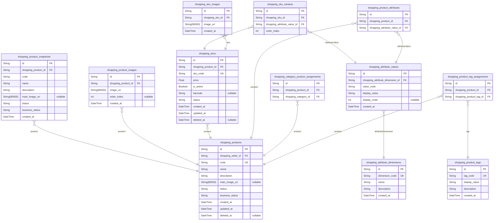
```mermaid
erDiagram
"shopping_products" {
  String id PK
  String shopping_seller_id FK
  String code UK
  String name
  String description
  String(80000) main_image_uri "nullable"
  String status
  String business_status
  DateTime created_at
  DateTime updated_at
  DateTime deleted_at "nullable"
}
"shopping_product_snapshots" {
  String id PK
  String shopping_product_id FK
  String code
  String name
  String description
  String(80000) main_image_uri "nullable"
  String status
  String business_status
  DateTime created_at
}
"shopping_product_images" {
  String id PK
  String shopping_product_id FK
  String(80000) image_uri
  Int order_index "nullable"
  DateTime created_at
}
"shopping_skus" {
  String id PK
  String shopping_product_id FK
  String sku_code UK
  Float price
  Boolean is_active
  String barcode "nullable"
  String status
  DateTime created_at
  DateTime updated_at
  DateTime deleted_at "nullable"
}
"shopping_sku_variants" {
  String id PK
  String shopping_sku_id FK
  String shopping_attribute_value_id FK
  Int order_index
}
"shopping_sku_images" {
  String id PK
  String shopping_sku_id FK
  String(80000) image_uri
  DateTime created_at
}
"shopping_attribute_dimensions" {
  String id PK
  String dimension_code UK
  String name
  String description
  DateTime created_at
}
"shopping_attribute_values" {
  String id PK
  String shopping_attribute_dimension_id FK
  String value_code
  String display_value
  Int display_order "nullable"
  DateTime created_at
}
"shopping_product_attributes" {
  String id PK
  String shopping_product_id FK
  String shopping_attribute_value_id FK
}
"shopping_category_product_assignments" {
  String id PK
  String shopping_product_id FK
  String shopping_category_id FK
}
"shopping_product_tags" {
  String id PK
  String tag_code UK
  String display_value
  String description
  DateTime created_at
}
"shopping_product_tag_assignments" {
  String id PK
  String shopping_product_id FK
  String shopping_product_tag_id FK
}
"shopping_product_snapshots" }o--|| "shopping_products" : product
"shopping_product_images" }o--|| "shopping_products" : product
"shopping_skus" }o--|| "shopping_products" : product
"shopping_sku_variants" }o--|| "shopping_skus" : sku
"shopping_sku_variants" }o--|| "shopping_attribute_values" : attributeValue
"shopping_sku_images" }o--|| "shopping_skus" : sku
"shopping_attribute_values" }o--|| "shopping_attribute_dimensions" : attributeDimension
"shopping_product_attributes" }o--|| "shopping_products" : product
"shopping_product_attributes" }o--|| "shopping_attribute_values" : attributeValue
"shopping_category_product_assignments" }o--|| "shopping_products" : product
"shopping_product_tag_assignments" }o--|| "shopping_products" : product
"shopping_product_tag_assignments" }o--|| "shopping_product_tags" : tag
```

### `shopping_products`

Core catalog products available in the shopping mall platform. Each
product contains general product information (name, description, price,
main image, etc.) and is associated with a seller (FK to
shopping_sellers), categories, tags, and SKUs. Supports both published
(active) and draft/archived status, provides audit and soft delete
fields. Subject to category and tag assignments via subsidiary tables.

Properties as follows:

- `id`: Primary Key.
- `shopping_seller_id`: Belonged seller's [shopping_sellers.id](#shopping_sellers).
- `code`
  > Unique business code for the product, used for lookup or external
  > referencing.
- `name`
  > Product display name shown to shoppers. Used for search and catalog
  > display.
- `description`
  > Long description of the product for customer information and search
  > indexing.
- `main_image_uri`: URI to the primary display image associated with this product.
- `status`
  > Product status (e.g., draft, active, archived, under_review). Used in
  > workflow.
- `business_status`: Business workflow status (e.g., in_review, approved, rejected).
- `created_at`: Creation timestamp for auditing.
- `updated_at`: Last updated timestamp for auditing.
- `deleted_at`
  > Soft-deleted timestamp. If not null, product is archived/not shown to
  > shoppers.

### `shopping_product_snapshots`

Historical snapshots of full product state for audit trail and change
history. Captures all product fields and foreign key references as they
were at the time of the snapshot. Used to reconstruct prior states,
enable moderation, or restore historical product versions. All edits to
shopping_products generate a snapshot entry.

Properties as follows:

- `id`: Primary Key.
- `shopping_product_id`: Parent product's [shopping_products.id](#shopping_products).
- `code`: Business code at time of snapshot.
- `name`: Name at time of snapshot.
- `description`: Long description at time of snapshot.
- `main_image_uri`: Primary image at time of snapshot.
- `status`: Product status at time of snapshot.
- `business_status`: Business workflow status at time of snapshot.
- `created_at`: Snapshot creation timestamp.

### `shopping_product_images`

Images associated with products for catalog display. Each image is linked
to a product and stores a URI reference. Allows multiple images per
product (up to 10 per business rules).

Properties as follows:

- `id`: Primary Key.
- `shopping_product_id`: Parent product's [shopping_products.id](#shopping_products).
- `image_uri`: URI pointing to an image file (JPEG/PNG, up to 5MB per upload).
- `order_index`: Zero-based display order for product images.
- `created_at`: Upload/creation timestamp.

### `shopping_skus`

Individual sellable SKU entities under a product. Each SKU represents a
unique combination of attribute values (variant), price, and inventory
reference. Linked to parent product, and optionally to inventory and
category. Carries pricing, in-stock state, and audit fields.

Properties as follows:

- `id`: Primary Key.
- `shopping_product_id`: Parent product's [shopping_products.id](#shopping_products).
- `sku_code`: Unique SKU business code (externally visible, globally unique).
- `price`: Retail price for this SKU variant.
- `is_active`: SKU enabled/disabled state. If false, not purchasable.
- `barcode`: Optional barcode/UPC for scanning.
- `status`: Business process status (e.g., in_stock, discontinued, archived).
- `created_at`: Creation timestamp.
- `updated_at`: Updated timestamp.
- `deleted_at`: Soft-deleted timestamp (if set, SKU is archived).

### `shopping_sku_variants`

Junction table mapping each SKU to its set of selected variant attribute
values. Supports up to 5 attribute variants per SKU (e.g., color, size,
material). M:N between SKU and attribute value, allowing rich filtering
and search.

Properties as follows:

- `id`: Primary Key.
- `shopping_sku_id`: Parent SKU's [shopping_skus.id](#shopping_skus).
- `shopping_attribute_value_id`: Associated attribute value's [shopping_attribute_values.id](#shopping_attribute_values).
- `order_index`: Order of this attribute among the variants for the SKU.

### `shopping_sku_images`

Images assigned directly to a SKU (variant). Used to represent visual
attributes of a SKU (e.g., color swatch).

Properties as follows:

- `id`: Primary Key.
- `shopping_sku_id`: Parent SKU's [shopping_skus.id](#shopping_skus).
- `image_uri`: URI of the SKU-specific image asset.
- `created_at`: Upload timestamp.

### `shopping_attribute_dimensions`

Defines the possible attribute types used for product/SKU variants (e.g.,
Color, Size, Material). Managed by admins/sellers for flexible product
setup. Each dimension may apply to many products and values.

Properties as follows:

- `id`: Primary Key.
- `dimension_code`
  > Business code for this attribute dimension (used for filtering, must be
  > unique).
- `name`: Display name of the attribute dimension (e.g., Color, Size).
- `description`: Long description for this attribute dimension's purpose.
- `created_at`: Creation timestamp.

### `shopping_attribute_values`

Possible selectable values for each attribute dimension (e.g., Red, Blue
for Color). Each value is connected to its dimension and may be shared
among products. Enables SKU variant composition.

Properties as follows:

- `id`: Primary Key.
- `shopping_attribute_dimension_id`: Parent attribute dimension's [shopping_attribute_dimensions.id](#shopping_attribute_dimensions).
- `value_code`
  > Unique code for this attribute value (used in filtering, must be unique
  > within the dimension).
- `display_value`: Display string (e.g., "Red", "Large", "Cotton").
- `display_order`: Sort order for this value among siblings.
- `created_at`: Creation timestamp.

### `shopping_product_attributes`

Junction table marking which attribute dimensions and values apply to a
given product (not variant-specific). Used to expose filtering and
faceted search features in the product catalog. M:N between
shopping_products and attribute values.

Properties as follows:

- `id`: Primary Key.
- `shopping_product_id`: Parent product's [shopping_products.id](#shopping_products).
- `shopping_attribute_value_id`: Assigned attribute value's [shopping_attribute_values.id](#shopping_attribute_values).

### `shopping_category_product_assignments`

Junction table assigning products to one or more categories. Many-to-many
mapping between products and shopping_categories. Used for catalog
display and filtering. Only leaf categories are valid assignments.

Properties as follows:

- `id`: Primary Key.
- `shopping_product_id`: Assigned product's [shopping_products.id](#shopping_products).
- `shopping_category_id`: Category's [shopping_categories.id](#shopping_categories). Only leaf nodes allowed.

### `shopping_product_tags`

Defines tags that can be applied to products for filtering and search
enhancement. Each tag is a free-form label managed by sellers or admins.
Tags can be assigned to multiple products through the tag assignment
table.

Properties as follows:

- `id`: Primary Key.
- `tag_code`: Business code/slug for the tag (must be unique).
- `display_value`: Displayed tag name (e.g., "Eco-Friendly").
- `description`: Description/purpose of this tag.
- `created_at`: Creation timestamp.

### `shopping_product_tag_assignments`

Junction table connecting products and tags (M:N). Enables sellers to
attach multiple tags to any product for catalog search and filter
operations.

Properties as follows:

- `id`: Primary Key.
- `shopping_product_id`: Assigned product's [shopping_products.id](#shopping_products).
- `shopping_product_tag_id`: Tag's [shopping_product_tags.id](#shopping_product_tags).

## Inventory

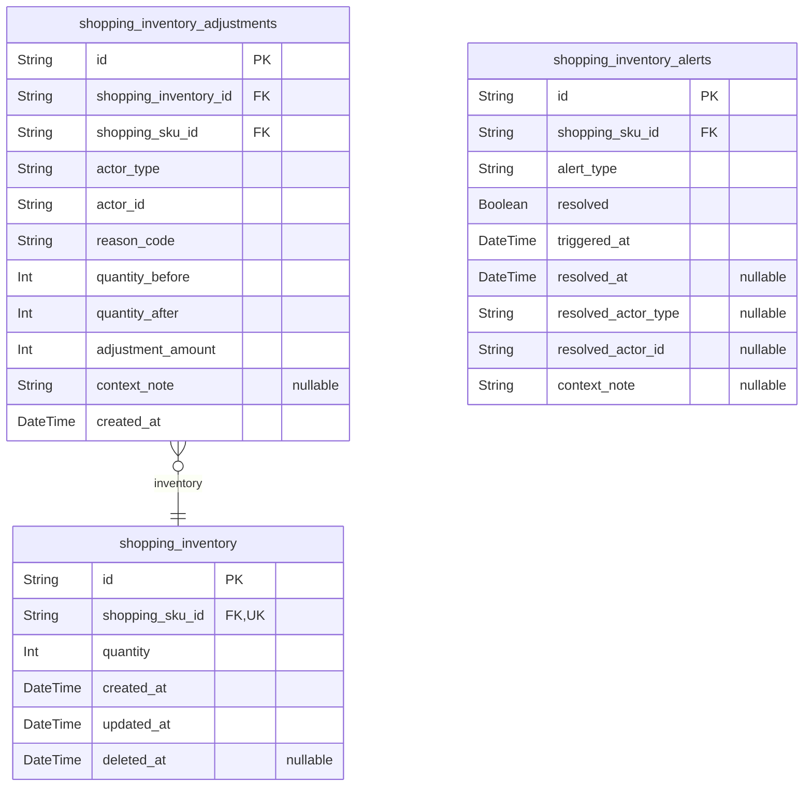
```mermaid
erDiagram
"shopping_inventory" {
  String id PK
  String shopping_sku_id FK,UK
  Int quantity
  DateTime created_at
  DateTime updated_at
  DateTime deleted_at "nullable"
}
"shopping_inventory_adjustments" {
  String id PK
  String shopping_inventory_id FK
  String shopping_sku_id FK
  String actor_type
  String actor_id
  String reason_code
  Int quantity_before
  Int quantity_after
  Int adjustment_amount
  String context_note "nullable"
  DateTime created_at
}
"shopping_inventory_alerts" {
  String id PK
  String shopping_sku_id FK
  String alert_type
  Boolean resolved
  DateTime triggered_at
  DateTime resolved_at "nullable"
  String resolved_actor_type "nullable"
  String resolved_actor_id "nullable"
  String context_note "nullable"
}
"shopping_inventory_adjustments" }o--|| "shopping_inventory" : inventory
```

### `shopping_inventory`

Represents the authoritative, real-time inventory state for each SKU.
This is the sole source of current stock count and status per SKU.
Adjustments are never made directly; all changes are append-only logged
and then reflected here. Soft delete used for SKU discontinuation/audit
retention. Foreign key to the SKU entity, all other SKU/product
information is referenced, never stored/duplicated.

Properties as follows:

- `id`: Primary Key.
- `shopping_sku_id`
  > SKU entity this inventory record tracks. [shopping_skus.id](#shopping_skus).
  > One-to-one with inventory record.
- `quantity`
  > Current available units. Must be >= 0. Stock-outs (0) and re-stocks
  > update this value atomically.
- `created_at`: When inventory record was created. Used for auditing.
- `updated_at`: When inventory last changed. Updated only via atomic adjustment flow.
- `deleted_at`
  > Soft deletion/audit retention: populated if SKU is removed/discontinued,
  > not physically deleted for compliance.

### `shopping_inventory_adjustments`

Ledger-style append-only log for every adjustment event that alters
inventory. Immutably captures before/after, delta, reason, actor context.
Snapshots exact stock transitions for compliance, rollback, and detailed
reporting. Does not soft-delete/never updated. Actor polymorphic fields
store actor_id (uuid) and actor_type (string) for disambiguation between
customers, sellers, admins. All IDs are simple UUIDs, never relations, to
prevent coupling between audit and account systems.

Properties as follows:

- `id`: Primary Key.
- `shopping_inventory_id`
  > Reference to the inventory instance being changed. {@link
  > shopping_inventory.id}.
- `shopping_sku_id`: SKU which was adjusted. [shopping_skus.id](#shopping_skus).
- `actor_type`
  > Which actor class performed this adjustment (customer, seller, admin, or
  > system). Polymorphic: not a relation.
- `actor_id`
  > UUID of the involved actor (user/admin/seller/system). No foreign key:
  > denormalized for immutable audit history.
- `reason_code`
  > Reason code for adjustment (order, refund, manual, etc). Used for
  > filtering and analytics.
- `quantity_before`: Quantity before adjustment applied.
- `quantity_after`: Quantity after adjustment.
- `adjustment_amount`
  > Delta applied by adjustment: quantity_after = quantity_before +
  > adjustment_amount.
- `context_note`
  > Optional context/note (order/payment reference, administrator comment,
  > batch ID, etc).
- `created_at`
  > When the adjustment event was logged. Creation timestamp only, never
  > updated.

### `shopping_inventory_alerts`

Inventory operational alerts: low-stock, stockout, anomaly triggers. Each
alert is unique per SKU/condition. Alerts track if they are open (active)
or resolved along with context of resolution. Actor info on resolution is
polymorphic: actor_type string and actor_id UUID (no foreign keys, as
alerts may be resolved by admins, sellers, or system events).

Properties as follows:

- `id`: Primary Key.
- `shopping_sku_id`: The SKU for which the alert was generated. [shopping_skus.id](#shopping_skus).
- `alert_type`
  > Type of alert: low_stock, out_of_stock, anomaly, manual. Used for logic
  > and filtering.
- `resolved`: True if alert has been addressed and is no longer active, else false.
- `triggered_at`: When alert was created (triggered).
- `resolved_at`: Timestamp alert was resolved/closed, if applicable.
- `resolved_actor_type`
  > Actor class that resolved the alert. Optional: 'admin', 'seller',
  > 'system'.
- `resolved_actor_id`: UUID of resolving actor (admin/seller/system). Optional. No FK.
- `context_note`
  > Explanation or context on why alert was opened or resolved. Useful for
  > operators.

## CartWishlist

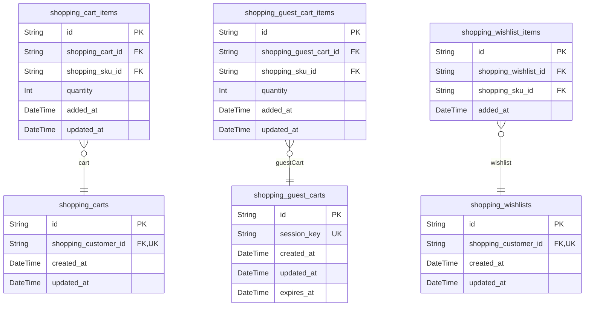
```mermaid
erDiagram
"shopping_carts" {
  String id PK
  String shopping_customer_id FK,UK
  DateTime created_at
  DateTime updated_at
}
"shopping_cart_items" {
  String id PK
  String shopping_cart_id FK
  String shopping_sku_id FK
  Int quantity
  DateTime added_at
  DateTime updated_at
}
"shopping_guest_carts" {
  String id PK
  String session_key UK
  DateTime created_at
  DateTime updated_at
  DateTime expires_at
}
"shopping_guest_cart_items" {
  String id PK
  String shopping_guest_cart_id FK
  String shopping_sku_id FK
  Int quantity
  DateTime added_at
  DateTime updated_at
}
"shopping_wishlists" {
  String id PK
  String shopping_customer_id FK,UK
  DateTime created_at
  DateTime updated_at
}
"shopping_wishlist_items" {
  String id PK
  String shopping_wishlist_id FK
  String shopping_sku_id FK
  DateTime added_at
}
"shopping_cart_items" }o--|| "shopping_carts" : cart
"shopping_guest_cart_items" }o--|| "shopping_guest_carts" : guestCart
"shopping_wishlist_items" }o--|| "shopping_wishlists" : wishlist
```

### `shopping_carts`

Shopping cart owned by a logged-in customer for storing items prior to
order. Each customer has at most one active cart. Associates directly
with the corresponding [shopping_customers](#shopping_customers) and is cleared upon
successful order or account deletion. Supports persistence, merging guest
carts (by session) at login. Main entry point for cart-related API
operations.

Properties as follows:

- `id`: Primary Key.
- `shopping_customer_id`
  > Belonged customer's [shopping_customers.id](#shopping_customers). References owner of
  > the cart.
- `created_at`: Cart creation timestamp.
- `updated_at`: Cart last updated timestamp (e.g., addition/removal of item).

### `shopping_cart_items`

Items contained in a customer's cart. Strict junction between
shopping_carts and shopping_skus, with unique constraint per sku. Stores
the quantity, variant/sku context, and add/update timestamps for each
item-in-cart. Enforces no duplicate SKUs per cart.

Properties as follows:

- `id`: Primary Key.
- `shopping_cart_id`: Parent cart's [shopping_carts.id](#shopping_carts).
- `shopping_sku_id`: Contained sku's [shopping_skus.id](#shopping_skus).
- `quantity`
  > Item quantity for this SKU within the cart. Enforced maximum at
  > application level (e.g., 10).
- `added_at`: When this item was added to cart.
- `updated_at`: Latest update (quantity change) for the cart item.

### `shopping_guest_carts`

Shopping cart for a guest (unauthenticated, session-based) user. Each
guest cart is identified by a unique session key and optionally has an
expiration. No customer or account FK present. Serves as the basis for
merging into account cart upon login/registration. Deleted or expired per
business policy.

Properties as follows:

- `id`: Primary Key.
- `session_key`: Opaque unique session key for guest cart (e.g., UUID, random secret).
- `created_at`: Cart creation time.
- `updated_at`: Cart last update time for activity tracking.
- `expires_at`
  > When this guest cart will expire and be deleted. Enforced by scheduled
  > cleanup jobs.

### `shopping_guest_cart_items`

Items in a guest cart. Junction table mapping a guest cart
(session-based) to specific SKU selections and quantities. Unique per
(cart, SKU). Deleted upon guest cart merge/expiration.

Properties as follows:

- `id`: Primary Key.
- `shopping_guest_cart_id`: Parent guest cart's [shopping_guest_carts.id](#shopping_guest_carts).
- `shopping_sku_id`: Contained sku's [shopping_skus.id](#shopping_skus).
- `quantity`: Quantity for this SKU in guest cart.
- `added_at`: Timestamp item added.
- `updated_at`: Latest update timestamp.

### `shopping_wishlists`

Wishlist owned by a logged-in customer. Each customer has at most one
wishlist. Contains SKUs/products the customer is interested in; supports
independent management apart from the cart. Main entry point for wishlist
API operations.

Properties as follows:

- `id`: Primary Key.
- `shopping_customer_id`: Belonged customer's [shopping_customers.id](#shopping_customers). Owner of the wishlist.
- `created_at`: Wishlist creation timestamp.
- `updated_at`: Wishlist last update timestamp.

### `shopping_wishlist_items`

SKUs contained in a customer's wishlist. Junction between wishlist and
SKU, unique per (wishlist, SKU). Allows future addition of metadata
(e.g., added date) and supports efficient lookup for customer
recommendations.

Properties as follows:

- `id`: Primary Key.
- `shopping_wishlist_id`: Parent wishlist's [shopping_wishlists.id](#shopping_wishlists).
- `shopping_sku_id`: Contained sku's [shopping_skus.id](#shopping_skus).
- `added_at`: Timestamp SKU was added to the wishlist.

## Orders

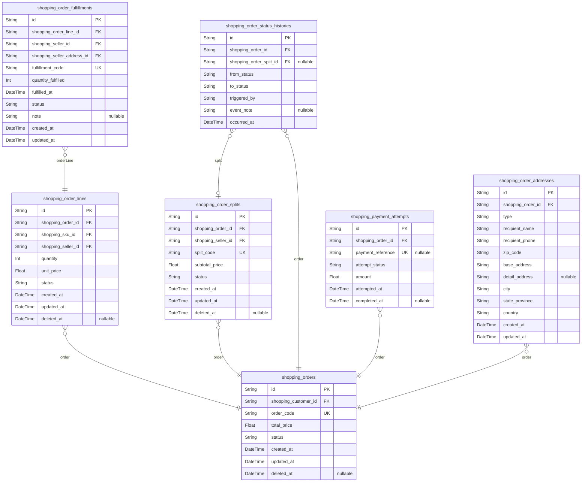
```mermaid
erDiagram
"shopping_orders" {
  String id PK
  String shopping_customer_id FK
  String order_code UK
  Float total_price
  String status
  DateTime created_at
  DateTime updated_at
  DateTime deleted_at "nullable"
}
"shopping_order_lines" {
  String id PK
  String shopping_order_id FK
  String shopping_sku_id FK
  String shopping_seller_id FK
  Int quantity
  Float unit_price
  String status
  DateTime created_at
  DateTime updated_at
  DateTime deleted_at "nullable"
}
"shopping_order_splits" {
  String id PK
  String shopping_order_id FK
  String shopping_seller_id FK
  String split_code UK
  Float subtotal_price
  String status
  DateTime created_at
  DateTime updated_at
  DateTime deleted_at "nullable"
}
"shopping_order_status_histories" {
  String id PK
  String shopping_order_id FK
  String shopping_order_split_id FK "nullable"
  String from_status
  String to_status
  String triggered_by
  String event_note "nullable"
  DateTime occurred_at
}
"shopping_payment_attempts" {
  String id PK
  String shopping_order_id FK
  String payment_reference UK "nullable"
  String attempt_status
  Float amount
  DateTime attempted_at
  DateTime completed_at "nullable"
}
"shopping_order_fulfillments" {
  String id PK
  String shopping_order_line_id FK
  String shopping_seller_id FK
  String shopping_seller_address_id FK
  String fulfillment_code UK
  Int quantity_fulfilled
  DateTime fulfilled_at
  String status
  String note "nullable"
  DateTime created_at
  DateTime updated_at
}
"shopping_order_addresses" {
  String id PK
  String shopping_order_id FK
  String type
  String recipient_name
  String recipient_phone
  String zip_code
  String base_address
  String detail_address "nullable"
  String city
  String state_province
  String country
  DateTime created_at
  DateTime updated_at
}
"shopping_order_lines" }o--|| "shopping_orders" : order
"shopping_order_splits" }o--|| "shopping_orders" : order
"shopping_order_status_histories" }o--|| "shopping_orders" : order
"shopping_order_status_histories" }o--o| "shopping_order_splits" : split
"shopping_payment_attempts" }o--|| "shopping_orders" : order
"shopping_order_fulfillments" }o--|| "shopping_order_lines" : orderLine
"shopping_order_addresses" }o--|| "shopping_orders" : order
```

### `shopping_orders`

Core order entity representing a customer purchase transaction.
References one customer and includes summary pricing and relationship to
lines, splits, addresses, and payment attempts. Audit timestamps support
full lifecycle traceability. Central to all business fulfillment and
payment processes.

Properties as follows:

- `id`: Primary Key.
- `shopping_customer_id`: Purchasing customer's [shopping_customers.id](#shopping_customers).
- `order_code`
  > Globally unique, human-readable order reference code (e.g.,
  > ORD-20240001). Used in customer and business workflows.
- `total_price`: Total price for the entire order (aggregated from lines).
- `status`
  > Current order status (see status history for changes). E.g. 'pending',
  > 'paid', 'processing', 'fulfilled', etc.
- `created_at`: Order creation timestamp.
- `updated_at`: Order last updated timestamp.
- `deleted_at`: Order soft delete timestamp; null if active.

### `shopping_order_lines`

Individual order line item, representing a single SKU and its
quantity/fulfillment. Linked to both shopping_orders and shopping_skus.
Basis for refunds, fulfillment, status, and review eligibility.

Properties as follows:

- `id`: Primary Key.
- `shopping_order_id`: Parent order's [shopping_orders.id](#shopping_orders).
- `shopping_sku_id`: Purchased SKU's [shopping_skus.id](#shopping_skus).
- `shopping_seller_id`: Owning seller's [shopping_sellers.id](#shopping_sellers).
- `quantity`: Ordered quantity of the SKU.
- `unit_price`: Final per-unit price for this SKU in the order (post-discount/tax).
- `status`
  > Current fulfillment status of this item (e.g., pending, shipped,
  > delivered).
- `created_at`: Order line creation time.
- `updated_at`: Order line update time.
- `deleted_at`: Soft delete for this line; null if active.

### `shopping_order_splits`

Represents split of an order, per seller, when a customer order contains
items from multiple sellers. Each split is processed, fulfilled, and
tracked independently.

Properties as follows:

- `id`: Primary Key.
- `shopping_order_id`: Parent order's [shopping_orders.id](#shopping_orders).
- `shopping_seller_id`: Seller for this split's [shopping_sellers.id](#shopping_sellers).
- `split_code`: Unique code for this split (order + seller). Used for tracking/reporting.
- `subtotal_price`: Subtotal price for this seller in this order, sum of related order lines.
- `status`: Current status for the seller's portion (e.g., 'pending', 'fulfilled').
- `created_at`: Split creation timestamp.
- `updated_at`: Split last update timestamp.
- `deleted_at`: Soft delete for this split; null if active.

### `shopping_order_status_histories`

Audit log of order and split status changes over time. Captures
transition events, who/what triggered them, previous/new status,
timestamp, and optional notes. Used for business auditing and
troubleshooting.

Properties as follows:

- `id`: Primary Key.
- `shopping_order_id`: Order's [shopping_orders.id](#shopping_orders).
- `shopping_order_split_id`
  > Order split's [shopping_order_splits.id](#shopping_order_splits), if status applies to a
  > split. Nullable.
- `from_status`: Previous status value.
- `to_status`: New status value for the transition.
- `triggered_by`: Actor/role/automated source that initiated the transition.
- `event_note`: Optional freeform note about the event/context.
- `occurred_at`: Timestamp of status transition.

### `shopping_payment_attempts`

Tracks all attempts to pay for an order (including failures, retries, or
alternate payment methods). Links to core order; each record includes
results and unique payment gateway identifiers as appropriate.

Properties as follows:

- `id`: Primary Key.
- `shopping_order_id`: Order this payment attempt is for: [shopping_orders.id](#shopping_orders).
- `payment_reference`
  > External provider or gateway reference for this payment attempt. May be
  > empty until submitted to processor.
- `attempt_status`: Status for this attempt (e.g., pending, completed, failed, cancelled).
- `amount`: Total amount attempted to charge.
- `attempted_at`: Timestamp of payment attempt creation.
- `completed_at`: When payment attempt finished (succeed/failed); null if still pending.

### `shopping_order_fulfillments`

Actual fulfillment action for a given order line. Links to an order line
with details such as fulfillment/shipping date, label, fulfillment
address, and status. Multiple fulfillment records possible per line to
support split-shipments or partial fill scenarios.

Properties as follows:

- `id`: Primary Key.
- `shopping_order_line_id`: Order line being fulfilled: [shopping_order_lines.id](#shopping_order_lines).
- `shopping_seller_id`: Seller fulfilling this order line: [shopping_sellers.id](#shopping_sellers).
- `shopping_seller_address_id`
  > Fulfillment source address: [shopping_seller_addresses.id](#shopping_seller_addresses)
  > (warehouse, etc.).
- `fulfillment_code`
  > Tracking code/label for fulfillment event. Human-readable, unique for
  > this record.
- `quantity_fulfilled`: Quantity filled in this fulfillment event.
- `fulfilled_at`: When fulfillment (handoff to carrier) completed.
- `status`: Current status (e.g. 'pending', 'shipped', 'delivered', 'cancelled').
- `note`: Optional note for fulfillment details (instructions, etc).
- `created_at`: Fulfillment record creation time.
- `updated_at`: Record update time.

### `shopping_order_addresses`

Stores delivery/billing address records associated to orders. Subsidiary
record — not independently managed, but supports audit and business
reporting in event of address changes. Kept for audit trail after order
is completed.

Properties as follows:

- `id`: Primary Key.
- `shopping_order_id`: Order associated with this address: [shopping_orders.id](#shopping_orders).
- `type`: Address type, e.g. 'shipping', 'billing' (noted for each record).
- `recipient_name`: Name of the delivery/billing recipient.
- `recipient_phone`: Contact phone for recipient (formatted as per local standards).
- `zip_code`: Postal or ZIP code, as required by destination.
- `base_address`: Main street address (no apartment/extra details).
- `detail_address`: Apartment, suite, or additional info (optional).
- `city`: City name/district for route assignments.
- `state_province`: State, province, or region.
- `country`: Country code (ISO 3166-1 or platform standard).
- `created_at`: Address record creation time.
- `updated_at`: Address record last update time.

## Refunds

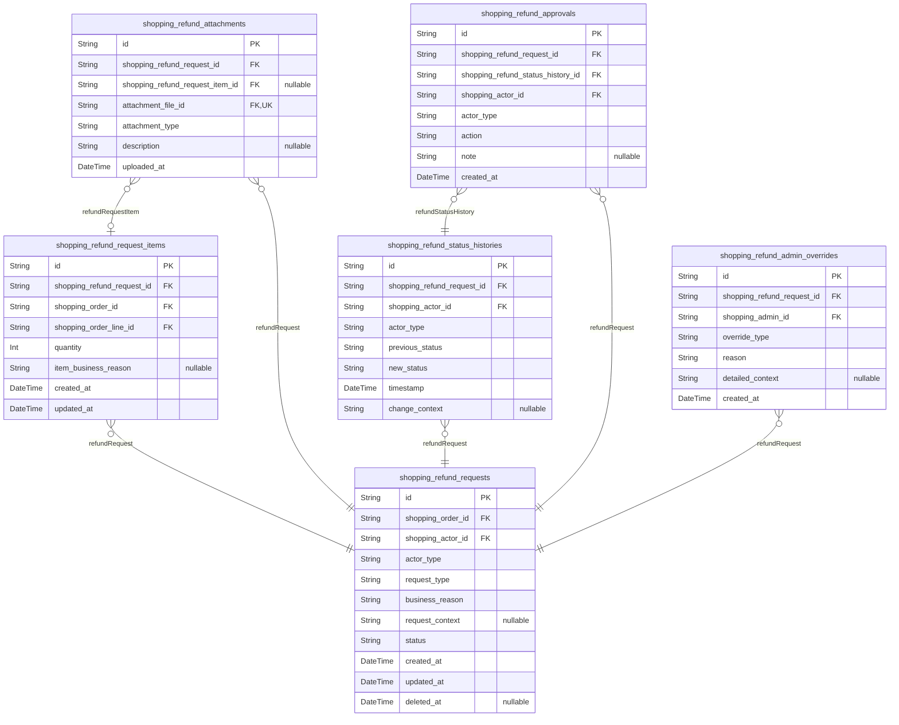
```mermaid
erDiagram
"shopping_refund_requests" {
  String id PK
  String shopping_order_id FK
  String shopping_actor_id FK
  String actor_type
  String request_type
  String business_reason
  String request_context "nullable"
  String status
  DateTime created_at
  DateTime updated_at
  DateTime deleted_at "nullable"
}
"shopping_refund_request_items" {
  String id PK
  String shopping_refund_request_id FK
  String shopping_order_id FK
  String shopping_order_line_id FK
  Int quantity
  String item_business_reason "nullable"
  DateTime created_at
  DateTime updated_at
}
"shopping_refund_attachments" {
  String id PK
  String shopping_refund_request_id FK
  String shopping_refund_request_item_id FK "nullable"
  String attachment_file_id FK,UK
  String attachment_type
  String description "nullable"
  DateTime uploaded_at
}
"shopping_refund_status_histories" {
  String id PK
  String shopping_refund_request_id FK
  String shopping_actor_id FK
  String actor_type
  String previous_status
  String new_status
  DateTime timestamp
  String change_context "nullable"
}
"shopping_refund_approvals" {
  String id PK
  String shopping_refund_request_id FK
  String shopping_refund_status_history_id FK
  String shopping_actor_id FK
  String actor_type
  String action
  String note "nullable"
  DateTime created_at
}
"shopping_refund_admin_overrides" {
  String id PK
  String shopping_refund_request_id FK
  String shopping_admin_id FK
  String override_type
  String reason
  String detailed_context "nullable"
  DateTime created_at
}
"shopping_refund_request_items" }o--|| "shopping_refund_requests" : refundRequest
"shopping_refund_attachments" }o--|| "shopping_refund_requests" : refundRequest
"shopping_refund_attachments" }o--o| "shopping_refund_request_items" : refundRequestItem
"shopping_refund_status_histories" }o--|| "shopping_refund_requests" : refundRequest
"shopping_refund_approvals" }o--|| "shopping_refund_requests" : refundRequest
"shopping_refund_approvals" }o--|| "shopping_refund_status_histories" : refundStatusHistory
"shopping_refund_admin_overrides" }o--|| "shopping_refund_requests" : refundRequest
```

### `shopping_refund_requests`

Central entity for refund, return, or cancellation requests. Represents a
standalone business process initiated by a customer or escalated by a
seller/admin. Contains references to the original order and actor,
request type, reason, context, and status. Attachments and request items
are linked via subsidiary tables. Approval and override processes
reference this model.

Properties as follows:

- `id`: Primary Key.
- `shopping_order_id`: Referenced order. [shopping_orders.id](#shopping_orders).
- `shopping_actor_id`
  > ID of the actor initiating the request (customer/seller/admin). {@link
  > shopping_customers.id}/[shopping_sellers.id](#shopping_sellers)/{@link
  > shopping_admins.id} depending on actor_type.
- `actor_type`
  > Type of actor initiating the request. Must be 'customer', 'seller', or
  > 'admin'.
- `request_type`: Business type of request: 'refund', 'return', or 'cancellation'.
- `business_reason`
  > Short non-nullable business provided reason for the request. E.g. 'item
  > defective', 'ordered by mistake', etc.
- `request_context`
  > Optional additional structured context or metadata associated with the
  > request (may contain JSON as string).
- `status`
  > Current business status of the request (e.g., 'pending',
  > 'awaiting_approval', 'approved', 'declined', 'completed', 'escalated',
  > etc).
- `created_at`: Timestamp when the refund request was created.
- `updated_at`
  > Timestamp when the request was last modified (status changed, reason
  > updated, etc).
- `deleted_at`: Optional soft deletion of refund request for business/audit reasons.

### `shopping_refund_request_items`

Links individual order line items to a refund request. Used to itemize
which order lines/SKUs are subject to refund, return, or cancellation
claims. Contains FK refs to parent request, order, and order line item,
and tracks quantity and item-specific reason if set. Always a child of a
refund request.

Properties as follows:

- `id`: Primary Key.
- `shopping_refund_request_id`: Parent refund request. [shopping_refund_requests.id](#shopping_refund_requests).
- `shopping_order_id`: Target order. [shopping_orders.id](#shopping_orders).
- `shopping_order_line_id`: Specific order line (SKU) being refunded. [shopping_order_lines.id](#shopping_order_lines).
- `quantity`
  > Number of units in the order line requested for
  > refund/return/cancellation (must be ≥1, ≤ order line quantity).
- `item_business_reason`
  > Optional item-specific business reason for requesting refund. Overrides
  > parent reason if set.
- `created_at`: Timestamp when the refund item was created.
- `updated_at`: Timestamp of last modification to this item record.

### `shopping_refund_attachments`

Stores any evidence, photos, documents, or files attached to a refund
request or refund item. Each attachment always references a parent
request and optionally a specific request item. Links to generic
attachment files handled in global file storage. Always subsidiary to a
refund request.

Properties as follows:

- `id`: Primary Key.
- `shopping_refund_request_id`: Parent refund request. [shopping_refund_requests.id](#shopping_refund_requests).
- `shopping_refund_request_item_id`
  > Optional: refund request item this attachment is associated with. {@link
  > shopping_refund_request_items.id}.
- `attachment_file_id`
  > FK to attachment file entity (managed in the file storage subsystem).
  > [shopping_product_images.id](#shopping_product_images) or generic attachment.
- `attachment_type`: Type of attachment (e.g., 'evidence', 'photo', 'invoice', etc).
- `description`: Human-readable description of attachment purpose or content.
- `uploaded_at`: Time attachment was uploaded.

### `shopping_refund_status_histories`

Append-only snapshot/audit log of all status transitions, actor actions,
and context for a refund request. Every change to a refund's status,
escalation, approval, or override creates a new record. Supports full
audit trails. Provides a read-only chronological timeline.

Properties as follows:

- `id`: Primary Key.
- `shopping_refund_request_id`: Parent refund request. [shopping_refund_requests.id](#shopping_refund_requests).
- `shopping_actor_id`
  > ID of the actor making this status change. {@link
  > shopping_customers.id}/[shopping_sellers.id](#shopping_sellers)/{@link
  > shopping_admins.id}.
- `actor_type`: Type of actor making the status change: customer, seller, admin.
- `previous_status`: Request status before this transition.
- `new_status`: Request status after the transition.
- `timestamp`: When this status change occurred.
- `change_context`: Optional additional context or comments for audit/reference.

### `shopping_refund_approvals`

Record of approval or rejection actions for a given refund request.
Includes compliance and workflow details; each approval is tied to the
request and status history, and records actor and audit fields. Approval
actions are explicitly recorded regardless of acceptance or rejection for
traceability.

Properties as follows:

- `id`: Primary Key.
- `shopping_refund_request_id`
  > Refund request being approved/rejected. {@link
  > shopping_refund_requests.id}.
- `shopping_refund_status_history_id`
  > Specific status change being approved/rejected. {@link
  > shopping_refund_status_histories.id}.
- `shopping_actor_id`
  > Actor performing the approval/rejection action. {@link
  > shopping_admins.id}/[shopping_sellers.id](#shopping_sellers).
- `actor_type`: Type of actor approving/rejecting (admin, seller).
- `action`: Approval action taken: 'approved', 'rejected', or relevant state.
- `note`: Optional note or rationale for approval/rejection.
- `created_at`: Timestamp when the approval/rejection is recorded.

### `shopping_refund_admin_overrides`

Captures administrative override/escalation/forced-resolution actions by
platform admin for refund cases. Used for compliance, legal, or
regulatory interventions. References parent refund request, admin actor,
context, and timestamps. Always subsidiary to a refund instance.

Properties as follows:

- `id`: Primary Key.
- `shopping_refund_request_id`: Parent refund request. [shopping_refund_requests.id](#shopping_refund_requests).
- `shopping_admin_id`: Admin actor performing the override. [shopping_admins.id](#shopping_admins).
- `override_type`: Type of override (e.g., 'force_accept', 'force_reject', 'reassign', etc).
- `reason`: Business or legal reason for performing the override.
- `detailed_context`: Optional detailed business/technical context or metadata for trace.
- `created_at`: Timestamp when the override was initiated.

## Tracking

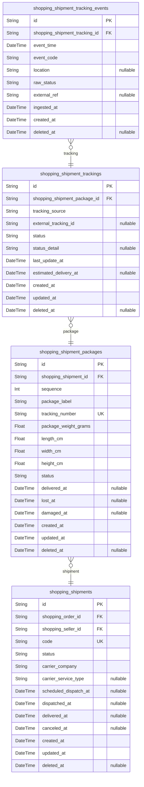
```mermaid
erDiagram
"shopping_shipments" {
  String id PK
  String shopping_order_id FK
  String shopping_seller_id FK
  String code UK
  String status
  String carrier_company
  String carrier_service_type "nullable"
  DateTime scheduled_dispatch_at "nullable"
  DateTime dispatched_at "nullable"
  DateTime delivered_at "nullable"
  DateTime canceled_at "nullable"
  DateTime created_at
  DateTime updated_at
  DateTime deleted_at "nullable"
}
"shopping_shipment_packages" {
  String id PK
  String shopping_shipment_id FK
  Int sequence
  String package_label
  String tracking_number UK
  Float package_weight_grams
  Float length_cm
  Float width_cm
  Float height_cm
  String status
  DateTime delivered_at "nullable"
  DateTime lost_at "nullable"
  DateTime damaged_at "nullable"
  DateTime created_at
  DateTime updated_at
  DateTime deleted_at "nullable"
}
"shopping_shipment_trackings" {
  String id PK
  String shopping_shipment_package_id FK
  String tracking_source
  String external_tracking_id "nullable"
  String status
  String status_detail "nullable"
  DateTime last_update_at
  DateTime estimated_delivery_at "nullable"
  DateTime created_at
  DateTime updated_at
  DateTime deleted_at "nullable"
}
"shopping_shipment_tracking_events" {
  String id PK
  String shopping_shipment_tracking_id FK
  DateTime event_time
  String event_code
  String location "nullable"
  String raw_status
  String external_ref "nullable"
  DateTime ingested_at
  DateTime created_at
  DateTime deleted_at "nullable"
}
"shopping_shipment_packages" }o--|| "shopping_shipments" : shipment
"shopping_shipment_trackings" }o--|| "shopping_shipment_packages" : package
"shopping_shipment_tracking_events" }o--|| "shopping_shipment_trackings" : tracking
```

### `shopping_shipments`

Represents a single logical shipment process which may fulfill part or
all of a customer order. Contains courier allocation, main status, and
summary delivery data. Each shipment aggregates multiple packages and
references the originating order, allowing support for split shipments
and multi-carrier fulfillment. Business context: managed by admin or
warehouse ops; users/sellers view but do not edit. Relates to {@link
shopping_shipment_packages}.

Properties as follows:

- `id`: Primary Key.
- `shopping_order_id`: Originating order. [shopping_orders.id](#shopping_orders).
- `shopping_seller_id`: Owning seller/business for this shipment. [shopping_sellers.id](#shopping_sellers).
- `code`: Unique shipment code for business/ops tracing (e.g. SHPT-2025-0001).
- `status`
  > Shipment lifecycle status (e.g. pending, packed, in_transit, delivered,
  > canceled, returned).
- `carrier_company`: Allocated shipping/courier company (display name, e.g. FedEx, CJ대한통운).
- `carrier_service_type`
  > Specific courier service used (e.g. overnight/express/standard, if
  > multi-option).
- `scheduled_dispatch_at`
  > Planned dispatch/shipping datetime for warehouse logistics (nullable for
  > ad-hoc).
- `dispatched_at`: Actual shipment dispatch timestamp (for logistics/audit trail).
- `delivered_at`: Final shipment delivered/courier scan timestamp (null until completed).
- `canceled_at`: If canceled, timestamp of shipment cancellation.
- `created_at`: Entity creation timestamp (UTC).
- `updated_at`: Entity last updated timestamp (UTC).
- `deleted_at`: Soft-delete timestamp; null unless deleted.

### `shopping_shipment_packages`

Physical package unit within a shipment. Each shipment may contain 1..n
packages, supporting split or consolidated packaging. Tracks package
dimensions, weight, carrier label, and fulfillment details. Used for
traceability, lost/damaged shipment handling, and external tracking
number assignment. Relates to [shopping_shipments](#shopping_shipments) via shipment_id
and to [shopping_shipment_trackings](#shopping_shipment_trackings).

Properties as follows:

- `id`: Primary Key.
- `shopping_shipment_id`: Parent shipment this package belongs to. [shopping_shipments.id](#shopping_shipments).
- `sequence`: Sequence/order of the package within the parent shipment.
- `package_label`: Carrier/warehouse-assigned package ID or label for internal ops.
- `tracking_number`: Courier-generated unique tracking number (external use).
- `package_weight_grams`: Weight in grams for carrier, shipping cost, and customs.
- `length_cm`: Length (cm) of package for shipper/courier specs.
- `width_cm`: Width (cm) for fulfillment and shipper/courier specs.
- `height_cm`: Height (cm) of package.
- `status`
  > Package status (e.g. pending, ready, shipped, in_transit, delivered,
  > lost, damaged).
- `delivered_at`: If final, recorded delivery timestamp (external scan).
- `lost_at`: If lost/undeliverable, recorded timestamp.
- `damaged_at`: If carrier or warehouse logs as damaged during process, timestamp noted.
- `created_at`: Entity creation timestamp (UTC).
- `updated_at`: Last update UTC timestamp.
- `deleted_at`: Soft-delete timestamp, null unless deleted.

### `shopping_shipment_trackings`

Tracking instance for each package/courier. May exist for each
shipment_package if more than one carrier or external tracking source is
involved (e.g. handoff between domestic/international carriers). Used for
reconciliation of multiple tracking sources and complete audit trace.
Each is linked to a single package and may log API/scan info, last known
status, and expected/estimated delivery. Not managed directly by
end-users.

Properties as follows:

- `id`: Primary Key.
- `shopping_shipment_package_id`
  > Parent package this tracking instance is associated with. {@link
  > shopping_shipment_packages.id}.
- `tracking_source`
  > Source of tracking data (e.g. courier_api, warehouse_scan,
  > customer_report, manual); for logging provenance.
- `external_tracking_id`
  > Unique tracking reference provided by external carrier/courier API (if
  > available).
- `status`
  > Most recently reported status from this tracking instance (e.g.
  > in_transit, delivered, delayed, exception, lost).
- `status_detail`
  > Full text from latest tracking event/status message (raw message or
  > system mapped).
- `last_update_at`: Timestamp of last update from carrier/API/scan or manual update.
- `estimated_delivery_at`: Estimated delivery time, if provided by courier or computed by system.
- `created_at`: Row created UTC timestamp.
- `updated_at`: Last modification UTC timestamp.
- `deleted_at`: Soft delete timestamp.

### `shopping_shipment_tracking_events`

Immutable, append-only log of all significant tracking events for a
shipment package. Each event corresponds to a single timestamped scan,
status update, or tracker API callback—may include carrier codes,
location, raw event text, and associated URLs or external references.
Enables full audit trail and external integration troubleshooting.
Managed as an event log, not for direct CRUD except system ingestion.

Properties as follows:

- `id`: Primary Key.
- `shopping_shipment_tracking_id`
  > Linked tracking instance (which is, in turn, linked to a package). {@link
  > shopping_shipment_trackings.id}.
- `event_time`
  > Datetime of this tracking event (scan/callback/receipt/etc; not
  > necessarily same as system ingested time).
- `event_code`
  > Courier or platform event code (‘DELIVERED’, ‘IN_TRANSIT’,
  > ‘OUT_FOR_DELIVERY’, etc), or custom code for system events.
- `location`
  > Event location (city, warehouse, or geo string); null if not supplied by
  > source.
- `raw_status`
  > Raw status/description from external tracking event or API; full,
  > unmapped text.
- `external_ref`
  > URL or reference provided by external tracker system (tracking link, scan
  > ID, etc).
- `ingested_at`
  > UTC time when this event was ingested by the system (differs from
  > event_time when delayed).
- `created_at`: Row creation time (UTC).
- `deleted_at`
  > Soft-delete flag/timestamp; event log is never hard-deleted, but
  > deletions are tracked for audit.

## Reviews

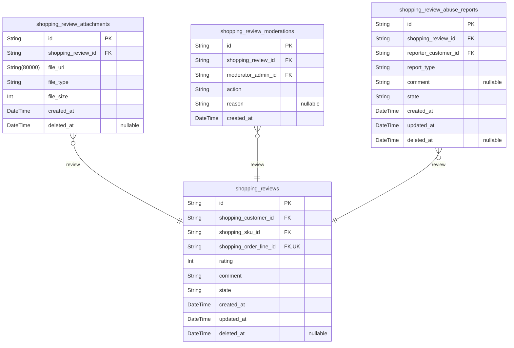
```mermaid
erDiagram
"shopping_reviews" {
  String id PK
  String shopping_customer_id FK
  String shopping_sku_id FK
  String shopping_order_line_id FK,UK
  Int rating
  String comment
  String state
  DateTime created_at
  DateTime updated_at
  DateTime deleted_at "nullable"
}
"shopping_review_attachments" {
  String id PK
  String shopping_review_id FK
  String(80000) file_uri
  String file_type
  Int file_size
  DateTime created_at
  DateTime deleted_at "nullable"
}
"shopping_review_moderations" {
  String id PK
  String shopping_review_id FK
  String moderator_admin_id FK
  String action
  String reason "nullable"
  DateTime created_at
}
"shopping_review_abuse_reports" {
  String id PK
  String shopping_review_id FK
  String reporter_customer_id FK
  String report_type
  String comment "nullable"
  String state
  DateTime created_at
  DateTime updated_at
  DateTime deleted_at "nullable"
}
"shopping_review_attachments" }o--|| "shopping_reviews" : review
"shopping_review_moderations" }o--|| "shopping_reviews" : review
"shopping_review_abuse_reports" }o--|| "shopping_reviews" : review
```

### `shopping_reviews`

Main business entity representing a customer review for a specific SKU in
an order. Each review is uniquely associated with a customer, a SKU, and
an order line, ensuring eligibility rules are enforced. Review records
contain rating, text, and status/state fields. Key relationships: links
to customer, SKU, order line. Independent entity for full CRUD,
moderation, and audit tracking.

Properties as follows:

- `id`: Primary Key.
- `shopping_customer_id`: Reviewer customer. [shopping_customers.id](#shopping_customers)
- `shopping_sku_id`: Reviewed SKU. [shopping_skus.id](#shopping_skus)
- `shopping_order_line_id`
  > Order line this review corresponds to (enforces eligibility). {@link
  > shopping_order_lines.id}
- `rating`: Star rating value (1–5, required for aggregation)
- `comment`: User review comment (10–2000 characters, required).
- `state`
  > Current review state (visible, pending_moderation, removed, under_review,
  > etc.). Business workflow uses values such as: 'visible', 'pending',
  > 'removed', 'under_review'.
- `created_at`: Review creation timestamp.
- `updated_at`: Timestamp for most recent review modification.
- `deleted_at`: Soft delete marker for removed reviews (nullable).

### `shopping_review_attachments`

Supporting entity for storing file, image, or video attachments belonging
to a single review. Attachment records reference reviews and store
metadata about the uploaded content. Managed only within the review API
context.

Properties as follows:

- `id`: Primary Key.
- `shopping_review_id`: Parent review. [shopping_reviews.id](#shopping_reviews)
- `file_uri`: Storage URI or URL for the attachment file.
- `file_type`: Mime/media type of the attachment (e.g., image/png, video/mp4).
- `file_size`: Attachment file size in bytes.
- `created_at`: Attachment creation timestamp.
- `deleted_at`: Soft delete marker for the attachment (nullable).

### `shopping_review_moderations`

Snapshot/audit trail entity recording all moderation or state transitions
for reviews. Each record logs an action (e.g., approved, removed,
restored), actor (admin), timestamp, and any rationale or comments.
Enables full moderation traceability.

Properties as follows:

- `id`: Primary Key.
- `shopping_review_id`: Target review. [shopping_reviews.id](#shopping_reviews)
- `moderator_admin_id`: Admin moderator who performed the action. [shopping_admins.id](#shopping_admins)
- `action`
  > Type of moderation action (approved, removed, restored, flagged, edited,
  > etc.).
- `reason`: Moderator-provided reason or notes about the action taken.
- `created_at`: Timestamp this moderation action was performed.

### `shopping_review_abuse_reports`

Main entity for customer- or seller-initiated abuse reports against a
review. Independently created entity that logs the actor, review, type of
abuse, report comments, and audit timestamps. Enables report CRUD and
workflow review by admins.

Properties as follows:

- `id`: Primary Key.
- `shopping_review_id`: Reported review. [shopping_reviews.id](#shopping_reviews)
- `reporter_customer_id`: Customer reporting the review. [shopping_customers.id](#shopping_customers)
- `report_type`
  > Type/category of abuse reported (e.g., spam, hate_speech, off_topic,
  > etc.).
- `comment`: Optional textual explanation or evidence for the report.
- `state`: Abuse report state (open, processed, dismissed, etc.).
- `created_at`: Report creation timestamp.
- `updated_at`: Most recent report modification timestamp.
- `deleted_at`: Soft delete, null if active.

## AdminOps

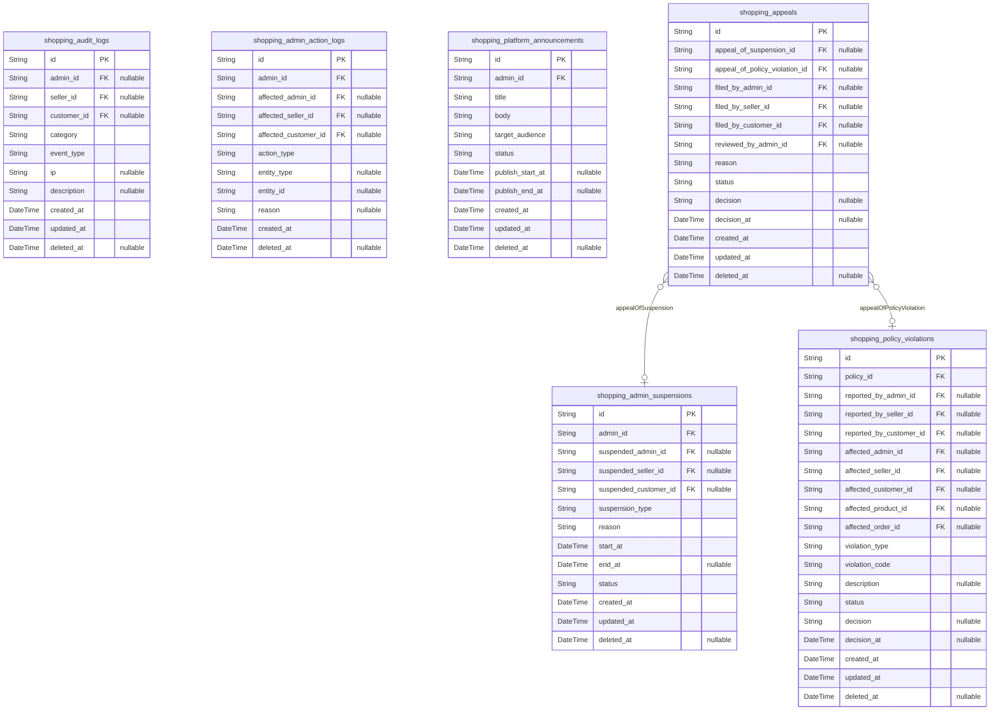
```mermaid
erDiagram
"shopping_audit_logs" {
  String id PK
  String admin_id FK "nullable"
  String seller_id FK "nullable"
  String customer_id FK "nullable"
  String category
  String event_type
  String ip "nullable"
  String description "nullable"
  DateTime created_at
  DateTime updated_at
  DateTime deleted_at "nullable"
}
"shopping_admin_action_logs" {
  String id PK
  String admin_id FK
  String affected_admin_id FK "nullable"
  String affected_seller_id FK "nullable"
  String affected_customer_id FK "nullable"
  String action_type
  String entity_type "nullable"
  String entity_id "nullable"
  String reason "nullable"
  DateTime created_at
  DateTime deleted_at "nullable"
}
"shopping_admin_suspensions" {
  String id PK
  String admin_id FK
  String suspended_admin_id FK "nullable"
  String suspended_seller_id FK "nullable"
  String suspended_customer_id FK "nullable"
  String suspension_type
  String reason
  DateTime start_at
  DateTime end_at "nullable"
  String status
  DateTime created_at
  DateTime updated_at
  DateTime deleted_at "nullable"
}
"shopping_platform_announcements" {
  String id PK
  String admin_id FK
  String title
  String body
  String target_audience
  String status
  DateTime publish_start_at "nullable"
  DateTime publish_end_at "nullable"
  DateTime created_at
  DateTime updated_at
  DateTime deleted_at "nullable"
}
"shopping_policy_violations" {
  String id PK
  String policy_id FK
  String reported_by_admin_id FK "nullable"
  String reported_by_seller_id FK "nullable"
  String reported_by_customer_id FK "nullable"
  String affected_admin_id FK "nullable"
  String affected_seller_id FK "nullable"
  String affected_customer_id FK "nullable"
  String affected_product_id FK "nullable"
  String affected_order_id FK "nullable"
  String violation_type
  String violation_code
  String description "nullable"
  String status
  String decision "nullable"
  DateTime decision_at "nullable"
  DateTime created_at
  DateTime updated_at
  DateTime deleted_at "nullable"
}
"shopping_appeals" {
  String id PK
  String appeal_of_suspension_id FK "nullable"
  String appeal_of_policy_violation_id FK "nullable"
  String filed_by_admin_id FK "nullable"
  String filed_by_seller_id FK "nullable"
  String filed_by_customer_id FK "nullable"
  String reviewed_by_admin_id FK "nullable"
  String reason
  String status
  String decision "nullable"
  DateTime decision_at "nullable"
  DateTime created_at
  DateTime updated_at
  DateTime deleted_at "nullable"
}
"shopping_appeals" }o--o| "shopping_admin_suspensions" : appealOfSuspension
"shopping_appeals" }o--o| "shopping_policy_violations" : appealOfPolicyViolation
```

### `shopping_audit_logs`

Contains immutable records of all critical business and
security-sensitive operations performed on the platform. Each record
represents an atomic, auditable event, such as admin/seller/customer
actions, privilege escalations, or system overrides. Designed for
compliance and traceability across the system. Linked to the actor
performing the action when available. Used for regulatory reporting,
security investigations, and dispute handling.

Properties as follows:

- `id`: Primary Key.
- `admin_id`: Admin actor performing the logged operation. [shopping_admins.id](#shopping_admins).
- `seller_id`
  > Seller actor affected by this action if relevant. {@link
  > shopping_sellers.id}.
- `customer_id`
  > Customer actor affected by this action if relevant. {@link
  > shopping_customers.id}.
- `category`
  > Structured log category or domain (e.g., 'security', 'order', 'refund',
  > 'inventory').
- `event_type`
  > Machine-readable code for the specific action (e.g.,
  > 'ADMIN_SUSPEND_SELLER', 'ORDER_MANUAL_REFUND', 'PRIV_ESCALATION').
- `ip`: IP address from which the operation originated, for traceability.
- `description`: Human-readable summary of the event, for audit reports or investigation.
- `created_at`: Record creation timestamp (immutable atomic event recording).
- `updated_at`
  > Record update timestamp (immutable, but may indicate additional
  > annotation).
- `deleted_at`: Soft delete marker if the log was removed from default query views.

### `shopping_admin_action_logs`

Contains records of major administrative operations—such as admin
grants/revocations, privileged data edits, forced password resets,
dispute decisions, and system policy changes. Linked to both the action
author (admin) and, optionally, the affected actor. Used for internal
auditing, role reviews, and compliance checks. Each log entry is
immutable and fully auditable.

Properties as follows:

- `id`: Primary Key.
- `admin_id`: Admin actor who performed the action. [shopping_admins.id](#shopping_admins).
- `affected_admin_id`
  > Admin account affected by this action, if relevant. {@link
  > shopping_admins.id}.
- `affected_seller_id`: Seller account affected. [shopping_sellers.id](#shopping_sellers).
- `affected_customer_id`: Customer account affected. [shopping_customers.id](#shopping_customers).
- `action_type`
  > Constant representing the action kind (e.g., 'GRANT_ROLE', 'FORCE_RESET',
  > 'SUSPEND_SELLER').
- `entity_type`: Type of entity affected (e.g., 'product', 'order', 'user', 'setting').
- `entity_id`
  > ID of the affected entity (could be product, order, etc.), for linkable
  > action context.
- `reason`: Optional business context or rationale for the admin's action.
- `created_at`: Action record creation time.
- `deleted_at`: Soft delete marker; set if the log should be hidden from normal reports.

### `shopping_admin_suspensions`

Records all suspensions imposed by platform admins upon other admins,
sellers, or customers. Includes both temporary and permanent suspensions.
Used for audit trails, business rule enforcement, and compliance
reporting. References the admin who enacted the suspension, the affected
entity, suspension reason, dates, type, and decision status.

Properties as follows:

- `id`: Primary Key.
- `admin_id`: Admin who imposed the suspension. [shopping_admins.id](#shopping_admins).
- `suspended_admin_id`: Suspended admin, if applicable. [shopping_admins.id](#shopping_admins).
- `suspended_seller_id`: Suspended seller, if applicable. [shopping_sellers.id](#shopping_sellers).
- `suspended_customer_id`: Suspended customer, if applicable. [shopping_customers.id](#shopping_customers).
- `suspension_type`
  > Type of suspension imposed (e.g., 'temporary', 'permanent',
  > 'pending_appeal').
- `reason`: Detailed business reason for suspension (policy violation, fraud, etc.).
- `start_at`: Suspension effective start time.
- `end_at`: End time for temporary suspensions; null if permanent.
- `status`: Current status (e.g., 'active', 'expired', 'revoked', 'pending_appeal').
- `created_at`: Suspension creation record timestamp.
- `updated_at`: Record update timestamp, for audit/log purposes.
- `deleted_at`: Soft delete marker; marks the record as hidden in default views.

### `shopping_platform_announcements`

Stores all platform-wide announcements initiated by admins. Each record
captures title, content, target audience, visibility windows, publication
status, and author (admin reference). Used to push maintenance, update,
and official notices to all or filtered user segments. Status and
schedule fields control announcement display periods.

Properties as follows:

- `id`: Primary Key.
- `admin_id`: Admin who authored the announcement. [shopping_admins.id](#shopping_admins).
- `title`: Announcement title, shown in notification headers and listings.
- `body`: Full announcement content, potentially with markdown formatting.
- `target_audience`
  > Audience segment/role to receive this announcement (e.g., 'all',
  > 'customers', 'sellers', 'admins').
- `status`
  > Current lifecycle status (e.g., 'draft', 'scheduled', 'active',
  > 'expired', 'hidden').
- `publish_start_at`: Optional scheduled start datetime for announcement display.
- `publish_end_at`: Optional end datetime for announcement visibility.
- `created_at`: Record creation timestamp.
- `updated_at`: Timestamp when record last updated (may be for content changes).
- `deleted_at`: Soft delete timestamp for hiding from listings/reporting.

### `shopping_policy_violations`

Tracks all detected or reported business policy violations involving any
actor or entity (customer/seller/admin/product/order/etc). Each record
references the violated policy, the reporting actor, affected entity,
violation type/code, description, status, dates, and decision history.
Used for compliance, after-action reviews, automation triggers, and
escalation to appeals. Supports complex violation lifecycle.

Properties as follows:

- `id`: Primary Key.
- `policy_id`
  > Reference to violated business policy configuration. {@link
  > shopping_business_policies.id}.
- `reported_by_admin_id`
  > Admin who filed the violation report, if applicable. {@link
  > shopping_admins.id}.
- `reported_by_seller_id`: Seller who reported the violation, if any. [shopping_sellers.id](#shopping_sellers).
- `reported_by_customer_id`
  > Customer who reported the violation, if any. {@link
  > shopping_customers.id}.
- `affected_admin_id`
  > Admin account affected by the violation (e.g., internal compliance
  > cases). [shopping_admins.id](#shopping_admins).
- `affected_seller_id`: Seller account affected by violation. [shopping_sellers.id](#shopping_sellers).
- `affected_customer_id`: Customer account affected by violation. [shopping_customers.id](#shopping_customers).
- `affected_product_id`: Product affected by violation. [shopping_products.id](#shopping_products).
- `affected_order_id`: Order affected by violation. [shopping_orders.id](#shopping_orders).
- `violation_type`
  > Constant for violation class (e.g., 'abuse', 'fraud',
  > 'duplicate_account', 'policy_breach').
- `violation_code`: Machine-readable code for violation (from business policy reference).
- `description`: Human-readable violation summary for admins/reviewers.
- `status`
  > Current lifecycle status (e.g., 'open', 'under_review', 'resolved',
  > 'escalated', 'invalid', 'canceled').
- `decision`: Resolution or adjudication result; null if not yet decided.
- `decision_at`: Timestamp of the resolution decision.
- `created_at`: Time when violation record was created.
- `updated_at`: Last update timestamp (typically investigation note/decision).
- `deleted_at`: Soft delete for audit/cleanup, not for physical erasure.

### `shopping_appeals`

Tracks formal appeals filed against suspensions, account actions,
business policy violations, or other adverse admin/adminops actions.
Records the target entity, appeal reason, status, decision, and reviewer
admin. Supports audit trail, multi-stage decision, and escalations.
Crucial for regulatory, compliance, and dispute-handling processes.

Properties as follows:

- `id`: Primary Key.
- `appeal_of_suspension_id`
  > References the base suspension being appealed, if applicable. {@link
  > shopping_admin_suspensions.id}.
- `appeal_of_policy_violation_id`
  > References corresponding policy violation, if applicable. {@link
  > shopping_policy_violations.id}.
- `filed_by_admin_id`
  > Admin who filed the appeal, if initiated internally. {@link
  > shopping_admins.id}.
- `filed_by_seller_id`: Seller who filed the appeal, if externally. [shopping_sellers.id](#shopping_sellers).
- `filed_by_customer_id`: Customer who filed the appeal. [shopping_customers.id](#shopping_customers).
- `reviewed_by_admin_id`: Admin who reviewed or decided the appeal. [shopping_admins.id](#shopping_admins).
- `reason`: Detailed business reason and supporting context for the appeal.
- `status`
  > Current appeal lifecycle status (e.g., 'filed', 'under_review',
  > 'approved', 'rejected', 'closed', 'escalated').
- `decision`
  > Decision/result of the appeal process if known (e.g., 'upheld',
  > 'overturned').
- `decision_at`: Datetime of appeal decision.
- `created_at`: Appeal filing timestamp.
- `updated_at`: Last updated timestamp (investigation, notes, status changes).
- `deleted_at`: Soft delete timestamp for audit/cleanup.

## Policy

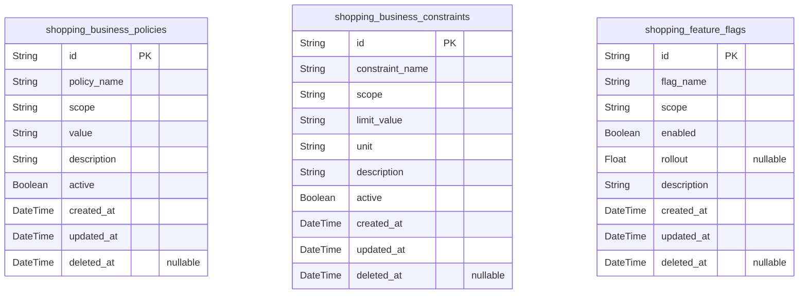
```mermaid
erDiagram
"shopping_business_policies" {
  String id PK
  String policy_name
  String scope
  String value
  String description
  Boolean active
  DateTime created_at
  DateTime updated_at
  DateTime deleted_at "nullable"
}
"shopping_business_constraints" {
  String id PK
  String constraint_name
  String scope
  String limit_value
  String unit
  String description
  Boolean active
  DateTime created_at
  DateTime updated_at
  DateTime deleted_at "nullable"
}
"shopping_feature_flags" {
  String id PK
  String flag_name
  String scope
  Boolean enabled
  Float rollout "nullable"
  String description
  DateTime created_at
  DateTime updated_at
  DateTime deleted_at "nullable"
}
```

### `shopping_business_policies`

Defines named business policies for platform-wide application or specific
domains. Used to codify and audit enforceable business rules such as
return windows, commission rates, and user eligibility thresholds.
Referenced by other domains for outward enforcement; never contains
operational data itself.

Properties as follows:

- `id`: Primary Key.
- `policy_name`
  > Unique name for the business policy (e.g., 'order_return_window',
  > 'seller_onboarding_requirement'). Used for outward reference and
  > enforcement in other domains.
- `scope`
  > Scope or domain where this policy applies (e.g., 'global', 'orders',
  > 'sellers').
- `value`
  > Value or threshold for the policy (e.g., '30', 'approved'). Can be
  > interpreted as string, integer, or enum as required by consuming domain.
- `description`
  > Detailed description of the business purpose and operational impact of
  > this policy.
- `active`: Whether this policy is currently active and enforced platform-wide.
- `created_at`: Policy creation timestamp.
- `updated_at`: Policy update timestamp.
- `deleted_at`
  > Soft delete timestamp, if the policy is archived or replaced. Null if
  > active.

### `shopping_business_constraints`

Defines system-wide or domain-specific constraints (e.g., rate limits,
maximum SKU count, min/max purchase values). Used for enforcing
quantitative limits or operational boundaries across the platform.
Referenced by other domains by outward FK, never inward.

Properties as follows:

- `id`: Primary Key.
- `constraint_name`
  > Unique name of the constraint (e.g., 'max_orders_per_user_day',
  > 'sku_max_per_product'). Used for lookups and enforcement.
- `scope`
  > Scope or domain for the constraint (e.g., 'global', 'carts', 'checkout',
  > 'products').
- `limit_value`
  > Constraint value, typically an integer or decimal encoded as string
  > (actual enforcement handled in consuming domain).
- `unit`: Unit for the constraint's value (e.g., 'count', 'seconds', 'amount').
- `description`
  > Full business explanation of what limit this constraint applies and its
  > operational significance.
- `active`: Whether the constraint is currently in force.
- `created_at`: Constraint creation timestamp.
- `updated_at`: Constraint last update timestamp.
- `deleted_at`: Soft delete timestamp; null if constraint is active.

### `shopping_feature_flags`

Manages feature toggles and rollout switches for platform capabilities
(e.g., beta features, A/B experiments, domain-scoped rollouts). Admins
can independently enable/disable features or set percentage rollout.
Outward referenced for controlled enablement, not bound to specific
session or user here.

Properties as follows:

- `id`: Primary Key.
- `flag_name`
  > Unique name of the feature flag (e.g., 'new_checkout_flow',
  > 'wishlist_enabled'). Used for outward reference and API enablement.
- `scope`
  > Domain or context where this feature applies (e.g., 'global', 'orders',
  > 'checkout', 'frontend').
- `enabled`
  > Indicates whether the feature is enabled system-wide for the associated
  > scope.
- `rollout`
  > (Optional) Percentage 0-100 for gradual rollout/experimentation. 100 =
  > fully enabled, 0 = off (used for A/B testing).
- `description`
  > Explanation of feature flag purpose and behavior under enabled/disabled
  > conditions.
- `created_at`: Feature flag creation timestamp.
- `updated_at`: Update timestamp for the feature flag.
- `deleted_at`: Soft delete timestamp; null if flag is active.

## default

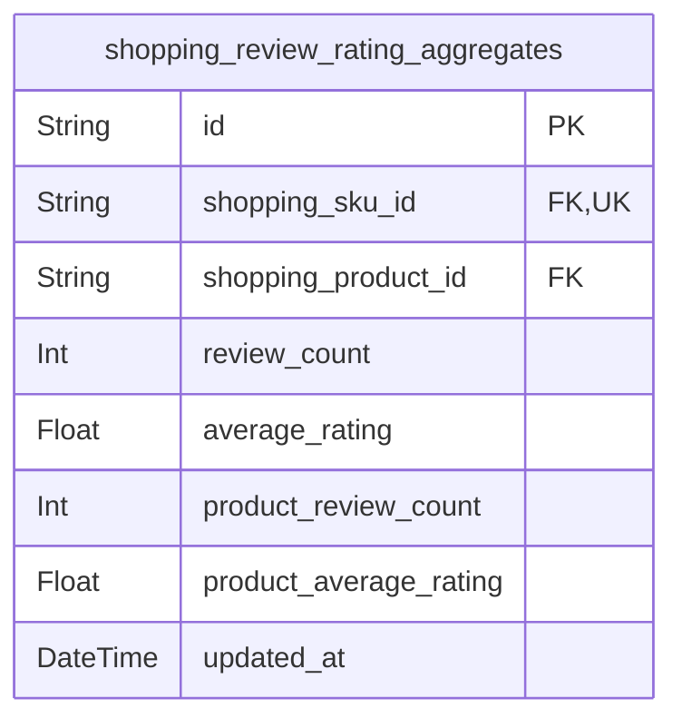
```mermaid
erDiagram
"shopping_review_rating_aggregates" {
  String id PK
  String shopping_sku_id FK,UK
  String shopping_product_id FK
  Int review_count
  Float average_rating
  Int product_review_count
  Float product_average_rating
  DateTime updated_at
}
```

### `shopping_review_rating_aggregates`

Materialized view table that stores denormalized pre-aggregated rating
and review statistics for each SKU and its parent product. Optimizes
product and SKU listing queries for average rating and review count. Not
directly modifiable by users.

Properties as follows:

- `id`: Primary Key.
- `shopping_sku_id`: Target SKU. [shopping_skus.id](#shopping_skus)
- `shopping_product_id`
  > Parent product for the SKU (for aggregate at product level). {@link
  > shopping_products.id}
- `review_count`: Total number of reviews for this SKU.
- `average_rating`: Average star rating for this SKU (precalculated, one decimal precision).
- `product_review_count`: Total reviews for the parent product (aggregated from all SKUs).
- `product_average_rating`: Average rating for the product overall (across SKUs).
- `updated_at`: Aggregation refresh timestamp for cache invalidation/business needs.
