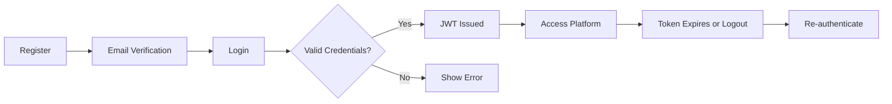
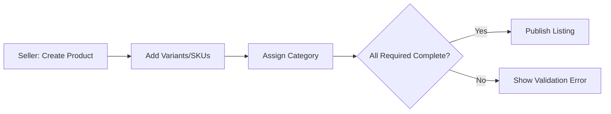
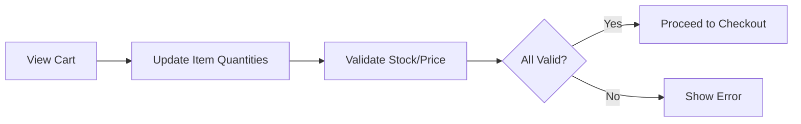
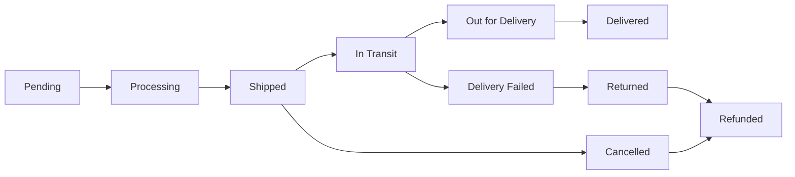
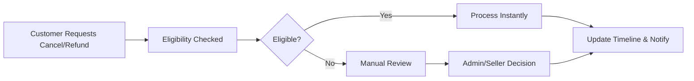

# Requirements Analysis for shoppingMall E-Commerce Platform

## 1. Service Overview and Purpose
The shoppingMall e-commerce platform enables buyers and third-party sellers to transact online with secure authentication, multi-variant product management, advanced search and filtering, seamless cart and checkout processes, transparent order tracking, review and rating mechanisms, robust seller tools, inventory controls, customer service flows, and a fully featured administrative dashboard. The platform's core objective is to deliver a scalable, trustworthy marketplace experience supporting millions of products, users, and orders.

## 2. User Roles and Authentication Flows
### User Roles
- **Customer**: Can register and log in, manage addresses, browse/search products, add to cart/wishlist, place orders, track and manage orders, review products.
- **Seller**: Can register for account, list/manage products (variants/SKUs), handle incoming orders, manage inventory, respond to reviews.
- **Admin**: Platform-wide authority—manages all users, products, orders, categories, reviews, disputes, and analytics dashboards.

### Authentication Scenarios
- WHEN a new user registers, THE system SHALL require email, password, and (for sellers) business information, verify uniqueness, and send a verification email.
- WHEN login is attempted, THE system SHALL validate credentials and only allow verified users. Failed logins SHALL receive a specific error and be throttled after several attempts.
- WHEN a password reset is requested, THE system SHALL send a single-use reset link and update the password only if the link is valid.
- WHEN a customer manages addresses, THE system SHALL permit add, edit, delete, set default, ensuring access is restricted to the address owner.
- THE system SHALL use JWT tokens for all authenticated requests, encoding userId, role, permissions, and expiry; tokens SHALL expire within 30 minutes, with refresh up to 30 days.
- WHERE a user role does not permit an action, THE system SHALL deny and log the event, returning a clear error to the user.

#### Mermaid: Registration, Login, and Token Lifecycle

## 3. User Journey/Scenario Documentation
### Customer Primary Journey
- Registers and verifies email
- Manages address book
- Browses and filters products, searches by keyword/category
- Adds product variants to cart or wishlist
- Proceeds to checkout, enters shipping/payment
- Completes payment, receives order confirmation
- Tracks order status, leaves review after delivery

#### EARS Requirements
- WHEN a customer completes registration/verification, THE system SHALL allow login and profile management.
- WHEN a product is added to wishlist, THE system SHALL persist that relationship and respond within 1s.
- WHEN a cart checkout is started, THE system SHALL validate item availability/price and respond with any changes before allowing payment.

### Seller Primary Journey
- Registers with business details, completes approval (if reviewed)
- Lists products with variants, sets price/stock, assigns category
- Receives notifications for new orders, updates inventory/fulfillment
- Responds to reviews/questions, manages catalog and low stock alerts

#### EARS Requirements
- WHEN a seller lists a product with variants, THE system SHALL require all variant/SKU and stock data before publishing.
- WHEN inventory changes, THE system SHALL broadcast changes to affected SKUs in real time.
- IF low stock is detected, THEN system SHALL send notification within 30 seconds.

### Admin Primary Journey
- Admin logs in with two-factor auth
- Views dashboard of orders, products, reviews, analytics
- Moderates flagged reviews, disputes, handles escalations

#### EARS/Business Rules
- WHEN an admin updates a product/order/review status, THE system SHALL log the change and notify all affected roles.
- WHEN ban/suspension is set for a seller/account, THE system SHALL restrict access instantly and audit the action.

## 4. Product Catalog & Management
- Sellers can create products with: name, description, images, category, and multiple SKUs (each with price, options, inventory).
- SKUs define product variations (color, size, etc.) and all inventory is managed at SKU level.
- Customers can view/search/filter products by category, price, seller, or variant options; only in-stock SKUs are buyable.
- Admins manage category tree (multi-level), can disable categories/products. Disabling a category removes all associated products from public views.
- All product and category changes are audited.

#### EARS Rules
- WHEN a product variant goes out-of-stock, THE system SHALL mark it unavailable and prevent checkout for that SKU.
- WHEN a seller attempts to delete a product with active orders, THE system SHALL block deletion and explain the business reason.

#### Mermaid: Product and SKU Creation & Listing

## 5. Shopping Cart, Wishlist, and Order Processing
- Each customer has one cart; may contain up to 50 unique SKUs and 20 per SKU by default, set by admin.
- Cart items are checked for stock and price before checkout. Out-of-stock/discontinued SKUs are blocked from purchase.
- Wishlists are product-level (not SKU) and max 100 items. Only logged-in users may manage wishlists.
- Cart is auto-saved for 30 days after inactivity; merging logic is enforced on guest login.
- On checkout, orders are split by seller if needed, and inventory is locked at payment phase.

#### EARS
- WHEN a user adds/removes items to cart/wishlist, THE system SHALL respond within 1s and update the status immediately.
- WHEN a cart checkout is initiated, THE system SHALL validate, lock inventory, and confirm availability before order creation.
- WHEN payment fails, THEN the order SHALL NOT be created and inventory is released instantly.

#### Mermaid: Cart Review and Checkout

## 6. Payment Handling and Order Fulfillment
- All payment methods are configurable per admin; customers select at checkout.
- Orders are saved only if payment is successful. Payment goes via gateway, with validation on amount and recipient.
- Successful payment triggers order confirmation to both seller and customer.
- Failed payments place the order into "pending payment" for customer recovery, inventory held for 15 mins (default).
- Refunds are initiated for eligible cancellations, handled with timeline tracking and notifications.

#### EARS
- WHEN payment completes, THE system SHALL record all order data, notify both parties, and forward fulfillment to the seller.
- IF gateway delay or uncertainty occurs, THEN the system SHALL keep order in pending and notify customer within 10s.

## 7. Order Tracking and Shipping Status
- Sellers update order status: Pending → Processing → Shipped → In Transit → Out for Delivery → Delivered (see diagram).
- Shipping events/updates, including tracking numbers and carrier data, are sent to customers instantly.
- Delivery failures, returns, or refunds move to special flows with admin intervention if needed.
- All order status changes are logged and time-stamped.

#### Mermaid: Order Status Lifecyle

## 8. Reviews and Ratings Mechanism
- Verified buyers may leave 1 review (star rating + comment + optional images) per product per purchase.
- Reviews are moderated automatically and by admin for flagged/spam/abuse cases.
- Sellers can reply to reviews of their own products but cannot delete/modify customer reviews.
- Admins have global moderation: remove, restore, or annotate reviews with full audit.
- Reviews update aggregate product scores in real time.

#### EARS
- WHEN a review is submitted by an eligible customer, THE system SHALL display it in the product page within 2 seconds if auto-approved, or queue for admin moderation.
- WHEN seller/admin flags or moderates a review, THE system SHALL update aggregate scores atomically.

## 9. Seller Account and Inventory Control
- Sellers may adjust inventory per SKU, see low stock warnings, and set/unset block on unavailable products.
- All stock moves (add, remove, reserve, release, block) are logged by seller/admin/timestamp/reason.
- Inventory is reserved on order checkout (pending payment), decremented only on payment completion. Over-reservation is strictly prevented.
- Manual/admin adjustments require reason and are restricted per role.
- Low stock threshold is configurable; system default is 5 units/SKU.

#### EARS
- WHEN stock is updated by seller/admin, THE system SHALL reflect changes in all user views within 3 seconds.
- IF over-reservation or out-of-sync detected, THEN system SHALL block affected SKU, alert seller/admin, and prevent checkout until resolved.

## 10. Order History & Customer Service (Cancellation, Refund)
- Customers can review a complete timeline of their orders, including each status, fulfillment step, and any events (cancel, refund, etc.).
- Cancellation eligible before shipment; handled via self-service unless seller-approval is needed per policy.
- Refunds are requested either pre-shipment (auto if eligible) or post-shipment (pending review by seller/admin). Appeals/escalations are permitted if denied.
- All cancellation/refund/escalation actions are visible in order timeline and auditable by admin.

#### EARS
- WHEN a cancellation is requested, THE system SHALL validate eligibility, process instantly if pre-shipment, or notify for manual review if post-shipment.
- WHEN refund is approved/denied, THE system SHALL update status and notify customer within 1 working day in all cases.

#### Mermaid: Cancellation and Refund Escalation

## 11. Administrative Dashboard
- Admin views summary and filtered lists of all users, products, orders, reviews.
- Admin can manage (edit/disable/restore/delete) any catalog, category, user, or seller; approve/ban users.
- Platform-wide analytics including GMV, conversion, order volume, refund/dispute rate accessible by admin, exportable as CSV/Excel.
- Admin decisions/actions are always logged and must include the acting user and reason.
- Moderation flows for abuse, fraud, review flagging, dispute handling are routed via admin dashboard.

#### EARS
- WHEN an admin takes any action impacting platform data or status, THE system SHALL record an immutable audit entry with all affected entities and event context.
- WHEN viewing analytics/reports, THE system SHALL render standard summaries in under 5 seconds for date-filtered data.

## 12. Business Rules, Error Cases, and Edge Scenarios
- All business logic around checkout, payment, cart expiry, returns, moderation, inventory racing, and disputes must be enforced as described.
- Validation at all points shall give actionable, role-appropriate errors (e.g., insufficient stock, concurrent modification, role-based access denial).
- All timelines (e.g., order processing, refund, escalation) must be tracked and visible to authorized users.
- System must support up to 10,000 concurrent cart/checkout/payment/review/inventory operations per minute with <2 second response for 95th percentile.
- Data retention respects legal/business policy: e.g., order history for minimum 5 years, admin audit for 3+ years.
- All references to features/logic should use internal linking to related requirement sections for context—no dangling references or raw filenames.

---
_For further context, see linked requirement sections: [User Roles and Authentication](#user-roles-and-authentication-flows), [Product Catalog & Management](#product-catalog--management), [Shopping Cart/Order Processing](#shopping-cart-wishlist-and-order-processing), [Order Tracking & Shipping](#order-tracking-and-shipping-status), [Reviews & Ratings](#reviews-and-ratings-mechanism), [Admin Dashboard](#administrative-dashboard)._