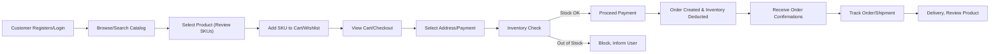
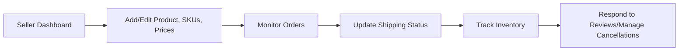
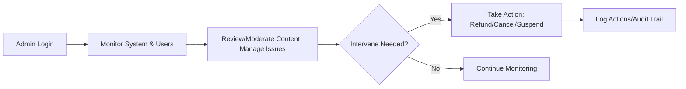

# Functional and Non-Functional Requirements for E-Commerce Shopping Mall Platform

## 1. Introduction & Scope
This document provides a complete, implementation-ready description of functional and non-functional requirements for the e-commerce shopping mall platform ('shoppingMall'). All requirements are actionable for backend developers, structured in EARS (Easy Approach to Requirements Syntax) format, and address the needs of all business actors: buyer (customer), seller, and admin. The scope includes all features expected of a modern multi-vendor e-commerce service and establishes a foundation for business rules, workflows, and validation.

## 2. Functional Requirements

### 2.1 User Registration, Authentication, and Address Management
- THE platform SHALL allow new users (customer, seller) to register by email and password, enforcing unique email across all users.
- WHEN a new user registers, THE platform SHALL require email verification before activating the account and enabling core functions.
- THE system SHALL collect and persist multiple addresses per user (up to 10), each supporting full name, street, city, province/state, postal code, country, and phone.
- THE platform SHALL allow users to edit/delete/view/set default addresses at all times, except when an address is used in an in-progress order.
- WHEN a user logs in, THE system SHALL create a session (JWT), valid for 30 minutes, enabling secure authenticated access to role-based features.
- WHEN a seller registers, THE platform SHALL require additional verification (business name, registration, ID) and block selling activity unless approved.

### 2.2 Product Catalog, Categories, and Search
- THE product catalog SHALL organize all listings by categories and subcategories, allowing products to belong to multiple categories.
- THE system SHALL enable keyword and full-text search with multi-attribute filters (category, price, variant attributes, seller).
- WHEN browsing or searching the catalog, THE system SHALL return a paginated list (default 20/page) with sorting (price, relevance, rating, date added).
- WHERE categories contain subcategories, THE system SHALL render hierarchical navigation for buyers.

#### Product Variants (SKU)
- THE system SHALL permit sellers to define SKUs for each product, where each SKU reflects a unique set of variant attributes (color, size, etc).
- WHEN listing a product, THE seller SHALL specify price and initial stock for each distinct SKU. SKU combinations must be unique within a product.
- WHEN a buyer inspects a product, THE system SHALL display all variant options, with real-time stock and clear out-of-stock indication at the SKU level.

### 2.3 Shopping Cart and Wishlist
- THE system SHALL allow each authenticated customer to maintain a persistent cart containing items by SKU and quantity (with inventory checks).
- WHEN a customer adds/removes or updates items in their cart, THE system SHALL validate live inventory before confirming changes.
- IF a cart item’s SKU inventory is insufficient, THEN THE system SHALL present a clear error and block the operation.
- THE system SHALL allow users to move items between cart and wishlist, both of which persist per account across sessions/devices.
- WHERE a wishlist item becomes unavailable or discontinued, THE system SHALL display status and restrict movement to cart.

### 2.4 Order Placement and Payment Processing
- WHEN a customer proceeds to checkout, THE system SHALL confirm user address, review all cart SKUs, check inventory, calculate taxes/shipping, and present an accurate total before payment.
- THE system SHALL integrate with at least one payment provider (credit/debit card or e-wallet), maintaining PCI compliance (no raw card storage).
- WHEN payment succeeds, THE system SHALL create the order, deduct inventory, assign order ID, and send confirmations (customer, seller, admin as needed).
- IF payment fails, THEN THE system SHALL retain the cart and present actionable recovery options, blocking the order until resolved.

### 2.5 Order Tracking and Shipping Status Updates
- EACH order SHALL be tracked from placement through each stage: Processing, Shipped, Delivered, Cancelled, Refunded.
- Sellers and admins SHALL update shipping status, with customers receiving notifications on all status changes.
- THE system SHALL provide carrier tracking numbers/links for shipped orders when available. Customers may view in dashboard.

### 2.6 Product Reviews and Ratings
- THE system SHALL allow verified customers to submit one review and one rating (1–5 stars) for each purchased product.
- Reviews SHALL be editable or deletable only within 30 days of posting. Reviews must have minimum 10 characters, max 1000.
- Reviews and ratings SHALL be visible on product detail pages, sorted newest-first.
- IF a review contains prohibited content, THEN THE system SHALL block it and notify the user with the reason.
- Sellers may respond to reviews, visible to all but not modifiable by the original reviewer.

### 2.7 Seller Accounts and Inventory Management
- Sellers SHALL access a personal dashboard to manage their products, SKUs, inventory, pricing, and incoming orders.
- Inventory SHALL be tracked and modifiable per SKU. Selling/fulfillment for SKUs with zero or negative stock SHALL be blocked and annotated.
- Sellers may add, update, or remove products/SKUs, but only for their catalog.
- Sellers SHALL receive all relevant notifications on new orders, cancellations, returns, and impending low inventory.

### 2.8 Order History, Cancellation, and Refunds
- Customers SHALL view detailed history of all past and current orders, including order ID, status, purchase date, items, total, shipping/tracking events.
- Customers may request order cancellation before shipping or initiate refund requests after delivery, subject to platform refund/cancellation windows and policies.
- Sellers and admins SHALL receive and action these requests; all decisions (approve, deny, escalate) must be auditable and recorded.

### 2.9 Admin Dashboard for Oversight
- Admins SHALL have unrestricted access to oversee and manage all users, products, sellers, categories, orders, reviews, and system configurations.
- Admins SHALL intervene in all disputes, issue direct refunds/cancellations, approve/disable listings, and manage role escalations.
- All admin actions SHALL be logged with actor, timestamp, and affected resource(s).

## 3. Non-Functional Requirements

### 3.1 Performance
- THE platform SHALL serve product browsing, search, and cart operations within 2 seconds (95% of cases) under normal loads.
- All checkout/order/payment events SHALL complete within 3 seconds (95% of cases); errors and completion states show immediately.
- The order processing subsystem SHALL handle bursts of up to 1,000 new orders/minute during campaigns or peak events.

### 3.2 Security and Privacy
- All user data SHALL be protected in transit and at rest via industry-standard encryption.
- THE platform SHALL use JWT-based session authentication; no sensitive information leaves backend zones unencrypted.
- Seller/admin privileges SHALL require elevated authentication (fresh login within 5 minutes of the last privileged action).
- Payment data MUST remain tokenized, successfully processed only via PCI-compliant provider endpoints.

### 3.3 Availability and Scalability
- Uptime SHALL target 99.9%, with planned maintenance <2 hours/month. Notification to all actors must precede any downtime by at least 24 hours.
- THE platform SHALL be horizontally scalable to handle 10,000+ concurrent user sessions and 20x normal throughput for flash sales.
- Backups of all transaction/order data SHALL be performed daily and restorable within 30 minutes in disaster scenarios.

### 3.4 Regulatory Compliance
- THE service SHALL follow all privacy, taxes, and financial compliance standards applicable in its markets, including handling EU residents’ data under GDPR.
- Users SHALL have self-service access to export and request deletion of personal data with defined response timescales (within 30 days of request).

## 4. Business Rules Overview
- Input for user, product, and order creation/update SHALL be comprehensively validated (required fields, ranges, format, no negative prices/quantities, address completeness).
- Only customers may place orders or request returns/refunds for their own purchases.
- Sellers may only modify products/SKUs in their own catalog; they are never permitted access to other sellers’ data or customer private data.
- Admins may intervene in any process (order, payment, refund, inventory, review) and may override any system decision for compliance, fraud, or severe service issues but must record an explicit action log.
- All state changes (e.g., order status, refund, shipping update, review) are timestamped, actor-attributed, and fully auditable. No entity may delete or alter audit logs post-creation.
- Unauthorized action attempts by any actor shall be denied and logged, with security team alerts for patterns suggesting fraud or hacking.

## 5. Visual Flow Diagrams

### 5.1 Customer Order Flow

```mermaid
graph LR
  A["Customer Registers/Login"] --> B["Browse/Search Catalog"]
  B --> C["Select Product (Review SKUs)"]
  C --> D["Add SKU to Cart/Wishlist"]
  D --> E["View Cart/Checkout"]
  E --> F["Select Address/Payment"]
  F --> G["Inventory Check"]
  G -->|"Stock OK"| H["Proceed Payment"]
  G -->|"Out of Stock"| I["Block, Inform User"]
  H --> J["Order Created & Inventory Deducted"]
  J --> K["Receive Order Confirmations"]
  K --> L["Track Order/Shipment"]
  L --> M["Delivery, Review Product"]
```

### 5.2 Seller Fulfillment Flow

```mermaid
graph LR
  S1["Seller Dashboard"] --> S2["Add/Edit Product, SKUs, Prices"]
  S2 --> S3["Monitor Orders"]
  S3 --> S4["Update Shipping Status"]
  S4 --> S5["Track Inventory"]
  S5 --> S6["Respond to Reviews/Manage Cancellations"]
```

### 5.3 Admin Oversight/Dispute Flow

```mermaid
graph LR
  A1["Admin Login"] --> A2["Monitor System & Users"]
  A2 --> A3["Review/Moderate Content, Manage Issues"]
  A3 --> A4{"Intervene Needed?"}
  A4 -->|"Yes"| A5["Take Action: Refund/Cancel/Suspend"]
  A5 --> A6["Log Actions/Audit Trail"]
  A4 -->|"No"| A7["Continue Monitoring"]
```

---

This document is exhaustive, covering all functional features and non-functional expectations for the shoppingMall backend platform. Every section and flow uses EARS requirements style and is implementation-ready with no ambiguous meta-commentary, placeholders, or technical schema details.