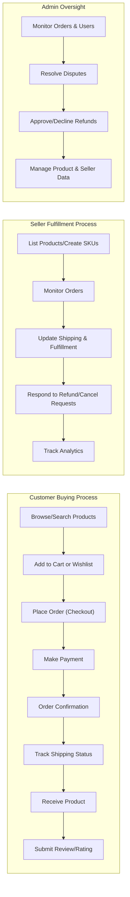

# Shopping Mall Platform Service Overview

## Executive Summary

The shoppingMall platform is an integrated e-commerce service designed to connect buyers (customers), sellers, and administrators. THE platform SHALL enable users to register, browse and search a rich catalog of products, manage shopping carts and wishlists, place orders, make online payments, track shipments, submit reviews, and engage in all essential activities for a modern digital shopping experience. Sellers are provided with comprehensive tools to list and manage inventory, handle incoming orders, and analyze sales. Administrators maintain full oversight and management of all data, user activities, and marketplace performance.

THE purpose of shoppingMall is to bridge the gap between buyers and independent merchants, offering a professional, secure, and scalable environment for transaction, trust, and engagement. By delivering a high-quality, frictionless marketplace for both end customers and partner sellers, shoppingMall aims to accelerate digital commerce in competitive retail sectors.

## Business Model

### Why This Service Exists

- THE rise of online shopping has created a strong demand for platforms where independent sellers can reach broader audiences without needing to build their own infrastructure.
- Customers increasingly prefer one-stop marketplaces offering selection, pricing, and fast logistics over scattered boutique stores.
- THE platform addresses pain points such as fragmented experiences, trust/safety issues, inventory uncertainty, and manual order management, which plague smaller non-integrated e-commerce solutions.

### Revenue Strategy

- THE platform SHALL generate revenue primarily via transaction-based commissions on each completed order (percentage of sale per merchant).
- WHERE applicable, THE platform SHALL also collect service fees from premium seller accounts (for advanced features, analytics, or promotional tools).
- THE platform MAY support additional revenue through advertising placements and partnership marketing.

### Growth Plan

- THE primary growth strategy focuses on onboarding reputable sellers with unique, high-quality inventory, and incentivizing buyer retention through loyalty programs, personalized recommendations, and seamless order processing.
- User acquisition SHALL be driven by digital marketing, partnerships with logistics/payment providers, promotional campaigns, and referral incentives.
- Retention SHALL be reinforced through reliable service, fast support on disputes/cancellations, buyer protection policies, and consistent value delivery to both seller and customer actors.

### Success Metrics

- THE system SHALL use the following business KPIs: Monthly Active Users (MAU), Total Gross Merchandise Volume (GMV), Completed Orders per Month, Seller Churn Rate, Average Order Value (AOV), Buyer Retention Rate, Customer Lifetime Value (CLV), and Net Promoter Score (NPS).
- Revenue performance SHALL be tracked in real time to guide promotional adjustments and platform evolution.

## Target Users and Stakeholders

The shoppingMall platform is designed for three primary user actors:

### 1. Customer (Buyer)
- A registered or new user seeking to discover, buy, and review products.
- Needs convenience in browsing, search, wishlisting, order tracking, secure payments, and purchase history management.

### 2. Seller (Merchant)
- An individual or business with inventory to offer to a broad online audience.
- Requires product cataloging, SKU/variant management, sales dashboard, fulfillment tracking, and review/feedback tools.

### 3. Admin (Platform Operator)
- The team or personnel responsible for platform governance, dispute resolution, escalated customer/seller requests, and system oversight.
- Needs full visibility and access to all data, orders, processes, users, and corrective controls.

Stakeholders also include payment providers, shipping/logistics partners, and compliance/audit functions who interact via integrations or periodic reporting.

## Core Features Overview

### User Registration, Login, and Address Management
- THE system SHALL enable new users (customers and sellers) to register, log in, and manage personal profiles.
- Users SHALL be able to maintain multiple shipping addresses associated with their profiles.

### Product Catalog with Categories and Search
- THE platform SHALL provide a structured catalog where products are classified into categories and searchable via keywords or filters.
- WHEN users search or filter, THE system SHALL return relevant products instantly based on query and available inventory.

### Product Variants (SKU) with Options
- Sellers SHALL be able to create product variants (SKUs) reflecting colors, sizes, options, and other marketplace-relevant dimensions.
- THE catalog SHALL display available variants and inventory counts in real time for both buyers and sellers.

### Shopping Cart and Wishlist
- WHILE browsing, THE customer SHALL add items to their cart or wishlist with a single interaction.
- Users SHALL be able to modify, delete, or purchase items in their cart.
- THE wishlist SHALL persist across sessions and devices for logged-in users.

### Order Placement and Payment Processing
- THE ordering process SHALL allow customers to review their cart, provide shipping information, select a payment method, and finalize transactions in a secure fashion.
- IF payment fails, THEN THE system SHALL clearly notify users and allow retry or selection of alternate payment methods.

### Order Tracking and Shipping Status
- After successful order placement, THE customer SHALL track shipping and delivery status via their dashboard.
- Sellers SHALL update shipping status as fulfillment progresses.

### Product Reviews and Ratings
- AFTER delivery, THE customer SHALL submit one or more reviews with ratings for purchased products.
- Reviews SHALL be visible to all users, helping inform purchasing decisions.

### Seller Accounts and Catalog Management
- WHILE signed in as a seller, the user SHALL access and manage their product catalog, create and edit SKUs, adjust pricing, handle orders, and view sales analytics.

### Inventory Management per SKU
- THE system SHALL allow sellers to maintain inventory per SKU and provide real-time updates as items are sold or restocked.
- IF inventory for a SKU reaches zero, THEN THE platform SHALL automatically update product visibility to reflect out-of-stock status.

### Order History, Cancellation, and Refunds
- Customers SHALL access a history of all orders, including status, item details, and fulfillment timeline.
- WHEN an order is within the allowable cancellation window, THE customer SHALL submit cancellation or refund requests through the platform interface.
- Sellers and admins SHALL be notified of and act on such requests as per business rules.

### Admin Dashboard for Management
- THE admin dashboard SHALL provide platform operators with full access to user, order, and product data.
- Admin actors SHALL monitor escalations, approve or decline refund/cancellation requests, perform compliance oversight, and manage system-wide content.

## Competitive Advantages

- Integrated platform experience for buyers and sellers, eliminating need for third-party plugins or external systems.
- Comprehensive inventory and variant management supporting even complex products (e.g., fashion/apparel, multi-attribute goods).
- Scalable, role-based dashboards for each actor (customer, seller, admin) with advanced filtering and analytics.
- End-to-end trust and safety features: user verification, review moderation, fraud detection, and dispute resolution workflows.
- Robust fulfillment and logistics tracking with transparency for buyers and merchants.
- Flexible platform for rapid onboarding of new sellers and categories, adaptive to market needs.
- Customizable promotional and loyalty features for buyer retention and seller growth.

## Success Metrics

THE platform SHALL measure and report on the following KPIs:

| Metric                      | Definition                                                                        |
|-----------------------------|----------------------------------------------------------------------------------|
| Monthly Active Users (MAU)  | Number of distinct users engaging in >1 transaction per month                     |
| Gross Merchandise Volume    | Aggregate value of completed orders each month                                    |
| Completed Orders per Month  | Completed (paid + fulfilled) transactions processed monthly                       |
| Seller Churn Rate           | % sellers leaving the platform in a given time period                             |
| Average Order Value (AOV)   | Mean value of all transactions over a fixed term                                  |
| Buyer Retention Rate        | % of buyers who complete >1 purchase within a 6-month window                      |
| Customer Lifetime Value     | Average projected revenue generated by a customer during their membership         |
| Net Promoter Score (NPS)    | Survey-based benchmark for overall user advocacy and service satisfaction         |

## High-Level Process Visualization

THE above process visualization offers an at-a-glance understanding of the multi-actor flows and marketplace lifecycle.

---

For detailed user roles and permissions, please refer to the [User Actor and Permissions Requirements](./02-user-actors-and-permissions.md).
To review the complete feature and business logic specification, see the [Functional Requirements Document](./03-functional-requirements.md).
