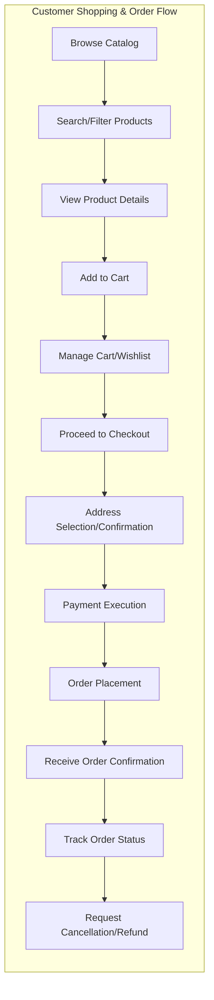
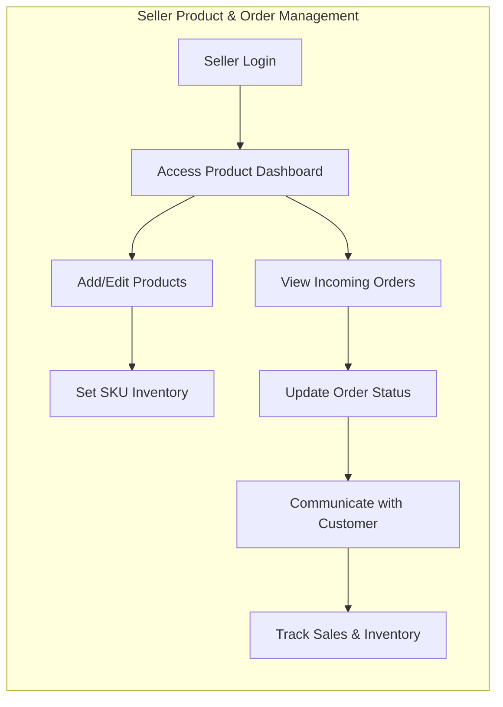
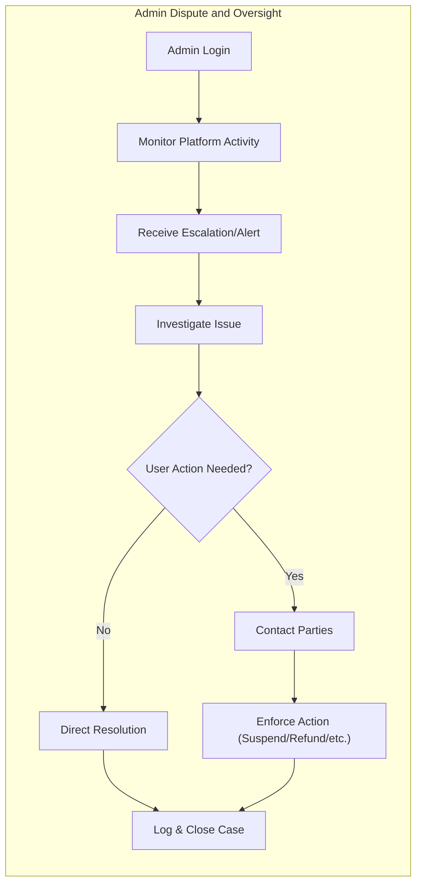

# User Actors and Permissions Requirements

This document defines all user actors, their business capabilities, permissions, and authentication flows for the shopping mall platform. It ensures backend developers have a precise, actionable reference for implementing secure, role-based backend logic.

## 1. User Actor Definitions

### 1.1 Customer
A "customer" is a registered buyer who:
- Browses the product catalog and categories
- Searches for products
- Manages multiple shipping and billing addresses
- Adds/removes items from their cart and wishlist
- Places orders with payment
- Tracks order shipping status
- Views order history
- Requests order cancellation and refund
- Writes and manages reviews and ratings

#### Business Role
- Primary end-user and revenue driver
- Limited to managing personal data and orders

#### Limitations
- Cannot view or manipulate products/orders of other customers
- Cannot access seller/admin product management screens

### 1.2 Seller
A "seller" is a registered merchant who:
- Manages own product listings (add, update, delete)
- Sets up categories, pricing, descriptions, images
- Manages inventory for each SKU (variants, e.g., color/size)
- Receives and processes orders placed by customers
- Updates shipping and order status
- Handles refund and cancellation requests from buyers
- Tracks sales statistics and performance
- Responds to product reviews and questions

#### Business Role
- Revenue partner for the platform
- Responsible for product and order fulfillment for their own products

#### Limitations
- Cannot access other sellers’ or overall platform management features
- No access to other sellers’ products or orders
- Cannot perform platform admin actions

### 1.3 Admin
An "admin" is the platform operator/administrator:
- Oversees all users: customers, sellers, other admins
- Manages all products, categories, and orders on the platform
- Handles escalations, disputes, and exceptions
- Controls refunds, cancellations, and customer support processes
- Maintains seller registrations and status
- Accesses analytics, monitoring, and reporting

#### Business Role
- Maintains platform health, integrity, and compliance
- Provides final resolution to disputes and high-level actions

#### Limitations
- None (full platform-wide access)

## 2. Authentication and Registration Requirements

### 2.1 Core Authentication Flows (EARS)
- THE system SHALL support registration as customer or seller via email and password.
- THE system SHALL send account verification by email after registration.
- WHEN a user registers, THE system SHALL require name, email, password, and for sellers, business identification information.
- WHEN a user verifies their account, THE system SHALL activate the account and enable full access.
- THE system SHALL authenticate users with email and password for login and provide JWT tokens for session management.
- THE system SHALL require login for all actions except catalog browsing and search.
- WHEN a user is authenticated, THE system SHALL allow access only according to their role-based permissions.
- WHEN a user requests password reset, THE system SHALL send an email with a reset link.
- WHEN a user logs out, THE system SHALL revoke the session or invalidate the JWT token.
- WHILE a user is authenticated, THE system SHALL keep the session active up to 30 minutes or until logout, whichever comes first.
- THE system SHALL allow users to manage (add, update, delete) shipping and billing addresses in their profile.
- WHEN a customer logs in, THE system SHALL allow access to their cart and wishlist.

### 2.2 Actor-specific Authentication Notes
- Sellers must provide additional verification during registration (e.g., business documents)
- Admin accounts can only be created or managed by existing admins

### 2.3 Token Management Policies (EARS)
- THE system SHALL use JWT tokens for all authentication; access token limited to 30 minutes validity, refresh token limited to 30 days.
- THE system SHALL embed userId, role, and permissions array in JWT payload.
- WHEN a token expires or is revoked, THEN THE system SHALL deny access and require re-authentication.
- WHERE user session duration exceeds 30 minutes, THEN THE system SHALL enforce a new login.

## 3. Permissions Matrix

| Action                                              | Customer | Seller | Admin |
|-----------------------------------------------------|----------|--------|-------|
| Register via email/password                         |   ✅     |   ✅   |   ❌  |
| Login/Logout                                       |   ✅     |   ✅   |   ✅  |
| Email verification and password reset               |   ✅     |   ✅   |   ✅  |
| Manage own profile/address                         |   ✅     |   ✅   |   ✅  |
| Browse/search product catalog                      |   ✅     |   ✅   |   ✅  |
| Add to cart/wishlist                              |   ✅     |   ❌   |   ❌  |
| Place orders/payments                             |   ✅     |   ❌   |   ❌  |
| Track orders/shipping status                      |   ✅     |   ✅   |   ✅  |
| View order history                                |   ✅     |   ✅   |   ✅  |
| Request cancellation/refund                       |   ✅     |   ❌   |   ✅  |
| Write/manage reviews/ratings                      |   ✅     |   ❌   |   ✅  |
| Manage own product catalog/inventory               |   ❌     |   ✅   |   ✅  |
| Process buyer orders, update status                |   ❌     |   ✅   |   ✅  |
| Update product details/images                      |   ❌     |   ✅   |   ✅  |
| Handle refunds/cancellations (for own orders)      |   ❌     |   ✅   |   ✅  |
| Respond to reviews/questions                       |   ❌     |   ✅   |   ✅  |
| Access platform/seller analytics                   |   ❌     |   ✅   |   ✅  |
| View/manage all customers and sellers              |   ❌     |   ❌   |   ✅  |
| Manage categories and site-wide settings           |   ❌     |   ❌   |   ✅  |
| Escalation/dispute resolution                      |   ❌     |   ❌   |   ✅  |
| Grant/revoke admin/seller privileges               |   ❌     |   ❌   |   ✅  |

## 4. Role-based Access Control Scenarios (EARS & Mermaid)

### 4.1 Customer Shopping and Order Placement
- WHEN a customer searches the catalog, THE system SHALL display all matching products with category filters.
- WHEN a customer adds items to their cart, THE system SHALL save the cart per user account.
- WHEN a customer proceeds to checkout, THE system SHALL require address confirmation and payment.
- WHEN a customer places an order, THE system SHALL immediately confirm order placement and send notification.
- WHEN a customer requests order cancellation before shipment, THE system SHALL allow the request and update order status.

#### Shopping Flow Diagram

### 4.2 Seller Product and Order Management
- WHEN a seller logs in, THE system SHALL allow access to product and order dashboard.
- WHEN a seller creates a product, THE system SHALL require product name, description, category, images, price, inventory by SKU.
- WHEN a seller receives an order, THE system SHALL display order details and enable status updates (preparing, shipped, cancelled, refunded).
- WHEN a seller updates inventory, THE system SHALL reflect real-time stock per SKU.
- IF inventory is depleted (zero stock), THEN THE system SHALL disable new orders for the SKU.
- WHEN a seller responds to a product review or inquiry, THE system SHALL record the communication linked to the product and user.

#### Seller Order Fulfillment Flow

### 4.3 Admin Platform Oversight
- WHEN an admin logs in, THE system SHALL allow access to all platform resources.
- THE system SHALL allow admin to manage all customer/seller accounts, products, categories, and transactions.
- WHEN high-risk issues are detected (e.g., disputes, fraud, policy violations), THE system SHALL provide admin tools to investigate and resolve.
- THE admin SHALL have authority to issue full/partial refunds, process escalations, and manage all platform-level settings.
- THE admin SHALL be able to enable/disable user accounts as needed.

#### Admin Escalation/Dispute Flow

---

This document uses EARS format for requirements. Each actor’s business capabilities and authentication flows are exhaustively mapped. This foundation ensures robust, role-based backend implementation for the shopping mall service.