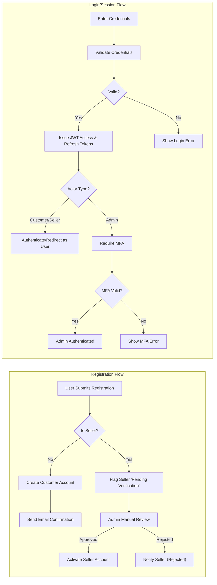

# User Actor Definitions and Authentication Requirements for Shopping Mall Platform

## Introduction
The shopping mall platform employs robust actor-based authentication and authorization to support secure, scalable commerce. The following requirements clarify actor roles, access permissions, authentication mechanisms, and session management, using EARS (Easy Approach to Requirements Syntax) format for clarity. This removes ambiguity to facilitate immediate backend implementation.

## User Actor Definitions

### Customer
Defined as an individual who can register, authenticate, search for products, purchase items, manage addresses, maintain wishlists and carts, place orders, track shipping, write product reviews, view order histories, and initiate order cancellation or refund requests. Customers SHALL only manipulate their own account, data, and orders.

### Seller
Defined as an individual or legal entity representing a merchant who manages their product catalog, SKUs, pricing, inventory, order fulfillments, shipping and tracking updates, post-sales support (cancellations, refunds), and business information. Sellers SHALL NOT access or manage resources belonging to others. Seller onboarding requires identity verification and approval by admin prior to activation.

### Admin
Defined as a privileged platform operator responsible for global order, seller, product, user, and dispute management, as well as system health, compliance, and the enforcement of business rules. Admins may not sell or purchase products within the system.

---

## Authentication & Registration Requirements

### General Authentication
- THE platform SHALL use secure, industry-standard authentication and password hashing for all actors.
- THE platform SHALL provide JWT (JSON Web Token)-based session management for all actors.
- WHEN any user actor registers, THE system SHALL require a valid unique email and strong password.
- WHEN a user completes registration, THE system SHALL send a confirmation email to verify their address.
- WHEN a user attempts login, THE system SHALL validate credentials and respond within 2 seconds.
- IF credential validation fails, THEN THE system SHALL deny authentication and provide an error message indicating the reason (e.g., invalid credentials, account locked).
- WHEN a user logs out, THE system SHALL revoke their session and invalidate associated tokens immediately.

### Customer Registration & Access
- WHEN a customer registers, THE system SHALL collect at minimum: name, email, password, default shipping address, and contact phone number.
- THE system SHALL allow registered customers to update profile information, addresses, and password at any time while authenticated.
- THE system SHALL allow customers to reset their password via a secure, timed email link.
- IF a customer requests password reset, THEN THE system SHALL send a reset email only to the address on file and SHALL invalidate links after 1 hour.

### Seller Registration & Access
- WHEN a seller registers, THE system SHALL require: legal name, unique business email, password, business registration number, customer support contact, and shipping return address.
- WHEN a seller registers, THE system SHALL flag the account as "pending verification" until manual review by an admin is complete.
- WHEN an admin verifies a seller application, THE system SHALL activate the seller account and send notification.
- IF a seller attempts login while unverified, THEN THE system SHALL deny access with appropriate explanation.
- THE system SHALL allow sellers to update their profile, business contacts, and product portfolio after verification.
- THE system SHALL allow sellers to reset their password as per customer rules.

### Admin Registration & Access
- THE admin account setup SHALL be restricted to platform design-time initialization or by an existing admin only.
- WHEN an admin is created, THE system SHALL require: name, admin email, and strong password.
- THE system SHALL mandate multi-factor authentication (MFA) for all admin logins.
- THE system SHALL allow admins to reset their own password via MFA-validated procedure only.

### Token & Session Management (For All Roles)
- THE system SHALL issue JWT access and refresh tokens upon successful login.
- THE JWT access token SHALL expire in 15 minutes.
- THE refresh token SHALL expire after 14 days or upon user-initiated revocation.
- JWT payload SHALL include: userId, role, and permissions array.
- WHEN an actor uses a refresh token, THE system SHALL rotate to a new token and invalidate the prior refresh token.
- THE system SHALL provide a secure method to view and revoke active sessions.
- IF an admin forcibly logs out a user, THEN THE system SHALL revoke all active tokens for that user immediately.

---

## Permission Matrix

| Action                                                   | Customer | Seller | Admin |
|----------------------------------------------------------|----------|--------|-------|
| Register account                                         | ✅       | ✅     | ❌    |
| Login/logout                                             | ✅       | ✅     | ✅    |
| Reset password                                           | ✅       | ✅     | ✅    |
| Add/update addresses                                     | ✅       | ❌     | ❌    |
| Browse/search product catalog                            | ✅       | ✅     | ✅    |
| Create product listing                                   | ❌       | ✅     | ✅    |
| Manage own products/variants                             | ❌       | ✅     | ✅    |
| View own orders                                          | ✅       | ✅     | ✅    |
| Place new orders                                         | ✅       | ❌     | ❌    |
| Manage inventory (for own products)                      | ❌       | ✅     | ✅    |
| Update shipping status for own sales                     | ❌       | ✅     | ✅    |
| Process order cancellation/refund (own)                  | ✅       | ✅     | ✅    |
| Submit product reviews/ratings                           | ✅       | ❌     | ✅    |
| Manage wishlist/shopping cart                            | ✅       | ❌     | ❌    |
| Access order history                                     | ✅       | ✅     | ✅    |
| Cancel/refund a past order                               | ✅       | ✅     | ✅    |
| View all users and their details                         | ❌       | ❌     | ✅    |
| View/manage all products/orders (global scope)           | ❌       | ❌     | ✅    |
| Approve/ban seller or customer accounts                  | ❌       | ❌     | ✅    |
| Oversee refund/cancellation disputes for all orders      | ❌       | ❌     | ✅    |
| Resolve user/content reports, manage reviews             | ❌       | ❌     | ✅    |
| View/refund/cancel order (all users, all sellers)        | ❌       | ❌     | ✅    |
| Manage inventory across the platform                     | ❌       | ❌     | ✅    |
| Modify platform configurations and settings              | ❌       | ❌     | ✅    |

---

## Token & Session Management

- THE system SHALL use JWT-based authentication for all actor types.
- WHEN a user signs in, THE system SHALL issue an access token (valid 15 minutes) and a refresh token (valid 14 days).
- THE system SHALL store tokens securely using httpOnly cookies or secure local storage, following best practices.
- THE system SHALL invalidate all tokens immediately on explicit user logout, password change, or forced admin action.
- THE system SHALL include userId, role, and permissions array in all JWTs.
- THE system SHALL maintain a session log for each actor that lists device, location, and active session timestamps, visible to the user/admin.
- WHERE possible, THE system SHALL use short-lived tokens and require refresh to minimize attack surface.

---

## Actor-Specific Limitations

### Customer Limitations
- IF a customer attempts to access seller or admin functions, THEN THE system SHALL deny access and return HTTP 403 with a business error code.
- IF a customer has a locked or suspended account, THEN THE system SHALL deny access at login and display a clear reason.
- THE system SHALL enforce a maximum number of failed authentication attempts per hour (e.g., 5); on exceeding this, THE system SHALL lock the account for 30 minutes and notify the registered email.

### Seller Limitations
- IF a seller has not completed admin verification, THEN THE system SHALL deny product listing, order management, or dashboard access and show an appropriate reason.
- IF a seller attempts to manage or view another seller's data, THEN THE system SHALL deny with a business error code.
- IF a seller's inventory for a SKU reaches zero, THE system SHALL automatically mark that product as "out of stock" for purchase.

### Admin Limitations
- WHEN an admin attempts to perform an operation outside defined admin privileges, THE system SHALL deny with HTTP 403.
- THE system SHALL audit all privilege escalations and maintain full logs for all admin actions.
- THE system SHALL prevent any admin from deleting the last remaining admin account.

---

## Sample Authentication and Authorization Flow

---

# End of Document
