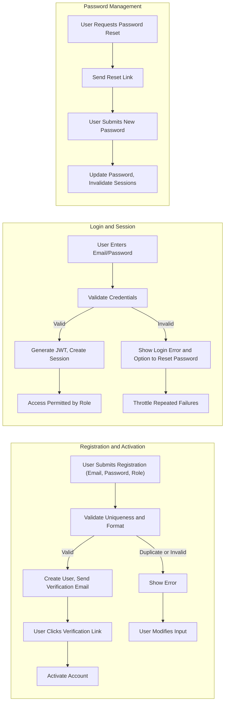
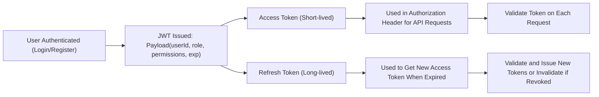

# User Roles and Authentication Requirement Analysis

## 1. Role Overview and Definitions

| Role    | Description                                                                                                                                                    |
|---------|----------------------------------------------------------------------------------------------------------------------------------------------------------------|
| Customer| A regular buyer who can register, log in, browse products, add items to cart and wishlist, place orders, manage orders (track, cancel, request refund), write product reviews, and manage their own addresses. |
| Seller  | A vendor who can register for a seller account, list and manage products (including variants and inventory), process orders, update shipping/tracking status, and respond to customer reviews or questions about their own products. |
| Admin   | A system administrator with full access to manage all users, products, orders, categories, and oversee platform operations (including resolving disputes, handling refunds, and managing seller status). |

### Role Hierarchy
- **Admin** has all permissions of Seller and Customer, plus platform-level controls.
- **Seller** can manage their own products/orders; cannot access admin settings or other sellers' products/orders.
- **Customer** interacts through purchase and review processes only; cannot access seller/admin features.

## 2. Authentication Flows

### Core Authentication Features
- Registration (customer and seller: email + password)
- Login (email + password)
- Address management (customer)
- Email verification
- Password reset (forgot/change password)
- Logout
- Session invalidation

### EARS Requirements (Authentication Flows)
- WHEN a user submits a registration form, THE system SHALL validate all required fields (email, password, role), create the user record, and send out an email verification.
- IF a registration uses an email already present in the system, THEN THE system SHALL reject the request with a clear error message.
- WHEN a user verifies their email, THE system SHALL activate the account and permit login.
- WHEN invalid or expired verification tokens are used, THE system SHALL reject them with a specific error message and guide the user to request a new one.
- WHEN a user attempts to log in, THE system SHALL authenticate credentials against stored data and only allow verified users.
- IF incorrect credentials are provided, THEN THE system SHALL reject login with error code and short throttling delay after repeated failures.
- WHEN a user requests a password reset, THE system SHALL send a time-limited reset link to the registered email.
- WHEN a valid password reset is performed, THE system SHALL update the stored hash and revoke all active sessions.
- WHEN a user logs out, THE system SHALL immediately terminate the session token.
- WHILE a session is active, THE system SHALL allow access based on role permissions and token validity.
- WHEN a customer manages their address book, THE system SHALL permit add, edit, delete, and set default for multiple addresses.

### Authentication Flow Diagram

## 3. Role-based Permissions Matrix

| Action                                              | Customer | Seller | Admin |
|-----------------------------------------------------|----------|--------|-------|
| Register an account                                 | ✅       | ✅     | ✅    |
| Login/Logout                                        | ✅       | ✅     | ✅    |
| Manage profile information                          | ✅       | ✅     | ✅    |
| Manage addresses                                    | ✅       |        |       |
| Browse/search products                              | ✅       | ✅     | ✅    |
| Add to cart, wishlist                              | ✅       |        |       |
| Place order, process payment                        | ✅       |        |       |
| Track, cancel, or request refund on own orders      | ✅       |        |       |
| Write product reviews & ratings                     | ✅       |        |       |
| Manage own product listings                         |          | ✅     | ✅    |
| Manage own inventory and SKUs                       |          | ✅     | ✅    |
| Process received orders, update shipping status      |          | ✅     | ✅    |
| Respond to reviews about own products               |          | ✅     | ✅    |
| View and manage all users, products, orders, etc.   |          |        | ✅    |
| Moderate reviews, handle disputes & refunds         |          |        | ✅    |
| Manage categories, system settings                  |          |        | ✅    |

### EARS Requirements (Permissions)
- WHERE a user holds role customer, THE system SHALL restrict access to only customer functions (e.g., products catalog, cart, reviews, orders, address management).
- WHERE a user holds role seller, THE system SHALL grant access to seller dashboard for managing their own products, inventory, and orders only.
- WHERE a user holds role admin, THE system SHALL grant full access to all system management and moderation functions.
- IF a user tries to access a restricted area outside their permission, THEN THE system SHALL deny the request with a clear error status and log the event.

## 4. JWT and Token Management

### Token Lifecycle and Security
- THE system SHALL use JWT (JSON Web Token) to represent user sessions and authorization state for all authenticated requests.
- THE system SHALL issue access tokens valid for 15-30 minutes and refresh tokens valid for 7-30 days.
- THE JWT payload SHALL include userId, role, permissions array, and issued/expiry times.
- THE JWT secret key SHALL be securely managed and rotated as required by business policy.
- WHEN a user logs out, THE system SHALL blacklist the corresponding token until expiration.
- IF a token is expired or tampered with, THEN THE system SHALL reject it and require re-authentication.
- THE system SHALL allow tokens to be stored via secure httpOnly cookie or localStorage, as chosen by the business policy.

### Token Flow Diagram

### EARS Requirements (Token/Session Management)
- WHEN a user logs in, THE system SHALL issue a new pair of access and refresh tokens, each with defined lifetimes.
- WHEN a token is used for API requests, THE system SHALL validate JWT authenticity, expiration, and permissions before granting access.
- IF a token is expired, invalid, or blacklisted, THEN THE system SHALL deny access and return error code with guidance for re-authentication.
- WHEN a refresh token is used, THE system SHALL verify its validity before issuing new session tokens.

---

This requirements document provides all business-driven requirements for identity and permission management in the shoppingMall system. All technical implementation decisions, such as library selection and specific JWT management strategies, are at the discretion of the backend development team.