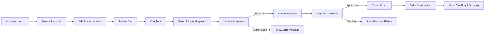
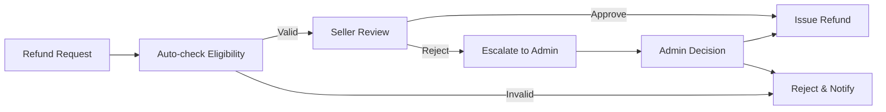

# Functional and Non-Functional Requirements for E-Commerce Shopping Mall Platform

## 1. Introduction & Scope
This document provides a complete, implementation-ready description of functional and non-functional requirements for the e-commerce shopping mall platform (“shoppingMall”). All requirements are structured to be actionable for backend developers and follow EARS (Easy Approach to Requirements Syntax) format where applicable. The scope covers all platform features expected by buyers (customers), sellers, and admins.

## 2. Functional Requirements

### 2.1 User Registration and Authentication
- THE platform SHALL allow new users to register using email and password.
- THE platform SHALL require unique email addresses for registration.
- THE platform SHALL send verification links for email confirmation after registration.
- WHEN email confirmation is pending, THE platform SHALL restrict access to purchase and seller functions.
- THE platform SHALL allow users to login and logout securely.
- WHEN login fails due to incorrect credentials, THE platform SHALL return an informative error message without revealing sensitive details.
- WHEN users forget their password, THE platform SHALL provide password reset via secure email link.
- THE platform SHALL use JWTs for session authentication for all actors.
- WHILE tokens are valid, THE platform SHALL permit access to authenticated operations according to user role.
- IF a non-registered user attempts authenticated actions, THEN THE platform SHALL deny access and indicate authentication is required.

#### Address Management
- THE platform SHALL allow customers to add, edit, delete, and mark primary shipping and billing addresses.
- WHEN placing an order, THE platform SHALL display the user’s saved addresses for selection.
- THE platform SHALL validate address format, check for completeness, and restrict the number of saved addresses to 10 per user.
- IF an address is incomplete or invalid, THEN THE platform SHALL prevent saving and display validation errors.

### 2.2 Product Catalog & Category Browsing
- THE platform SHALL support browsing and searching for products by category, keyword, and attribute filters.
- THE platform SHALL organize products into a hierarchical category structure (e.g., Electronics > Mobile Phones > Accessories).
- WHEN a user accesses a category, THE platform SHALL display paginated product lists; default page size is 20.
- THE platform SHALL support category-based, keyword-based, and multi-attribute filtering.
- WHERE categories have subcategories, THE platform SHALL display proper nesting.

#### Product Variants (SKU)
- THE platform SHALL store each product as one or more SKUs, representing unique combinations of color, size, and configurable options.
- THE platform SHALL allow sellers to define SKU attributes per product.
- WHEN displaying products, THE platform SHALL show available variant options per SKU and indicate out-of-stock status per variant.
- IF a SKU is out of stock, THEN THE platform SHALL prevent purchase of that variant.

#### Search
- THE platform SHALL support full-text search by product name, description, and seller.
- WHEN a search yields no results, THE platform SHALL inform the user and suggest alternative actions.

### 2.3 Shopping Cart & Wishlist
- THE platform SHALL support persistent shopping carts per customer, auto-saved unless explicitly cleared.
- WHEN a user adds a product to the cart, THE platform SHALL verify inventory for the selected SKU in real-time.
- IF a SKU is no longer available/has insufficient inventory, THEN THE platform SHALL notify the user and block addition.
- THE platform SHALL support quantity adjustments for cart items, always validating against inventory.
- THE platform SHALL allow customers to add/remove products to a personal wishlist, visible only to the originating account.
- THE platform SHALL preserve cart and wishlist in case of user session restoration or re-login.

### 2.4 Order Placement & Payment Processing
- WHEN a customer checks out their cart, THE platform SHALL verify all product availability, apply shipping and taxes, and calculate order total.
- THE platform SHALL support at least one payment gateway (e.g., credit/debit card, 3rd party processor).
- WHEN payment is authorized, THE platform SHALL create an order, reserve inventory, and send order confirmation to customer and the involved seller(s).
- IF payment fails, THEN THE platform SHALL retain cart status, display error, and allow retry.
- THE platform SHALL not finalize orders and shall not reserve inventory unless payment is confirmed.

### 2.5 Order Tracking & Shipping Updates
- THE platform SHALL store and display order status (“Placed”, “Processing”, “Shipped”, “Delivered”, “Cancelled”) for each order.
- WHEN a seller updates the order shipping status, THE platform SHALL notify the customer via email and update the dashboard.
- THE platform SHALL provide shipping tracking links or estimated delivery dates where available.

### 2.6 Product Reviews & Ratings
- THE platform SHALL allow verified purchasers to submit a review and rating (1–5 stars) per purchased product.
- THE platform SHALL verify purchase history before permitting reviews (“verified customer only”).
- WHEN a review is submitted, THE platform SHALL allow text content (min 10, max 1000 characters) and a single rating per purchase.
- THE platform SHALL allow users to update or delete their own reviews within 30 days of posting.
- THE platform SHALL display cumulative rating statistics per product and show all reviews in descending order of creation date.
- IF a review contains prohibited content (profanity, spam), THEN THE platform SHALL block submission and inform the user.

### 2.7 Seller Account & Product Management
- THE platform SHALL permit sellers to register, onboard, and manage business profile including payment information.
- THE platform SHALL require seller verification (ID or business documents) before first product listing.
- WHEN seller verification is pending, THE platform SHALL disable listing and transaction functions.
- THE platform SHALL allow sellers to create, update, and delete product listings with SKUs, images, pricing, and inventory details.
- THE platform SHALL allow sellers to view/manage orders assigned to them, update order status, and process cancellations/refunds as per policies.
- THE platform SHALL provide sales statistics per seller account, including revenue, order volume, and top products.

### 2.8 Inventory & SKU Management
- THE platform SHALL enable sellers to manage real-time inventory levels at SKU level.
- WHERE inventory reaches zero, THE platform SHALL mark the SKU as unavailable for purchase or reservation.
- WHEN a seller updates inventory or pricing, THE platform SHALL reflect changes immediately across catalog and active carts.
- THE platform SHALL not allow overselling—orders may only be placed for SKUs with available inventory.

### 2.9 Order History, Cancellation & Refunds
- THE platform SHALL maintain complete order histories per customer, with details and current status.
- THE platform SHALL allow customers to request order cancellation until item is shipped.
- WHEN a cancellation is approved, THE platform SHALL trigger inventory restoration and process reversal/refund via payment partner.
- THE platform SHALL allow customers to submit refund requests for eligible orders, to be processed by sellers or admins per policy.
- WHEN a refund is processed, THE platform SHALL notify all parties and update order/end-user status accordingly.
- THE platform SHALL maintain audit logs for all order, cancellation, and refund activities.

### 2.10 Admin Dashboard & Controls
- THE platform SHALL provide admins with ability to view, filter, and manage all products, categories, sellers, and users.
- THE platform SHALL allow admins to update platform-wide categories, approve or reject seller onboarding, and batch update product status (active, inactive, removed).
- THE platform SHALL allow admins to view all orders, intervene in disputes, and approve/refuse refund requests.
- WHEN admins perform moderation, THE platform SHALL log all actions and decisions for audit.
- THE platform SHALL allow only admins to escalate or override seller/customer actions when required by business policies.

## 3. Non-Functional Requirements

### 3.1 Performance
- THE platform SHALL return responses to user-initiated actions (e.g., product search, cart update, order placement) within 2 seconds under normal operating loads (≤100 concurrent users).
- THE platform SHALL support scaling to at least 10,000 concurrent users, with graceful performance degradation only past this limit.
- THE platform SHALL process payment completion and order creation in less than 3 seconds in 95% of cases.

### 3.2 Security
- THE platform SHALL ensure all authentication, payment, and sensitive operations require valid session tokens (JWTs).
- THE platform SHALL persist only encrypted passwords and payment credentials.
- WHEN security incidents are detected (e.g., repeated failed logins, unusual activity), THE platform SHALL lock affected accounts and inform the user.
- THE platform SHALL ensure all audit trails are tamper-evident and immutable (write-once, read-many).

### 3.3 Compliance
- THE platform SHALL comply with applicable data privacy regulations (e.g., GDPR for EU buyers, PCI-DSS for card payments).
- THE platform SHALL provide mechanisms for users to request account/data deletion or export, with compliance to local law.
- THE platform SHALL log all access to personal, financial, or order data for regulatory review for at least 1 year.

### 3.4 Availability & Scalability
- THE platform SHALL target 99.9% uptime, with planned maintenance <= 2 hours/month and full notification for users at least 24 hours prior.
- THE platform SHALL maintain daily data backups, recoverable within 30 minutes in case of major outage/failure.
- WHEN critical infrastructure fails, THE platform SHALL provide a “service temporarily unavailable” message and prevent order activity until systems are restored.

## 4. Business Rules Overview

- THE platform SHALL validate all user input for required fields, range, and format per feature.
- WHEN conflicts arise between sellers and customers (e.g., disputed refunds), THE platform SHALL escalate to admin review and final decision.
- THE platform SHALL associate every order with exact buyer, seller(s), products, and payment record for traceability.
- IF users attempt to perform unauthorized actions (e.g., buyers accessing seller/admin functions), THEN THE platform SHALL prevent and log such attempts.
- THE platform SHALL not permit sellers or admins to access customer payment credentials beyond what is necessary for processing.
- THE platform SHALL prevent users from manipulating historical order data or reviews after allowed windows expire.

## 5. Diagrams

### 5.1 Overall Order Placement & Fulfillment (Customer View)

### 5.2 Seller Order Processing

### 5.3 Admin Refund/Dispute Escalation

---

This requirements document is designed to ensure backend implementation aligns precisely with business needs, actor expectations, and regulatory standards. All features, flows, and rules must be reflected as described; deviations require documented business stakeholder approval.