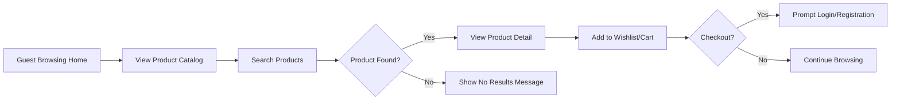
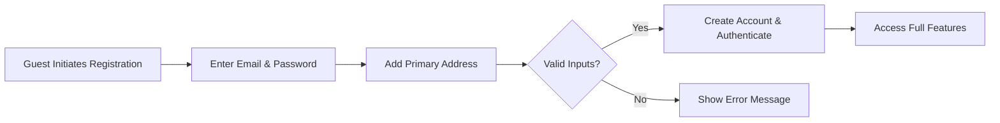
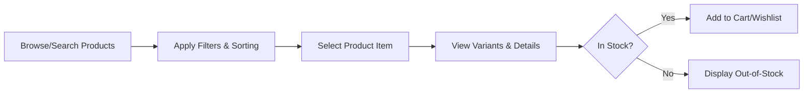
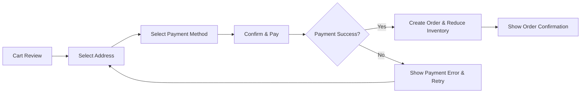
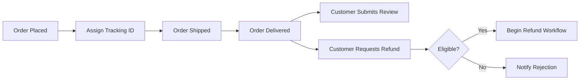
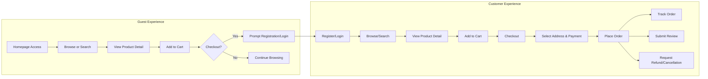

# Key User Flows for E-Commerce Shopping Mall Platform

## Introduction
This document comprehensively describes primary user journeys and business flows for the shopping mall platform. All actors—guests, customers, sellers, and admins—are considered, with requirements structured for unambiguous backend implementation. The Easy Approach to Requirements Syntax (EARS) is used for all applicable requirements to ensure clarity and testability. Visual process diagrams are provided using Mermaid with full compliance to syntax standards.

## 1. Guest User Browsing

### Overview
A guest user is any non-authenticated visitor. Their main functions include browsing products, searching the catalog, viewing product details, and creating a wishlist or pre-cart (if supported for guests).

### EARS Requirements
- THE shopping mall platform SHALL display the product catalog to all guest users.
- WHEN a guest user searches for a product, THE shopping system SHALL return products sorted by relevance and availability.
- IF a guest user attempts to access member-only functionality (e.g., checkout, address management), THEN THE shopping mall platform SHALL redirect to registration or login.
- WHERE guest cart functionality is supported, THE shopping system SHALL allow guests to add items temporarily, with cart expiration after 24 hours of inactivity.

### Boundary/Error Cases
- IF a searched product is not found, THEN THE shopping mall platform SHALL display an empty results message.
- IF a guest attempts to proceed to checkout, THEN THE system SHALL prompt for registration or login before continuing.

### Mermaid Diagram: Guest Product Browsing

## 2. Customer Registration & Profile Management

### Overview
Customers are actors who have registered and authenticated. They can manage their profile, addresses, carts, wishlists, and orders.

### EARS Requirements
- WHEN a guest selects registration or login, THE shopping mall system SHALL present forms for email, password, and address setup.
- THE shopping mall system SHALL validate all user-provided information per defined business and regulatory rules.
- WHEN a user completes registration, THE system SHALL create a customer record and initiate an authenticated session.
- THE customer SHALL be able to manage profile (name, email), addresses, and password from their account area.
- WHEN a customer adds or edits an address, THE shopping mall platform SHALL validate delivery zones and format.
- IF a customer attempts to register with an email already in use, THEN THE system SHALL display an informative error and prevent duplicate accounts.

### Mermaid Diagram: Customer Registration/Profile

## 3. Product Discovery & Search

### Overview
Product discovery supports both guests and authenticated customers through browse, filter, search, and recommendations.

### EARS Requirements
- THE shopping system SHALL support filtering by category, price range, seller, ratings, and stock status.
- WHEN a user selects a product, THE shopping mall system SHALL display all variants (color, size, SKU options) with real-time stock.
- THE platform SHALL allow sorting options (e.g., newest, price ascending/descending, highest rated, popularity).
- THE system SHALL provide recommendations for related or featured products based on current browsing context.

### Error/Boundary Cases
- IF a chosen variant is out-of-stock, THEN THE shopping system SHALL disable purchase actions and show an out-of-stock message.

### Mermaid Diagram: Product Discovery

## 4. Checkout & Payment Flow

### Overview
Checkout is available to authenticated customers and involves address selection, cart review, payment, and order creation.

### EARS Requirements
- WHEN a customer proceeds to checkout, THE platform SHALL require address verification (or selection if multiple exist).
- THE system SHALL summarize all cart items, showing prices, quantities, shipping cost, and expected delivery.
- THE system SHALL support multiple payment methods (e.g., credit card, third-party processor, etc.).
- WHEN payment is successful, THE shopping mall platform SHALL create an order, reduce inventory, and provide a confirmation with unique order ID.
- IF payment fails, THEN THE system SHALL alert the user and offer retry or method change.
- WHEN checkout occurs, THE platform SHALL check all inventory for items in cart immediately prior to payment and prevent out-of-stock checkout.

### Mermaid Diagram: Checkout & Payment

## 5. After-sales Processes: Order Tracking, Reviews, Refunds

### Overview
Once an order is placed, customers can track orders, submit reviews/rating, and request cancellations/refunds. Sellers manage fulfillment; admins oversee exception handling.

### EARS Requirements
- WHEN an order is placed, THE system SHALL generate a tracking number and expose shipping status to customer.
- THE customer SHALL be able to view a chronological history of all past orders and their statuses.
- WHEN an order status changes (e.g., shipped, delivered), THE system SHALL notify the customer by email or suitable notification.
- THE customer SHALL be able to submit product reviews and ratings only for products in completed orders.
- WHEN a refund or cancellation is requested, THE system SHALL validate eligibility per business policy and begin the approval workflow involving sellers/admins as required.
- IF a cancellation/refund is rejected, THEN THE system SHALL inform the customer with a clear business reason.
- THE seller SHALL be able to update shipping status and respond to after-sales requests from customers post-fulfillment.

### Mermaid Diagram: Order Tracking & After-Sales

## 6. Holistic User Journey: End-to-End Shopper Flow

### Mermaid Diagram: Full Shopper Flow

## 7. Error Handling & Exceptional Scenarios

- IF a user tries to access a deleted or hidden product, THEN THE system SHALL display an appropriate error and remove non-buyable products from catalog listings.
- IF server or network errors prevent cart actions, THEN THE platform SHALL retain user state client-side and prompt to retry once recovered.
- IF a seller does not fulfill the order by designated policy deadlines, THEN THE system SHALL escalate to admin for resolution.
- IF payment verification is delayed from third-party providers beyond 60 seconds, THEN THE system SHALL time out gracefully and communicate possible status outcomes to user, offering recovery flows for double payment, uncertain status, or retry.

## 8. Success Criteria & Performance Expectations

- WHEN any user-facing workflow is invoked, THE system SHALL respond within 2 seconds for 95% of requests under normal load.
- THE shopping platform SHALL ensure that no user-critical process (registration, checkout, payment confirmation) exceeds 5 seconds for 99% of cases under peak traffic.
- THE system SHALL preserve all successful user-submitted transactions (registration, orders, reviews) even in case of backend outages, ensuring data integrity and at-least-once delivery.

---

For definitions of actors and permission levels, see [User Actor Definitions and Authentication](./02-user-actors.md).
For the overall business context, see [Business Model and Vision](./01-business-model.md).
For detailed function-level requirements, see [Functional Requirements](./04-functional-requirements.md).
For nonfunctional and compliance information, see [Nonfunctional & Compliance Requirements](./14-nonfunctional-glossary.md).
