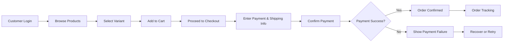
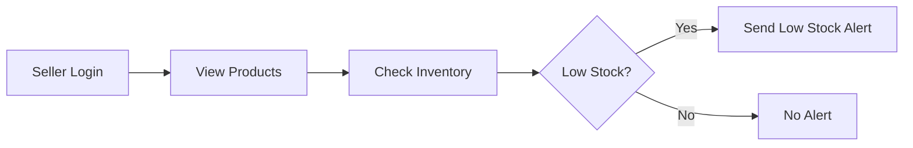

# User Journeys and Scenario Analysis for the ShoppingMall Platform

## Introduction
This document provides a comprehensive map of user journeys for the ShoppingMall platform, detailing primary and edge-case scenarios for all core roles: customer, seller, and admin. Each scenario is described with stepwise business logic, EARS-format requirements, relevant exception handling, and user-facing recovery paths. The objective is to ensure backend developers have a clear, action-ready reference for implementing all workflow logic in the system.

## User Role Overview

| Role      | Description                                                                                                           |
|-----------|-----------------------------------------------------------------------------------------------------------------------|
| Customer  | A buyer who can register, log in, manage addresses, browse/search products, add to cart/wishlist, place orders, track, cancel, request refunds, and review products.                                         |
| Seller    | A vendor who can register for a seller account, list/manage products (with variants and inventory), process orders, update shipping status, and reply to reviews/questions about their products.            |
| Admin     | Platform administrator with full management authority: users, products, orders, categories, platform operations, dispute handling, refunds, seller status.                                                   |

## Primary User Journeys

### 3.1 Customer Journeys
#### Registration and Login
- WHEN a customer submits registration details (email, password, and address), THE system SHALL create a unique customer account with associated address book entry.
- WHEN a customer logs in with valid credentials, THE system SHALL create a secure user session and provide access to all customer features within 2 seconds.
- IF registration fails due to duplicate email, THEN THE system SHALL display an error and prevent account creation.

#### Address Management
- WHEN a customer adds a new address, THE system SHALL validate all fields (name, detailed address, phone) and save to their address book.
- WHEN a customer edits or deletes an address, THE system SHALL ensure the address exists and the requestor is the owner before performing the operation.

#### Browsing & Searching Products
- WHEN a customer accesses the catalog, THE system SHALL display available products, organized by categories and with search/filter options.
- WHEN a customer searches for products using keywords or filters, THE system SHALL return relevant items within 2 seconds.

#### Managing Cart & Wishlist
- WHEN a customer adds a product variant (specific color/size) to their cart, THE system SHALL verify stock and add the item to their cart.
- IF selected SKU is out of stock, THEN THE system SHALL show an error and prevent adding to cart.
- WHEN a customer adds/removes products to wishlist, THE system SHALL update their wishlist state instantly.

#### Placing Orders & Payment
- WHEN a customer checks out their cart, THE system SHALL validate all items (availability, price), collect shipping/payment info, and process order placement.
- WHEN payment is completed successfully, THE system SHALL confirm the order and send order details to the customer and seller.
- IF payment fails, THEN THE system SHALL abort the order, release any reserved inventory, and notify the customer.

#### Order Tracking & Shipping
- WHEN an order is placed, THE system SHALL allow the customer to track order progress and shipping status.
- WHEN a seller updates shipping status, THE system SHALL notify the customer in real time.

#### Review & Rating
- WHEN an order is fulfilled, THE system SHALL allow the customer to submit a review and rating for each ordered product.
- IF a customer attempts to review a non-purchased product, THEN THE system SHALL reject the request.

#### Order Management (History, Cancellation, Refund)
- WHEN a customer views their order history, THE system SHALL display all their previous orders in reverse chronological order.
- WHEN a cancellation is requested for a pending order, THE system SHALL validate eligibility, process cancellation, and update status.
- WHEN a refund is requested, THE system SHALL initiate the refund flow per business rules and notify both customer and seller.

### 3.2 Seller Journeys
#### Seller Registration & Login
- WHEN a seller applies for an account, THE system SHALL capture business details for review and activate on approval.
- WHEN a seller logs in, THE system SHALL allow product, order, and inventory management features based on seller permissions.

#### Product Management
- WHEN a seller creates a new product or variant, THE system SHALL require all mandatory data (name, description, images, SKUs, price, stock) and validate uniqueness.
- WHEN a seller updates a product/variant, THE system SHALL validate the operation, ensuring no customer orders are harmed by major attribute changes.

#### Inventory Management
- WHEN a seller updates inventory for an SKU, THE system SHALL immediately reflect the new stock and enable/disable ordering as appropriate.
- IF inventory drops below threshold, THEN THE system SHALL send a low-stock alert to the seller and prevent new orders if out of stock.

#### Order Processing
- WHEN an order is received, THE system SHALL notify the seller and display all details in the seller dashboard.
- WHEN a seller updates order status (e.g., ships the item), THE system SHALL update customer-facing tracking and trigger automated notifications.

#### Review Interaction
- WHEN a seller responds to a review or question on their product, THE system SHALL properly record and display the reply.
- IF seller attempts to reply to reviews not associated with their products, THEN THE system SHALL prevent the action.

### 3.3 Admin Journeys
#### Admin Authentication
- WHEN an admin logs in, THE system SHALL provide access to all admin dashboards, analytics, and platform operations.

#### User & Seller Management
- WHEN an admin manages users/sellers, THE system SHALL display current accounts and allow ban/reactivation actions as permitted.
- WHEN a dispute or refund escalation arises, THE system SHALL provide admins with all relevant info, action buttons, and status updates.

#### Category & Product Oversight
- WHEN an admin manages categories/products, THE system SHALL allow full create/edit/delete authority, with change logs.

#### Order & Transaction Oversight
- WHEN an admin reviews orders, THE system SHALL allow full search, filter, and status update capability.

#### Platform Monitoring
- WHEN an admin views analytics, THE system SHALL present real-time metrics for traffic, transactions, inventory flow, and other KPIs.

## Edge Case and Exception Scenarios

### 4.1 Error and Failure Paths
- IF a customer tries to place an order for an out-of-stock SKU, THEN THE system SHALL block the transaction and explain the cause.
- IF payment is interrupted (customer closes browser, bank declines, etc.), THEN THE system SHALL release reserved inventory and display the failure on next login.
- IF a seller tries to update an order already fulfilled or refunded, THEN THE system SHALL reject the update.
- IF an admin attempts an unauthorized action (e.g., due to session expiry), THEN THE system SHALL redirect to login and log the attempt.

### 4.2 Abandonment & Recovery Flows
- WHEN a customer abandons a cart for more than 30 minutes, THE system SHALL retain cart contents but display a reminder at next login.
- IF a seller leaves product creation incomplete, THEN THE system SHALL save draft state for resumption.
- IF network disconnects during key flows (checkout, admin actions), THEN THE system SHALL display recovery options and never double-commit.

### 4.3 Permissions & Access Violations
- IF a user attempts to access a feature beyond their role, THEN THE system SHALL deny with a clear, role-based error message.

## Typical Success Paths

### Customer Happy Path Example
1. Register account → log in → search product → add variant to cart → checkout → pay → receive order confirmation → track shipment → receive product → write review

### Seller Happy Path Example
1. Register seller account → log in → list product with variants/SKUs → get order notification → manage order/shipping → update inventory → respond to reviews/questions

### Admin Happy Path Example
1. Log in → review analytics dashboard → manage users/sellers → update categories/products → handle escalated disputes/refunds

## Mermaid Diagrams: Visual Mapping

### Example 1: Customer Order Placement Flow

### Example 2: Seller Inventory Update & Low Stock Alert

## User Experience Performance Requirements
- THE system SHALL complete all user-triggered flows (registration, login, product search, order placement, status updates) within 2 seconds under normal conditions.
- IF performance drops below this threshold, THEN THE system SHALL log the incident and alert admins for remediation.

## Summary of Business Logic
- All journeys are subject to user role permissions as previously specified.
- System must prioritize accuracy in state transitions, auditability for all admin actions, and always present clear cause for any error or exception path.
- Robust edge-case and recovery logic prevents data inconsistency and enhances user trust for all major platform workflows.