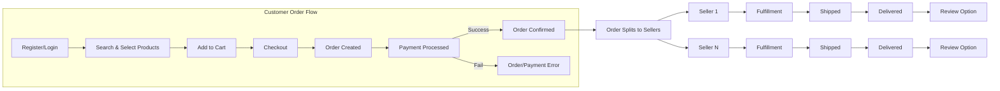

# Shopping Mall Platform – Functional Requirements

## 1. Core Backend Capabilities

### 1.1 User Account Management
- WHEN a new account registration is requested, THE system SHALL allow account creation as customer or seller, requiring email, password, and, where applicable, seller verification data.
- THE system SHALL verify the uniqueness of all email addresses for registration purposes.
- WHEN a user logs in with valid credentials, THE system SHALL issue a secure session token with proper role/permissions attached.
- WHEN a user requests password reset, THE system SHALL provide a secure, time-limited recovery workflow.
- WHEN a user wishes to manage addresses, THE system SHALL allow storing, modifying, and deleting delivery addresses, subject to address format validation rules.
- IF any invalid credentials are provided, THEN THE system SHALL reject authentication with a specific error message.
- THE system SHALL allow users to delete their own accounts after verifying identity and pending orders are resolved.

### 1.2 Product Catalog & Categories
- THE system SHALL support categorizing all products via a multi-level category tree, allowing category creation, update, and archival (admin only).
- WHEN a user requests a product list, THE system SHALL enable filter and search by keyword, category, price, and attributes.
- THE system SHALL enable seller users to create, update, and archive (soft-delete) their own products, specifying variants (SKUs) including color, size, or other options.
- THE system SHALL ensure all product listings display SKU-level stock status, price, and availability information.

### 1.3 Product Variant (SKU) Management
- WHEN a product includes variants, THE system SHALL treat each variant as a unique SKU with dedicated pricing, inventory, and attributes.
- THE system SHALL allow sellers to add, update, and remove SKUs under their products.
- IF a product has no active SKUs, THEN THE system SHALL prevent the product from being displayed for purchase.
- WHEN SKUs are updated, THE system SHALL reflect all changes immediately in product queries.
- WHEN requested, THE system SHALL provide SKU-level detail by ID.

### 1.4 Cart and Wishlist
- THE system SHALL enable logged-in customers to create and manage a cart – adding, updating, and removing SKUs, with quantity checks per SKU.
- WHEN a customer adds a SKU to the cart, THE system SHALL validate stock availability and maximum per-order limits.
- THE system SHALL allow customers to maintain a wishlist, storing multiple SKUs for future reference.
- THE system SHALL enforce that only logged-in customers may persist carts or wishlists across sessions.
- THE system SHALL remove cart items automatically if the relevant SKU becomes unavailable or out of stock, and notify the user appropriately.
- THE system SHALL support guest carts (session-based only) that do not persist across devices.

### 1.5 Order Placement and Payment Processing
- WHEN a customer submits a checkout request, THE system SHALL validate required information (delivery, payment, at least one item, in-stock SKUs).
- WHEN an order is placed, THE system SHALL reserve inventory immediately to prevent overselling.
- THE system SHALL provide integration points for payment service providers, returning clear status (pending, success, fail) following payment attempts.
- WHEN payment is confirmed, THE system SHALL finalize the order and provide customers with a full summary.
- IF payment fails or is canceled, THEN THE system SHALL restore any reserved inventory and notify the user.
- THE system SHALL associate orders to seller accounts based on product SKU ownership, splitting orders accordingly.

### 1.6 Order Tracking, Shipping, Status Updates
- THE system SHALL assign a unique tracking code to each order at confirmation.
- WHEN an order status changes (e.g., packed, shipped, delivered, canceled), THE system SHALL update both customer and seller order histories and send notifications.
- THE system SHALL allow customers and sellers to view the order status and timeline at any time.
- THE system SHALL allow sellers to update shipping information and change the order status when applicable.
- THE system SHALL ensure only the responsible seller or an admin can edit order statuses and shipment data.
- THE system SHALL enforce secure, auditable logs for all order and status changes.

### 1.7 Product Reviews and Ratings
- WHEN a customer completes a purchase and order is marked delivered, THE system SHALL permit submission of a product review and rating.
- THE system SHALL enforce that only customers who purchased a SKU may submit a review for that SKU.
- THE system SHALL allow customers to edit or delete their own reviews within a specified window (e.g., 30 days).
- THE system SHALL display aggregate ratings and review counts on product pages.
- THE system SHALL provide moderation features, allowing admins to remove abusive, fraudulent, or inappropriate reviews.

### 1.8 Seller Account & Inventory Management
- THE system SHALL enable sellers to manage their own products, SKUs, inventory levels, and order fulfillment (including shipping, updates, and cancellations).
- THE system SHALL prevent sellers from modifying products or SKUs owned by other sellers.
- THE system SHALL notify sellers of low stock thresholds and out-of-stock events in real-time.
- WHEN inventory changes are reported (sales, restock, refund), THE system SHALL update SKU stock accordingly and prevent sales if zero.

### 1.9 Order History, Cancellation, and Refund
- THE system SHALL retain full order history per customer and seller, including status changes, payment details, shipment data, and customer requests.
- WHEN a cancellation or refund is requested, THE system SHALL validate eligibility (e.g., only prior to shipment or as per business policy), process refund workflow, and update statuses.
- THE system SHALL allow admin users to override and resolve disputes as per platform rules.
- WHEN an order is refunded, THE system SHALL restore affected inventory to the correct SKU(s).

### 1.10 Admin Dashboard & Platform Oversight
- THE system SHALL allow admin users to view, filter, and manage all orders, products, users, and disputes across the platform.
- THE system SHALL enable admin to perform order overrides, product or seller suspensions, and review moderation.
- THE system SHALL require audit logging for all admin actions affecting platform data.

---

## 2. Business Logic Rules

### 2.1 Unique Constraint Enforcement
- THE system SHALL guarantee uniqueness for emails, product SKUs, and order IDs across the platform.

### 2.2 Consistency and Atomicity
- WHEN orders or refunds are created, THE system SHALL ensure all related updates (inventory, order status, payment, logs) are atomically committed or rolled back if any failure occurs.

### 2.3 Actor Permissions and Separation
- THE system SHALL enforce permissions strictly according to user role (customer, seller, admin) as per [User Actor Documentation](./02-user-actors.md).

### 2.4 Data Retention and Deletion
- WHEN a user account is deleted, THE system SHALL anonymize personal data from order histories, retaining necessary records per legal requirements.

### 2.5 Review Authorship Verification
- THE system SHALL ensure only authenticated buyers of a product can submit reviews for that product.

### 2.6 Stock Validation
- WHEN a user attempts to order more units than are available, IF excess quantity is requested, THEN THE system SHALL reject the order with a clear message.

### 2.7 Cart Consistency
- WHEN an in-cart SKU becomes unavailable before order placement, THE system SHALL automatically remove it from all affected carts and notify the users.

## 3. Actor-based Behaviors

### 3.1 Customer
- THE customer SHALL register, log in, manage their addresses, place orders, maintain cart and wishlist, track order status, write reviews, initiate cancellations/refunds, and view full order history.
- THE customer SHALL only be able to purchase SKUs in active status and with inventory available.
- THE customer SHALL not have the ability to edit or delete products, orders, or data they do not own.

### 3.2 Seller
- THE seller SHALL list new products and manage their own product catalog, SKUs, pricing, and inventory.
- THE seller SHALL view and fulfill orders on their owned products, update shipment details, and communicate with buyers.
- THE seller SHALL be restricted from accessing other sellers’ data or orders not associated with their products.

### 3.3 Admin
- THE admin SHALL access all platform data, manage all products, sellers, and customers, moderate reviews, and oversee dispute/refund processes.
- THE admin SHALL execute escalated actions (e.g., suspending a seller, force-refunding an order) with audit logs.
- THE admin SHALL configure site-wide settings relevant to platform operation.

---

## 4. Process Validations

### 4.1 Registration
- WHEN a user registers, THE system SHALL validate required inputs: unique, properly formatted email, strong password (minimum length and complexity), consent to terms.
- IF data is invalid (e.g., existing email, invalid format), THEN THE system SHALL return an explicit error.

### 4.2 Order Placement & Payment
- WHEN placing an order, THE system SHALL validate stock is sufficient for each SKU and reject order otherwise.
- THE system SHALL confirm address and payment details as valid and complete before processing.
- WHEN payment is received, THE system SHALL record a payment confirmation event in order history.
- IF payment fails or times out, THEN THE system SHALL cancel order and restore all inventory held for that session.

### 4.3 Review Submission
- WHEN a customer submits a review, THE system SHALL check for prior purchase status and reject attempts from users without prior deliveries for that SKU.
- THE system SHALL validate rating is within the allowable range (e.g., 1-5).
- THE system SHALL block duplicate reviews from the same customer for the same order/SKU.

### 4.4 Product and Stock
- WHEN a seller adds or updates a product/SKU, THE system SHALL enforce that required data fields are present (name, price, stock, attributes).
- IF a seller attempts to delete a SKU or product tied to ongoing orders, THEN THE system SHALL deny the operation and return a constraint error.

### 4.5 Cart & Wishlist
- WHEN a customer updates cart or wishlist, THE system SHALL validate SKUs are active, not archived or discontinued.
- WHEN transferring cart from guest to logged-in account, THE system SHALL merge and validate all items according to business rules (no duplicates, stock checks).

---

## Mermaid Diagram: Order Placement to Delivery Flow

---
This document provides business requirements only. All technical implementations (architecture, APIs, database design, etc.) are at the discretion of the development team. Developers have full autonomy over how to realize these requirements in the codebase.