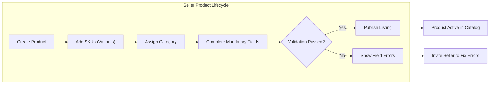

# Product Catalog and Management Requirements Analysis

## Product Model & Variants (SKU)

### Core Concepts
- **Product**: A distinct item listed for sale, which may have multiple variants (SKUs).
- **SKU (Stock-Keeping Unit)**: The specific sellable variation of a product, defined by option combinations (color, size, etc.) and inventory controlled at this level.

### Requirements (EARS Format)
- THE catalog system SHALL allow sellers to create new products and define at least the following attributes per product: name, description, images (multiple), price, category, and seller contact.
- THE system SHALL allow sellers to associate multiple SKUs to a single product, each with their own attributes (e.g., price adjustment, available quantity, status, and option values such as color, size).
- THE system SHALL require at least one SKU per product for listing; products without an active SKU SHALL not be discoverable publicly.
- WHEN a seller creates or modifies a SKU, THE system SHALL validate that all required variant-specific fields are completed, and inventory quantities are non-negative integers.
- WHEN a customer views a product, THE system SHALL display all available SKUs (option selections, price, in-stock status) for the product.
- WHEN an admin edits a product or SKU, THE system SHALL log the change event for auditing purposes.
- WHERE a SKU has zero inventory, THE system SHALL NOT allow it to be purchased or added to cart, and SHALL clearly mark it as "Out of Stock" in queries.
- WHEN a customer attempts to add an out-of-stock SKU to the cart, THEN THE system SHALL return an error message: "This option is currently out of stock."
- WHERE a seller attempts to delete a product with active (open) orders associated with any of its SKUs, THEN THE system SHALL deny the deletion and return an actionable error.

### SKU Option Handling
- THE system SHALL allow sellers to define arbitrary variant options (e.g., color, size, material).
- THE system SHALL generate all valid SKU combinations from specified options and allow sellers to selectively enable/disable specific combinations.

### Example Structure (Markdown Table for Developer Context)
| Product Attribute | Required | Description |
|------------------|----------|-------------|
| Name             | Yes      | Product name (string, 2-100 chars) |
| Description      | Yes      | Product description (string, max 2000 chars) |
| Images           | Yes      | 1 or more images (URL references) |
| Seller           | Yes      | Seller account reference |
| Category         | Yes      | Assigned category |

| SKU Attribute    | Required | Description |
|------------------|----------|-------------|
| Option Values    | Yes      | E.g., Color: Red, Size: M |
| Price            | Yes      | Price for this SKU |
| Inventory        | Yes      | Integer, >= 0 |
| SKU Status       | Yes      | Active/Inactive |

## Category Management

### Requirements (EARS Format)
- THE system SHALL allow admins to create, edit, enable, disable, and delete categories.
- THE system SHALL support hierarchical category trees (e.g., Clothing > Men's > Shirts).
- THE system SHALL require every product to be assigned to exactly one leaf category.
- WHEN a category is disabled, THE system SHALL automatically unpublish all products assigned to that category and prevent further customer discovery.
- WHERE a seller attempts to assign a product to a disabled or non-leaf category, THEN THE system SHALL deny the attempt and return an explanatory error.
- WHEN a category is deleted, THE system SHALL reject deletion if products or subcategories still exist beneath it; admins must reassign or delete child objects first.

### Category Design (for UI/UX context)
- The category structure SHALL be navigable for deep hierarchies (up to 5 levels recommended).
- Categories SHALL support multilingual names and descriptions for localization.

## Product Search & Filtering

### Functional Requirements (EARS Format)
- THE system SHALL allow customers and guests to search the product catalog by free-text (e.g., name, keywords) and by filters (category, price range, product options).
- THE system SHALL return search results including product title, image, price, main variant options, in-stock/out-of-stock state, and rating.
- WHEN a search or filter is applied, THE system SHALL return results in descending order of relevance (default: best match, with secondary sorts by price, popularity, newest).
- THE system SHALL support pagination for search results (default: 20 items per page).
- WHEN a customer selects a filter or ordering option, THE system SHALL apply it immediately and refresh the result set accordingly.
- WHERE a search query returns more than 1,000 results, THE system SHALL return only the top 1,000 and indicate that more products may exist.
- THE system SHALL respond to text and filter searches within 2 seconds for the majority (95th percentile) of queries.

### Filtering Capabilities
- Filter by category (including children of a category)
- Filter by seller
- Filter by price range
- Filter by in-stock only
- Filter by option value (e.g., color, size)
- Sorting: Best match, Price (asc, desc), Newest, Rating, Popularity

## Business Rules for Listings

### Key Business Logic (EARS)
- THE system SHALL allow only sellers and admins to create, edit, or remove product listings.
- THE system SHALL require all mandatory fields to be completed and at least one image before a product may be published.
- WHERE an admin disables or deletes a product, THE system SHALL remove it from all search results and category listings instantly.
- WHEN a product is unpublished or inventory for all SKUs reaches zero, THE system SHALL remove the product from customer-facing discovery flows.
- THE system SHALL NOT allow two products with the same name from the same seller within the same category.
- THE system SHALL log every create, edit, publish, unpublish, disable, or delete event for listings (audit trail for admin review and seller transparency).

### Publishing & Unpublishing Scenarios
- WHEN a product is edited and fails validation, THEN THE system SHALL prevent publishing and show specific validation errors.
- IF a product listing is reported by multiple users, THEN THE system SHALL flag it for admin review.
- THE system SHALL allow admins to override and edit any product or SKU detail, including forced unpublishing with cause reason.

## Permission and Access Matrix by Role

| Feature                   | Customer | Seller | Admin |
|---------------------------|----------|--------|-------|
| View product catalog      | ✅       | ✅     | ✅    |
| Search/filter products    | ✅       | ✅     | ✅    |
| Add/edit/delete product   | ❌       | ✅     | ✅    |
| Manage variants/SKUs      | ❌       | ✅     | ✅    |
| Assign products to category | ❌     | ✅     | ✅    |
| Add/edit/delete categories| ❌       | ❌     | ✅    |
| Unpublish/disable products| ❌       | ✅     | ✅    |

_All API enforcement of these permissions must be based on the user's authenticated role, as per the [User Roles and Authentication Requirements](./02-user-roles-and-authentication.md)._

## Error Handling & Edge Scenarios

### Typical Error States
- IF a seller submits a product with missing required fields, THEN THE system SHALL reject the listing and enumerate specific field errors.
- IF a seller or admin attempts to delete a category/product/SKU associated with active orders, THEN THE system SHALL block the operation and specify affected orders or SKUs.
- WHERE a filter or search query is invalid (e.g., malformed price range, unrecognized option), THE system SHALL return an actionable error message.
- IF an out-of-stock SKU is involved in cart/checkout/wishlist logic, THEN THE system SHALL consistently block the action with a clear error.

### Business Validation
- All inputs for product, SKU, and category attributes SHALL be validated for length, type, and permitted value ranges before write actions.
- WHEN admin actions alter the status of a product or category, THE system SHALL propagate relevant changes to all associated products/SKUs instantly.

## Mermaid Diagram: Product Listing Workflow

## Performance & User Experience Expectations
- API calls for product listing, variant retrieval, and search/filter results SHALL respond within 2 seconds for all standard queries in 95% of cases.
- Bulk updates and large product catalogs SHALL paginate results and provide background task completion messages where operations may exceed 2 seconds.

## Success Criteria
- THE requirements in this document SHALL be considered satisfied when all described workflows, actions, permissions, and business rules are enforceable by the backend logic, and all user-facing error messages are actionable and user-friendly.

