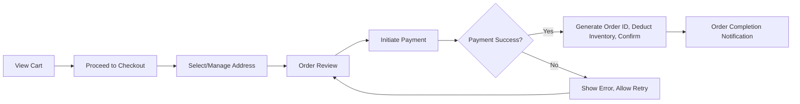
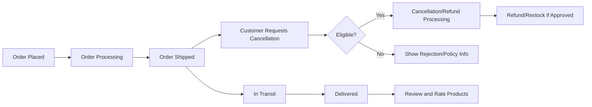
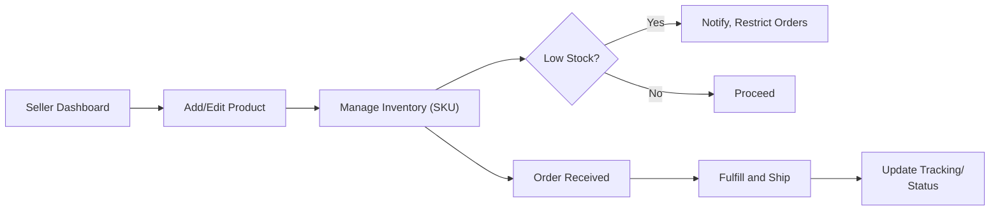
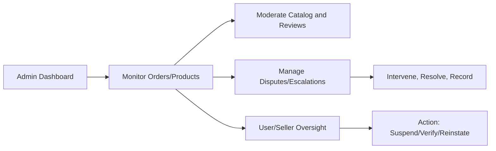

# User Flows and Journeys for E-Commerce Shopping Mall Platform

## Introduction

This document provides a complete, step-by-step analysis of core user flows and business processes that define the e-commerce shopping mall platform (shoppingMall). Designed especially for backend developers, it describes in precise, unambiguous business language how each actor—customers, sellers, and administrators—interacts with the platform through full shopping, transaction, review, and management lifecycles. Requirements leverage the EARS (Easy Approach to Requirements Syntax) format for clarity and testability and visually illustrate complex transitions via Mermaid diagrams using LR (left-to-right) orientation.

---

## 1. Customer Shopping Journey

### Overview
This flow describes how a customer (registered user) browses, searches, selects products and variants (SKUs), manages the cart and wishlist, and prepares for order placement.

### Flow Description
1. **Catalog Browsing and Search**
    - WHEN a customer is on the landing page, THE system SHALL show a featured product selection and main categories.
    - WHEN a customer types a query or applies filters, THE system SHALL display a paginated, sorted product list reflecting those criteria, with response times under 2 seconds for typical queries.
2. **Viewing Product Details**
    - WHEN a customer selects a product, THE system SHALL show product images, descriptions, price, available SKUs (color, size, options), inventory per SKU, seller information, and average ratings.
    - IF a product is unavailable, THEN THE system SHALL indicate the out-of-stock status and restrict purchase options.
3. **Selecting SKUs and Quantity**
    - WHEN a customer selects desired SKU options and a quantity, THE system SHALL validate the selected combination and confirm sufficient stock before enabling 'Add to Cart' and 'Add to Wishlist' actions.
    - IF an invalid SKU/quantity is chosen, THEN THE system SHALL display a specific error indicating the reason (e.g., stock not available, option not selectable).
4. **Cart and Wishlist Management**
    - THE customer SHALL be able to add or remove products (by SKU and quantity) from both cart and wishlist.
    - WHEN a product on the wishlist becomes out of stock, THE system SHALL mark it accordingly.
    - WHEN a customer navigates to their cart, THE system SHALL show an up-to-date summary of all items, subtotals, discounts, and total cost.
    - WHILE in the shopping journey, THE system SHALL persist the cart and wishlist across user sessions.

### Mermaid Diagram: Customer Shopping Journey
```mermaid
graph LR
    A["Landing Page"] --> B["Browse/Search Catalog"]
    B --> C["View Product List"]
    C --> D["Select Product"]
    D --> E["View Product Details(SKUs)"]
    E --> F{ "In Stock?" }
    F -->|"Yes"| G["Select SKU/Quantity"]
    F -->|"No"| H["Show Out-of-Stock Msg"]
    G --> I["Add to Cart/Wishlist"]
    I --> J["View Cart/Wishlist"]
    J --> K["Update, Remove, or Proceed to Checkout"]
```

---

## 2. Checkout and Payment Flow

### Overview
Covers the customer experience from starting checkout to completing an order and payment, handling address management and payment errors.

### Flow Description
1. **Address Selection/Management**
    - WHEN proceeding to checkout, THE system SHALL prompt the customer to select an existing address or add a new one.
    - THE customer SHALL be able to manage multiple addresses, set a default, edit, or delete as desired.
    - IF address fields are missing/invalid, THEN THE system SHALL block order submission and highlight errors.
2. **Order Review and Confirmation**
    - WHEN order information is complete, THE system SHALL show a detailed summary including all cart items by SKU, shipping info, costs, estimated delivery, discounts, and applied promotions.
    - THE system SHALL offer customers a clear method to confirm or cancel the order at this stage.
3. **Payment Processing**
    - WHEN a customer proceeds to payment, THE system SHALL securely initiate payment via integrated gateway(s) and require confirmation.
    - IF payment is successful, THEN THE system SHALL generate a unique order ID, deduct inventory, and issue confirmation.
    - IF payment fails (e.g., declined, timeout), THEN THE system SHALL display a clear error, allow retry, and reserve selected inventory for up to 5 minutes.
    - ALL payment attempts SHALL be audit-logged for compliance.
4. **Order Completion**
    - WHEN payment succeeds, THE system SHALL mark order as 'paid', trigger inventory deduction, and notify customer via dashboard and email/SMS.
    - THE system SHALL clear successful items from cart while leaving failed ones with actionable status notes.

### Mermaid Diagram: Checkout and Payment Flow


---

## 3. Order Tracking and Shipping Updates

### Overview
Tracks an order’s lifecycle, including post-placement events—processing, shipment, delivery, order history, and cancellation/refund handling.

### Flow Description
1. **Order Tracking**
    - WHEN a customer views order history, THE system SHALL display chronological orders with status (pending, processing, shipped, delivered, cancelled, refunded).
    - WHEN a customer clicks on an order, THE system SHALL show item details, order progress, tracking numbers (if available), estimated delivery, and shipment updates.
2. **Shipping and Status Updates**
    - WHEN shipment occurs, THE system SHALL update order status to 'shipped', display estimated arrival, and provide any carrier tracking link.
    - IF carrier sends status updates (e.g., "in transit"), THEN THE system SHALL relay real-time or near-real-time updates to customer dashboard and notifications.
3. **Order Cancellation/Refund**
    - WHERE an order is eligible by policy, THE system SHALL enable cancellation or refund requests for each item or the full order, specifying valid windows (e.g., until shipped).
    - WHEN a cancellation/refund is requested, THE system SHALL route to the proper workflow (seller review, auto-approval, or admin mediation as per rules).
    - THE customer SHALL get status notifications on all actions taken (approved, denied, processed, refunded).

### Mermaid Diagram: Order Tracking and Post-Purchase Workflow


---

## 4. Seller Product and Inventory Management

### Overview
Describes a seller's lifecycle—registering, listing and updating products, managing SKUs and inventory, and handling order fulfillment/responses.

### Flow Description
1. **Product Management**
    - WHEN a seller logs in, THE system SHALL present a dashboard with product status, inventory, and sales analytics.
    - THE seller SHALL be able to add new products with required information (category, images, descriptions, price, SKU options).
    - WHEN editing a product, THE system SHALL validate field-level business rules (e.g., valid price range, SKU uniqueness).
    - IF a product or SKU goes out of stock, THEN THE system SHALL auto-update status to prevent new orders for that SKU.
2. **Inventory Control**
    - THE seller SHALL update inventory in real-time; all changes SHALL persist immediately and trigger platform syncs.
    - WHEN stock falls below threshold, THE system SHALL notify the seller and optionally restrict further orders until replenished.
3. **Order Fulfillment and Management**
    - WHEN an order is placed, THE system SHALL notify the seller, assign order for fulfillment, and show necessary order details.
    - THE seller SHALL update shipment/tracking information and mark the order as fulfilled once shipped.
    - WHERE customer issues arise (cancellation/refund/review), THE seller SHALL be notified and can respond as per policy.

### Mermaid Diagram: Seller Product and Order Management


---

## 5. Admin Oversight Flows

### Overview
Defines end-to-end admin activities for platform-wide management: reviewing and moderating products, handling disputes, monitoring transactions, and enforcing platform rules.

### Flow Description
1. **Order and Product Management**
    - WHEN admin logs in, THE system SHALL display dashboards of active orders, outstanding issues, product activity, and key business metrics.
    - THE admin SHALL list, view, filter, and moderate all product catalog entries and user profiles.
    - THE admin SHALL manage and resolve escalations (cancellation, refund, dispute cases), with decisions logged for audit.
    - WHEN suspicious activities or data anomalies arise, THE system SHALL alert the admin and provide case-based tools for investigation.
2. **Seller and User Oversight**
    - THE admin SHALL verify, suspend, or reinstate sellers and buyers as per terms and compliance regulations.
    - WHEN required, THE system SHALL allow admin to issue refunds or corrections directly, overriding automated flows when justified.
    - ALL admin interventions SHALL be recorded with timestamps and audit trails for compliance.

### Mermaid Diagram: Admin Workflow


---

## Notes
- Every journey and flow above adheres to EARS requirements format wherever applicable.
- State transitions, error flows, and business rules are developed further in related documents: see [Business Rules and Validations](./06-business-rules-and-validations.md), [Performance and UX Requirements](./07-performance-and-ux-requirements.md), and [Error Handling and Exception Cases](./08-error-handling-and-exception-cases.md).
- All diagrams strictly follow Mermaid double-quote conventions for node labels.
- The flows described here must be implemented in a way that meets all business requirements, not technical specifications, as described elsewhere.