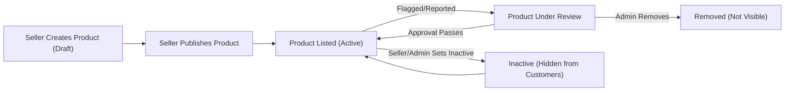
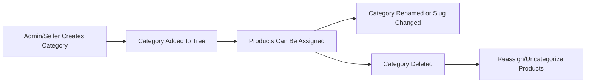
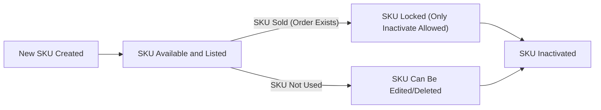

# Business Requirements for Product, Catalog, and Category Management

## Introduction
The product, category, and catalog management subsystem of the shopping mall platform is core to the user, seller, and admin experience. This document details all functional and business requirements for onboarding, updating, categorizing, managing variants/SKUs, and displaying products. All specifications below are written in the EARS format for clarity wherever applicable, removing ambiguity for backend developers.

## Product Onboarding
### 1. Product Creation Process
- WHEN a seller wants to list a new product, THE system SHALL provide an interface for mandatory information collection, including product name, description, primary image, category, main price, and at least one variant/SKU.
- THE system SHALL allow sellers to upload up to 10 images per product; each image SHALL be JPEG or PNG, max 5MB per image, with at least one required.
- WHEN a product is saved as draft, THE system SHALL not make it visible to shoppers until status changes to active.
- WHEN creating or editing a product, THE seller SHALL provide full shipping information (dimensions, weight, available shipping options).
- THE system SHALL validate required fields and return all errors during submission. IF required fields are missing or formats are invalid, THEN THE system SHALL reject submission and return user-friendly error codes explaining each specific issue.
- WHERE a product is meant for adult (18+) audiences, THE seller SHALL be required to designate this during onboarding.

### 2. Product Editing & State Changes
- WHEN a product is edited by its seller, THE system SHALL allow editing of all fields except for SKU code if any orders exist for that SKU.
- WHEN a product is set to "inactive" by seller or admin, THE system SHALL immediately remove it from all customer-facing listings, searches, and recommendations, but preserve its historical order records.
- WHEN an admin edits or removes a product, THE system SHALL log audit information (who performed, when, what change) and store for 3+ years.

### 3. Product Visibility & Approval
- WHEN a new product is created but not published, THE system SHALL keep it in draft status only visible to that seller.
- WHEN a published product is flagged for review (e.g., abuse or compliance report), THE system SHALL mark it as "under review" and hide it from general search and category listings until resolved.

### 4. Product Status Workflow (Diagram)

## Category Management
### 1. Category Structure
- THE system SHALL support a hierarchical category structure up to 5 levels deep (e.g., Clothing > Women > Dresses > Maxi).
- WHEN a category is created, edited, or deleted, THE system SHALL update all affected product assignments and maintain catalog integrity (no orphaned products; reassign or mark as uncategorized if needed).
- WHEN a seller assigns a product to a category, THE system SHALL restrict available categories to leaf nodes (lowest level) to avoid ambiguity.
- WHEN browsing, THE customer SHALL be able to navigate the full category tree and retrieve all products assigned to a selected node or any of its subcategories.

### 2. Category Naming & SEO
- WHEN a new category is created, THE system SHALL validate it is unique in name within its parent category.
- THE system SHALL ensure each category has a URL-friendly slug auto-generated from its name.

### 3. Category Lifecycle (Diagram)

## Variants / SKU Management
### 1. SKU Structure
- WHEN a product is onboarded, THE system SHALL require at least one SKU, each representing a unique combination of selectable attributes (e.g., color, size, material).
- THE system SHALL limit a single product to a maximum of 250 distinct SKUs for manageability.
- THE SKU identifier SHALL be globally unique (system-generated if not provided).
- WHEN defining variants, THE seller SHALL be allowed to specify up to 5 variant dimensions (such as size, color, style, etc.) per product, with each dimension supporting up to 50 values.
- WHEN an attribute value would create a duplicate SKU, THEN THE system SHALL reject submission with a specific error message.
- WHERE inventory is tracked, THE system SHALL enforce quantity per SKU and support zero or negative values for out-of-stock or backorder status as appropriate.

### 2. SKU Editing & Retirement
- WHEN updating an existing SKU, THE system SHALL allow updates to price, inventory, active/inactive status, barcodes, and images, but not the globally unique identifier if orders exist for that SKU.
- WHEN retiring (deleting) an SKU, THE system SHALL prevent removal if orders exist for that SKU (only inactivating is permitted in this case).

### 3. SKU Lifecycle (Diagram)

## Product Search, Filter, and Display Rules
### 1. Customer Search & Filter
- WHEN a customer searches using keywords, THE system SHALL perform full-text search on product name, description, and tags, returning results in order of relevance (primary) and then newest listings.
- THE system SHALL support product filters by category (and its children), price range, brand, variant attributes (e.g., color/size), rating, availability (in stock only), and seller.
- THE system SHALL support paging through search results with a default page size of 20, maximum of 100 per request.
- WHEN a customer applies multiple filters, THE system SHALL combine them using logical AND.
- THE system SHALL return the total count of matching products with every search result page.

### 2. Sorting and Relevance
- THE system SHALL allow customers to sort listings by newest, price (low-high, high-low), best rating, and best-selling.
- WHEN searching, THE system SHALL always prioritize sponsored products (ads) at the top of results, clearly labeled as sponsored.
- WHEN showing listings, THE system SHALL ensure only products with at least one active SKU and at least one image are displayed to customers.

### 3. Product Listing Display Rules
- THE system SHALL display for each product: name, primary image, minimum price (across available SKUs), rating score, number of reviews, availability (in/out of stock), and seller name.
- WHERE a product has multiple variants/SKUs, THE system SHALL display a summary (e.g., "10 colors, 5 sizes") in the listing.

## Error Handling & Edge Cases
- IF a category referenced during product onboarding is deleted, THEN THE system SHALL prompt reassignment or mark the product as "uncategorized" until resolved.
- IF a search yields no results, THEN THE system SHALL return a friendly message and suggest relevant categories or popular products.
- IF a seller attempts to assign a product to a non-leaf or invalid category, THEN THE system SHALL prevent assignment and display the error.

## Performance & Experience Requirements
- THE system SHALL respond to product creation/update/listing/search API requests within 2 seconds under normal load.
- THE system SHALL process bulk product/SKU imports (up to 1,000 items) within 3 minutes, with progress tracking APIs.
- THE system SHALL allow concurrent product, category, and SKU updates without causing orphaned relationships or data corruption.

## Actor Permissions Table
| Action                                    | Customer | Seller | Admin |
|-------------------------------------------|----------|--------|-------|
| View products & variants                  | ✅       | ✅     | ✅    |
| Search/filter products                    | ✅       | ✅     | ✅    |
| Create/edit/delete own products           | ❌       | ✅     | ✅    |
| Create/edit/delete categories             | ❌       | ❌     | ✅    |
| Assign products to categories             | ❌       | ✅     | ✅    |
| Manage SKUs (own products)                | ❌       | ✅     | ✅    |
| Manage all SKUs/products                  | ❌       | ❌     | ✅    |
| Change product status (inactive/etc)      | ❌       | ✅     | ✅    |
| Bulk import/export                        | ❌       | ✅     | ✅    |
| View unpublished/draft products           | ❌       | ✅ (own) | ✅    |
| Approve/reject product flags/abuse        | ❌       | ❌     | ✅    |

## Glossary (Business Terms)
- **Product**: Sellable item with descriptive, pricing, and media data, possibly with multiple variants.
- **Category**: Hierarchical organizational label assigned to products for browsing and filtering.
- **SKU (Stock Keeping Unit)**: Unique combination of selectable variant dimensions for a product, with its own pricing, inventory, and attributes.
- **Draft Product**: Product saved by seller, not visible to customers until published.
- **Leaf Category**: Category with no children, where products must be assigned.
- **Sponsored Product**: Product prioritized in rankings due to advertising spend.
- **Attribute Dimension**: A selectable characteristic of a product (e.g., color, size).

---

*This document provides business requirements only. All technical implementation decisions (database schemas, APIs, infrastructure, etc.) are left to developers’ discretion. This document describes WHAT the business needs, not HOW to build it.*