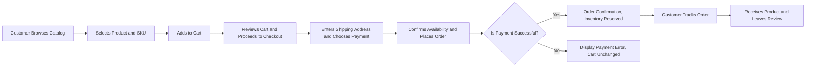
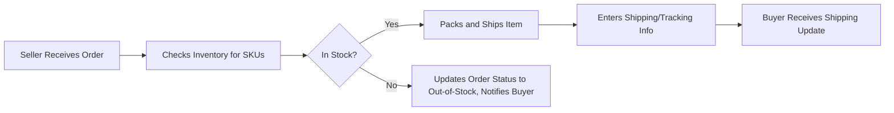
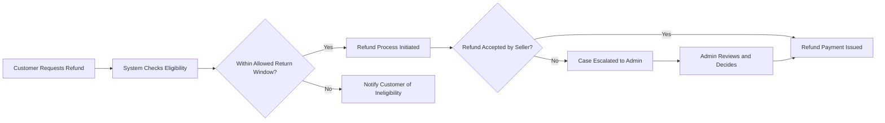

# User Scenarios for E-commerce Shopping Mall Platform

## Introduction
This document enumerates and describes primary, edge, and recovery business scenarios for the shoppingMall platform, supporting robust backend requirements and test planning. It covers all key actors: customers, sellers, and admins, ensuring exhaustive context for business logic, error handling, and compliance with user expectations. All requirements are presented in the EARS (Easy Approach to Requirements Syntax) format where applicable.

## Primary Success Scenarios

### Buyer (Customer) Scenarios

#### Browsing and Discovering Products
- WHEN a customer browses the product catalog, THE shoppingMall SHALL display products grouped by category with search and filtering enabled.
- WHEN a customer selects a product, THE shoppingMall SHALL show product details, available SKUs (sizes, colors, options), seller information, and current inventory status.

#### Registration, Authentication, and Profile Management
- WHEN a user registers as a customer, THE shoppingMall SHALL collect and validate email, password, and at least one address for shipping.
- WHEN a customer logs in, THE shoppingMall SHALL authenticate credentials, create a session, and allow address management (add/update/delete).

#### Shopping Cart & Wishlist Management
- WHEN a customer views a product, THE shoppingMall SHALL allow adding the desired SKU to the shopping cart or wishlist.
- WHEN a customer reviews their cart, THE shoppingMall SHALL calculate totals, display selected options at the SKU level, and allow quantity edits or item removal.
- WHEN a customer moves a wishlist item to cart, THE shoppingMall SHALL add the item to cart and update availability.

#### Placing Orders and Payment
- WHEN a customer proceeds to checkout, THE shoppingMall SHALL collect delivery address/option, accept payment via integrated gateways, validate stock for all selected SKUs, and confirm the order.
- WHEN payment is successful, THE shoppingMall SHALL create the order, reserve inventory, and generate order confirmation with tracking number.

#### Order Tracking and Shipping
- WHEN an order is placed, THE shoppingMall SHALL allow the customer to track shipping status, display estimated delivery date, and send updates as the order status changes.

#### Review and Ratings
- WHEN an order is completed, THE shoppingMall SHALL enable the customer to submit one review and rating per purchased product.

### Seller Scenarios

#### Seller Registration & Catalog Management
- WHEN a new user registers as a seller, THE shoppingMall SHALL validate identity, business registration (if applicable), and allow them to create a seller profile.
- WHEN logged in, THE seller SHALL manage their own product catalog, including adding, updating, or removing products and SKUs with specific inventory per variant.
- WHEN updating product details or inventory levels, THE shoppingMall SHALL confirm changes for only the seller’s own records, not affecting others.

#### Order Fulfillment and Shipping
- WHEN an order is placed for their products, THE seller SHALL view order details, manage inventory per SKU, and update shipping status.
- WHEN an item is shipped, THE seller SHALL update tracking info, triggering notifications to the buyer.

#### Review and Feedback
- WHEN a review is submitted about a seller’s product, THE seller SHALL be able to view and respond to it without altering its original content.

### Admin Scenarios

#### Platform Oversight
- WHEN an admin logs in, THE shoppingMall SHALL grant access to manage all products, categories, user accounts, orders, and refunds across the platform.
- WHEN a dispute or escalation is raised (e.g., from a refund request or report), THE admin SHALL review all details, communicate with concerned parties, and resolve or escalate as needed.
- WHEN needed, THE admin SHALL initiate refunds, cancellations, or modifications to any order on the system.

## Edge Cases and Exceptions

### Product and Inventory Issues
- IF a customer tries to purchase more SKUs than are in stock, THEN THE shoppingMall SHALL display an out-of-stock error and prevent order placement for the unavailable quantity.
- IF a product is discontinued while in a customer’s wishlist or cart, THEN THE shoppingMall SHALL mark it as unavailable with an explanation.

### Order Placement and Payment Exceptions
- IF payment processing fails, THEN THE shoppingMall SHALL inform the customer, keep the cart unchanged, and provide actionable steps to retry or select another payment method.
- IF an order is placed but inventory becomes insufficient due to simultaneous purchases, THEN THE shoppingMall SHALL process orders on a first-come, first-served basis and notify affected buyers of order cancellation or split shipment.

### Address and Delivery Issues
- IF a customer provides an invalid or incomplete address at checkout, THEN THE shoppingMall SHALL validate the input and prevent order placement until the address is corrected.
- IF a delivery is delayed beyond the promised window, THEN THE shoppingMall SHALL notify both the customer and the seller, and prompt the admin for review if the delay exceeds a pre-defined threshold.

### Review and Rating Irregularities
- IF a customer tries to submit multiple reviews for a single order or product, THEN THE shoppingMall SHALL prevent duplicate submissions and present a clear error message.
- IF a review contains inappropriate or prohibited content (as defined by community guidelines), THEN THE shoppingMall SHALL flag the review for admin moderation before publication.

## Negative and Recovery Scenarios

### Cancellation and Refunds
- WHEN a customer requests an order cancellation before shipping, THE shoppingMall SHALL allow cancellation and instantly reverse payment if processing has not started.
- WHEN a customer requests a refund for an eligible order, THE shoppingMall SHALL collect the reason, verify return eligibility based on time and product status, and process the refund with admin or seller approval as required.
- IF a seller rejects a refund without valid grounds, THEN THE shoppingMall SHALL escalate the case to admin for intervention.
- IF a customer repeatedly abuses refund requests, THEN THE shoppingMall SHALL flag the account for admin review and potential action.

### System Recovery Flows
- IF a backend service failure interrupts payment or order confirmation, THEN THE shoppingMall SHALL retry the operation within a defined timeout window, then transparently inform the user of the final result and steps to retry.
- IF critical system services are degraded (e.g., inventory service unavailable), THEN THE shoppingMall SHALL not allow payments or order placement during this period and present an explicit service status notification.

### Escalations and Dispute Handling
- WHEN a buyer or seller opens a dispute (e.g., product not as described, damaged goods), THE shoppingMall SHALL record all messages, evidence, and actions, notify relevant parties, and assign an admin as arbitrator within a pre-defined SLA.
- WHEN disputes are resolved, THE shoppingMall SHALL update order states, refund status, user accounts, and notify all parties of the decision and any consequences.

## Mermaid Diagrams of Core User Flows

### Example: Customer Purchase and Order Flow

### Example: Seller Fulfillment and Update Flow

### Example: Refund and Dispute Scenario

## Conclusion
This user scenario documentation provides a complete basis for backend implementation and QA in the shoppingMall e-commerce platform. All role-specific, edge, and recovery cases are exhaustively covered. Requirements follow EARS format for clarity and testability, with Mermaid diagrams to clarify complex business logic and actor flows.