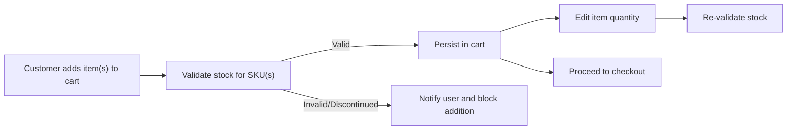
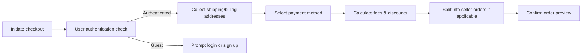
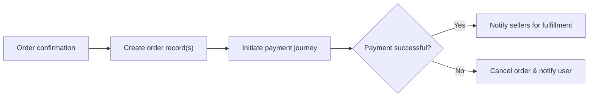
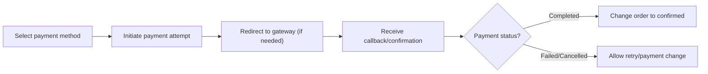
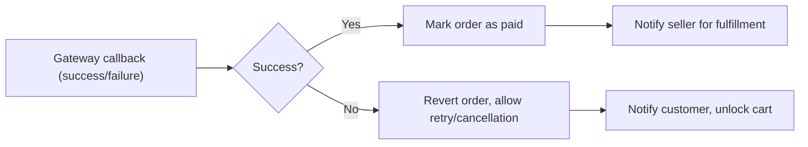

# Order Placement, Payment Management, and Checkout Process Requirements

## 1. Cart Handling

### 1.1 Overview
The shopping cart represents a temporary collection of products, variants, and their quantities selected by the customer prior to order placement. It is crucial for the cart lifecycle to be well-defined, seamless, and resistant to common errors (such as out-of-stock or discontinued items).

#### 1.2 EARS-Formatted Cart Requirements
- WHEN a customer adds a product to cart, THE system SHALL validate inventory availability for the requested SKU.
- WHEN a customer is not authenticated, THE system SHALL create a guest cart tied to session/cookie (as per security guidelines).
- WHEN a guest user logs in, THE system SHALL migrate valid cart items to the authenticated user's cart.
- WHEN a customer modifies item quantities, THE system SHALL re-validate inventory, product status, and SKU validity.
- IF a cart contains a discontinued or out-of-stock SKU, THEN THE system SHALL alert the customer and remove or mark the item as unavailable.
- THE system SHALL restrict the cart to a practical quantity per SKU (e.g., maximum 10 units per SKU per purchase).
- THE system SHALL persist user carts for a minimum of 30 days after last modification.
- THE system SHALL treat wishlist and cart as separate business entities, with no automatic cross-over.
- WHILE a product is in cart, THE system SHALL not reserve stock until checkout is initiated.

#### 1.3 Edge Cases & Error Handling
- IF inventory changes after product is added to cart but before checkout, THEN THE system SHALL re-validate at checkout initiation and notify user of changes.
- IF a customer’s cart is empty at checkout, THEN THE system SHALL block checkout initiation and prompt to add items.
- WHEN concurrent users attempt to purchase the same low-stock SKU, THE system SHALL allocate on a first-to-complete-payment basis.

### 1.4 Example Cart Flow (Mermaid)

## 2. Checkout Process

### 2.1 Overview
The checkout process is the business flow that transitions a validated cart into a formal order object after collecting all required information (shipping, billing, payment preference).

#### 2.2 EARS-Formatted Checkout Requirements
- WHEN a customer initiates checkout, THE system SHALL require authentication prior to progressing beyond address entry.
- WHEN proceeding to checkout, THE system SHALL request or retrieve shipping address, billing details, and preferred payment method.
- WHEN a seller has restricted shipping regions, THE system SHALL only allow customers to checkout if their address matches allowed regions.
- THE system SHALL calculate all applicable discounts, taxes, and shipping fees before order confirmation.
- IF any item in the cart becomes unavailable before checkout completion, THEN THE system SHALL block progression and present an actionable error.
- WHEN customer wishes to edit personal, shipping, or payment information during checkout, THE system SHALL permit this up to payment step.
- WHERE multiple sellers' products exist in one cart/order, THE system SHALL split orders per seller and clearly present this to the customer.

#### 2.3 Data Validation
- THE system SHALL validate address formats (postal codes etc.) according to the destination country’s specifications.
- THE system SHALL verify the integrity of all price and SKU data during the checkout process to prevent manipulation.

### 2.4 Example Checkout Flow (Mermaid)

## 3. Order Placement

### 3.1 Overview
Order placement represents the commitment from the customer to buy, possibly split by seller. This creates an order record and initiates the payment process.

#### 3.2 EARS-Formatted Order Requirements
- WHEN a customer confirms the order, THE system SHALL atomically create a pending order record(s) with all related items, customer data, addresses, and price breakdown.
- WHEN creating an order, THE system SHALL assign a unique order reference code and timestamp.
- WHILE an order is in payment pending status, THE system SHALL hold items but not deduct stock until payment is authorized.
- IF order placement fails at any business validation step (e.g., fraud, address), THEN THE system SHALL abort the transaction and inform the customer of the reason.
- WHEN order is successfully placed, THE system SHALL notify the respective seller(s) for fulfillment.

### 3.3 Order Lifecycle States
| State                 | Description                                           |
|----------------------|-------------------------------------------------------|
| Pending Payment      | Awaiting completion of customer payment               |
| Payment Confirmed    | Payment received, ready for seller processing         |
| Processing           | Seller handling order, preparing shipment             |
| Fulfilled            | Order shipped and tracking initiated                  |
| Cancelled            | Order was cancelled by customer or system             |
| Refunded/Returned    | Order was refunded or returned, process completed     |

### 3.4 Example Order Placement Flow (Mermaid)

## 4. Payment Options

### 4.1 Supported Payment Methods
- Card payments (credit/debit)
- Bank transfer (where regionally available)
- Third-party (e.g., PayPal, Stripe, local providers)
- Store/loyalty credits (if implemented in business)

#### 4.2 EARS-Formatted Payment Requirements
- WHEN a customer selects a payment method, THE system SHALL display relevant legal notices and data privacy warnings.
- WHEN integrating with a third-party payment gateway, THE system SHALL securely pass order summary and await confirmation callback.
- THE system SHALL generate a payment attempt record for each checkout session.
- THE system SHALL limit the maximum number of consecutive failed payment attempts (e.g., 5 per hour) to prevent abuse.
- WHEN a payment fails, THE system SHALL allow the user to select another payment method or retry, up to set limits.
- WHERE payment requires redirection (e.g., external site), THE system SHALL clearly display instructions and restore preceding context after callback.
- IF system detects fraud signals or blacklisted payment accounts, THEN THE system SHALL reject payment and present a clear error.

#### 4.3 Payment Statuses
| Status        | Description                            |
|--------------|----------------------------------------|
| Pending      | Payment process ongoing                |
| Completed    | Payment confirmed                      |
| Failed       | Payment failed, retry allowed          |
| Cancelled    | User/system cancelled payment attempt  |

### 4.4 Example Payment Flow (Mermaid)

## 5. Payment Confirmation

### 5.1 Overview
After order placement and attempted payment, final business logic determines the order’s transition to paid and ready-for-processing status.

#### 5.2 EARS-Formatted Payment Confirmation Requirements
- WHEN payment gateway confirms a successful payment, THE system SHALL atomically mark the related order(s) as paid and trigger fulfillment notifications to sellers.
- WHEN payment gateway signals payment failure, THE system SHALL cancel or allow retries according to business policy.
- WHILE payment is pending, THE system SHALL not hand off the order to fulfillment or allow inventory deduction.
- IF payment confirmation is not received within a defined timeout window (e.g., 15 mins), THEN THE system SHALL expire the payment attempt and reset order to pre-payment state.
- THE system SHALL log all payment attempts and results with timestamp, reference, and linkage to the associated order.

### 5.3 Example Payment Confirmation Flow (Mermaid)

## 6. Business Logic Rules (Cross-cutting)

- THE system SHALL require all critical actions (cart edit, checkout, payment, cancellation) to be auditable with timestamps and actor references.
- WHERE regulatory jurisdictions require, THE system SHALL retain payment and order logs for a mandated minimum period (e.g., 5+ years).
- THE system SHALL assign immutable order IDs and payment references upon creation.

## 7. Actor-Specific Behaviors and Permissions

| Action                                   | Customer | Seller | Admin |
|------------------------------------------|----------|--------|-------|
| Create cart/order                        | ✅       | ❌     | ✅    |
| Initiate payment                         | ✅       | ❌     | ✅    |
| Cancel/modify order before payment       | ✅       | ❌     | ✅    |
| Retry/alternate payment method           | ✅       | ❌     | ✅    |
| Fulfillment/shipping updates             | ❌       | ✅     | ✅    |
| Refund/cancel after payment              | ✅       | ✅     | ✅    |

- Sellers may view but not edit payment details of orders for their products.
- Admins may access all order/payment data and override payment/fulfillment status in special cases (dispute, fraud, technical errors).

## 8. Error Handling Scenarios

### 8.1 Examples (EARS Format)
- IF a payment gateway returns an error or times out, THEN THE system SHALL display a non-technical message and allow the user to retry or choose a new payment option.
- IF system detects mismatched payment amounts, THEN THE system SHALL abort order fulfillment and alert both the customer and admin.
- IF a user repeatedly fails payment authentication (e.g., 3DS fail), THEN THE system SHALL block further attempts for a cooling-off period.
- IF the user’s inventory is depleted during checkout, THEN THE system SHALL block progression and suggest similar products if possible.

## 9. Performance and Experience Requirements
- THE system SHALL complete checkout and order placement flows within 3 seconds for 95% of requests under typical load.
- THE system SHALL process payment confirmations and order state transitions within 5 seconds of gateway callbacks, barring external delays.
- THE system SHALL always show real-time (or near real-time) cart and order status to the customer.

## 10. Related Process Flows
For additional requirements see:
- [Cart and Wishlist Requirements](./09-cart-wishlist.md)
- [Order Tracking & Shipping Requirements](./10-order-tracking.md)
- [Non-functional & Compliance Requirements](./14-nonfunctional-glossary.md)
