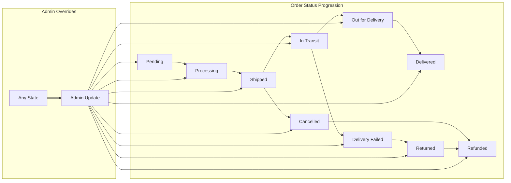

# Order Tracking & Shipping Requirement Analysis

## 1. Introduction
This document specifies the business requirements, workflows, and rules for order tracking and shipping status management in the shoppingMall e-commerce platform. It details the status transitions throughout the post-purchase process, permissions of each participant (customer, seller, admin), update mechanisms, and notification logic. All requirements are provided in precise, implementation-ready EARS format where applicable.

## 2. Business Context and Objectives
Transparent order tracking and prompt shipping status updates are essential for user trust, operational efficiency, and customer support. The aim is:
- To ensure buyers can monitor the fulfillment and delivery process of each order
- To enable sellers to keep customers informed and manage fulfillment
- To empower admins to resolve disputes or handle exceptions

## 3. User Roles and Order Tracking Permissions
Referencing the platform's roles:
| Role    | View Order Status | Update Shipping Status | Receive Notifications | Manage Tracking Issues |
|---------|------------------|-----------------------|----------------------|-----------------------|
| Customer | ✅                | ❌                    | ✅                    | ❌                    |
| Seller   | ✅ (own orders)   | ✅ (own products)      | ✅                    | Limited (own orders)  |
| Admin    | ✅ (all)          | ✅ (all)               | ✅                    | ✅                    |

- WHEN a customer places an order, THE system SHALL assign the customer as the primary viewer of the order’s tracking and shipping status.
- WHEN a seller receives an order for their products, THE system SHALL allow the seller to update shipping and tracking status only for their fulfilled products.
- WHERE a user is an admin, THE system SHALL allow updating and overriding any shipping/tracking status.

## 4. Tracking Logic and Status Flow
Orders progress through several defined shipping/tracking states. Statuses must be updated in sequence, except where admin overrides or exception flows apply. States:
- Pending
- Processing (Preparing Shipment)
- Shipped
- In Transit
- Out for Delivery
- Delivered
- Cancelled
- Returned
- Refunded
- Delivery Failed

**State Transition EARS Requirements:**
- WHEN a customer completes checkout and payment, THE system SHALL set the initial order status to "Pending".
- WHEN a seller acknowledges and begins preparing an order, THE system SHALL set status to "Processing".
- WHEN a seller marks goods as shipped and provides tracking information, THE system SHALL transition status to "Shipped" and associate carrier/tracking.
- WHEN the carrier updates status to "In Transit" (via integration or seller input), THE system SHALL reflect that status instantly.
- WHEN goods reach the delivery destination and are out for local delivery, THE system SHALL update status to "Out for Delivery".
- WHEN delivery is confirmed (by carrier event or seller/admin confirmation), THE system SHALL set status to "Delivered".
- IF shipment is lost, undeliverable, or carrier returns item, THEN THE system SHALL allow transition to "Delivery Failed", "Returned" as appropriate, based on carrier/seller input or admin override.
- WHEN an order is cancelled prior to shipment, THE system SHALL set status to "Cancelled" and block further fulfillment.
- WHEN an order is refunded (by admin action or automated logic), THE system SHALL set status to "Refunded".

## 5. Shipping Statuses and Definitions
| Status          | Definition                                                                           |
|-----------------|--------------------------------------------------------------------------------------|
| Pending         | Order placed but not yet processed by seller                                         |
| Processing      | Seller acknowledges order, preparing for shipment                                     |
| Shipped         | Package handed off to carrier, tracking available                                    |
| In Transit      | Package is with carrier, moving towards destination                                  |
| Out for Delivery| Package is with local courier/out for last-mile delivery                             |
| Delivered       | Customer received package (carrier or seller confirms)                               |
| Cancelled       | Order canceled before shipment                                                       |
| Returned        | Product returned to seller or warehouse                                              |
| Refunded        | Payment refunded to customer following return/cancellation                           |
| Delivery Failed | Carrier/seller reports failed delivery (address issue, lost, etc.)                   |

## 6. Update Mechanisms
- Sellers can update status for their orders/products through their seller dashboard.
- Admins can update/override any order or shipping status across the platform.
- System can automatically update statuses when carrier integration or webhook updates occur.
- WHEN a status update occurs, THE system SHALL log the action with a timestamp, actor (user/system), and status before/after.
- IF multiple sellers are involved in a single order, THEN THE system SHALL maintain per-product or per-shipment tracking data, and display both individual and aggregate status views to customers.
- WHERE tracking is supported by integrated carrier APIs, THE system SHALL fetch the latest status at least every 30 minutes or in real-time if webhook is available.
- IF a status update fails due to technical or business reasons, THEN THE system SHALL display an error message and prompt retry or escalation to admin.

## 7. Notification and Communication Requirements
- WHEN an order transitions between statuses, THE system SHALL send notifications to affected customers and sellers.
- WHEN a seller updates shipping/tracking information, THE system SHALL notify the customer including carrier, tracking number, and estimated delivery date.
- WHEN a delivery is marked as failed, returned, or refunded, THE system SHALL notify both customer and seller, including next steps and available customer service contacts.
- WHERE customers opt for SMS/email/app push, THE system SHALL use configured method(s) for alerts.
- Notification content SHALL always include order identifier, product details, new status, timestamp, and actionable instructions (e.g., “Track Your Package”, “Contact Support”).

## 8. Error Handling and Exceptional Scenarios
- IF tracking information is not available or is out of sync, THEN THE system SHALL display "Tracking unavailable" and offer contact details for customer service.
- IF a status update is performed out of expected sequence (e.g., "Delivered" before "Shipped"), THEN THE system SHALL block the action except where admin override applies.
- WHEN carrier reports a delay or delivery failure, THE system SHALL escalate notification to admin for review and customer service intervention.
- WHEN multiple packages are under a single order (multi-seller, split-shipment), THE system SHALL show a summary plus individual shipment statuses.
- IF a customer or seller disputes a shipping outcome, THEN THE system SHALL enable escalation to admin, who can audit status change history and resolve.

## 9. Performance & UX Expectations
- WHEN a status update occurs (seller action, carrier event, admin update), THE system SHALL reflect the updated status to users within 2 seconds.
- WHEN fetching current tracking status, THE system SHALL fetch data from carrier or internal update no older than 30 minutes (unless real-time integration exists).
- In all cases, notification delivery (SMS, Email, App Push) SHALL occur instantly after status changes (within 10 seconds target window).

## 10. Mermaid Diagram: Order Tracking & Shipping Status Flow

## 11. Success Criteria
- Customers always have a clear, up-to-date status of all orders and individual shipments
- Sellers can accurately update status and provide tracking details where required
- Admins have audit and override capabilities in exceptional cases
- Notifications, error handling, and performance targets align with business goals for user trust
