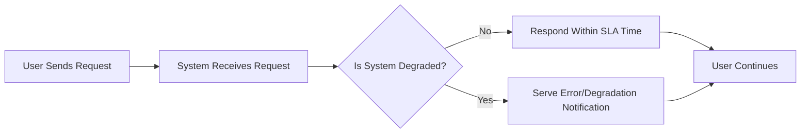
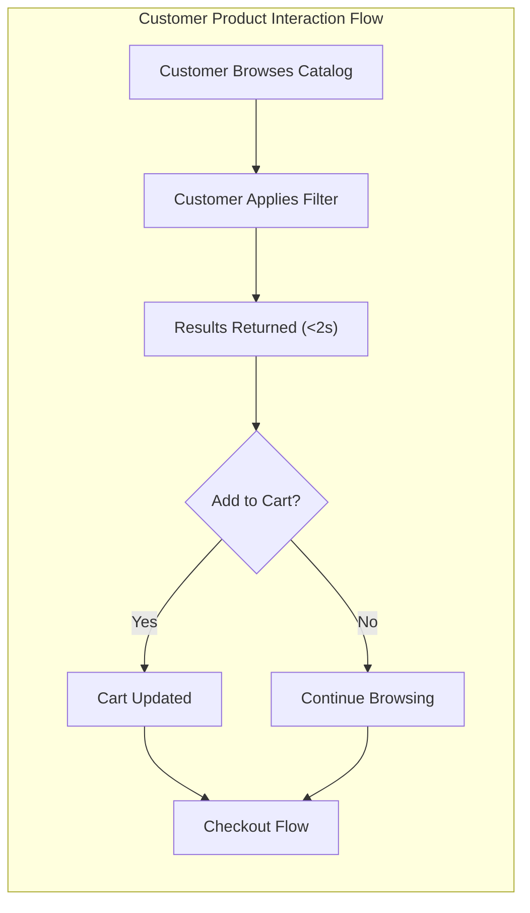
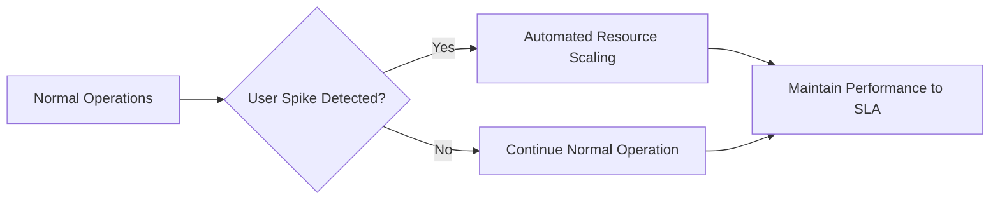

# Performance and User Experience Requirements for the shoppingMall E-Commerce Platform

## 1. Performance Requirements

### 1.1 Response Time
- WHEN any authenticated or guest user requests a product list or searches, THE system SHALL return results within 2 seconds for 95% of requests under typical network circumstances.
- WHEN a user (customer, seller, or admin) submits login credentials, THE system SHALL validate and return a result within 1.5 seconds, except in exceptional system degradation scenarios.
- WHEN a user places an order or performs checkout, THE system SHALL process and confirm the transaction within 3 seconds.
- WHEN a user interacts with the shopping cart (add, remove, update item), THE system SHALL apply the change and return the cart status within 1.5 seconds.
- WHEN a user submits a cancellation or refund request, THE system SHALL acknowledge the receipt instantly and provide a processing status within 3 seconds.

### 1.2 Throughput & Volume
- THE platform SHALL support a minimum of 500 concurrent active users with sustained read/write operations, scaling linearly to 2,000 with minimal reduction in perceived performance (within 10%).
- WHERE peak sales events are scheduled (e.g., holiday promotions), THE system SHALL support up to 20x normal request rates for a period of at least 4 consecutive hours.
- THE order processing pipeline SHALL handle a minimum of 100 new orders per minute during normal operations, scaling to 1,000 per minute during peak campaigns.

### 1.3 Data Consistency & Integrity
- WHEN users update sensitive information (addresses, payment methods), THE changes SHALL be confirmed and available to all relevant views immediately (within 1 second of write confirmation).
- IF a transaction fails at any stage, THEN THE system SHALL display an actionable error and preserve user state without data corruption.
- WHERE high-value operations occur (placing orders, processing refunds), THE system SHALL guarantee atomicity and consistency in all backend operations.

### 1.4 Performance Diagram

## 2. User Experience Standards

### 2.1 General UX Principles
- THE system SHALL provide consistent feedback for every user action – confirmations, error reasons, and completion status.
- WHEN a background process (e.g., refund review) affects user-initiated operations, THE system SHALL communicate status updates at each significant step.
- THE system SHALL localize all feedback and error messages in the user-selected language (default: English for locale en-US).

### 2.2 User Journey Smoothness
- WHEN browsing product catalogs, THE system SHALL enable filtering, sorting, and paging with near-instant (<2 seconds) response.
- WHEN a user attempts an operation not permitted for their role (e.g., customer editing inventory), THEN THE system SHALL display a clear role-based restriction message.
- THE system SHALL retain changes to cart and wishlist between authenticated sessions for each customer.
- IF an operation is delayed beyond published performance standards, THEN THE system SHALL provide a progress indicator and allow for safe retry or cancellation.

### 2.3 Error Communication and Handling
- IF a user action fails (e.g., out-of-stock, payment declined), THEN THE system SHALL present a clear, actionable message and recovery steps.
- WHEN system errors or maintenance intervals will impact user experience, THE system SHALL notify users at least 30 minutes in advance (when possible) and provide status banners during the incident.
- THE system SHALL ensure all error messages are in user-friendly natural language, never exposing technical codes or internal references.

### 2.4 Accessibility & Inclusivity
- THE system SHALL adhere to WCAG 2.1 AA standards, ensuring support for screen readers, keyboard-only navigation, and high-contrast modes.
- WHERE visual indicators or colors are used, THE system SHALL offer alternative text or patterns for the visually impaired.

### 2.5 User Experience Flow Example

## 3. System Scalability and Availability

### 3.1 Scalability
- WHERE business expansion or seasonal campaigns occur, THE platform SHALL horizontally scale core backend services to handle 10x normal user load without observable degradation in end-user experience (response time <15% slower than baseline).
- THE system SHALL support seamless onboarding of new sellers, new product categories, and new customers without downtime or migration windows.

### 3.2 Availability & Redundancy
- THE platform SHALL deliver minimum 99.5% uptime measured monthly, with a long-term goal of 99.9% (excluding pre-scheduled maintenance, defined <2h/month).
- WHERE single points of failure exist, THE system SHALL implement failover or hot-standby for order processing, payment, and authentication subsystems.
- WHEN emerging failures are detected (backend, database, payment integration), THE system SHALL automatically degrade non-essential features to preserve order and payment processing functionality.

### 3.3 Disaster Recovery & Data Safety
- WHEN a component or service fails, THE system SHALL recover full operations within 15 minutes using backup and replication.
- THE system SHALL persist and archive transaction, inventory, and review data in real time, with daily integrity and recovery checks conducted automatically.

### 3.4 Scalability Diagram

## 4. Service Level Expectations

### 4.1 Service Target Metrics Table
| Metric                            | Minimum Target          | Ideal Target     | Notes                               |
|-----------------------------------|------------------------|------------------|--------------------------------------|
| API response (product search)     | < 2 seconds (p95)      | < 1.2 seconds   | Under 95% load                      |
| API response (checkout)           | < 3 seconds (p99)      | < 2 seconds     | Full transaction/path                |
| System Uptime                     | 99.5% monthly          | 99.9%           | Excludes scheduled maintenance       |
| Error message clarity (user-rated)| 80% positive feedback  | 95%+            | Post-incident user survey            |
| Cart/wishlist persistence         | 30 days                | 180 days        | No data loss through session expiry  |

### 4.2 Incident Response
- WHEN a critical outage occurs, THE system SHALL notify all affected users within 10 minutes and update status at least every 30 minutes until resolved.
- WHEN incidents result in missed SLAs, THE system SHALL record, track, and present post-mortems to the admin team within 48 hours.

### 4.3 Continuous Improvement
- THE system SHALL regularly collect and analyze UX and performance metrics to identify improvement opportunities. Quarterly reviews SHALL be conducted and changes prioritized in product roadmap sessions.

---

This document outlines end-user-facing performance expectations, user experience criteria, and operational standards. All backend technical teams must ensure backend implementations meet or exceed these business requirements as perceived by all user roles.