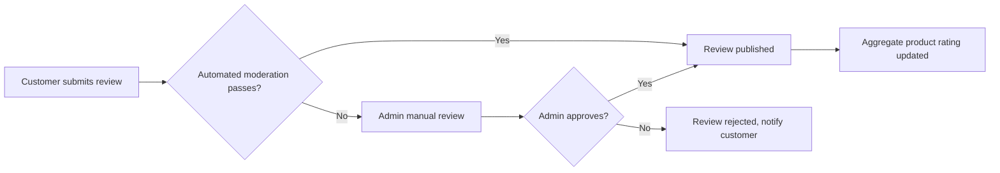

# Reviews and Ratings Requirement Analysis

## Introduction
Reviews and ratings are a cornerstone feature for the shoppingMall platform, providing credibility, feedback, and actionable insights to customers, sellers, and system administrators. This document defines the complete business requirements for product reviews and ratings, capturing all scenarios, flows, business rules, validation logic, and error handling required for a robust, fair, and high-trust experience. The requirements herein are written in EARS format wherever suitable and focus strictly on business logic without reference to technical implementation or database details.

## 1. Review Creation
### 1.1 Eligibility and Access
- WHEN a customer completes a purchase of a product, THE system SHALL allow the customer to submit a review for that specific product.
- IF a customer attempts to post a review for a product not purchased, THEN THE system SHALL reject the action and notify the user.
- WHERE a purchase is made by a customer, THE system SHALL allow exactly one review per product per purchase by that customer.
- IF a customer has multiple purchases of the same product, THEN THE system SHALL allow one review per purchase instance.
- WHERE a customer has posted a review, THE system SHALL allow the customer to edit or delete their own review, subject to moderation restrictions.

### 1.2 Review Content Structure
- THE review SHALL comprise of a star rating (1-5), a written comment (minimum 10, maximum 2,000 characters), and optional photo upload (up to 5 images, each max 4MB).
- IF content guidelines are violated (e.g. use of profanity, spam, prohibited words), THEN THE system SHALL reject the review submission and show an appropriate error message.
- THE system SHALL support content in Korean and English (UTF-8), with automatic language detection for moderation logic.

### 1.3 Review Submission Flow
- WHEN a review is submitted, THE system SHALL save the review in pending status for moderation (if moderation is required) or publish immediately (if auto-approval by policy applies).
- THE system SHALL timestamp each review creation and update event.
- IF there is a moderation backlog, THEN THE system SHALL queue reviews for review by admin in received order.

## 2. Rating Logic
### 2.1 Rating Mechanism
- THE system SHALL use a 1-5 star (integer only) rating scale for all products.
- WHEN a valid review is published, THE system SHALL include the new star rating in the product’s aggregated rating.
- WHEN a review is edited or deleted, THE system SHALL update the product’s average rating and total review count immediately.
- THE product rating displayed SHALL always reflect the latest calculated average from visible (non-hidden) reviews only.
- IF a product has no reviews, THEN THE system SHALL display “No ratings yet” instead of a numeric value.

### 2.2 Aggregation and Display
- THE system SHALL aggregate ratings and total review counts per product in real-time, updated within 2 seconds of review creation, update, or deletion.
- WHERE reviews are deleted (hard or soft), THE system SHALL recalculate the aggregate rating to exclude the removed entries.
- THE system SHALL allow sorting of product listings by average rating, total number of reviews, and most recent review date.

## 3. Moderation Processes
### 3.1 Moderation Workflow
- WHEN a review is submitted, THE system SHALL apply automatic moderation filters (e.g., blacklist, pattern matching for abuse).
- IF automated moderation flags a review, THEN THE system SHALL hold the review for manual admin review and notify the admin.
- WHERE manual moderation is required, THE admin SHALL have abilities to approve, edit (with audit logging), or reject any review.
- WHEN an admin rejects a review, THE system SHALL notify the customer with the reason for rejection.
- WHERE a review is flagged by another user (seller or customer), THE system SHALL log the flag and trigger moderation workflow for review.
- IF a review is successfully moderated (approved), THEN THE system SHALL change its status to published and include it in product display and aggregation.

### 3.2 Seller Interactions with Reviews
- WHERE a review concerns their products, THE seller SHALL be allowed to submit a public reply visible alongside the review.
- Sellers SHALL NOT edit or delete customer reviews, but may flag reviews for moderation.

### 3.3 Admin Oversight
- THE admin SHALL have authority to remove, hide, restore, or annotate any review on the platform.
- A complete audit trail of all moderation actions SHALL be maintained.
- IF a review is removed for guideline violations, THEN THE system SHALL notify the original customer with explanation.

#### Mermaid: Review Submission and Moderation Flow

## 4. Incentives & Restrictions
### 4.1 Incentives
- WHERE a customer submits a review meeting all guidelines, THE system SHALL award reward points (if loyalty program is in effect) or other non-monetary incentives.
- THE system SHALL display badges or tags for customers with frequent, high-quality, or featured reviews.

### 4.2 Restrictions and Abuse Prevention
- IF a customer attempts to submit more than one review per purchase, THEN THE system SHALL block the action and notify the user.
- IF multiple reviews with identical or near-identical content are detected (spam), THEN THE system SHALL block or flag as suspicious.
- THE system SHALL implement daily and monthly review submission limits per customer account (configurable by admin).
- IF a user is suspended or banned, THEN THE system SHALL prevent further review or rating activity.
- Reviews containing advertising, outside links, personal data, or offensive content SHALL be blocked per business policy.

## 5. Error Handling and Edge Cases
- IF a user attempts to review without a purchase, THEN THE system SHALL show a clear error explaining the reason.
- WHEN review image upload fails (e.g. format, size), THE system SHALL inform the user and allow retry.
- IF a review is edited or removed during product aggregation, THEN THE system SHALL recalculate stats instantly and atomically.
- IF a moderation action fails, THEN THE system SHALL retry or escalate to admin notification within 1 minute.

## 6. Performance & Non-Functional Requirements
- All review actions (create, edit, delete, flag) SHALL be processed and reflected in UI and aggregate scores within 2 seconds.
- Aggregated rating calculations per product SHALL be updated real-time for all users after any change.
- Moderation queue processing SHALL support priority escalation for flagged or system-critical cases.
- THE system SHALL support at least 10,000 concurrent review submissions per minute with no significant performance degradation.

## 7. Example User Scenarios
1. Customer A purchases Product X, leaves a review with photos. Review is auto-approved, appears in product page, rating updates instantly.
2. Customer B attempts to review Product Y which was never purchased—system rejects with message “Only verified buyers can submit reviews.”
3. Seller C sees a negative review for their product, replies publicly, also flags for admin review due to abusive language. Admin reviews and removes abusive review, aggregate rating updates instantly, notifications sent to both parties.
4. Customer D edits a positive review to neutral after order issue is resolved, system updates review and aggregate rating instantly, history is logged for audit.

# End of Requirement Analysis for Reviews and Ratings
