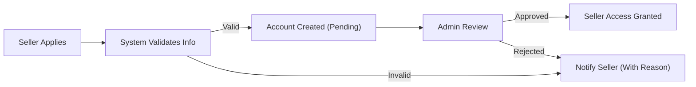
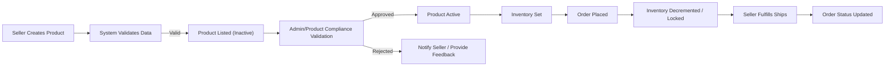
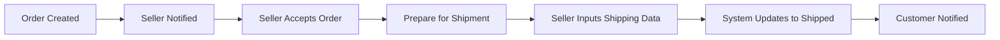

# E-Commerce Shopping Platform Seller Operations Requirements

## Introduction

This document outlines the comprehensive set of business requirements for all seller-side operations on the e-commerce shopping mall platform (“shopping”). It serves as a blueprint for backend developers and sellers, detailing registration, product management, inventory operations, order processing, shipping updates, business rules, validation constraints, and expected system behaviors. All requirements are written for clarity and actionability using the EARS (Easy Approach to Requirements Syntax) format wherever possible.

## 1. Seller Onboarding

### 1.1 Seller Registration Flow
- WHEN a potential seller applies for a seller account, THE system SHALL collect the following business information: legal entity name, business registration ID or certificate, owner/manager contact details (email, phone), primary business address, tax ID (where relevant), banking/payment account information, and a valid email address for authentication.
- WHEN seller application data is submitted, THE system SHALL validate all fields for completeness, data type, legal/format correctness, and flag any missing/invalid fields for correction by the applicant.
- WHEN legal verification is required (e.g., business registration), THE system SHALL trigger a document validation workflow before account approval.
- WHEN all required data is validated, THE system SHALL provision a seller account with pending approval status and notify platform administrators for manual or automated review.
- WHEN a seller application is approved, THE system SHALL enable seller login and seller-side features.
- IF seller onboarding is rejected due to invalid credentials, THEN THE system SHALL provide actionable and specific reasons for rejection to the applicant.

### 1.2 Seller Authentication and Status
- THE system SHALL allow sellers to log in using email/password (or designated credentials), following global authentication requirements defined in the [User Actor Definitions](./02-user-actors.md).
- WHILE a seller account is in pending or suspended status, THE system SHALL restrict access to seller controls and provide explanation.
- WHEN a seller logs in successfully, THE system SHALL provide access to seller dashboard, product, inventory, and order management interfaces linked to their account.

### 1.3 Seller Profile and Dashboard Access
- THE system SHALL allow sellers to view and edit their profile, including business contact, address, and bank/payment details, subject to validation and compliance rules.
- IF required profile fields are missing or invalid, THEN THE system SHALL reject updates and prompt correction.

## 2. Product Management

### 2.1 Product Listing Creation and Ownership
- WHEN a seller creates a product listing, THE system SHALL require: product title, full description, category selection, images/media, pricing, tax settings, shipping options, and mandatory product specifications (as per [Product and Catalog Management](./05-product-catalog.md)).
- WHEN a product is listed, THE system SHALL link the product to the seller owner and make its status "inactive/pending approval" until all validations are complete.
- WHEN a product passes all platform compliance checks (including text/image moderation if applicable), THE system SHALL allow sellers to activate and publish listings.
- WHERE the platform supports product variants (SKU, color, size, etc.), THE system SHALL require all variant details for each SKU before listing activation.
- IF a seller attempts to list a duplicate product/SKU, THEN THE system SHALL notify the seller and reject the submission.

### 2.2 Product Update and Maintenance
- THE system SHALL allow sellers to update product information (pricing, description, stock, images, variant details) at any time, except for fields under restriction due to active or pending orders involving the item.
- WHEN product details are updated, THE system SHALL log the update history and notify the admin if changes affect compliant listing requirements.
- IF a product is delisted or disabled (due to regulatory or quality violations), THEN THE system SHALL notify the seller with specific actionable feedback.

### 2.3 Product Deletion/Archiving
- WHEN a seller archives or deletes a product, THE system SHALL ensure that products in active/pending orders cannot be fully deleted—only archived/hidden from catalog.

## 3. Inventory Tracking

### 3.1 SKU Inventory Management
- THE system SHALL enable sellers to set and update inventory counts at the individual SKU level for each product variant.
- WHEN an order is placed involving a SKU, THE system SHALL decrease available inventory immediately and lock the ordered quantity against further sales.
- WHEN a SKU inventory reaches zero, THE system SHALL prevent new orders and update product visibility accordingly (out-of-stock status).
- IF a seller attempts to oversell (by manual increase while locked by order), THEN THE system SHALL display a warning and block the operation.

### 3.2 Inventory Adjustment Rules
- WHEN an order is cancelled, refunded, or returned, THE system SHALL release/restore the inventory for the affected SKU back to available stock.

### 3.3 Inventory Visibility and Notifications
- THE system SHALL display current, real-time inventory per SKU to the seller.
- WHERE inventory drops below a customizable threshold, THE system SHALL notify the seller through the dashboard and/or email (subject to notification settings).

## 4. Order Fulfillment & Shipping Updates

### 4.1 Order Acceptance and Processing
- WHEN a new order is placed for seller's product(s), THE system SHALL notify the seller in real time (dashboard and/or email, subject to settings).
- THE system SHALL allow sellers to view all order details, including products, quantities, buyer shipping information, selected shipping method, and payment status.
- WHEN a seller accepts an order, THE system SHALL update order status to "processing" and generate a shipping task/work order for fulfillment.
- IF order payment is incomplete or fraudulent, THEN THE system SHALL block fulfillment actions and flag the order for review.

### 4.2 Shipping and Tracking Updates
- WHEN a seller ships an order, THE system SHALL require entry/upload of carrier, tracking number, and shipping method.
- WHEN shipment details are submitted, THE system SHALL update order status to "shipped", notify the customer, and update the tracking record for the order.
- THE system SHALL allow sellers to edit shipping/tracking information only while the order is in a shippable state and not after delivery confirmation.
- WHERE the platform supports integration with shipping providers, THE system SHALL validate carrier/tracking numbers according to provider guidelines.
- WHEN customer requests order cancellation or return, THE system SHALL notify seller immediately and block further fulfillment actions until resolved.

### 4.3 Order History and Status Handling
- THE system SHALL provide sellers with order history (searchable, sortable) including date placed, current status, fulfillment events, customer, and payment info (within compliance/privacy bounds).
- IF an order is disputed or under review (refund, return, complaint), THEN THE system SHALL indicate the order state distinctly and restrict certain actions (refunds, shipment, closure) until resolution.

## 5. Actor Responsibilities and Limitation Summary

### Permissions Table
| Operation/Feature                             | Customer | Seller | Admin |
|-----------------------------------------------|:--------:|:------:|:-----:|
| Apply for seller account                      |    ❌    |   ✅   |  ✅   |
| Create/manage own products                    |    ❌    |   ✅   |  ✅   |
| Adjust inventory for own products             |    ❌    |   ✅   |  ✅   |
| View/edit own orders (seller-side)            |    ❌    |   ✅   |  ✅   |
| Fulfill/ship orders                           |    ❌    |   ✅   |  ✅   |
| View customer PII for their orders            |    ❌    |   ✅   |  ✅   |
| View all marketplace data                     |    ❌    |   ❌   |  ✅   |
| Approve/disable products platform-wide        |    ❌    |   ❌   |  ✅   |
| Set global inventory/business rules           |    ❌    |   ❌   |  ✅   |
| Initiate/approve refunds for own orders       |    ❌    |   ✅   |  ✅   |
| Initiate/approve refunds for other sellers    |    ❌    |   ❌   |  ✅   |

## 6. Error Handling and Business Rule Edge Cases

- IF a seller attempts any action on another seller’s products, THEN THE system SHALL deny access and display an authorization error message.
- IF a seller account is suspended or disabled, THEN THE system SHALL prevent new product, inventory, or order actions and display reason.
- IF inventory, shipping data, or order info is missing or fails validation, THEN THE system SHALL block submission and detail reasons for failure.
- WHEN system or third-party integration (payment/shipping) is unavailable, THE system SHALL display clear error status and suggest next steps for sellers.

## 7. Performance and UX Expectations

- WHEN a seller updates product/inventory/order information, THE system SHALL confirm the update on the seller dashboard instantly (within 2 seconds, 95th percentile).
- WHEN an order status changes (new, shipped, returned, etc.), THE system SHALL display updated order state to both seller and customer with a latency of less than 3 seconds.
- THE system SHALL be available for seller operations 99.5% of the time in any given month.

## 8. Diagrams and Visuals

### 8.1 Seller Onboarding Flow

### 8.2 Product Listing and Fulfillment Flow

### 8.3 Order Processing and Shipping

## 9. References
- [Product and Catalog Management Requirements](./05-product-catalog.md)
- [Order and Payment Flow Requirements](./06-order-payment.md)
- [Inventory Management Requirements](./12-inventory-management.md)
- [Admin Operations and Management](./13-admin-operations.md)
- [User Actor Definitions](./02-user-actors.md)

---