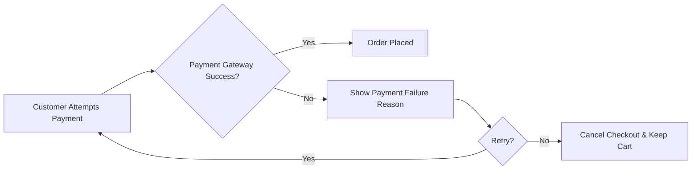

# Error Handling and Exception Cases in the Shopping Mall Platform

## Introduction
This document provides a comprehensive catalog of error types and exception flows in the shopping mall service. Its goal is to ensure all errors encountered by customers, sellers, or admins are handled gracefully, communicated clearly in user-centric business language, and offer robust recovery paths. All requirements use the EARS (Easy Approach to Requirements Syntax) format for clarity, and major process flows are visually mapped for maximum developer utility.

## Major Error Types (by Process)

### 1. User Registration and Login
- Invalid credentials (wrong email or password)
- Duplicate account (e.g., registration with existing email)
- Password complexity or format errors
- Social login/account linking failures
- Excessive failed login attempts (account lock)
- Email verification timeout or invalid verification link
- Token/session expiration

### 2. Address Management
- Invalid address format or missing required fields
- Adding more addresses than allowed
- Attempting to delete primary/default address
- Address not found

### 3. Product Catalog and Search
- Product not found (removed or out of stock)
- Invalid search term or unsupported filters
- Attempt to access restricted or hidden products
- Category not found or deprecated

### 4. Product Variants and Inventory
- Variant not available (SKU combination does not exist)
- Out of stock (SKU reached zero quantity)
- Trying to add unavailable variant to cart

### 5. Cart and Wishlist Management
- Adding item for a removed or disabled product
- Adding more than stock quantity to cart
- Wishlist at maximum allowed items
- Attempt to remove item not in cart/wishlist

### 6. Order Placement and Payment
- Insufficient stock at checkout (item became unavailable)
- Payment gateway failure (declined, timeout, error)
- Invalid payment method (unsupported card/type)
- Order amount mismatch (price changed between selection and payment)
- Exceeding purchase quantity per policy

### 7. Order Tracking and Shipping
- Tracking number not found/invalid
- Shipment delayed or lost
- Unable to update shipping address (order shipped already)
- Attempt to cancel order after shipment

### 8. Product Reviews and Ratings
- Review submission before purchase
- Multiple reviews for same product/order
- Review/edit window expired
- Inappropriate or restricted review content

### 9. Seller Product/Inventory Management
- Unauthorized access to another seller's product
- Attempt to edit product locked by admin
- Upload with invalid SKU or missing details
- Inventory update for discontinued SKU

### 10. Order History, Cancellation, and Refunds
- Cancellation after non-cancellable state (e.g., shipped)
- Refund not allowed (policy violation)
- Duplicate or conflicting refund requests

### 11. Admin Actions
- Attempted action without required permissions
- Invalid admin operation (e.g., attempting destructive irreversible action without confirmation)
- Escalation for unresolved user/seller issue

---

## Error Triggers and Recovery Flows

### General Principles
- Every error MUST be communicated in clear, actionable user language, never as a technical message.
- Users must always have a recovery option or be notified of next steps.
- Admins and Sellers require error context for fast resolution.

### Triggers and Recovery (by Key Actors)

#### User Registration/Login Errors
- WHEN user provides invalid credentials, THE system SHALL inform them that the email or password is incorrect and allow retry.
- IF user exceeds maximum login attempts, THEN THE system SHALL lock the account for a cooldown period and display recovery instructions.
- WHEN user tries to register with existing email, THE system SHALL prompt them to log in or recover password.
- IF verification link is expired, THEN THE system SHALL provide an option to resend the link.

#### Address Management Errors
- WHEN address format is invalid, THE system SHALL highlight the error and prompt user to correct.
- IF user attempts to delete the only/default address, THEN THE system SHALL block the action with an explanation.

#### Product Catalog and Search Errors
- IF search yields no results, THEN THE system SHALL display a user-friendly "no results found" message and suggest alternatives.
- WHEN product is not found, THE system SHALL inform user that the product is unavailable.

#### Product Variant/Inventory Errors
- IF selected product variant is unavailable, THEN THE system SHALL block selection and suggest alternatives.
- WHERE cart quantity exceeds inventory, THE system SHALL limit quantity to available stock and inform user.

#### Cart and Wishlist Errors
- WHEN user adds product no longer available, THE system SHALL display reason and remove it from cart/wishlist.
- WHERE wishlist is full, THE system SHALL alert user and suggest removing other items before adding new.

#### Order and Payment Errors
- IF payment fails (for any reason), THEN THE system SHALL show failure reason and steps to retry or use alternate method.
- WHEN insufficient stock during checkout, THE system SHALL block order, update cart, and suggest alternative actions.
- IF invalid payment method is used, THEN THE system SHALL prevent transaction and provide supported methods.

#### Order Tracking/Shipping Errors
- IF tracking number is invalid, THEN THE system SHALL notify user and advise to contact support.
- WHEN order is no longer eligible for address update/cancellation, THE system SHALL deny the action and explain why.

#### Product Review Errors
- IF user attempts to review without purchase, THEN THE system SHALL block submission and explain requirement.
- WHERE review window expired, THE system SHALL disallow submission/update and display window details.
- IF inappropriate content is detected, THEN THE system SHALL reject with clear feedback on policy.

#### Seller Inventory/Management Errors
- WHEN seller edits another seller's product, THE system SHALL deny access and log the event.
- IF trying to update inventory for discontinued SKU, THEN THE system SHALL block update and prompt cleanup.

#### Orders, Cancellation, and Refund Errors
- IF user attempts refund on ineligible order, THEN THE system SHALL reject and display refund policy.
- WHEN duplicate refund/cancellation is requested, THE system SHALL ignore or merge requests, showing explained status.

#### Admin Actions
- IF admin operates outside permission, THEN THE system SHALL block and log action.
- WHEN potentially destructive admin action is requested, THE system SHALL require confirmation and display warnings.

---

### Multi-Actor Error Flows
- WHEN seller receives an order they can't fulfill (out of stock), THE system SHALL allow seller to mark order as "Unable to Fulfill," automatically notify customer, trigger refund process, and alert admin for review.
- WHEN an order dispute is created, THE system SHALL escalate to admin and provide all actors with a dispute status and contact point.

---

### Mermaid: Example Error Handling Flow (Payment Failure)

---

## User Notifications and Feedback Patterns

### Customer
- Errors are always conveyed in familiar, actionable language, indicating what went wrong and next steps (retry, correct, contact support).
- Recovery actions (links, buttons) are always available for self-service correction, except for legal or administrative escalations.
- WHEN possible, system SHALL auto-correct (e.g., trim spaces, suggest alternatives) and inform user.

### Seller
- Sellers receive notifications for errors/issues with their listings, inventory, or order processing. Clear guidance is provided for necessary actions or escalation paths.
- WHEN error relates to compliance or policy, THE system SHALL provide links to documentation or support resources.
- Seller dashboard SHALL display any unresolved errors for prompt action.

### Admin
- Admins are informed for any process error that cannot be resolved by regular users or sellers, with clear identification of affected records, actors, and recovery tools.
- Error logs and escalation queues are visible in the admin dashboard.
- Recovery or override actions are available per admin role.

---

## Best Practices for Error Transparency and Recovery
- Errors are proactive and user-centric: never expose technical details (e.g., stack traces), but always describe the business context.
- Recovery steps shall be easy, visible, and logged for audit.
- Users must always know their next possible action and estimated resolution time.
- Confirmation and validation steps are presented before irreversible or sensitive actions.
- Edge cases and conflicts (e.g., stock depletion during payment, admin-seller disputes) are handled by escalating to humans with full context.

---

## Summary
Robust error handling is central to the platform’s reliability and reputation. All major error types, user-facing feedback, and recovery flows have been exhaustively documented according to the EARS methodology. Backend systems MUST implement all error messaging and recovery in business terms, never technical jargon, for all actors (customer, seller, admin). Diagrams and structured requirements herein support full transparency and a premium e-commerce experience.