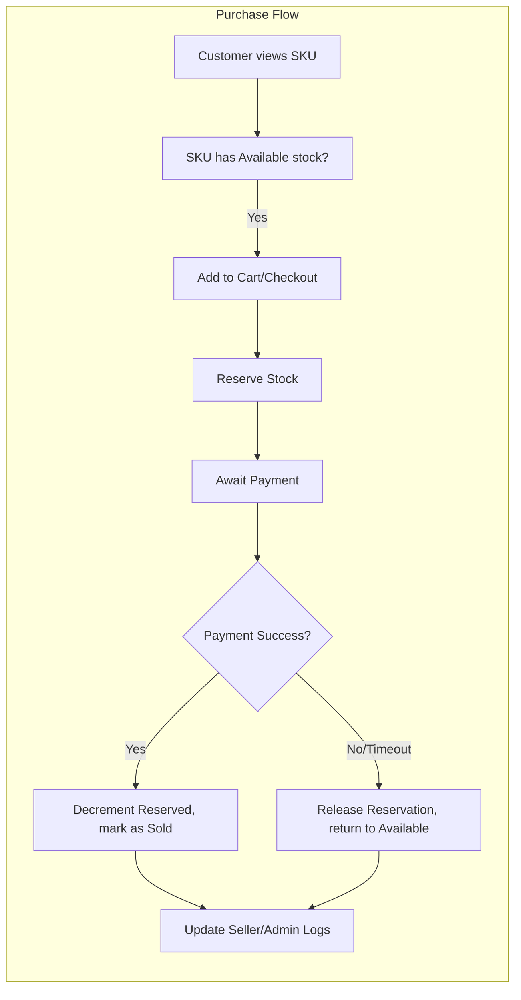
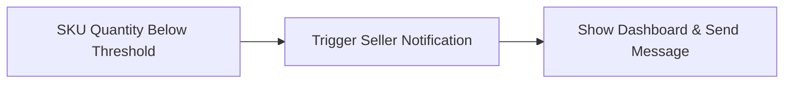
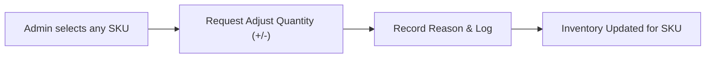

# Inventory Management Requirement Analysis Report (shoppingMall)

## 1. Introduction
This requirement analysis defines the complete business logic, workflows, and constraints for inventory management within the shoppingMall e-commerce platform. All requirements use EARS (Easy Approach to Requirements Syntax) format wherever applicable, written for backend developers to enable the building of robust, ambiguity-free inventory systems at both the seller and SKU (variant) level.

## 2. Inventory Model (Business-Level)

### 2.1 Data Model Overview (Business)
- Each product is comprised of one or more SKUs (Stock Keeping Units), representing individual variants (e.g., size, color, option).
- Inventory quantities are tracked strictly per-SKU, never only at the product level.
- Sellers own inventory of only their listed products.
- The inventory model tracks current available quantity, reserved/held quantity, total historical stock, and optionally minimum/maximum thresholds per SKU.
- Only sellers and admins are permitted to adjust stock quantities (customers cannot).

### 2.2 Inventory States and Transitions
- Inventory for an SKU can be in one of the following states: Available, Reserved (pending order), Sold, Blocked (manually locked by seller/admin), Out of Stock.
- THE system SHALL transition inventory between "Available" and "Reserved" states when customer checkout/initiate order.
- THE system SHALL decrement from "Available" to "Sold" only upon order payment confirmation.
- IF an order is canceled before fulfillment, THEN THE system SHALL release reserved quantity back to "Available".

### 2.3 Relationship to SKUs and Sellers
- Every SKU is linked to a single product and a single seller.
- Sellers only manage and view inventory for their own SKUs.
- Admins may override or update any inventory field for any SKU on the platform.

## 3. Stock Update Flows

### 3.1 Stock Addition / Restocking
- WHEN a seller wishes to replenish inventory, THE system SHALL allow the seller to increase the available quantity for any SKU they own.
- WHEN an admin wishes to correct stock errors, THE system SHALL allow manual inventory adjustment for any SKU.
- All inventory increases require logging: WHEN inventory is increased, THE system SHALL record seller/admin/user, timestamp, amount, and reason.

### 3.2 Stock Decrement / Sales
- WHEN a customer places an order and proceeds to checkout, THE system SHALL reserve the requested quantity per SKU, moving it to the "Reserved" state, if available.
- WHEN payment is confirmed, THE system SHALL decrement reserved quantity to "Sold".
- IF payment fails or order is canceled prior to fulfillment, THEN THE system SHALL restore reserved quantity to "Available".
- WHERE multiple customers attempt to reserve the same SKU, THE system SHALL process reservations strictly by order of payment completion timestamp. Over-reservation is strictly prohibited.

### 3.3 Manual Adjustments
- Sellers may decrease available quantity manually to correct errors (e.g., damaged/lost inventory).
- WHEN an admin intervenes (e.g., for compliance), THE system SHALL record the admin's ID, reason, affected SKU, and adjustment amount for auditing.

### 3.4 Inventory Hold / Reservation
- WHEN an order is pending payment, THE system SHALL temporarily reserve inventory for up to 15 minutes (configurable) per order.
- IF payment is not completed within the reservation window, THEN THE system SHALL release held quantity.

## 4. Low Stock and Purchase Block Rules

### 4.1 Low Stock Thresholds
- Sellers may set custom "low stock" warning levels per SKU; THE system SHALL notify the seller when threshold is reached or crossed.
- THE system SHALL set default "low stock" warning at 5 units per SKU if not configured.

### 4.2 Purchase Block Logic
- IF an SKU reaches 0 available quantity after reservations, THEN THE system SHALL:
  - Block further purchases automatically;
  - Display "Out of Stock" status to customers;
  - Notify the seller via dashboard and/or notification system.

### 4.3 Reserve Quotas
- WHERE regulatory or promotional quotas apply (e.g., "max 5 units per customer per day"), THE system SHALL enforce per-customer purchasing limits at checkout.

## 5. Error Paths & Edge Cases

### 5.1 Over-sale/Under-sale Prevention
- IF concurrent checkout events occur, THEN THE system SHALL atomically verify and lock available quantity before confirming reservation.
- THE system SHALL prevent purchase confirmations if available quantity is insufficient at the time of payment completion.

### 5.2 Simultaneous Orders and Race Conditions
- WHEN two or more customers attempt to buy the same SKU in the same second, THE system SHALL use transaction order (payment timestamp) to grant stock strictly FIFO.

### 5.3 Lost Sync Scenarios
- IF system detects inconsistent inventory state (e.g., database or integration issue), THEN THE system SHALL flag the SKU, block further sales, and notify seller and admin for manual intervention.

## 6. Business Rules & Constraints

- Minimum stock level per SKU is zero; maximum is configurable but defaults to 99,999 unless otherwise set by admin.
- THE system SHALL not allow negative inventory under any circumstance.
- Inventory adjustment logs SHALL be immutable and accessible by admin for at least 1 year.
- Inventory changes by sellers are limited to SKUs they own only; cross-seller adjustments are prohibited (except by admin).
- WHEN an SKU is discontinued, THE system SHALL retain historical inventory and adjustment logs for audit.

## 7. Role-Based Access and Auditing

| Action                            | Customer | Seller    | Admin  |
|-----------------------------------|----------|-----------|--------|
| View SKU inventory                | ❌       | Own only  | All    |
| Adjust quantity (increase/decr.)  | ❌       | Own only  | All    |
| Manual block/unblock SKU sales    | ❌       | Own only  | All    |
| Access adjustment audit log       | ❌       | Own only  | All    |
| Receive low stock notifications   | ❌       | Yes       | Yes    |
| Force override inventory          | ❌       | ❌        | Yes    |

- THE system SHALL strictly enforce the above matrix.

## 8. Performance & Non-functional Requirements

- WHEN inventory update is submitted, THE system SHALL reflect changes to stock availability for all affected users within 3 seconds.
- THE system SHALL process at least 100 concurrent purchase or reserve transactions per SKU without lost-updates or race-conditions.
- Inventory notifications SHALL be sent in real-time (within 1 second) when low stock or outages occur.

## 9. Example Flows & Mermaid Diagram

### 9.1 Normal Purchase and Stock Update

### 9.2 Low Stock Notification

### 9.3 Admin Manual Adjustment

## 10. Appendix: Glossary & Requirement Patterns

- SKU: Stock Keeping Unit, unique per product variant.
- Reservation: Temporary hold on stock during order/payment window.
- Sold: Inventory permanently decremented post-payment.
- Blocked: State preventing customer purchase.
- Audit Log: Historical, immutable record of all manual/admin inventory changes.

## Compliance Statement
> *Developer Note: This document defines business requirements only. All technical implementations (architecture, APIs, database design, etc.) are at the discretion of the development team.*
