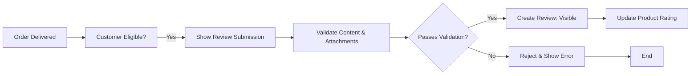
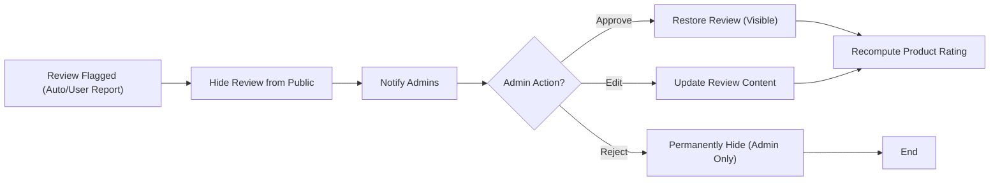

# E-commerce Shopping Mall Platform: Review and Feedback System Business Requirements

## Introduction and Scope
This document defines all business requirements, flows, and actor-based permissions for the review and rating system in the e-commerce shopping mall backend. It covers customer review submission, rating calculation, moderation and abuse handling, display logic, performance constraints, and business logic using EARS format. All requirements are written to guide backend development, with no frontend or technical implementation details.

## Review Submission

### Eligibility and Timing
- WHEN a 'customer' completes the delivery of a product order, THE system SHALL permit the customer to submit a review for each purchased item.
- WHERE an order contains multiple SKUs, THE system SHALL allow the customer to submit a separate review per purchased SKU.
- WHERE a customer has previously purchased the same product, THE system SHALL allow only one review per order line item but SHALL permit additional reviews for subsequent purchases/orders.
- IF a customer has not purchased or received a product, THEN THE system SHALL prevent review submission for that product by that customer.
- WHERE a review is submitted, THE system SHALL associate the review with the specific SKU, order, and customer account for traceability.

### Review Content Requirements
- THE review SHALL include, at minimum, a rating value (integer 1–5), a textual comment (minimum 10 and maximum 2,000 characters), and optional image/video attachments (maximum 5, each under 5MB).
- IF a review submission lacks a valid rating or violates content field constraints, THEN THE system SHALL reject the submission and display actionable error messages.
- WHEN updating a review, THE system SHALL only allow changes to the text, attachments, or rating within 7 days of initial posting. After 7 days, edits SHALL be disallowed except by admin action.
- IF a customer attempts to edit or delete a review after the allowed period, THEN THE system SHALL block the operation and return a specific error code: "REVIEW_EDIT_WINDOW_EXPIRED".
- WHERE deletion occurs, THE system SHALL retain the review for audit and moderation history (soft delete), except where removed by admin for legal reasons (hard delete).

### Review Lifecycle
- WHEN a review is submitted, THE system SHALL default its state to 'visible' pending moderation rules.
- WHERE suspicious content or patterns are detected (e.g., banned words, repeated spam), THE system SHALL auto-flag reviews for moderation and change state to 'pending'.

## Rating Mechanism

### Structure & Association
- EACH product SHALL aggregate its public review ratings, showing an average (rounded to one decimal) and total number of reviews.
- WHERE product variants (SKUs) exist, THE system SHALL compute ratings per SKU and for the parent product.
- WHERE a product is deleted or discontinued, THE system SHALL archive associated reviews and ratings for legal and business reporting.
- THE system SHALL support ratings from 1 (worst) to 5 (best), with no partial/in-between values.

### Restrictions
- WHERE a customer submits multiple orders of a product, EACH eligible order is entitled to a unique review. Duplicate reviews for the same SKU within the same order SHALL be disallowed.
- IF a rating is missing or out of range, THEN THE system SHALL reject the review with error code: "INVALID_RATING_VALUE".
- WHILE a review is in 'pending' or 'flagged' state, its rating SHALL be excluded from public aggregation.

### Rating Aggregation & Display
- WHEN aggregating ratings, THE system SHALL recalculate average ratings dynamically whenever new reviews become visible or existing ones are updated/deleted.
- THE rating averages SHALL be displayed with a minimum of one decimal precision (e.g., 4.3/5.0; not 4/5).

## Moderation & Abuse Handling

### Moderation Triggers and States
- WHEN a review is reported by any logged-in user, THE system SHALL change its state to 'under_review' and notify an admin.
- WHERE flagged for moderation, THE system SHALL record the reason (manual or automatic: spam, hate speech, off-topic, prohibited attachment, etc.) and last action.
- WHEN an admin reviews a flagged review, THE admin SHALL be able to approve (restore visibility), reject (hide), edit, or permanently delete the review.
- WHILE a review is flagged or under moderation, it SHALL be hidden from public listing and excluded from product rating aggregation.

### Auto-Moderation and Notification
- THE system SHALL implement automatic moderation for abusive language, illicit images, or suspicious/fraudulent patterns.
- WHERE auto-moderation triggers (keyword detection, spam heuristics) are met, THE review SHALL transition to 'pending review' and a notification SHALL be sent to admins.
- WHEN a review is moderated by an admin, THE system SHALL log all actions for audit, including the acting admin and timestamps.
- THE system SHALL notify the customer when their review's status changes due to moderation.

### Abuse Reporting
- WHEN any customer or seller reports a review for abuse, THE system SHALL allow optional description/reason and record the reporter's identity (for abuse prevention tracking).
- WHERE sustained abuse reporting on a single customer is detected (e.g., multiple fraudulent reviews), THE system SHALL temporarily restrict their ability to leave further reviews, and flag the account for admin review.

## Review Display Rules

### Visibility and Context
- WHILE a review is in a visible state and passes moderation, THE system SHALL display it in the product review section, sorted by most recent by default.
- WHERE sorting/filtering is offered, THE system SHALL support at least: most recent, highest rating, lowest rating, and with/without images.
- THE system SHALL mask customer display names, showing either anonymized usernames (e.g., J***n), or optionally only the first/last character (according to privacy regulations).
- WHERE a review is deleted (soft deletion), THE system SHALL show a placeholder message ("This review has been removed") but exclude it from aggregation and public listing for the product.
- WHERE an admin deletes a review for legal or compliance reasons, THE system SHALL remove all its content from all frontend/API results.
- WHEN a customer requests their account deletion and confirms, THE system SHALL anonymize all past reviews authored by that user but retain rating contributions for aggregation per regulatory standards.
- WHERE images in reviews are present, THE system SHALL scan attachments for compliance (file size, format, content).

### Editing/Removing Reviews
- WHEN a customer wishes to update or remove their review within 7 days, THE system SHALL permit the edit or removal (soft delete), with appropriate audit log.
- ADMINS SHALL have full authority to edit, remove, restore, or hard-delete any review at any time for any policy or compliance reason, with all such actions audited.

## Actor-Specific Constraints and Behaviors

### Customer
- Customers SHALL only review SKUs they have purchased and received, and SHALL only edit/delete their own reviews.
- WHEN submitting a review, THE system SHALL verify review eligibility, product ownership, and previous review existence per order line/SKU.
- IF a customer attempts to review a seller, THEN THE system SHALL reject the action (only product/SKU reviews are supported).

### Seller
- Sellers SHALL NOT submit reviews for their own products, nor review products on the platform.
- Sellers MAY respond to customer reviews visible on their products with an official comment (optional feature).
- WHEN a seller responds, THE system SHALL associate the response with the related review and display it if moderation allows.
- Sellers MAY report abusive or inappropriate reviews on their product for admin review.

### Admin
- Admins SHALL have blanket authority over all review and moderation operations: change state, edit/delete content, view full audit logs, resolve disputes.
- ADMINS SHALL be identifiable in all moderation actions and logs for audit and compliance.

### Permission Matrix
| Action                      | Customer | Seller | Admin |
|-----------------------------|:--------:|:------:|:-----:|
| Submit product review       |   ✅     |   ❌   |  ❌   |
| Edit/delete own review      |   ✅     |   ❌   |  ✅   |
| Report review for abuse     |   ✅     |   ✅   |  ✅   |
| Respond to reviews          |   ❌     |   ✅   |  ✅   |
| Approve/reject review       |   ❌     |   ❌   |  ✅   |
| Hard delete content         |   ❌     |   ❌   |  ✅   |

## Core Business Logic (EARS Format)

- WHEN a customer completes delivery of a product, THE system SHALL permit review submission for each purchased SKU.
- IF a customer attempts to review a product they have not purchased, THEN THE system SHALL reject the submission and display an actionable error.
- WHEN a review contains prohibited text or fails automated checks, THE system SHALL flag it and send for admin review.
- WHEN a review is flagged, THE system SHALL hide it from public display and exclude it from product rating aggregation.
- WHEN a review is edited or deleted (within policy window), THE system SHALL update or remove it while maintaining an audit log.
- WHEN an abusive review is reported by any actor, THE system SHALL allow optional reason and trigger moderation process.
- WHEN a review is moderated by an admin, THE system SHALL log all actions, record admin identifier, and notify the review author.
- WHEN a customer requests account deletion, THE system SHALL anonymize their review display names but retain rating data.
- THE system SHALL reject review content not matching validation (length, attachment size, rating value) with explicit error codes.

## Business Error Scenarios & Handling (EARS)

- IF a customer submits a review for a SKU not associated with their completed orders, THEN THE system SHALL reject with error code: "REVIEW_INELIGIBLE".
- IF a review submission contains banned words or content, THEN THE system SHALL reject with error code: "REVIEW_CONTENT_BLOCKED".
- IF an image/video attachment exceeds file size/format constraints, THEN THE system SHALL reject that attachment with error code: "REVIEW_INVALID_ATTACHMENT".
- IF a review is flagged for abuse and remains unmoderated for more than 48 hours, THEN THE system SHALL escalate notification to admins.
- IF a customer attempts to submit multiple reviews for the same SKU in one order, THEN THE system SHALL reject duplicate submissions with error code: "REVIEW_DUPLICATE_FOR_ORDER".
- IF moderation actions fail or system error occurs, THEN THE system SHALL log and notify admins within 2 seconds.

## Performance & User Experience Requirements

- THE system SHALL process all review-related requests (submission, edit, moderation update) and respond to users within 2 seconds under normal operational load.
- WHEN a new review is posted and approved/visible, THE product’s rating average SHALL update and be visible to users within 3 seconds.
- WHEN automated moderation is triggered, THE system SHALL flag and update review state within 1 second.
- THE system SHALL scale to support products with over 10,000 reviews without significant response degradation (>5 seconds for display or rating calculation).
- THE system SHALL be robust against race conditions for review submission and aggregation, ensuring data accuracy.

## Representative Flows (Mermaid Diagrams)

### Review Submission Flow

### Moderation and Abuse Workflow

## Success Criteria

- All permitted review and rating flows operate as specified, with clearly actionable responses for all actors.
- Moderation, error, and abuse scenarios are addressed with unambiguous states, error codes, and audit logging requirements.
- All business logic is specified in EARS format wherever possible.
- The document leaves NO ambiguity for developers implementing backend logic for review and feedback features.
