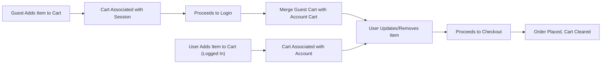
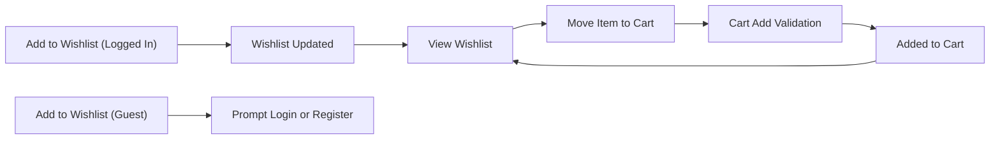

# Cart and Wishlist Management Requirements

## 1. Cart Item Lifecycle

### 1.1 Cart Creation
- WHEN a new customer visits the shopping mall, THE system SHALL create a temporary cart identified by session or device.
- WHEN a registered customer is logged in, THE system SHALL associate the cart with the customer account.
- IF the user is not logged in, THEN THE system SHALL keep the cart in guest mode until authentication.

### 1.2 Add to Cart
- WHEN a user selects a product to add to cart, THE system SHALL validate product existence, active status, variant/option availability, and sufficient stock quantity.
- WHEN a valid product is added, THE system SHALL append a new cart item with productID, variantID (SKU), options, quantity, and timestamp.
- IF a cart already contains the same SKU and options, THEN THE system SHALL increment the quantity instead of creating a duplicate entry.

### 1.3 Update Cart Item
- WHEN a user updates the quantity of a cart item, THE system SHALL validate maximum allowed quantity per product (e.g., stock limits, business rules).
- IF the new quantity exceeds available stock, THEN THE system SHALL display an error and restrict the quantity to the current maximum available.
- THE system SHALL allow users to change selected product variants/options for a cart item, provided new combination is valid and available.

### 1.4 Remove from Cart
- WHEN a user removes a product from the cart, THE system SHALL delete the cart item immediately.
- WHEN all items are removed, THE system SHALL retain an empty cart for the session/account.

### 1.5 Cart Expiration & Persistence
- WHILE the user is not logged in, THE system SHALL persist the guest cart for 7 days after the user's last activity (business configurable).
- WHEN a logged-in user's cart has been inactive for 30 days, THE system SHALL auto-expire and delete the cart.
- WHEN a guest logs in or registers, THE system SHALL check for an existing guest cart and merge its items into the account cart.
- IF both guest and account carts contain the same product SKU and options, THEN THE system SHALL sum the quantities (subject to stock)

### 1.6 Cart Checkout Readiness
- WHEN viewing the cart, THE system SHALL display only products that are still active and in stock.
- IF a product in the cart has become deactivated or out of stock, THEN THE system SHALL indicate this item cannot be purchased and offer removal.
- WHEN proceeding to checkout, THE system SHALL require at least one valid, available cart item.
- WHEN order is placed, THE system SHALL clear the corresponding cart items.

## 2. Wishlist Features

### 2.1 Add to Wishlist
- WHEN a logged-in customer selects 'Add to Wishlist' on a product or variant, THE system SHALL create or update a wishlist entry for that account.
- THE system SHALL allow only unique product (or SKU) entries per user's wishlist; duplicates SHALL be prevented.
- IF the product is already on the wishlist, THEN THE system SHALL not add a duplicate and SHALL display the appropriate feedback.

### 2.2 Remove from Wishlist
- WHEN a customer removes a product from the wishlist, THE system SHALL immediately delete the selected entry.

### 2.3 View Wishlist
- WHEN a customer visits their wishlist, THE system SHALL display all currently available (active) products/variants that exist in their wishlist.
- IF a product in the wishlist has been deleted or deactivated, THEN THE system SHALL inform the user of the status and offer removal.
- THE wishlist SHALL be private to each user and not publicly visible.

### 2.4 Move Wishlist Item to Cart
- WHEN a user moves an item from wishlist to cart, THE system SHALL validate current product status and available stock, then add it to cart if valid.
- IF the item is unavailable or out of stock, THEN THE system SHALL display a business-appropriate error message.
- THE system SHALL keep the item in the wishlist until the user removes it, even after it is added to the cart.

### 2.5 Wishlist Limits
- WHERE there is a business-imposed limit (e.g., max 100 items per wishlist), THE system SHALL prevent further additions and inform the user.

## 3. Guest vs. Logged-in Handling

### 3.1 Cart for Guests
- THE system SHALL support temporary carts for unauthenticated (guest) users via cookies or device/session ID.
- WHEN a guest user logs in or registers, THE system SHALL offer to merge their temporary cart with the authenticated user's cart.
- IF a merge occurs, THEN THE system SHALL handle product duplication as summing quantities (up to maximum stock/quantity rules).

### 3.2 Wishlist for Guests
- THE system SHALL not provide persistent or session-based wishlists for guest users.
- WHEN a guest attempts to add an item to a wishlist, THE system SHALL prompt the guest to register or log in.

### 3.3 Edge Case Handling
- IF a guest cart expires after the persistence window, THEN THE system SHALL delete the guest cart and its contents.
- IF there is a server/browser/session failure while a guest cart is active, THEN THE system SHALL recover the cart from available storage if possible, or start a new cart session.

## 4. Business Logic Rules & Permissions

### 4.1 Permission Matrix
| Action                              | customer | seller | admin |
|-------------------------------------|----------|--------|-------|
| Add item to cart                    | ✅       | ❌     | ❌    |
| Update item quantity in cart        | ✅       | ❌     | ❌    |
| Remove item from cart               | ✅       | ❌     | ❌    |
| Merge guest and account cart        | ✅       | ❌     | ❌    |
| Add item to wishlist                | ✅       | ❌     | ❌    |
| Remove item from wishlist           | ✅       | ❌     | ❌    |
| Move item from wishlist to cart     | ✅       | ❌     | ❌    |
| Delete guest cart (expire)          | ✅       | ❌     | ✅    |
| Delete any user's cart              | ❌       | ❌     | ✅    |
| View own cart                       | ✅       | ❌     | ❌    |
| View own wishlist                   | ✅       | ❌     | ❌    |

- Seller and admin accounts SHALL NOT have customer-facing cart or wishlist functionality (except admin system-level management if needed).

### 4.2 Validation and Limits
- WHERE business policy limits maximum quantity of a SKU per cart (e.g., max 10), THE system SHALL enforce the rule at add/update time.
- IF a product is deleted/deactivated after being added to cart or wishlist, THEN THE system SHALL prevent purchase/addition and notify the user.
- WHEN a product or SKU is reactivated, THE system SHALL restore normal cart/wishlist functionality for that item.

## 5. Error Handling Scenarios
- IF an add-to-cart action fails due to out-of-stock, THEN THE system SHALL clearly display an error and prevent addition.
- IF any update to cart item quantity fails because of invalid input or rule violation, THEN THE system SHALL prevent the change and present an error describing allowable limits.
- IF wishlist addition fails due to exceeding maximum allowed items, THEN THE system SHALL indicate the limit has been reached.
- IF a cart session (guest or logged-in) is lost due to storage issues, THEN THE system SHALL notify the user and provide steps to restore or re-establish their cart.
- IF user attempts to access another user's cart or wishlist, THEN THE system SHALL deny access and present an authentication error.

## 6. Performance and Non-functional Requirements
- THE cart and wishlist SHALL be instantly retrievable (response within 300ms under normal loads).
- THE system SHALL handle up to 10,000 concurrent cart sessions without degradation.
- All cart/wishlist actions SHALL be fully transactional to prevent lost or duplicated items during concurrent operations.
- THE system SHALL respect privacy and security standards for customer data.

## 7. Visual Diagrams

### 7.1 Cart Workflow (Mermaid)

### 7.2 Wishlist Workflow (Mermaid)

