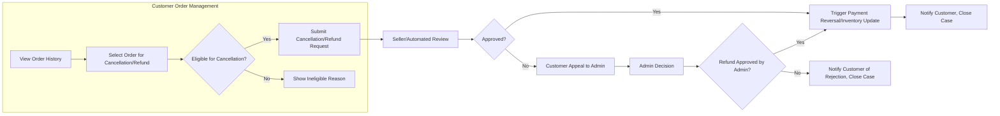
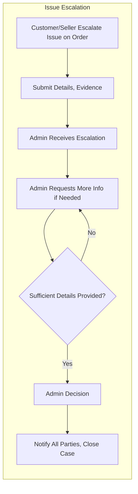

# Order History and Customer Service Requirements Analysis Report

## 1. Overview
Order history management and customer service features form a core part of the e-commerce shoppingMall business logic, ensuring user trust, regulatory compliance, and efficient dispute resolution. This document details the requirements for tracking all past and current orders, handling user-initiated cancellations and refund requests, and managing customer support escalations while accurately recording all relevant state transitions and business checks. 

## 2. Order History Access

### 2.1 Access & Retrieval
- WHEN a customer logs into their account, THE system SHALL provide an order history page listing all their completed and in-progress orders, ordered by created date (newest first).
- WHEN a customer views their order history, THE system SHALL display, at minimum, order number, order date, order status, item summary, payment status, shipping status, and total paid.
- WHERE an order contains multiple items from different sellers, THE system SHALL display clear segmentation per seller.
- IF a user has no orders, THEN THE system SHALL display an appropriate empty state message.
- WHERE a customer selects an order, THE system SHALL show complete details (SKUs, product names, variants, prices, address used, payment method, order timeline, seller contact, tracking info, cancellation/refund status).
- WHERE an order contains digital and physical items, THE system SHALL clearly segment fulfillment status by item.

### 2.2 Historical Data Detail
- THE system SHALL maintain a status change timeline for each order, recording all relevant events (placed, paid, shipped, delivered, cancelled, refund requested, refund processed) with ISO 8601 timestamps.
- WHERE an admin, seller, or customer accesses order history, THE system SHALL enforce role-based data scope: customers see only their own orders, sellers see only their order fulfillments, admins can query all orders.
- WHERE an order is modified (such as returns, partial refund, or address correction), THE system SHALL log a record of each modification and its initiator.

## 3. Order Cancellation Process

### 3.1 Request Flow
- WHEN a customer initiates an order cancellation on open or processing orders (before shipment confirmation), THE system SHALL check business rules, present eligible orders, and collect a cancellation reason from the user.
- WHERE an order contains shippable and non-shippable goods, THE system SHALL allow partial cancellation on eligible items according to business policy.
- THE system SHALL validate cancellation eligibility based on order state (e.g., unshipped, payment completed, discount/promotional state).
- WHEN an order is eligible and cancellation is confirmed, THE system SHALL update order and inventory states, notify affected seller(s), and update the refund status (if required).
- WHEN cancellation is not eligible (e.g., order shipped), THE system SHALL display an informative error message explaining the lockout reason.
- THE system SHALL log all cancellation attempts, including denied/cancelled requests, with actionable reasons.

### 3.2 Seller/Admin Involvement
- WHEN a cancellation is requested, THE system SHALL notify relevant sellers in real-time or via actionable alerts.
- THE system SHALL allow sellers to review pending cancellation requests and respond in the case of, e.g., made-to-order items or special cases as configured by business policy.
- WHERE a decision requires admin escalation (e.g., disputed eligibility, system error), THE system SHALL route the request to the platform admin dashboard with full audit logs.

## 4. Refund Handling

### 4.1 Refund Initiation
- WHEN a cancellation is processed or a customer initiates a "Request Refund" (e.g., for undelivered or defective product), THE system SHALL collect a reason and supporting documentation (uploads, message).
- THE system SHALL validate refund eligibility (payment state, delivery confirmation, product type, seller-specific policies).
- IF the order or product is not eligible for refund, THEN THE system SHALL deny the request and provide a detailed error message.
- THE system SHALL support both full and partial refunds, reflecting item-level status in the order record.

### 4.2 Workflow
- WHEN a refund request is permitted, THE system SHALL update refund status to "pending review" and notify the seller.
- THE system SHALL allow sellers to review and approve/refuse refund requests within a configurable business window (e.g., 3 business days), providing a reason for refusal.
- IF the seller does not act within the window, THEN THE system SHALL escalate to admin for forced decision.
- WHEN a seller approves a refund, THE system SHALL trigger payment reversal via integrated payment provider (asynchronous or synchronous, per provider capability), update inventory as appropriate, and notify customer with refund status/proof.
- WHERE a seller refuses a refund, THE system SHALL allow the customer to appeal to admin, at which point the admin reviews the case history and makes a final, logged decision.

### 4.3 Special Scenarios
- WHERE partial deliverables exist (e.g., some items delivered, some not), THE system SHALL allow item-level refunds and status segmentation.
- IF refund cannot be processed automatically (e.g., payment provider failure), THEN THE system SHALL log the failure, notify admin, and instruct the customer on next steps.

## 5. Customer Service Escalations

### 5.1 Initiation & Tracking
- WHEN a customer or seller disagrees with cancellation/refund outcome or experiences unresolved issues (e.g., defective items, non-responsive seller), THE system SHALL allow escalation via the order detail page with message and evidence submission.
- THE system SHALL track all escalations, associating them to respective order numbers and accounts, marking their current resolution state (open, in-progress, resolved, rejected).
- THE system SHALL provide admins with a dashboard view of all open cases, prioritizing by order age, customer severity, and previous escalations.

### 5.2 Admin Handling
- WHEN an escalation is assigned, THE system SHALL present admins with all relevant information (order data, communication history, uploaded evidence, actor logs).
- THE system SHALL allow admins to communicate with all parties, request additional information, and record all resolutions/actions for compliance.
- WHEN a final decision is rendered, THE system SHALL trigger downstream effects (refund, order reactivation, user notification) and update the order/escalation record.
- THE system SHALL send all relevant parties notification of decision and reasoning.

## 6. Business Rules and Permissions

### 6.1 Permissions Table
| Action                                             | Customer | Seller | Admin |
|---------------------------------------------------|:--------:|:------:|:-----:|
| View own order history                            |   ✅     |   -    |   -   |
| View orders containing own products               |    -     |   ✅   |   -   |
| View all orders                                   |    -     |   -    |   ✅  |
| Initiate cancellation/refund on own orders        |   ✅     |   -    |   -   |
| Respond to cancellation/refund requests           |    -     |   ✅   |   ✅  |
| Escalate/resolve customer service cases           |   ✅     |   ✅   |   ✅  |
| Make final decision on escalated cases            |    -     |   -    |   ✅  |

### 6.2 JWT Payloads (Reference)
- All role-based actions SHALL be validated via role claim in JWT.
- JWT to contain userId, role, order access scope, and permissions array.

## 7. Performance, Error Handling, and Edge Cases
- THE system SHALL display order history and status changes within 2 seconds for 99% of accesses.
- WHERE data access exceeds this window, THE system SHALL present a progress indicator and not permit further user action until resolved.
- IF order data or status records are missing or corrupted, THEN THE system SHALL log the incident, notify admin in real-time, and present an apology and support contact to the user.
- THE system SHALL allow for business-defined history retention period (e.g., minimum statutory period of 5 years after order completion).

## 8. Visual Flows (Mermaid)

### Order Cancellation/Refund Flow - Left to Right

### Customer Service Escalation

---
*Developer Note: This document defines business requirements only. All technical implementations (architecture, APIs, database design, etc.) are at the discretion of the development team.*
