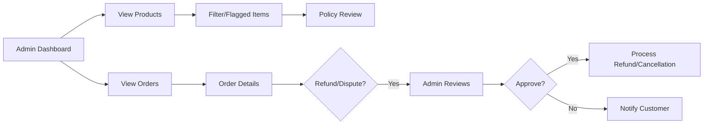
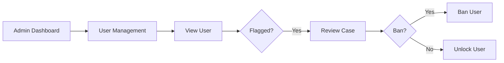

# Admin Dashboard Requirements for E-Commerce Shopping Mall Platform

## 1. Introduction
The admin dashboard is the central tool for platform administrators to oversee, moderate, and optimize the operations of the e-commerce shopping mall. This document outlines the business requirements for all administrative workflows related to user management, product and order oversight, moderation, analytics, reporting, and exception scenarios. Requirements are written in business-focused terms (not technical implementations) using EARS (Easy Approach to Requirements Syntax) where applicable.

## 2. Admin User Model
### 2.1 Role and Permissions
- THE "admin" role SHALL have full access to all platform management features and SHALL be responsible for overall site health, compliance, and operational integrity.

### 2.2 Authentication
- THE system SHALL require two-factor authentication for admin logins.
- THE system SHALL invalidate all admin sessions immediately upon password or privilege change.
- THE system SHALL require all administrative actions to be logged for audit purposes, with records retained for at least 3 years.

### 2.3 Session Management
- WHEN an admin logs in, THE system SHALL issue a JWT access token with role and permissions encoded.
- WHEN an admin logs out or their session expires, THE system SHALL invalidate all related tokens and log the event.

### 2.4 Permission Matrix (Business Summary)
| Feature/Action                   | Admin |
|----------------------------------|-------|
| View/edit all products           | ✅    |
| Add/remove/modify categories     | ✅    |
| Manage all user accounts         | ✅    |
| Approve/ban seller accounts      | ✅    |
| View sitewide order data         | ✅    |
| Process refunds/disputes         | ✅    |
| Access and export analytics      | ✅    |
| Override product or order status | ✅    |
| Manage platform notifications    | ✅    |
| Moderate reviews/ratings         | ✅    |

- WHEN an action would impact platform integrity, THE system SHALL require explicit admin confirmation before execution.

## 3. Order & Product Management

### 3.1 Product Oversight
- THE admin dashboard SHALL list all products, filterable and sortable by key attributes (e.g. category, seller, status, inventory).
- WHEN a product is flagged for policy violation or low quality, THE system SHALL present this in the admin dashboard for review.
- WHEN an admin edits product details, THE system SHALL log the action and show audit trails.
- WHEN critical metadata (e.g., price, category) is changed by admin, THE system SHALL require confirmation.
- WHERE an admin deletes a product, THE system SHALL perform a soft-delete allowing restoration within 30 days, with the action clearly logged.

### 3.2 Category Management
- THE system SHALL allow admins to add, edit, and remove product categories.
- IF a category is associated with active products and is deleted, THEN THE system SHALL require reassignment or archiving of affected products before deletion completes.

### 3.3 Order Oversight
- THE admin dashboard SHALL surface all orders, with advanced filtering (status, customer, seller, date range, value, shipping state).
- WHERE exceptions occur (e.g. failed payments, unusual order volumes, repeated cancellations), THE system SHALL highlight and escalate these to admin dashboards.
- WHEN an admin updates order status, THE system SHALL log the update and, where appropriate, trigger notifications to affected customers/sellers.
- WHEN a customer or seller requests refund or dispute resolution, THE admin SHALL be able to view full order detail, previous actions, and submit resolution or escalation decisions.

### 3.4 Refund/Cancellation Resolution
- THE system SHALL provide admins clear workflow for reviewing, approving, or denying order cancellations and refunds.
- WHEN a refund is denied, THE system SHALL allow admins to input denial reason and trigger customer notification.
- WHEN a customer is flagged for abusive refund requests, THE system SHALL alert admins with a summary of related incidents.

#### Product & Order Flows (Mermaid)

## 4. User & Seller Moderation Flows
### 4.1 User Account Oversight
- THE admin dashboard SHALL allow viewing, searching, and filtering of all user (customer, seller) accounts.
- WHEN viewing a user, THE admin SHALL see account status, order/refund/review history, and flag or lock accounts as needed.
- WHEN a user is flagged for suspicious or malicious activity, THE system SHALL notify admins and require review before further action can be taken (e.g. account ban or unban).
- WHEN an account is locked or unlocked, THE system SHALL record the action, trigger notification, and enforce access restrictions immediately.
- IF a customer or seller account is suspected of fraud, THEN THE system SHALL provide access to all related order, payment, and review data for investigation.

### 4.2 Seller Account Management
- THE admin dashboard SHALL allow for approval, suspension, or termination of seller accounts based on compliance, performance, or policy violations.
- WHEN a new seller registers, THE system SHALL surface the pending approval in the admin dashboard, supporting full review of submitted data, documents, and linked products.
- WHEN a seller is suspended or terminated, THE admin SHALL provide reason which is logged and communicated to the seller.
- WHEN a seller’s performance metrics (e.g., late shipping rate, negative reviews) fall below platform thresholds, THE system SHALL notify admins and flag the seller for review.

### 4.3 Review Moderation
- THE admin dashboard SHALL provide workflows for reviewing, approving, or removing product reviews and ratings.
- WHEN a review is flagged for abuse, spam, or policy violation, THE system SHALL highlight it to admins for decision and log resolutions.
- WHERE recurring abuse is detected (e.g. repeated violators), THE system SHALL provide admins a summary of related previous actions.

#### Moderation Flows (Mermaid)

## 5. Platform Analytics & Reporting
- THE admin dashboard SHALL display metrics including total sales, order counts, revenue, active users, engagement rates, and seller statistics, filtered by configurable timeframes.
- WHEN an admin requests analytics, THE system SHALL generate reports within 5 seconds for common timeframes and export results as CSV or Excel files.
- WHERE advanced analytics (e.g., cohort, funnel, geographic trends) are feasible, THE system SHALL allow slicing by product, category, seller, and date range.
- IF data is incomplete (e.g., due to sync or error), THEN THE system SHALL display warning messages and partial results, not fail silently.
- WHEN anomalies or significant operational shifts occur (e.g., order spike, mass cancellations), THE system SHALL alert admins via dashboard and notification channels.

## 6. Error Handling and Performance Requirements
- IF any admin operation fails (e.g., network error, invalid operation), THEN THE system SHALL provide descriptive error messages and recovery options to the admin, including event logging.
- WHEN an admin tries to perform an unauthorized or restricted action, THE system SHALL block the action, show the reason, and log the incident.
- WHEN loading data for any dashboard section, THE system SHALL return results within 3 seconds under normal operation.
- THE system SHALL support real-time refresh (manual or auto) of order, product, and user status data in the admin UI, triggering appropriate notifications for critical events.

---
This requirements document defines the full range of business logic and operational workflows needed for the admin dashboard on the e-commerce shopping mall platform, enabling backend developers to implement secure, reliable, and compliant administrative features. All technical implementation details (APIs, data structures, interfaces) are left to the development team’s discretion.