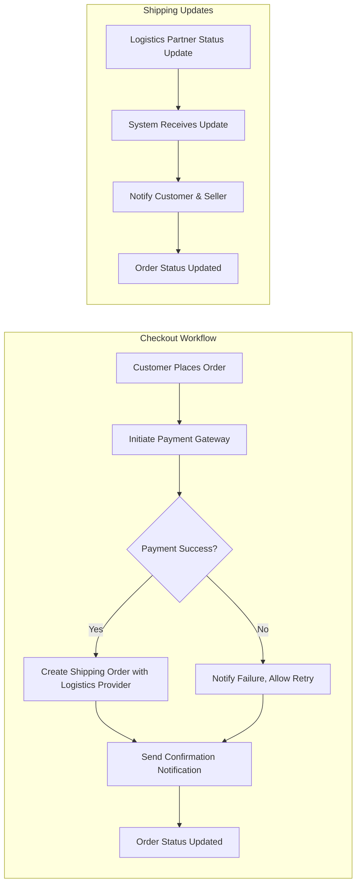

# Integration Requirements for the shoppingMall E-commerce Platform

## Introduction
This document outlines the full set of business requirements for integrating the shoppingMall platform with essential external service providers and partners. It focuses exclusively on the WHAT and WHY of integrations (not technical implementation) to enable backend teams to design, implement, and test integrations that directly enable business operations and user experiences. Each requirement is written in EARS where appropriate and addresses key integration-driven processes critical to the platform's success.

## Integration Summary Table
| Integration Category   | Business Purpose                                               |
|-----------------------|-----------------------------------------------------------------|
| Payment Gateways      | Process secure payments and manage refunds                      |
| Shipping/Logistics    | Fulfill, track, and update shipment status                      |
| Notification Partners | Send order/review/payment alerts via email, SMS, etc.           |
| Third-Party Accounts  | Enable easy authentication and data connection (social/login)    |

## Payment Gateway Integrations
### Business Rationale
E-commerce success depends on seamless payment acceptance, refunds, and payment status management. Multiple payment methods (credit/debit cards, e-wallets, bank transfer) are required for customer choice and business agility.

### Requirements
- THE payment system SHALL support integration with at least two leading payment gateways accepted in target markets.
- THE system SHALL support customer payments for orders using credit/debit cards, bank transfer, and at least one e-wallet.
- WHEN a customer places an order, THE platform SHALL initiate payment authorization and handle relevant statuses (approved, rejected, pending).
- IF payment fails or is declined, THEN THE platform SHALL provide clear, actionable instructions and allow order recovery or payment retry.
- WHEN a refund is approved, THE system SHALL trigger refund via the original payment gateway and update order/refund status promptly.
- THE platform SHALL ensure that all payment and refund processes are logged for audit and business analytics.
- THE system SHALL allow sellers to view payment statuses for their transactions but SHALL NOT expose sensitive customer payment details.

### Example Integration Touchpoints
- Payment authorization at checkout
- Payment status polling and update
- Refund initiation, status polling, and completion
- Dispute/chargeback notification workflows

## Shipping and Logistics Provider Connections
### Business Rationale
Customers demand timely delivery and accurate updates. Integration with leading logistics service(s) is critical for real-time shipment handling, tracking, and returns/cancellations.

### Requirements
- THE platform SHALL support integration with at least two recognized shipping/logistics partners providing national coverage and shipment tracking.
- WHEN an order is marked as ready for shipment by a seller, THE shipping connector SHALL transfer order details to the chosen logistics partner and retrieve a tracking number.
- WHEN a package is shipped or status updates (e.g., dispatched, in transit, out for delivery, delivered) occur, THE system SHALL update the customer and seller accordingly in near real time.
- IF a required shipping partner is unavailable, THEN THE system SHALL allow manual update by sellers and inform the customer of fulfillment status transparently.
- WHERE a customer requests order cancellation or return, THE platform SHALL initiate a pickup/return request with the logistics provider and monitor the process through completion.
- THE shipping system SHALL store and display tracking links for all shipped orders for reference by both customers and sellers.

### Example Integration Touchpoints
- Shipping label creation
- Dispatch and in-transit status notifications
- Delivery confirmation and feedback prompt triggers
- Return or pickup request initiation for cancellations/refunds

## Notification and Communication Partners
### Business Rationale
Notifications boost conversion, customer trust, and platform engagement. Integration with major notification/email/SMS providers is essential for timely alerts on critical business events.

### Requirements
- THE notification subsystem SHALL support integration with at least one email provider and one SMS or messaging gateway.
- WHEN events such as order placement, payment status changes, shipping/return milestones, or review requests occur, THE system SHALL trigger appropriate user- or seller-facing notifications via connected partners.
- WHERE communication partners experience outages or failures, THE system SHALL queue, retry, and escalate notification deliveries in accordance with business impact.
- THE notification system SHALL allow admins to configure content templates and toggle channels (SMS, email, push) by event type.
- THE system SHALL allow customers and sellers to opt in/out of specific notification types as required by privacy policies.
- THE platform SHALL log all notification events for audit, monitoring, and troubleshooting.

### Example Integration Touchpoints
- New order confirmation via email/SMS
- Payment success/failure notification
- Shipping update and package delivered announcement
- Review/rating request after delivery
- Admin alert for major system/process events

## Third-Party Authorization and Account Integration
### Business Rationale
Supporting third-party (social or SSO) login increases acquisition, conversion, and user engagement. Integration with major providers enables easy onboarding and account linking.

### Requirements
- THE authentication system SHALL support optional login via major third-party providers (e.g., Google, Facebook, Apple, or domestic equivalents relevant to market).
- WHEN a user registers or logs in with a third-party provider, THE system SHALL receive and validate user identity claims and create/tokenize the account as per platform policies.
- THE system SHALL provide secure account linking and unlinking for users who wish to connect/disconnect social or partner logins in their profile.
- IF third-party authentication fails, THEN THE platform SHALL guide the user through recovery flows and provide fallbacks to standard email/password login.
- THE system SHALL enable sellers and admins to use only standard platform login (not third-party) for increased control and security.
- THE authentication system SHALL log all third-party integration events for security and compliance.

### Example Integration Touchpoints
- Social login/SSO at registration or login
- Account linking/unlinking inside user profile
- Identity verification and consent management flows

## Cross-Integration Business Scenarios
Below are examples of how these integrations enable core platform workflows. For full user journeys, see the [User Flows and Journeys Document](./04-user-flows-and-journeys.md).

- WHEN a customer completes a purchase, THE system SHALL process payment via the integrated gateway, send notifications, and create a shipment order with logistics partners.
- WHEN a package reaches a shipping milestone, THE system SHALL trigger a notification to keep all actors informed.
- IF a payment or shipping update fails, THEN THE platform SHALL escalate via alternate communication channels (e.g., SMS). 
- WHEN a customer requests a cancellation/refund, THE platform SHALL coordinate payment, logistics, and communication flows across integrations, providing status updates to all actors.

## Constraints and Non-Functional Integration Considerations
- THE system SHALL ensure integrated partners (payment, shipping, notification) provide 99.5% or higher monthly uptime, with failover plans in place.
- THE platform SHALL not transmit or store sensitive payment credentials; payment gateways SHALL own PCI compliance.
- THE system SHALL track all integration interactions with full audit logs for compliance and troubleshooting.
- THE system SHALL process normal business events (payment, shipping, notification) and receive confirmation from integrations within 3 seconds for at least 95% of cases.
- THE platform SHALL support addition or replacement of integration partners with minimal downtime and no data loss.

## Mermaid Integration Flowchart

## Conclusion
All business requirements outlined above must be addressed through integration with proven, trusted external partners. This will ensure secure, reliable payment processing; fast, trackable deliveries; timely communications; and seamless user acquisition. Backend developers have full autonomy in the technical approach, choice of specific vendors, and implementation strategy, provided the above business requirements are satisfied and can be validated through end-to-end workflows.
