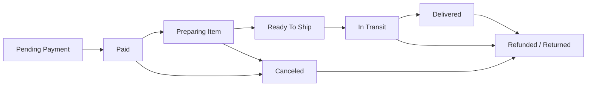
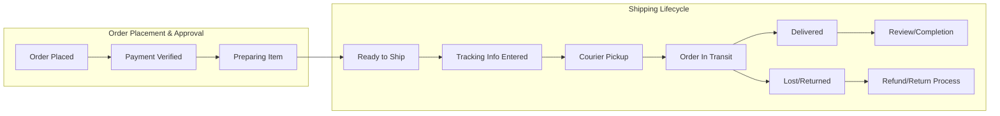

# Order Tracking and Shipping Status Backend Requirements (shopping-mall)

## Order Status Lifecycle

### Status Phases
The order shall progress through the following core statuses:
- Pending Payment
- Paid (Payment Confirmed)
- Preparing Item
- Ready To Ship
- In Transit (Shipping)
- Delivered / Completed
- Canceled
- Refunded / Returned

**Status Transition Diagram:**

### State Transition Business Logic
| From Status        | To Status           | Allowed Actor(s)      | Conditions                                                   |
|-------------------|---------------------|-----------------------|--------------------------------------------------------------|
| Pending Payment   | Paid                | System, Customer      | WHEN payment processed and verified                          |
| Paid              | Preparing Item      | Seller, Admin         | WHEN order is acknowledged and packaged                      |
| Preparing Item    | Ready To Ship       | Seller, Admin         | WHEN packing complete and handover ready                     |
| Ready To Ship     | In Transit          | Seller, Admin         | WHEN courier pickup confirmed, shipping info entered         |
| In Transit        | Delivered           | System, Seller        | WHEN delivery confirmed by carrier or customer               |
| Any               | Canceled            | Customer (with limits), Seller, Admin | WHEN cancellation rules are met                  |
| Delivered         | Refunded/Returned   | Customer (request), Admin/Seller (approval)| WHEN return/refund approved             |

**EARS Format Examples:**
- WHEN payment confirmation is received, THE system SHALL transition order to Paid.
- WHEN seller marks order as prepared, THE system SHALL move the order to Ready To Ship.
- WHEN valid shipping/tracking info is entered, THE system SHALL transition order to In Transit.
- WHEN courier confirms delivery, THE system SHALL set order status to Delivered.
- IF shipment is lost/damaged during In Transit, THEN THE system SHALL allow admin investigation and refund option.
- WHERE cancellation eligibility conditions are met, THE system SHALL allow customer to cancel order.
- WHEN return/refund is approved by admin or seller, THE system SHALL mark the order as Refunded/Returned.
- IF user or system attempts prohibited transition, THEN THE system SHALL reject the action & return reason code.

### State/Transition Validation Rules
- Only allowed actors can trigger each status change. Unauthorized attempts SHALL be blocked.
- System SHALL log timestamp and actor for every transition for audit purposes.
- All transitions and their triggering events SHALL be idempotent and reversible only via approved flows (e.g., refund after delivery, cancellation before shipment).
- Status transitions impact visibility of corresponding order actions (e.g., review allowed only after Delivered).

## Shipping Updates

### Seller/Platform Shipping Process
- Seller or admin initiates shipment by entering/selecting:
  - Courier company
  - Tracking number
  - Estimated shipment & arrival dates
- WHEN shipment info is registered, THE system SHALL validate tracking information against known carrier formats and store details per order item or package.
- WHEN shipment is registered and status is In Transit, THE system SHALL update customer order view with real-time tracking link and logistics details.
- SELLER SHALL be able to update tracking information in cases of shipment update or split shipment.
- WHEN shipment is delayed, lost, or status cannot be updated, THE system SHALL alert seller and admin for manual intervention.
- IF delivery is confirmed by courier API or customer, THEN THE system SHALL mark order as Delivered and trigger post-delivery flows (e.g., review enabled, refund/cancel flow restricted).

**EARS Format:**
- WHEN seller enters shipping/tracking info and confirms, THE system SHALL notify the customer and update order status.
- IF tracking info fails validation, THEN THE system SHALL display reason code and block transition.
- WHILE order is In Transit, THE system SHALL query external carrier APIs for latest tracking status and update order record.
- IF shipment is returned to sender, THEN THE system SHALL set order to Refunded/Returned and notify relevant actors.
- WHEN admin/seller updates estimated delivery, THE system SHALL record and communicate updates immediately to customers.

### Integration Scenarios
- THE system SHALL support integration with major domestic/international couriers (configuration-driven).
- External courier API credentials and settings SHALL be managed securely by admin.
- Multi-package/split shipment per order SHALL be supported and tracking managed individually.
- IF API integration fails or is unavailable, THEN THE system SHALL allow manual shipping updates and flag for admin review.

## Tracking Notifications

### Notification Flows
- WHEN order status changes (Paid, Preparing, Ready To Ship, In Transit, Delivered), THE system SHALL notify the customer with a timestamped message and details.
- WHERE tracking updates are received from courier API, THE system SHALL push tracking status changes to the customer in real-time or near real-time (refresh every 15 min, config-driven).
- WHILE order is In Transit, THE system SHALL provide tracking page/URL with latest details for customer.
- IF seller/admin updates tracking info, THEN THE system SHALL alert customer and log the event.
- IF shipment encounters delay/loss/undeliverable event, THEN THE system SHALL notify both customer and seller, providing escalation options to the admin.

### Actor-specific Notifications
| Event                         | Recipient(s)         | Notification Requirement                 |
|-------------------------------|----------------------|------------------------------------------|
| Status updated                | Customer, Seller     | WHEN order status changes                |
| Tracking info changed         | Customer             | WHEN new/updated shipment details issued |
| Delivery confirmed            | Customer, Seller     | WHEN delivered status set                |
| Shipment problem/unusual      | Customer, Seller, Admin | WHEN delay/loss/system error         |
| Cancellation/return completed | Customer, Seller     | WHEN refund/cancel finalized             |

**EARS Format:**
- WHEN order status changes, THE system SHALL send notification to all relevant actors.
- IF notification delivery fails, THEN THE system SHALL log and retry per policy and escalate to admin on repeated failure.

### Error Handling and Edge Scenarios
- IF status transition is attempted out of allowed order (e.g., Deliver before shipping), THEN THE system SHALL block action and provide error code/reason.
- IF tracking information is invalid/expired/unavailable, THEN THE system SHALL prompt seller/admin for update and hide tracking from customer until resolved.
- IF multi-shipment order has mixed delivery states, THEN THE system SHALL represent per-package statuses and overall state to customer, enabling consistent follow-up.
- WHERE cancellation/refund is in process during shipping, THE system SHALL coordinate flow to prevent double refunds or lost packages, and alert support/admin.

## Mermaid: Shipping & Order Tracking Process

## EARS Requirements Summary Table
| Requirement Scenario                                                | EARS Format Example                                                                 |
|---------------------------------------------------------------------|-------------------------------------------------------------------------------------|
| Transition from Paid to Preparing                                   | WHEN payment is confirmed, THE system SHALL set order to "Preparing"                |
| Seller enters shipment info                                         | WHEN seller enters shipment info, THE system SHALL validate and update order status  |
| Customer receives tracking notification                             | WHEN order status becomes "In Transit", THE system SHALL send tracking to customer  |
| Handling courier API error                                          | IF courier API call fails, THEN THE system SHALL alert admin & offer manual fallback |
| Lost package                                                        | IF shipment is lost in transit, THEN THE system SHALL flag, notify all actors, allow refund |
| Split/multi-shipment status                                         | WHERE order includes split shipments, THE system SHALL track and represent each separately |
| Notification delivery failure                                       | IF notification fails, THEN THE system SHALL retry and escalate to admin on repeats  |

## Performance & Response Requirements
- THE system SHALL process and display all order status changes within 2 seconds of relevant event or action.
- Tracking information SHALL be refreshed from external courier APIs at least every 15 minutes, configurable per courier/platform policy.
- All notification and tracking updates SHALL be durably logged for audit purposes.

### End of Document