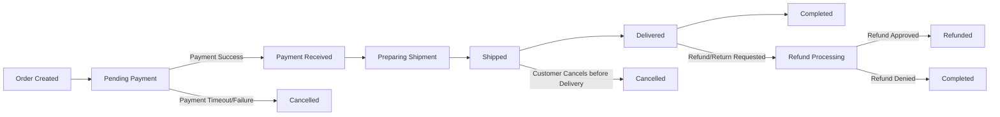
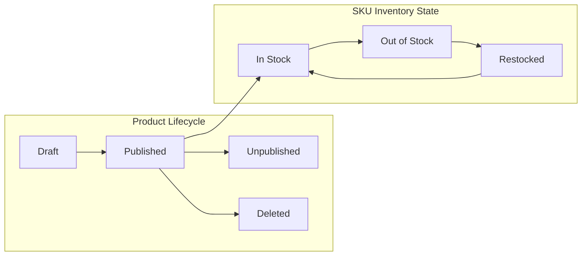
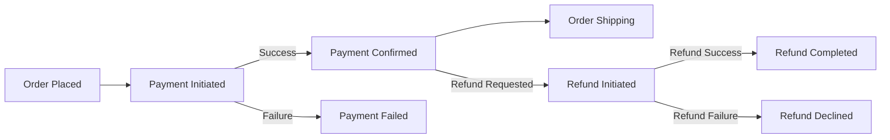

# Data Flow and Lifecycle Requirements for ShoppingMall Platform

## Introduction

This document defines the comprehensive business flow and lifecycle for the ShoppingMall platform’s core entities: orders, products and inventory (SKUs/variants), payments, and related refunds/cancellations. It clarifies how information moves and changes as each entity progresses through its business life cycle, using natural language and the EARS requirements standard. All references are to business processes and expectations, not technical detail.

## Order Data Lifecycle

### Order Creation
- WHEN a customer confirms checkout, THE platform SHALL create a distinct order record containing all chosen products, SKUs, the delivery address, and payment method.
- THE platform SHALL assign a unique identifier to each order upon creation and set its initial status to "Pending Payment".
- WHEN the customer completes payment, THE platform SHALL change the status to "Payment Received" and reserve/deduct inventory for the SKUs in the order.

### Order Processing and Shipping
- WHEN payment is confirmed, THE platform SHALL mark the order as "Preparing Shipments" and notify the seller(s) to process packing and logistics.
- WHEN a seller marks an item as shipped, THE platform SHALL update the shipment status, record tracking information, and move the order’s status to "Shipped".
- WHEN the order is delivered or the customer confirms receipt, THE platform SHALL record the event and update order status to "Delivered" and then "Completed".

### Multi-Seller and Partial Shipping
- WHERE multiple sellers or items are ordered together, THE platform SHALL track separate shipment statuses for each relevant item/shipment within a single overarching order.

### Order Cancellation and Refunds
- IF payment is not received within a set window (e.g., 30 minutes), THEN THE platform SHALL automatically cancel the order and release reserved SKUs.
- WHEN a customer requests cancellation before shipping, THE platform SHALL cancel the order if no item has yet shipped and revert inventory.
- WHEN a return or refund is requested after delivery, THE platform SHALL mark the order status as "Refund/Return Requested" and trigger a seller/admin action for approval.
- WHEN a refund or cancellation is approved, THE platform SHALL adjust order status to "Refunded" or "Cancelled" as business logic dictates and restore stock appropriately.

#### Order Data Lifecycle Flow

### Summary for Orders
- All status changes must be audit-trailed for actor, timestamp, and reason.
- Permission to update/view order status strictly follows the system’s permission matrix.

## Product and Inventory State Changes

### Product Listing & Updates
- WHEN a seller lists a product, THE platform SHALL require entry of at least one SKU (variant).
- WHEN product info (title, description, images, price, SKUs) changes, THE platform SHALL immediately reflect the changes and track them in an immutable audit log.

### SKU/Variant Management
- WHEN a SKU’s characteristics (color, size, etc.) change, THE platform SHALL validate SKU uniqueness within the product.
- IF a SKU is deleted, THEN THE platform SHALL prevent new orders for it but maintain historical data for past orders.

### Inventory Management
- WHEN any inventory change occurs (sale, restocking, admin/seller action), THE platform SHALL timestamp and record the new quantity and action source.
- IF a SKU’s inventory reaches zero, THEN THE platform SHALL set "Out of Stock" and prevent new orders for that SKU.

### Unpublishing/Deleting Products
- WHEN a product or SKU is unpublished/deleted, THE platform SHALL remove it from customer listings but retain all records for legal and order history.

#### Product and Inventory State Model

### Summary for Product/Inventory
- No overselling permitted; changes must be real-time and logged.
- All actions related to product or inventory changes are auditable by admin.

## Payment and Refund Event Flows

### Payment Process
- WHEN customer initiates payment, THE platform SHALL start payment authorization with chosen gateway.
- WHEN payment succeeds, THE platform SHALL update the order and notify the customer and involved seller(s).
- IF payment fails, THEN THE platform SHALL clearly inform the customer and allow them to retry or use alternative methods.

### Refund Process
- WHEN a refund is triggered (by admin/seller after request), THE platform SHALL process refund via the gateway, update all order and payment logs, and notify all impacted parties.
- WHERE a partial shipment/refund situation arises, THE platform SHALL support partial refund and update relevant records per business rule.

#### Payment and Refund Lifecycle

### Summary for Payment/Refunds
- Payment and refund events must be synchronized, reliable, and auditable; failure/recovery flows must be supported end-to-end.

## Data Retention and Archival Practices

### Record Retention Policies
- THE platform SHALL retain all transactional records (orders, payments, refunds, etc.) for at least the legally or contractually mandated time period (default 5 years, or longer as required).
- WHEN products or accounts are deleted, THE platform SHALL preserve historical data for audits and dispute resolution.
- WHEN data exceeds mandated retention duration, THE platform SHALL securely archive or erase it (with audit trail), except where subject to dispute/legal action.
- WHERE disputes or investigations are in progress, THE platform SHALL retain affected data regardless of retention expiration.
- THE platform SHALL provide clear notification to actors about data retention and archival policies at appropriate business interaction points.

## Visual Flows Reference
See above Mermaid diagrams for visual state and data progression across orders, products, SKUs, payments, and refunds. All diagrams use left-to-right orientation and double quotes in all node labels for parsing compatibility.

## Integration and References
For end-to-end lifecycle understanding, refer to:
- [User Flows and Journeys Documentation](./04-user-flows-and-journeys.md)
- [Business Rules and Validation Requirements](./06-business-rules-and-validations.md)

Business requirements above should be implemented in full alignment with referenced process documentation for consistency and completeness.