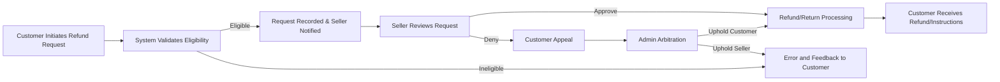
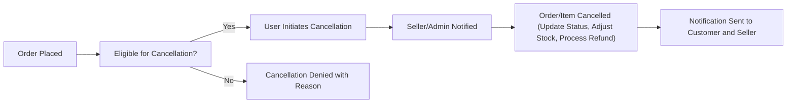

# Order History, Refund, and Cancellation: Business Requirements and Workflows

## 1. Order History Access

### 1.1 Actors and Permissions
- WHEN a customer is authenticated, THE system SHALL allow and provide access to the customer's complete personal order history, including search, pagination, and filtering capabilities.
- WHEN a seller is authenticated, THE system SHALL allow the seller to access the order history of products managed by that seller, with filtering and export options for managed products only.
- WHEN an admin is authenticated, THE system SHALL permit full access to all order histories across the platform, with aggregate, search, and auditing abilities.
- IF an unauthenticated actor attempts to view any order history, THEN THE system SHALL deny access and direct the actor to authenticate.

### 1.2 View Details & Search
- THE system SHALL allow customers to view detailed order records (products, status, shipping, payment, timestamps).
- THE system SHALL provide search by order number, product name, order status, or date range.
- THE system SHALL paginate customer and seller order history lists, allowing navigation across multiple pages.
- THE system SHALL allow download/export of order history in CSV for sellers and admins.
- IF a customer requests information for an order not belonging to their account, THEN THE system SHALL deny access and display an appropriate error.

## 2. Refund/Return Flow

### 2.1 Refund Request Initiation
- WHEN an order or order item is eligible for refund/return by business rules, THE system SHALL present the refund/return request option only for eligible cases.
- WHEN a customer requests a refund/return, THE system SHALL require selection of specific items (if partial) and a reason for the request.
- WHERE product-specific or seller policies require evidence, THE system SHALL require uploading supporting files (e.g., photos).

### 2.2 Refund/Return Processing
- WHEN a refund/return request is submitted, THE system SHALL notify the corresponding seller and lock the order/item from further cancellation or modification until resolution.
- THE system SHALL record the timestamp, all communications (messages/attachments), and status changes in an immutable history log.
- WHEN a seller receives a refund/return request, THE system SHALL provide review, response (approve/deny), and messaging capabilities to the seller within policy days.
- WHEN a seller fails to respond within the business-defined timespan (configurable, default 3 business days), THE system SHALL escalate the request to admin for intervention.
- WHEN a seller approves, THE system SHALL initiate the refund or return logistics as per business rules (inventory checks, logistics partner API, or customer instructions on shipping return goods).
- WHEN a seller rejects a request, THE system SHALL provide reason tracking, and THE customer SHALL have the right for admin review.
- WHEN an admin decides, THE decision SHALL override seller approval/denial and trigger the next business process (refund, rejection, or escalated arbitration).

### 2.3 Refund Status Tracking
- THE customer SHALL be able to view current, past, and pending refund/return statuses in real time, including all status transitions, event timestamps, and actor responsible.
- THE system SHALL notify customers at each stage (request filed, under review, approved, rejected, refund complete).
- WHERE refund is monetary, THE system SHALL process return of funds via the original payment method, and update financial records accordingly.

## 3. Cancellation Process

### 3.1 Cancellation Request
- WHEN an order/item is eligible for cancellation (by business rules such as status 'processing', not 'shipped', or before seller fulfillment/acceptance), THE customer SHALL be presented with a 'Cancel' option.
- IF an order/item is not cancellable (e.g., already shipped, processing refund, or in special disallowed cases), THEN THE system SHALL deny the request and communicate the specific reason.
- WHEN a customer initiates a cancellation, THE system SHALL require confirmation and allow cancellation per item or entire order if supported.
- WHEN cancellation is confirmed, THE system SHALL update order status, adjust inventory, and trigger notification to seller (and to admin if order value exceeds configurable threshold for review).

### 3.2 Handling Seller & Admin-Initiated Cancellations
- WHEN a seller is unable to fulfill an order (e.g., out of stock), THE seller SHALL be able to cancel order/items with mandatory justification, which triggers customer and admin notification and refund if applicable.
- WHEN an admin cancels an order/item (e.g., fraud detection), THE action SHALL be logged, and all relevant parties SHALL be notified.
- THE system SHALL document the initiator of every cancellation and associate the action with a responsible actor.

### 3.3 Status Tracking
- THE customer SHALL be able to track cancellation request statuses with timestamped updates and reasons.
- THE system SHALL show past and active cancellation reasons and actors for audit and dispute handling.

## 4. Cross-Actor Interactions
- THE system SHALL enforce that only authorized actors can access or modify order history records (customers: own; sellers: managed; admins: all).
- WHEN a refund/cancellation process overlaps (e.g., user requests both), THE system SHALL handle conflicts according to business priority rules (e.g., refund in process blocks cancellation).
- THE system SHALL audit every action related to refunds/cancellations for compliance.

## 5. Business Rules and Validation
- THE system SHALL only allow refunds/cancellations on eligible items/orders per item condition, status, payment method, seller policy, and elapsed time from order date (configurable, default 7-30 days, customizable per item).
- THE system SHALL validate customer inputs for refund/cancellation (e.g., reason length, attachment type/size) before request submission.
- THE system SHALL prevent duplicate or abusive requests from the same user/order/item within configured thresholds.
- WHERE business rules require, THE system SHALL allow only partial refunds/cancellations on eligible items, with clear allocation of return amounts and stock updates.

## 6. Error Handling and Exceptional Scenarios
- IF a user requests a refund or cancellation on an ineligible item/order, THEN THE system SHALL return a specific error message indicating eligibility violation.
- IF payment processor integration fails during refund, THEN THE system SHALL retry and escalate to admin on repeated failure, with customer notification.
- IF a seller or admin takes longer than allowed to process/refund, THEN THE system SHALL auto-escalate and log for reporting.

## 7. Performance Expectations
- WHEN customer accesses order history or refund/cancellation status, THE system SHALL respond within 2 seconds for typical use cases (<100 orders per user).
- WHEN a refund/cancellation is requested, THE system SHALL acknowledge request creation instantly (<=1 second), and update status asynchronously.

## 8. User Scenarios and Example Workflows

### Scenario 1: Customer Initiates Refund
1. Customer logs in → navigates Order History → selects delivered order eligible for refund
2. Customer selects one item, selects "refund," chooses reason, uploads photo
3. Seller receives request, investigates, and responds in system dashboard
4. Customer receives approval or rejection, system handles refund, inventory, and notification

### Scenario 2: Seller Cancels Out-of-Stock Item Before Shipping
1. Seller receives new order, realizes item unavailable
2. Seller selects order, chooses "cancel item," enters explanation
3. Customer receives notification; refund processed automatically

### Scenario 3: Admin Resolves Escalated Refund Dispute
1. Customer requests refund
2. Seller rejects and adds reason
3. Customer appeals, admin reviews all logs, makes a binding decision
4. System processes outcome and records all actions with timestamps

## 9. Mermaid Diagrams

### 9.1 Refund/Return Lifecycle Flow

### 9.2 Order Cancellation Decision Flow

## Document End