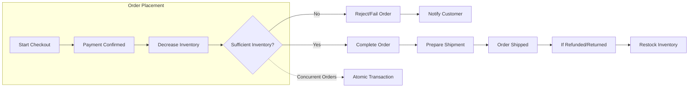

# Inventory Management Requirements - Shopping Mall Platform

## 1. Inventory Management Overview
Inventory management is the backbone for accurate product sale, avoidance of overselling, fulfillment rates, and customer satisfaction. The system SHALL manage inventory per product SKU with real-time status, support for atomic adjustments, and traceable actions by customers, sellers, and admins.

## 2. Inventory Adjustment Rules
### 2.1 Creation, Assignment, and Initial State
- THE system SHALL associate each unique SKU with a tracked inventory count.
- WHEN a seller onboards a new product/SKU, THE system SHALL require the seller to set an initial stock quantity.
- WHERE an SKU is newly listed, THE system SHALL prevent listing unless an initial inventory quantity is provided.
- THE system SHALL consider an SKU out-of-stock IF inventory count is zero or negative.

### 2.2 Adjustment Triggers (EARS Format)
- WHEN a customer places an order and payment is successfully confirmed, THE system SHALL decrease the inventory for each relevant SKU by the purchased quantity atomically.
- IF payment fails or is abandoned during checkout, THEN THE system SHALL NOT decrement inventory for the affected SKUs.
- WHEN an order is cancelled before shipment, THE system SHALL restore the inventory quantities for all associated SKUs, in accordance with the cancellation reason and timing.
- WHEN a return or refund is approved and item(s) are restocked based on business rules, THE system SHALL increment inventory for the corresponding SKUs, if admin or seller marks as "item received".
- WHEN a seller manually adjusts their inventory for a SKU, THE system SHALL record the adjustment reason, actor, previous and new quantity, and timestamp.
- WHEN an admin performs any inventory override, THE system SHALL maintain a permanent audit log including actor, adjustment details, and justification.

### 2.3 Integrity, Validation, and Concurrency
- THE system SHALL prevent negative inventory through atomic adjustment transactions.
- WHEN simultaneous orders for the same SKU occur, THE system SHALL process inventory in isolation to avoid overselling.
- WHEN requested adjustment quantity exceeds available inventory, THEN THE system SHALL reject the operation and provide an error response.

## 3. Stock-out Handling
- WHEN an SKU's inventory quantity becomes zero, THE system SHALL mark the SKU as "out-of-stock" and prevent it from being added to any cart or processed in a new order.
- WHEN inventory is restored above zero, THE system SHALL automatically update the SKU status to "available for purchase".
- IF an out-of-stock SKU exists in any customer's cart, THEN THE system SHALL inform the customer of the out-of-stock state when they view their cart or attempt checkout, and prevent order creation for the unavailable SKU.
- WHEN sellers attempt to decrease inventory below 0 for any SKU, THEN THE system SHALL reject the action with a clear error message.
- WHEN customers attempt to order more units than the available inventory, THE system SHALL limit the order to the available quantity or reject the order if no units remain.

## 4. Inventory Visibility
- THE system SHALL ensure customers can see the "in stock" or "out of stock" status for all products.
- WHERE inventory levels for a SKU are low (configurable threshold; e.g. 5 units), THE system SHALL display a "few left" indicator to the customer.
- THE system SHALL hide exact inventory numbers from customers but display accurate stock status indicators.
- Sellers SHALL have full visibility of their inventory quantities, historical adjustments, sales velocity, and low-stock alerts for their products only.
- Admins SHALL have global visibility into all inventory data, past transactions, and adjustment logs.

## 5. Business Logic and Scenarios

### 5.1 Customer Flows
- WHEN a customer views a product detail page, THE system SHALL show if the product is available for purchase or out of stock.
- WHEN a customer attempts to add an out-of-stock SKU to their wishlist, THE system SHALL allow it but inform them the item is currently unavailable for ordering.
- WHEN a customer adds items to cart and proceeds to checkout, THE system SHALL reserve inventory units only after payment is confirmed.
- WHEN customers place an order that includes multiple SKUs, THE system SHALL process each SKU's inventory independently and atomically.

### 5.2 Seller Operations
- Sellers SHALL only be allowed to modify inventory quantities for products/SKUs they own.
- Sellers SHALL receive automatic notifications on low stock and out-of-stock events for their SKUs.
- Seller inventory adjustments SHALL require a reason code (restock, manual correction, etc.).

### 5.3 Admin Responsibilities
- Admins SHALL be able to adjust inventory for any SKU, with mandatory justification.
- All admin adjustments SHALL be recorded for auditing, including before/after values and reason.
- Admins SHALL be able to generate reports on inventory turnover, stock-out frequency, and adjustment history.

### 5.4 Inventory and the Order Lifecycle

## 6. Error Handling Scenarios
- IF a seller attempts to modify inventory for another seller's SKU, THEN THE system SHALL reject with an authorization error.
- IF inventory service is temporarily unavailable, THEN THE system SHALL reject customer/cart/order requests with a standardized error response and instructions to retry.
- IF system detects data inconsistency (e.g. inventory drift), THEN THE system SHALL lock affected SKUs from order placement and escalate to admin.
- WHEN negative inventory or oversell is detected, THE system SHALL auto-correct and flag for admin review.

## 7. Performance and Operational Constraints
- THE system SHALL be capable of handling inventory adjustments for flash sales or high-demand events with accuracy and without significant latency (inventory check and update must occur within 300ms under normal load).
- THE system SHALL record all inventory events (adjustments, restores, failures) in an auditable log per SKU.
- THE system SHALL support operational/maintenance windows and soft locks for large-scale bulk inventory changes (by admin only).

## Permissions Matrix

| Action                                 | Customer | Seller    | Admin     |
|----------------------------------------|----------|-----------|-----------|
| View stock status                      | ✅        | ✅ (own)   | ✅ (all)  |
| Adjust inventory quantity              | ❌        | ✅ (own)   | ✅ (all)  |
| View adjustment/audit logs             | ❌        | ✅ (own)   | ✅ (all)  |
| Restore inventory after cancellation   | Auto     | Auto      | Auto      |
| Override/force inventory value         | ❌        | ❌        | ✅        | 
| Configure low-stock thresholds         | ❌        | ✅ (own)   | ✅ (all)  |

---

For upstream business process requirements, refer to the [Functional Requirements Document](./04-functional-requirements.md), [Product and Catalog Management Requirements](./05-product-catalog.md), and [Order Placement and Payment Process](./06-order-payment.md).

This document provides business requirements only; all technical implementation decisions, including database, API, and infrastructure specifics, are left to the development team.