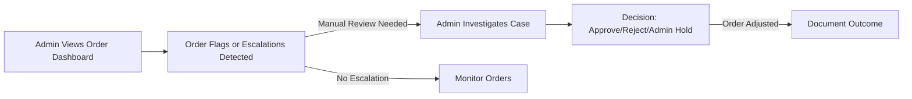
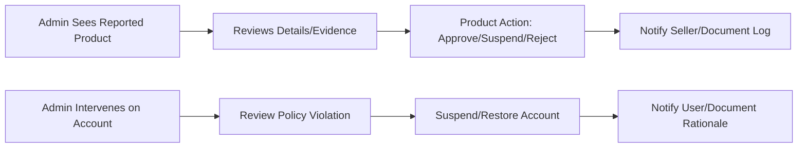
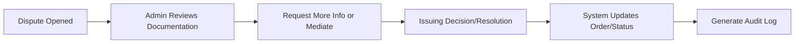

# Admin Operations and Platform Management Requirements for Shopping Mall

## Introduction
Defines all business requirements, operational expectations, and process flows for the administrator (admin) role. Focuses on business logic. EARS format is used where appropriate for immediate backend implementation.

## 1. Order Oversight

### 1.1 Proactive Monitoring
THE admin panel SHALL provide a real-time dashboard of all orders with current statuses, payment, shipping, exception flags, and cancellations. Admins SHALL have access to view, sort, and filter orders by seller, customer, status, and time.

### 1.2 Order Intervention and Escalation
WHEN an order is flagged for review (suspected fraud, seller inaction, repeated cancellations), THE admin SHALL receive real-time notification and gain tools to investigate. If escalated by customer/seller, admin SHALL access all documentation and communication history.

### 1.3 Order Hold and Manual Adjustments
WHEN an admin places an order on hold, THE system SHALL pause all downstream fulfillment until admin approval. WHEN a fraudulent, error, or policy-breaching order is confirmed, THE admin SHALL cancel, refund, and record all actions with justification. Manual adjustments to order status, fees, or refunds require audit logging and clear documentation for transparency.

### 1.4 SLA, Performance, and Analytics
THE dashboard SHALL track metrics (e.g., average resolution time, open disputes, refund rate) and present trend analytics for operational KPIs. When escalations exceed thresholds, THE system SHALL notify the admin team.

#### EARS Format
- WHEN an admin flags, investigates, or acts on any order, THE system SHALL log all interventions and maintain immutable audit trails.

## 2. Product & User Management

### 2.1 Product Moderation and Approval
THE admin SHALL view, search, and filter all products/SKUs. WHEN policy, legal, or copyright issues are reported, THE admin SHALL approve, reject, or suspend products with written reasons; sellers receive corresponding notifications.

### 2.2 Seller Account Handling
THE admin SHALL suspend, restore, or permanently ban seller accounts in cases of policy violation, fraud, or inactivity. Sellers can appeal bans; admins review and document each case.

### 2.3 Customer Account Handling
THE admin SHALL review, suspend, or restore customer accounts for documented violations or abuse (e.g., abuse of returns/reviews, payment issues). Suspension triggers notification and appeal instructions.

### 2.4 Role, Permission & Platform Policy
THE admin SHALL modify user roles (within policy), configure rules (e.g., refund/return period, dispute cap). New mandates require platform-wide notifications.

#### EARS Format
- WHEN an admin edits or enforces user/product policy, THE system SHALL log all changes and trigger notifications as required.
- IF unauthorized admin action is attempted, THEN THE system SHALL deny and record with error message.

## 3. Dispute, Refund, and Cancellation Handling

### 3.1 Dispute Case Oversight
WHEN a dispute is opened, THE admin SHALL review all related documentation and intervene when other actors cannot resolve. Further evidence may be requested; final binding decision is possible.

### 3.2 Refund/Cancellation Approval
WHEN an automated refund/cancellation is rejected or inconclusive, THE admin SHALL assess and decide. Allowed: override, adjustment, or denial with explanation, supporting full traceability.

### 3.3 Documentation and Audit Trails
All significant dispute, refund, and cancellation actions by admin MUST be logged with timestamps, actors, and reasons, and be available for exported audit review.

#### EARS Format
- WHEN an admin issues a dispute/refund/cancellation decision, THE system SHALL process order/account changes, notify relevant parties, and log comprehensively.
- WHEN key limits (max open disputes, refund delay) are exceeded, THE system SHALL escalate for admin review.

## 4. Platform Administrative Operations

### 4.1 Dashboard & Insights
THE admin dashboard SHALL present analytics on order trends, refund rates, user/seller counts, product trends, and warnings for abnormal/fraudulent activity. All dashboard accesses are logged.

### 4.2 Announcements & Communication
THE admin SHALL create, edit, and manage platform-wide announcements (maintenance, policy updates). System tracks read rates and delivery.

### 4.3 Configuration & Control
THE admin SHALL adjust global business parameters—tax, fees, return/cancellation periods. Changes log modifications and recalculations.

## 5. Error Handling and Performance

### 5.1 Error/Edge Cases
IF unauthorized admin actions occur, THEN THE system SHALL refuse, notify the actor, and audit. Critical failures (e.g., refund issue) require admin notification, full logging, and guidance for next steps. Document/evidence gaps block key admin actions and prompt requests for resolution.

### 5.2 Responsiveness and SLA
WHEN an admin action (suspension, refund, dispute approval) is performed, THE system SHALL process it within 2 seconds for 99.9% of cases. Long-running actions require progress notification and logs. The dashboard SHALL load actionable data in under 2 seconds.

## 6. Workflow Diagrams

### 6.1 Admin Order Oversight

### 6.2 Product & User Management

### 6.3 Dispute/Refund Handling

## 7. Business Rules Summary and KPIs

THE admin SHALL ensure interventions are justified, auditable, and subject to review. System shall support KPIs: dispute resolution time, interventions, violations, seller/user outcome satisfaction.

---
