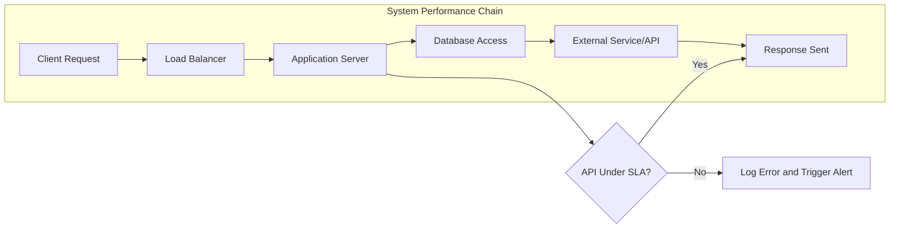

# Non-Functional Requirements, Constraints, and Glossary

## Performance Requirements

- THE platform SHALL maintain a 99.95% monthly uptime, measured by availability monitoring tools, with downtime not exceeding 22 minutes per month.
- WHILE the system is under normal load (<= 1,000 concurrent users), THE backend SHALL serve 95% of catalog search, product page, cart, and order APIs within 700 milliseconds round-trip at the application layer.
- WHILE traffic spikes (up to 5,000 concurrent users) occur, THE system SHALL degrade gracefully, maintaining at least 80% success rate with responses under 1.5 seconds and providing clear user error feedback during overload.
- IF any application API fails to respond within declared SLAs, THEN THE system SHALL log full context (endpoint, error message, time, user) for review and monitoring purposes.
- WHEN backend or payment providers are unreachable, THE system SHALL return a unified error code and message within 2 seconds.
- THE batch processing jobs (e.g., scheduled inventory sync, order summaries) SHALL complete within business-defined windows (e.g., between 2-4am KST) and notify admin users upon failure.
- THE platform SHALL be capable of horizontal scaling to accommodate heavy campaigns or known peak events (e.g., annual sales, marketing pushes).

#### Summary Table: Performance KPIs
| Area               | Service Level Target     | Response Time    | Notes                       |
|--------------------|-------------------------|------------------|-----------------------------|
| API Uptime         | >=99.95% monthly        | -                | Excluding planned maint.    |
| Core API response  | 95% < 700ms             | < 700ms          | Catalog, cart, order flows  |
| Peak traffic       | 80% < 1.5s              | < 1.5s           | Up to 5,000 users           |
| Batch jobs         | 100% success in window  | < 2 hrs (nightly)| Critical for reporting      |

## Security & Privacy

- THE system SHALL use JWT-based access tokens for all authenticated requests and SHALL encrypt secrets using environment-managed vaults.
- THE platform SHALL require TLS (HTTPS) for all external and internal traffic, rejecting all plaintext connections at the edge.
- THE system SHALL store user passwords salted and hashed (bcrypt or industry equivalent) and SHALL never persist plaintext passwords anywhere within infrastructure.
- THE system SHALL verify user email upon registration and periodically require re-authentication for critical account changes (password, address, payment method).
- WHEN payment information is provided, THE system SHALL process it ONLY via PCI DSS–compliant third-party payment processors; card information SHALL NOT persist in platform storage.
- THE system SHALL implement audit logging for all admin and seller-sensitive actions, retaining logs for a minimum of 1 year, and SHALL support traceability of every state-changing API call performed by admin or seller actors.
- THE system SHALL enforce rate limits on all endpoints (customer, seller, and admin) to mitigate abuse, with rate thresholds defined by ops policy.
- IF login fails for an account more than 5 consecutive times within 10 minutes, THEN THE system SHALL lock access for 15 minutes and send a notification email to the user.
- WHERE compliance or regulatory mandates data purging (e.g., account deletion), THE system SHALL support irreversible user data wipes within 30 days from request.

## Regulatory Compliance

- THE platform SHALL meet GDPR, CCPA, and KISA (Korean personal data protection) requirements for all users in their respective jurisdictions.
- WHEN users request data export or erasure, THE system SHALL process these requests within 10 business days and notify the user upon completion.
- THE platform SHALL display and request explicit user consent for privacy terms, data sharing with third parties, and marketing communications prior to account creation.
- WHEN an order includes regulated goods (e.g., age-restricted items), THE system SHALL verify legal eligibility before transaction completion.
- THE platform SHALL retain transaction logs and payment records for a minimum of 5 years or as required by local law.
- IF any legal, compliance, or privacy violation is detected, THEN THE system SHALL escalate alerts to admin within 1 hour and log the full breach context.

## Business Constraints

- THE system SHALL support at least 2,000 sellers and 200,000 product SKUs within a single logical tenant.
- THE platform SHALL allow zero downtime deployments for application and schema migrations, and SHALL have a tested rollback plan for feature and data hotfixes.
- THE system SHALL provide automated daily backups for all critical data, with a 99.9% restoration success rate across the previous 30 days.
- WHEN planned maintenance or outages are scheduled, THE platform SHALL communicate at least 48 hours in advance to all affected users and display a maintenance banner during the affected window.
- THE platform SHALL provide all core business functionality in English and Korean, with user-facing error messages and critical communications fully localized.
- THE system SHALL support deployment in multiple availability zones within the chosen cloud provider to minimize impact from regional failures.

## Glossary & Terms

| Term                     | Definition                                                                                                      |
|--------------------------|-----------------------------------------------------------------------------------------------------------------|
| Availability             | The percentage of time the system is operational, excluding planned maintenance.                                 |
| SKU                      | Stock Keeping Unit, a unique identifier for each variation of a product (color, size, etc).                     |
| JWT                      | JSON Web Token, used for stateless authentication and identity propagation.                                     |
| PCI DSS                  | Payment Card Industry Data Security Standard for secure card processing.                                        |
| GDPR                     | General Data Protection Regulation, EU law for data privacy.                                                    |
| CCPA                     | California Consumer Privacy Act, a data privacy law for California residents.                                   |
| KISA                     | Korean Internet & Security Agency, responsible for Korea’s data privacy regulation.                             |
| Uptime                   | Duration the system is fully operational and accessible.                                                        |
| Zero Downtime Deployment | Deployment approach that does not interrupt end-user service during updates or migrations.                      |
| Rate Limiting            | Restricting the number of requests a user or actor can make in a given time window for security.                |
| Audit Logging            | Logging of actions by administrators and privileged users for traceability and compliance.                      |
| Bcrypt                   | A password-hashing algorithm designed for secure storage of password credentials.                               |
| Personal Data            | Any information relating to an identified or identifiable individual, including email, address, and payment info.|
| Data Purging             | The complete, irreversible deletion of all user or transaction data from the system upon legal or user request.  |
| Disaster Recovery (DR)   | Strategies and tools for restoring full service following catastrophic failure.                                 |
| Batch Job                | Scheduled process which operates on multiple records, typically outside of normal user transaction flows.        |
| Localization             | Providing content and communication in multiple languages for user-facing systems.                              |
| Fault Tolerance          | System’s ability to remain operational in presence of component failure.                                       |
| Irreversible Deletion    | Data deletion which cannot be undone, meeting privacy laws and regulatory requirements.                        |

---

For functional, actor-based, and business scenario requirements, reference the [Functional Requirements Document](./04-functional-requirements.md). For operational and management flows, refer to the [Admin Operations and Management](./13-admin-operations.md) documentation.