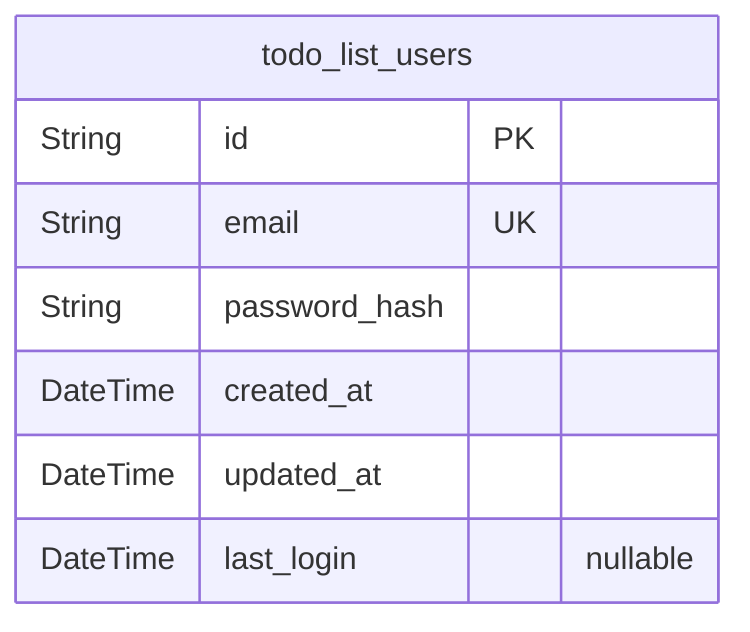
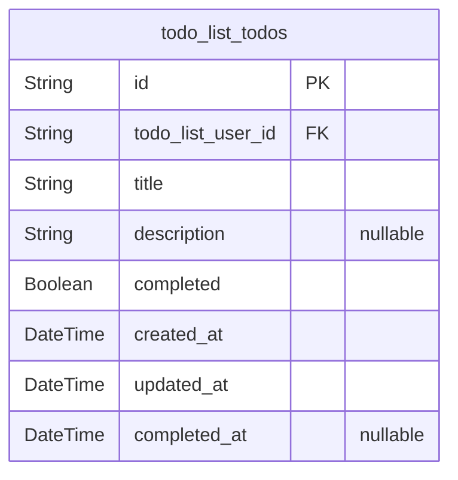

# Prisma Markdown

> Generated by [`prisma-markdown`](https://github.com/samchon/prisma-markdown)

- [Actors](#actors)
- [Todos](#todos)

## Actors

### `todo_list_users`

Authentication and identity table for all application users. Holds
essential user credentials, identification, and minimal auditing
information. Used for user registration, login, and ownership association
with [todo_list_todos](#todo_list_todos) (in other component). Each user record is
uniquely identified by email and manages its own password. Deletion or
modification of user accounts is audited via timestamps. Email uniqueness
enforces single identity. No advanced roles exist; this is the only actor
type in the system. No PII beyond minimal required for authentication is
stored. This table does not directly reference any business data tables,
but is referenced by them for ownership.

Properties as follows:

- `id`: Primary Key.
- `email`
  > Unique user email address for identification and login. Must be unique;
  > serves as user identity within the service.
- `password_hash`
  > Secure hash of the user password (never stores plaintext password). Used
  > for login verification only. Application must enforce proper hashing
  > algorithms.
- `created_at`
  > Timestamp when the user account was created (registration time). Used for
  > auditing and account lifecycle tracking.
- `updated_at`
  > Timestamp of most recent profile or credential update for auditing and
  > compliance.
- `last_login`
  > Timestamp of the user's most recent successful login. Used for security,
  > analytics, and notification of suspicious activity.

## Todos

### `todo_list_todos`

Represents a single task in the user's todo list. Each todo item belongs
to exactly one user, and all CRUD operations are scoped to the owner.
Fields include required title (100 char max), optional description (500
char max), completed status, timestamps for creation, last update, and
completion. Enforces strict user ownership via foreign key to {@link
todo_list_users.id}. Supports efficient retrieval by user and order of
creation.

Properties as follows:

- `id`: Primary Key.
- `todo_list_user_id`
  > Belonged user's [todo_list_users.id](#todo_list_users). Enforces per-user ownership
  > of each todo.
- `title`
  > Concise summary of the task. Required. 1-100 characters; validated by
  > application upon CRUD operations.
- `description`
  > Optional detailed description of the task. Maximum 500 characters; may be
  > null if not provided.
- `completed`
  > Whether the todo is currently marked as complete or not. Default is false
  > upon creation.
- `created_at`: Timestamp of when the todo was created. Used for audit and list ordering.
- `updated_at`
  > Timestamp of the last update to the todo (including completion
  > toggle/edit).
- `completed_at`: Timestamp when the todo was marked completed. Null if not completed.
