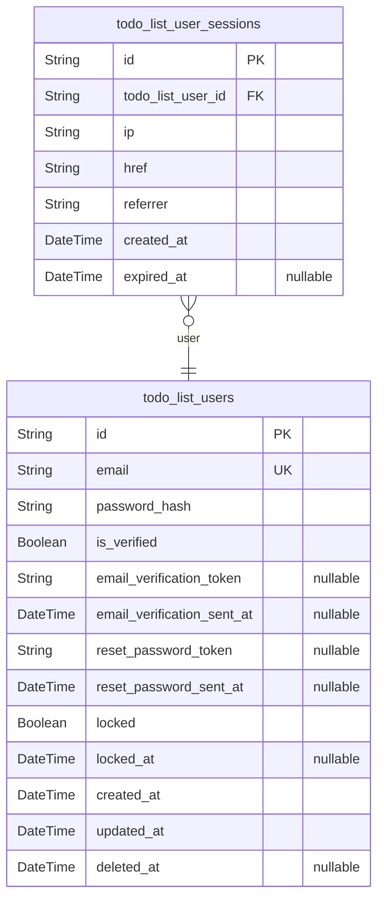
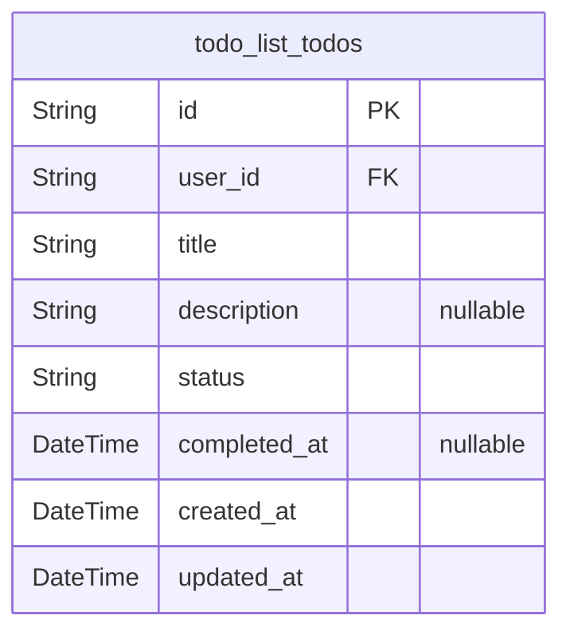

# Prisma Markdown

> Generated by [`prisma-markdown`](https://github.com/samchon/prisma-markdown)

- [Actors](#actors)
- [Tasks](#tasks)

## Actors

```mermaid
erDiagram
"todo_list_users" {
  String id PK
  String email UK
  String password_hash
  Boolean is_verified
  String email_verification_token "nullable"
  DateTime email_verification_sent_at "nullable"
  String reset_password_token "nullable"
  DateTime reset_password_sent_at "nullable"
  Boolean locked
  DateTime locked_at "nullable"
  DateTime created_at
  DateTime updated_at
  DateTime deleted_at "nullable"
}
"todo_list_user_sessions" {
  String id PK
  String todo_list_user_id FK
  String ip
  String href
  String referrer
  DateTime created_at
  DateTime expired_at "nullable"
}
"todo_list_user_sessions" }o--|| "todo_list_users" : user
```

### `todo_list_users`

Registered user table for the Todo List application.

Represents all end users who register, authenticate, and manage their
personal todos. Each user record contains essential authentication fields
(unique email, securely hashed password) and all metadata for identity
lifecycle events such as registration, email verification, password reset
tokens, and account status flags.

This model enforces unique email addresses, secure credential policy, and
account isolation for each user. It provides necessary fields for
business processes including registration, password reset, email
confirmation, locked/active status, and full account deletion lifecycle.
The table is primary for independent user management, supports full CRUD,
and underpins all authentication and authorization logic.

Properties as follows:

- `id`: Primary Key.
- `email`
  > User email address, used as the primary login credential. Must be unique
  > and conform to email format standards. Required for registration and
  > login.
- `password_hash`
  > Secure hash of the user's password. Never stores plaintext. Only hash
  > output is allowed (e.g., bcrypt, argon2).
- `is_verified`
  > Flag indicating if the user's email has been successfully verified. True
  > when verification process completed.
- `email_verification_token`
  > One-time token used to confirm user email verification. Null if already
  > verified or immediately after verification.
- `email_verification_sent_at`
  > UTC datetime when the last verification email was sent to the user. Null
  > if never sent or already verified.
- `reset_password_token`
  > Unique token used for user-initiated password resets. Null if not in
  > reset flow.
- `reset_password_sent_at`
  > Datetime of when the most recent password reset token was issued (UTC).
  > Used for computing expiration.
- `locked`
  > Flag indicating if the account has been temporarily locked due to
  > repeated failed login attempts or security actions. Used to prevent login
  > until reset.
- `locked_at`
  > Datetime when user account was locked due to authentication failures or
  > administrative actions. Null if not currently locked.
- `created_at`: UTC datetime when the user account was created.
- `updated_at`: UTC datetime when user account was last updated.
- `deleted_at`
  > UTC datetime when user was deleted (account removal). Null if active.
  > Used to ensure full cleanup, may drive future delayed deletion policy.

### `todo_list_user_sessions`

Session and login audit table for registered users.

Each session represents an authenticated login instance, storing
connection context metadata, linkage to user identity, and tracking for
active/expired sessions. Enforces auditing and session lifecycle
management required for compliance, security reviews, and JWT/session
revocation at logout, password reset, or account deletion.

Sessions may support persistent user tokens, device metadata, and are
strictly subsidiary—created and managed through user login and logout
flows. This model does not allow independent CRUD. Essential for
monitoring login activity and enforcing proper security policies.

Properties as follows:

- `id`: Primary Key.
- `todo_list_user_id`: Linked user for this session. Foreign key to [todo_list_users.id](#todo_list_users).
- `ip`: Client IP address from which the session/login was initiated.
- `href`
  > URL or endpoint used at login/session creation. Used for audit and
  > debugging.
- `referrer`
  > Referrer URL at session creation. May be empty but is required for full
  > traceability.
- `created_at`: UTC datetime when the session was created.
- `expired_at`
  > Datetime marking when the session expired or was revoked. Null if session
  > is currently active.

## Tasks

```mermaid
erDiagram
"todo_list_todos" {
  String id PK
  String user_id FK
  String title
  String description "nullable"
  String status
  DateTime completed_at "nullable"
  DateTime created_at
  DateTime updated_at
}
```

### `todo_list_todos`

User-specific todo item entity for personal task management.

Each row represents a single actionable task belonging to exactly one
authenticated user, supporting core CRUD operations and completion
toggling. The table enforces strict single-user ownership through a
foreign key to [todo_list_users](#todo_list_users), ensuring all todos are fully
partitioned by owner—no task is ever shared or visible between users.
Each todo must have a non-empty title (max 100 chars) unique within the
scope of its user, and may contain an optional description (max 1000
chars). The entity tracks creation, last update, and (if completed)
completion timestamps for full auditability of changes, following
business rules for hard (irreversible) deletion. Status field enables
differentiating between incomplete and complete tasks for filtered
queries. No subsidiary, snapshot, or cross-user relationships exist by
design. All access and data changes are strictly scoped to the
authenticated task owner.

Properties as follows:

- `id`: Primary Key. Uniquely identifies the todo item within the system.
- `user_id`
  > Foreign Key. Refers to the owner user account. Enforces strict
  > single-user ownership. [todo_list_users.id](#todo_list_users).
- `title`
  > Title of the todo item. Required; must be unique per user and limited to
  > 100 Unicode characters.
- `description`
  > Optional free-text description (up to 1000 characters) providing
  > additional context for the task. If present, cannot exceed length
  > constraint.
- `status`
  > Current status of the todo item: valid values are 'incomplete' and
  > 'complete'. Dictates the business state for completion queries and
  > toggling.
- `completed_at`
  > Timestamp representing when the item was marked complete. Null if the
  > task is currently incomplete.
- `created_at`
  > Creation timestamp set when the todo is first inserted. Used for default
  > ordering and auditing.
- `updated_at`
  > Timestamp of the most recent update. Updated on every content or status
  > change for robust change traceability.
