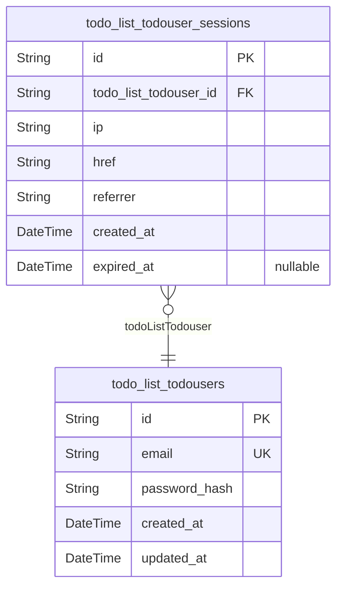
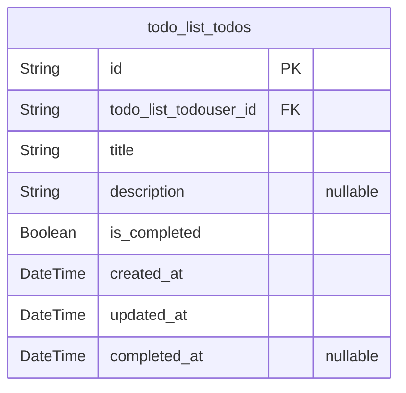

# Prisma Markdown

> Generated by [`prisma-markdown`](https://github.com/samchon/prisma-markdown)

- [Actors](#actors)
- [Todos](#todos)

## Actors

```mermaid
erDiagram
"todo_list_todousers" {
  String id PK
  String email UK
  String password_hash
  DateTime created_at
  DateTime updated_at
}
"todo_list_todouser_sessions" {
  String id PK
  String todo_list_todouser_id FK
  String ip
  String href
  String referrer
  DateTime created_at
  DateTime expired_at "nullable"
}
"todo_list_todouser_sessions" }o--|| "todo_list_todousers" : todoListTodouser
```

### `todo_list_todousers`

Represents a single authenticated todo user ("todoUser" actor) who can
sign up, log in, and manage their own todo items. Each user is uniquely
identified by their email, which must be unique and not null. Stores
credential and minimal profile information (email, password hash) and
audit fields for registration and account changes. Used as the reference
owner for all related todos via foreign key from the business domain.
Passwords are stored as secure hashes only.

Properties as follows:

- `id`: Primary Key.
- `email`
  > Unique email address of the user. Must be a valid email and unique across
  > all users. Used for authentication and login.
- `password_hash`
  > Bcrypt or secure hash of the user's authentication password. Never stores
  > plaintext. Used for verifying login credentials.
- `created_at`: Timestamp of account creation. Used for audit and registration history.
- `updated_at`
  > Timestamp of last update to user account. Updated automatically when
  > profile or credentials change.

### `todo_list_todouser_sessions`

Session records for each login/authentication event of a todo user. Each
session is directly owned by a single todo user and represents a
persistent login/token session (for JWT, refresh, etc). Audit fields
include IP, connection context, creation and optional expiry timestamps.
Sessions are referenced by session tokens and provide a complete
login/session audit log for each user. Managed through the
identity/authentication system. Sessions are not exposed for independent
CRUD and are always subsidiary to the owning user.

Properties as follows:

- `id`: Primary Key.
- `todo_list_todouser_id`: Belonged user's [todo_list_todousers.id](#todo_list_todousers)
- `ip`
  > IP address of the client at session creation time. Used for audit and
  > session context.
- `href`
  > Connection URL (entry point or referer) for traceability. Used for
  > session context in audits.
- `referrer`
  > HTTP referrer or origin URL when session was established. Used for
  > session traceability.
- `created_at`: Session creation timestamp. Used for session audit and ordering.
- `expired_at`: Session expiry or logout time. Nullable; if null, session is still valid.

## Todos

```mermaid
erDiagram
"todo_list_todos" {
  String id PK
  String todo_list_todouser_id FK
  String title
  String description "nullable"
  Boolean is_completed
  DateTime created_at
  DateTime updated_at
  DateTime completed_at "nullable"
}
```

### `todo_list_todos`

A todo business entity owned strictly by a single todoUser. Each record
represents a personal todo item with title, optional description,
completion status, timestamps, and ownership reference. Enforces all
business constraints as required: only the owning user can create, view,
update, complete, or delete the todo. No sharing, delegation, or
multi-user relations exist. Business validation (title and description
rules, unique id, timestamps, and state transitions) is handled at the
field level. Tightly coupled to [todo_list_todousers](#todo_list_todousers) for ownership
and permission enforcement.

Properties as follows:

- `id`: Primary Key.
- `todo_list_todouser_id`
  > Owner's [todo_list_todousers.id](#todo_list_todousers). Enforces strict ownership; only
  > the referenced todoUser can manage this todo.
- `title`
  > Short, required title of the todo item. Cannot be empty or
  > whitespace-only; maximum 100 characters per business rule.
- `description`
  > Optional details or notes for the todo. May be empty or null; must not
  > exceed 500 characters if present.
- `is_completed`
  > Indicates whether the todo is completed (true) or not (false). Only
  > boolean values are allowed per requirements. Business logic ensures
  > consistent state transitions.
- `created_at`
  > Timestamp when the todo was created. System-assigned; required for
  > traceability.
- `updated_at`
  > Timestamp for the last modification of the todo. System-assigned;
  > required for audit traceability.
- `completed_at`
  > Timestamp when the todo was marked as completed. Required and set only
  > when is_completed is true; must be null or omitted when is_completed is
  > false. Used for audit/history. Nullable as per business rule.
