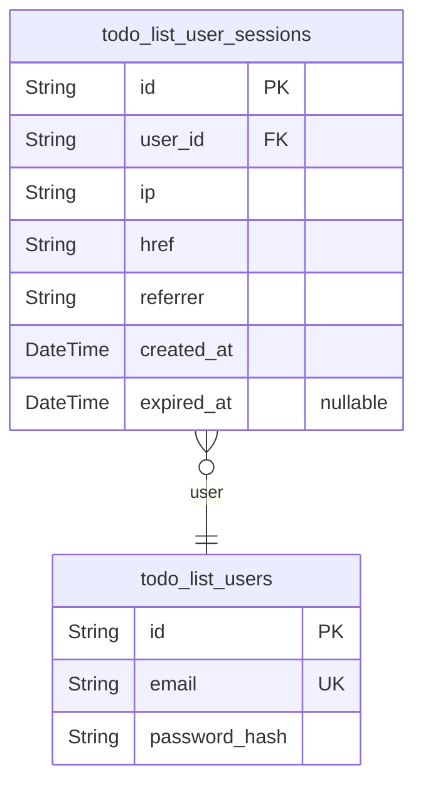
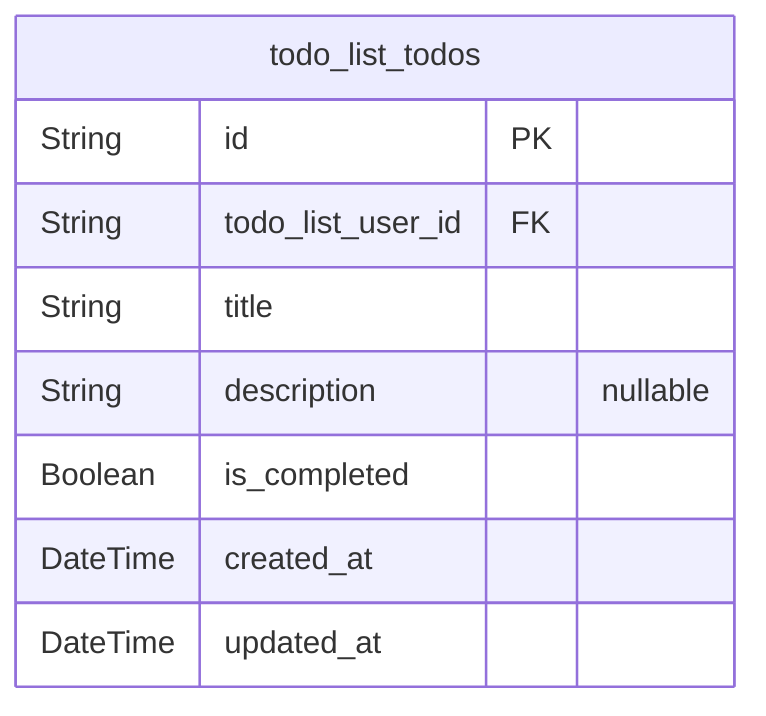

# Prisma Markdown

> Generated by [`prisma-markdown`](https://github.com/samchon/prisma-markdown)

- [Actors](#actors)
- [Todos](#todos)

## Actors

```mermaid
erDiagram
"todo_list_users" {
  String id PK
  String email UK
  String password_hash
}
"todo_list_user_sessions" {
  String id PK
  String user_id FK
  String ip
  String href
  String referrer
  DateTime created_at
  DateTime expired_at "nullable"
}
"todo_list_user_sessions" }o--|| "todo_list_users" : user
```

### `todo_list_users`

User accounts for the Todo List application.

Stores core authentication data for each registered user, supporting
secure, unique identification and credential management. Each user is
uniquely identified by their email address, which is validated for
uniqueness and required at registration.

Password hashes are stored using industry-standard secure
algorithms—never in plaintext—to enforce privacy and security policies.
The table enforces hard deletion to comply with irreversible data removal
business rules. No personal information beyond email and password hash is
retained, following strict data minimization.

This table supports user registration, authentication, and password
management workflows. All todos created in the system are strictly owned
by a single user, and access is limited to each user's personal data
only. No profiles, roles, or external identities are used. No soft delete
or audit trail is maintained for user accounts.

Properties as follows:

- `id`: Primary key uniquely identifying each user account.
- `email`
  > User's unique email address used for registration and authentication.
  > Must be unique. Required at account creation. Used for login,
  > notifications, and password reset workflows. Max length 254 characters
  > per business validation rules.
- `password_hash`
  > Bcrypt (or similarly secure) password hash for authentication.
  > Never stores plaintext passwords. Only secure cryptographic hashes. Used
  > exclusively for login verification and password reset workflows.

### `todo_list_user_sessions`

User session tracking for the Todo List application.

Records the authenticated session state for each user, allowing secure,
multi-device login, accurate audit of session creation and expiration,
and mandatory session termination scenarios (such as password reset or
logout everywhere).

Each session is associated with a user and contains contextual metadata
(IP, URL, referrer), along with creation and optional expiration time.

Sessions are never independently managed or visible to users except via
authentication flows—they are subsidiary entities for security and
traceability only. There is no soft or hard delete after logout—sessions
are purged per standard clean-up policies. Only one session table is
maintained for the sole actor type (user).

Properties as follows:

- `id`: Primary key uniquely identifying each session record.
- `user_id`
  > Foreign key referencing the owning user account. {@link
  > todo_list_users.id}.
- `ip`
  > The IP address from which the session was established. Used for security
  > and audit tracing.
- `href`
  > The full URL of the client connection at session start. Captured to
  > provide context for the session's origin.
- `referrer`
  > Referrer URL indicating the previous location before authentication or
  > session establishment. Used for session context and debugging.
- `created_at`: Timestamp when the session was created.
- `expired_at`
  > Optional timestamp marking when the session expired or was terminated.
  > Nullable. Used for session lifecycle enforcement.

## Todos

```mermaid
erDiagram
"todo_list_todos" {
  String id PK
  String todo_list_user_id FK
  String title
  String description "nullable"
  Boolean is_completed
  DateTime created_at
  DateTime updated_at
}
```

### `todo_list_todos`

Core business entity representing a personal todo item owned by a
registered user.

Stores all user-created tasks for the Todo List application. Every todo
is linked to exactly one user through the todo_list_users table,
guaranteeing strict per-user privacy and ownership boundaries. Fields
include a unique identifier, a required textual title, and an optional
description for expanded task notes. Only the owner may read, update, or
delete their own todos; cross-user access is strictly prohibited by
design.

Completion state is indicated by a boolean is_completed flag, enabling
users to filter or display completed and active todos. Each todo records
its creation and last modification timestamps to facilitate ordered
listings and update tracking. Deletion occurs as an immediate,
irreversible operation with no soft delete, recycling, or recovery
feature—a requirement explicitly defined for privacy and simplicity in
the MVP.

Indexes ensure fast lookup and retrieval by user and creation date, while
all field validation rules and usage patterns conform to minimal,
single-user, and privacy-centric business needs. No auxiliary or
historical tables are present, as per requirements.

Properties as follows:

- `id`: Primary Key.
- `todo_list_user_id`
  > Foreign key referencing the owner user. Each todo belongs to exactly one
  > user; enforces strict per-user data boundaries. {@link
  > todo_list_users.id}.
- `title`
  > Required title of the todo. Must be 1 to 255 non-whitespace characters.
  > Serves as the main identifying label for the user's task.
- `description`
  > Optional extended notes for the todo, up to 1024 characters. Provides
  > additional context or instructions for the user's private use.
- `is_completed`
  > True if the todo is marked completed by the user, false otherwise. Used
  > for workflow and list filtering.
- `created_at`
  > Timestamp of when the todo was created. Used for ordering and audit
  > purposes.
- `updated_at`
  > Timestamp of the most recent update to the todo. Updated on modification
  > of title, description, or completion status.
