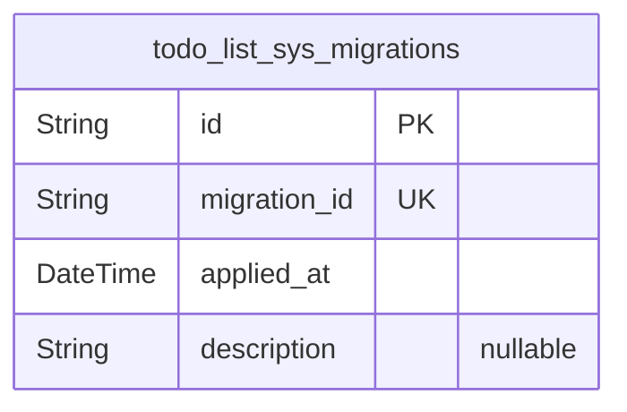
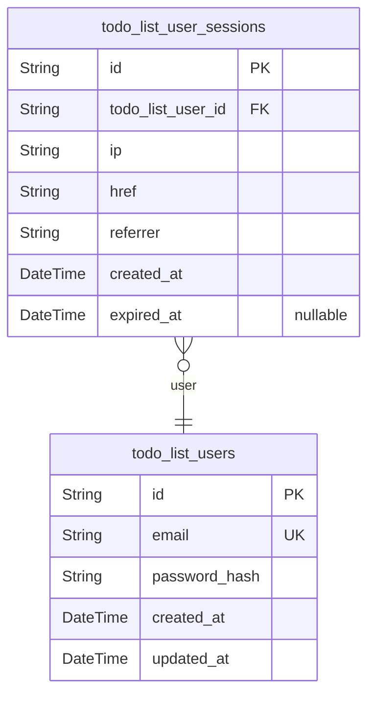
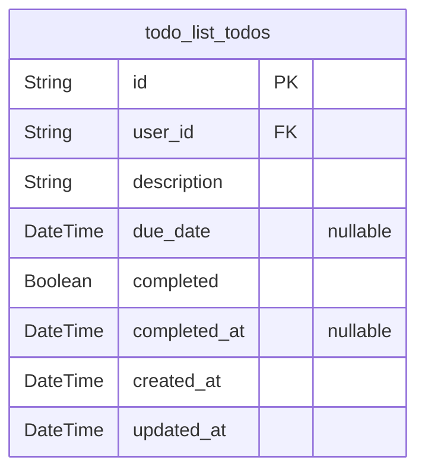

# Prisma Markdown

> Generated by [`prisma-markdown`](https://github.com/samchon/prisma-markdown)

- [Systematic](#systematic)
- [Actors](#actors)
- [Todos](#todos)

## Systematic

```mermaid
erDiagram
"todo_list_sys_migrations" {
  String id PK
  String migration_id UK
  DateTime applied_at
  String description "nullable"
}
```

### `todo_list_sys_migrations`

Migration and system control table for the Todo List database schema.

This model records migration identifiers, state, and timestamps to
support schema evolution, tracking, and deployment stability across
system environments. It is not referenced by business logic or API
endpoints, but is included to fulfill enterprise architectural principles
and validation requirements.

Only system administrators or database processes interact with this
table. Its existence ensures foundational compliance, traceability for
schema changes, and compatibility for future infrastructure extensions
within the backend system.

Properties as follows:

- `id`: Primary key for the migration/control entry.
- `migration_id`
  > Unique identifier for the schema migration event or version. Used by
  > internal system tooling to track and validate upgrade status.
- `applied_at`: Timestamp recording when this migration was applied to the database.
- `description`
  > Optional free-text description or comments about the migration event. Can
  > be used for system notes or audit context.

## Actors

```mermaid
erDiagram
"todo_list_users" {
  String id PK
  String email UK
  String password_hash
  DateTime created_at
  DateTime updated_at
}
"todo_list_user_sessions" {
  String id PK
  String todo_list_user_id FK
  String ip
  String href
  String referrer
  DateTime created_at
  DateTime expired_at "nullable"
}
"todo_list_user_sessions" }o--|| "todo_list_users" : user
```

### `todo_list_users`

Registered user accounts for the Todo List application.

Each record holds unique identity for a user, including required
authentication credentials. Users authorize via email and password; email
address is globally unique and used for login, password is securely
hashed. All personal Todos are owned and accessible exclusively by their
respective user identity.

Enforces strict privacy isolation—no cross-user data is accessible.
Contains timestamps for creation and last update. User accounts are
independently managed; deletion removes all associated Todos and
sessions.

Properties as follows:

- `id`: Primary key. Globally unique identifier for each user account.
- `email`
  > User's email address, used as the login credential. Must be globally
  > unique and verified. Acts as the public identifier for account access.
- `password_hash`
  > Secure hash of the user's password. Used strictly for authentication;
  > never stores plain values. Follows strong cryptographic standards for
  > storage.
- `created_at`
  > Timestamp when the user account was created. Set automatically by the
  > system.
- `updated_at`
  > Timestamp when user credentials or identity details were last updated.
  > System-managed, changes on any user update.

### `todo_list_user_sessions`

Session records for authenticated user activity in the Todo List
application.

Each entry traces a unique authenticated session for a user, supporting
secure management of access tokens, refresh cycles, and audit trails.
Sessions capture the originating user's identity, connection metadata,
creation/expiry timestamps, and related security context. Enables token
rotation, detection of concurrent logins, and session expiration handling
per security requirements.

Directly references a user account; deletion of a user cascades removal
of all sessions. Does not store tokens directly, ensures single-user
privacy, and is system-owned for audit trace only.

Properties as follows:

- `id`: Primary key. Globally unique identifier for each user session record.
- `todo_list_user_id`
  > References the account owner of this session. Links each session to a
  > single user by foreign key. [todo_list_users.id](#todo_list_users).
- `ip`
  > The IP address from which the user established this session. Mandatory
  > for connection traceability and audit.
- `href`
  > The URL from which the session was initiated. Captures the connection
  > context at login.
- `referrer`
  > The referrer URL at session start. Used for security context and tracking
  > origin flows.
- `created_at`
  > Timestamp at which this session was created. Recorded at the moment of
  > user authentication.
- `expired_at`
  > Timestamp when this session expired or was invalidated. NULL if session
  > is still active.

## Todos

```mermaid
erDiagram
"todo_list_todos" {
  String id PK
  String user_id FK
  String description
  DateTime due_date "nullable"
  Boolean completed
  DateTime completed_at "nullable"
  DateTime created_at
  DateTime updated_at
}
```

### `todo_list_todos`

Todo item for a single authenticated user.

Represents an individual task managed by the user, with a required
description, optional due date, completion status, and precise owner
reference. Each Todo is strictly owned by a single user, and the system
ensures no cross-user data access or visibility. Deleted Todos are
permanently erased—this model supports only active storage, not soft
deletes. Timestamps record creation, update, and completion events for
full business traceability. Enforces per-user uniqueness on (description,
due date) to prevent duplicates. Rows are never fragmented: one entity
per row, minimal as per domain rules.

Properties as follows:

- `id`
  > Primary key for the Todo item. Unique identifier for each Todo, generated
  > as a UUID v4.
- `user_id`: The owner of this Todo item. References [todo_list_users.id](#todo_list_users).
- `description`
  > Required task description. Must not be blank or exceed 250 characters.
  > Used to identify the Todo's main purpose for the owner.
- `due_date`
  > Optional due date for the Todo. If set, must be an ISO 8601 future date.
  > Nullable when not specified.
- `completed`
  > Boolean flag indicating whether the task is completed. Default is false;
  > set to true upon completion.
- `completed_at`
  > Timestamp marking when the Todo item was completed. Set only when
  > completed is true; null otherwise.
- `created_at`: Timestamp of initial Todo creation. Set by the system, never updated.
- `updated_at`
  > Timestamp of the last update to the Todo, reflecting description, due
  > date, or completion status changes.
