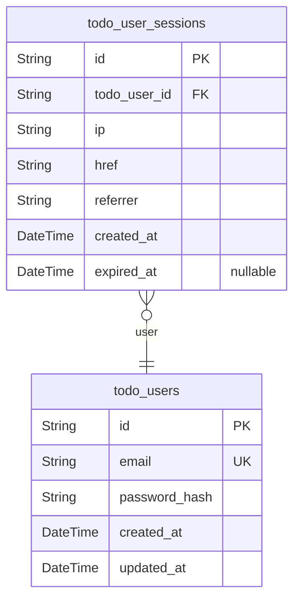
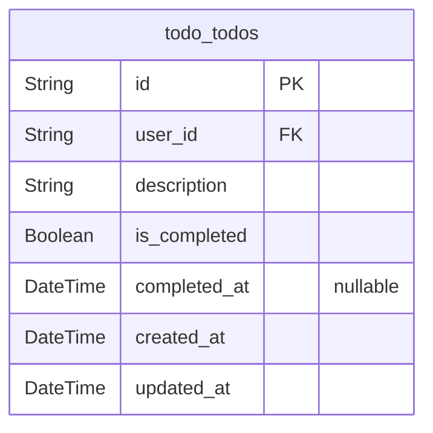

# Prisma Markdown

> Generated by [`prisma-markdown`](https://github.com/samchon/prisma-markdown)

- [Actors](#actors)
- [Todos](#todos)

## Actors

```mermaid
erDiagram
"todo_users" {
  String id PK
  String email UK
  String password_hash
  DateTime created_at
  DateTime updated_at
}
"todo_user_sessions" {
  String id PK
  String todo_user_id FK
  String ip
  String href
  String referrer
  DateTime created_at
  DateTime expired_at "nullable"
}
"todo_user_sessions" }o--|| "todo_users" : user
```

### `todo_users`

User account and authentication record for the minimal Todo List
application.

Represents an individual user with private access to their own todo
items. Stores unique email for identity, a securely hashed password for
authentication, and all fields required for secure registration and
sign-in per MVP requirements.

Each user entry is isolated to ensure privacy and prevent any cross-user
access. Removal of a user cascades to all dependent sessions and todos
for privacy and compliance. No role or privilege fields: users are always
basic end-users in this system.

Properties as follows:

- `id`
  > Primary key for the user. Unique, unguessable identifier for user account
  > records.
- `email`
  > User's unique email address for authentication and identity recovery.
  > Must be unique in the system per privacy and login requirements.
- `password_hash`
  > BCrypt or Argon2 hash of the user's password. Never stores plain text;
  > used solely for authentication and verification.
- `created_at`: Timestamp for when the user account was created.
- `updated_at`
  > Timestamp for the most recent update to this user's account (email,
  > password, etc.).

### `todo_user_sessions`

Audit and security tracking of authentication sessions for each user.

Stores login session metadata (creation, expiration), and connection
context (IP, referrer, visited URL). Each session references a user and
is removed if the user is deleted. Provides the backbone for
authentication flows, token invalidation, and session management per
privacy, security, and audit requirements. No device or user agent fields
included as MVP requires only essential context for traceability.

Properties as follows:

- `id`
  > Primary key for the session. Unique identifier for each authentication
  > session instance.
- `todo_user_id`
  > Foreign key referencing the owner of this session. Links each session to
  > a specific user. [todo_users.id](#todo_users).
- `ip`
  > IP address from which the session was initiated for auditing and session
  > traceability.
- `href`
  > URL at the time session was created, for security audit and origin
  > verification.
- `referrer`
  > HTTP referrer when session was created, for basic session tracing and
  > anti-abuse context.
- `created_at`: Timestamp for when the session was established.
- `expired_at`
  > Timestamp for when the session expired, was revoked, or logged out. Null
  > if session is active.

## Todos

```mermaid
erDiagram
"todo_todos" {
  String id PK
  String user_id FK
  String description
  Boolean is_completed
  DateTime completed_at "nullable"
  DateTime created_at
  DateTime updated_at
}
```

### `todo_todos`

Primary table storing all todo items for the application. Each todo is
exclusively owned and managed by a single authenticated user.

This model represents the complete lifecycle of a user's personal todo
task. It enforces strict privacy: only the owning user may create, view,
update, toggle, or delete the todo. All business, security, and audit
requirements are enforced through the schema, supporting item creation,
description editing, status toggling (complete/incomplete), and permanent
deletion.

Timestamps for creation, last update, and completion are recorded for
auditing and workflow support. The table is strictly normalized; every
todo is directly linked to a user through a non-null foreign key,
ensuring there are never any orphaned todos. All content length and
validation constraints are implemented at the DB level, with additional
protection against user ID abuse or cross-user access through user_id
indexing.

Properties as follows:

- `id`: Primary Key. Uniquely identifies each todo item.
- `user_id`
  > Foreign key linking to the owning user. Must always reference an existing
  > user. Required for all CRUD operations and ensures strict privacy. {@link
  > todo_users.id}.
- `description`
  > User-supplied description of the todo item. Must be between 1 and 255
  > characters after whitespace is trimmed. Required for creation and all
  > updates.
- `is_completed`
  > Completion status of the todo. True if complete, false if incomplete.
  > Default is false on creation.
- `completed_at`
  > Timestamp marking when the todo was last marked as complete. Null if
  > never completed or reset when marked incomplete.
- `created_at`
  > Timestamp marking when the todo was created. Always set at creation and
  > immutable.
- `updated_at`
  > Timestamp of the last update to any todo property. Always updated when
  > description or completion status changes.
