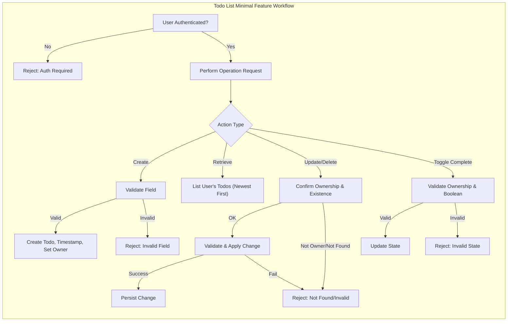

# Functional Requirements for Minimal Todo List Application

## Essential Features

### Minimal Scope & Feature Set
- THE system SHALL allow authenticated users to create Todo items describing tasks they wish to track.
- THE system SHALL allow each user to retrieve a list of all their current Todo items.
- THE system SHALL allow users to mark any Todo item as completed or not completed.
- THE system SHALL allow users to update the title/description of any of their existing Todo items.
- THE system SHALL allow users to delete any of their own Todo items.
- THE system SHALL require user authentication for any access or action with a Todo item.

### Explicit Functional Requirements (EARS)
1. WHEN a user submits a request to create a Todo, THE system SHALL save the new Todo item, associating it with that user.
2. WHEN a user requests their Todo list, THE system SHALL return a complete list of the user's active Todo items, in descending order of creation time (newest first).
3. WHEN a user updates a Todo item, THE system SHALL save only if the Todo belongs to that user and provided data passes validation.
4. WHEN a user deletes a Todo, THE system SHALL remove that Todo from their list, provided the user is the creator.
5. WHEN a user toggles the completion status of a Todo, THE system SHALL update the Todo's status accordingly and persist the updated state for that user only.
6. WHERE a user is not authenticated, THE system SHALL deny all Todo-related operations and report authentication required.
7. IF a user attempts to access, update, or delete a Todo they do not own, THEN THE system SHALL prevent the action and inform the user that resource does not exist.
8. THE system SHALL provide accurate counts of total Todos and completed Todos upon request.
9. WHEN a Todo is created or updated, THE system SHALL timestamp the operation for audit and business record-keeping.

## Business Rules

### Ownership & Access
- THE system SHALL restrict each user to accessing only Todo items created by that user.
- WHERE a Todo item does not belong to the requesting user, THE system SHALL treat it as non-existent for all business purposes.
- THE system SHALL require all operations (create, update, delete, mark complete/incomplete, retrieve) to occur only within the authenticated user session scope.

### Data Lifecycle
- THE system SHALL retain deleted Todos only long enough to complete the business process (no restore/undo requirements for minimal system).
- THE system SHALL store a creation timestamp and last modification timestamp for every Todo item.
- THE system SHALL initialize every new Todo as not completed by default.

### Functional Integrity
- THE system SHALL not allow batch actions (all operations are single-Todo at a time).
- THE system SHALL not support subtasks, labels, priorities, deadlines, or attachments.
- THE system SHALL not allow edit or delete operations on another user's Todo item under any circumstance.

## Validation Requirements

### Input Field Validation
- WHEN a user creates or updates a Todo, THE system SHALL validate that the title/description is a non-empty UTF-8 string with a length between 1 and 255 characters.
- IF the title/description is blank, THEN THE system SHALL reject the request with a message explaining the requirement.
- IF input exceeds maximum length, THEN THE system SHALL reject the request with a message indicating the maximum allowed size.
- WHERE an input contains only whitespace, THE system SHALL treat it as invalid.

### Identity Validation
- WHEN performing any action, THE system SHALL confirm the authenticated user identity and only allow operations on their own Todo items.

### State Validation
- IF a requested Todo to update or delete does not exist under the authenticated user, THEN THE system SHALL return a not-found response (without specifying whether the ID exists globally for security).
- WHEN a Todo status is toggled to completed or not completed, THE system SHALL accept only boolean state values.

## Performance Expectations

- THE system SHALL respond to all user actions (create, read, update, delete, mark complete/incomplete) within 1 second under normal operating conditions.
- THE system SHALL process and reflect changes instantly to the user experience (i.e., user observes the updated Todo state upon operation success without delay).
- THE system SHALL support at least 10 requests per second per authenticated user for Todo CRUD operations, with no noticeable performance degradation.
- THE system SHALL ensure that user authentication/authorization checks add at most 100ms to any action on their own Todos.

## Core Functional Flow Diagram

## Summary Table: Essential Features

| Feature                      | Description                                                      |
|------------------------------|------------------------------------------------------------------|
| Create Todo                  | User can create a new Todo item with basic text/description      |
| List Todos                   | User can view all their Todos (newest first)                     |
| Mark As Complete/Incomplete  | User can toggle completion status for a Todo                     |
| Update Todo                  | User can edit text/description of their own Todo                 |
| Delete Todo                  | User can remove their own Todo item                              |

## Key Business Constraints (for minimal system)
- Single user type: only registered users manage own Todos via API
- No sharing, no collaborative features, no labels/priorities/deadlines
- No admin, no moderation; user can only interact with own data
- Only core CRUD and toggle complete operations are allowed
- All error messages must avoid exposing existence of other users’ data or Todo items

## Compliance with Related Documents
For broader operational, error-handling, and business process requirements, refer to:
- [Service Overview](./01-service-overview.md)
- [User Roles and Authentication](./04-user-roles-and-authentication.md)
- [Business Rules and Validation](./07-business-rules-and-validation.md)
- [Exception Handling and Error Scenarios](./08-exception-handling-and-error-scenarios.md)