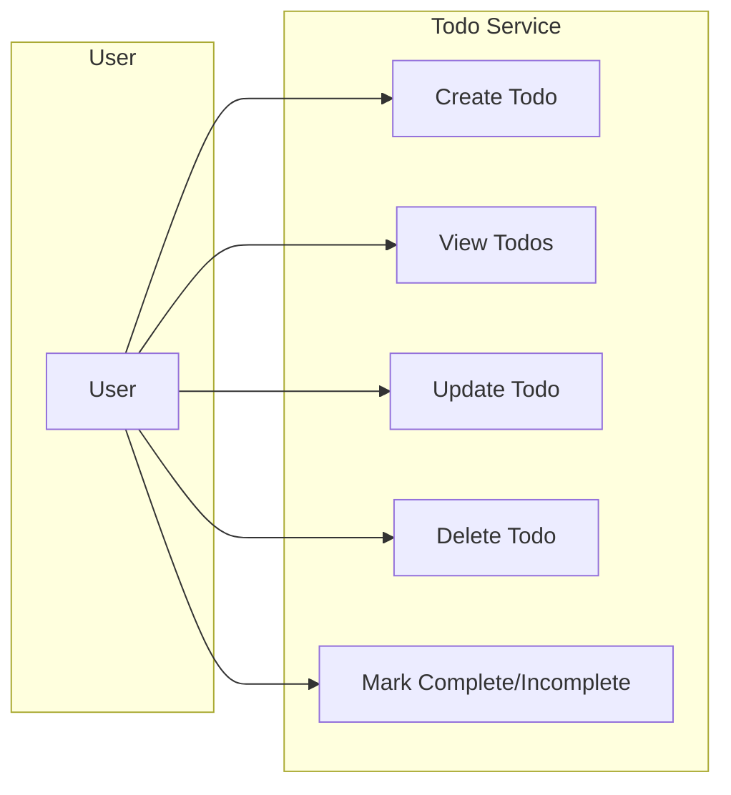

# Functional Requirements for Todo List Service

## Introduction and Context
The Todo List application provides a minimal, robust platform for authenticated users to record, view, manage, and complete their personal tasks. This requirements document defines every core behavior, business rule, and functional boundary using EARS (Easy Approach to Requirements Syntax), ensuring clarity and testability for backend development. Scope is strictly limited to essential features: CRUD for todo items, completion tracking, task ordering, filtering, and user/data operation validation. No collaborative, reminder, or categorization features are in scope. All logic presumes a single authenticated user context per operation.

## Task Management Features (CRUD)

### Creating Todos
- WHEN a user submits a request to create a new todo item, THE service SHALL create a new todo entry associated with that user.
- THE service SHALL require that the todo item has a non-empty title provided by the user.
- IF the todo title is missing or empty, THEN THE service SHALL reject the creation and provide a reason to the user.
- WHEN a user creates a todo, THE service SHALL set its default status to "incomplete".
- WHEN a user creates a todo, THE service SHALL record the creation datetime in UTC.

### Viewing Todos
- WHEN a user requests to view their todo list, THE service SHALL return all todo items created by that user, ordered by creation datetime descending (most recent first), unless otherwise specified.
- THE service SHALL allow users to view their todos paginated, showing a fixed number per page (20 by default).
- IF a user attempts to view todos without being authenticated, THEN THE service SHALL deny access and respond with an authentication error.

### Updating Todos
- WHEN a user submits a request to update one of their todo items, THE service SHALL update the content of that todo if and only if it belongs to the requesting user.
- IF a user attempts to update a todo not owned by them, THEN THE service SHALL reject the update and notify the user of insufficient permissions.
- WHEN updating a todo, THE service SHALL support updating the title and description fields, both adhering to validation rules stated below.
- WHEN a user submits an update with an empty title, THEN THE service SHALL reject the update and provide the user with a descriptive error message.
- THE service SHALL update the 'last modified timestamp' each time a todo is updated (tracked in UTC).

### Deleting Todos
- WHEN a user requests to delete a todo item they own, THE service SHALL permanently remove that todo from their list; deletes are non-reversible and data cannot be recovered.
- IF a user attempts to delete a todo not owned by them, THEN THE service SHALL reject the request and inform the user of a permission error.

## Completion Tracking
- WHEN a user marks a todo item as complete, THE service SHALL update the item's status to "complete" and record a UTC completion timestamp.
- WHEN a user marks a previously completed todo as incomplete, THE service SHALL update the status back to "incomplete" and clear the completion timestamp.
- THE service SHALL allow users to filter their todo list by "complete" or "incomplete" status, supporting both ad hoc and default queries.

## Ordering and Filtering
- THE service SHALL allow users to order their todo list by creation date (newest first or oldest first).
- THE service SHALL allow users to order their todo list by completion date, showing completed items in the selected order.
- THE service SHALL allow users to request only "complete" or only "incomplete" tasks via filter parameter.
- THE service SHALL always return results paginated, with a default of 20 per page, to ensure query efficiency even for large lists.

## Input Validation and Access Rules
- THE service SHALL enforce that each todo item must have a non-empty title up to 255 characters in length.
- THE service SHALL support an optional description field, up to 1,000 characters.
- THE service SHALL reject any todo item with a title or description exceeding the prescribed length limits.
- THE service SHALL restrict access to todo operations (view, update, delete) so that only the authenticated user may perform actions on their own tasks.
- IF a user attempts to access, modify, or delete any todo item that does not belong to them, THEN THE service SHALL reject the operation and return an explicit authorization error message.
- WHILE performing any todo operation, THE service SHALL ensure all required fields are present and valid prior to processing.

## Functional Requirement Traceability Table
| Feature                        | EARS Reference/Description                                                   |
|------------------------------- |----------------------------------------------------------------------------|
| Create Todo                    | WHEN a user submits a new todo, THE service SHALL create it for that user   |
| View Todos                     | WHEN a user requests their todos, THE service SHALL return only their items |
| Update Todo                    | WHEN a user updates a todo, THE service SHALL allow it if they own it       |
| Delete Todo                    | WHEN a user deletes a todo, THE service SHALL remove it if they own it      |
| Mark Complete/Incomplete       | WHEN a user toggles status, THE service SHALL update it accordingly         |
| Ordering                       | THE service SHALL allow ordering/filtering by creation/completion status    |
| Input Validation               | THE service SHALL validate all input fields before saving/updating          |
| Access Control                 | THE service SHALL restrict all operations to the authenticated user only    |
| Pagination                     | THE service SHALL return results in pages for long lists                    |

## Out of Scope
- Collaborative/sharing features (all data is private to the user)
- Reminders, recurring tasks or scheduled notifications
- Task categories, tags, or prioritization
- Soft deletion (all deletes are permanent)

## Mermaid Diagram: User-Task CRUD Flow

```mermaid
graph LR
  subgraph "User"
    U1["User"]
  end
  subgraph "Todo Service"
    T1["Create Todo"]
    T2["View Todos"]
    T3["Update Todo"]
    T4["Delete Todo"]
    T5["Mark Complete/Incomplete"]
  end
  U1 --> T1
  U1 --> T2
  U1 --> T3
  U1 --> T4
  U1 --> T5
```

## References
- [User Actors and Permissions](./03-user-actors-and-permissions.md)
- [Exception & Error Handling Requirements](./06-exception-error-handling.md)
- [Business Rules and Validation](./07-business-rules-and-validation.md)

## Conclusion
The requirements above represent the authoritative business rules for the minimal Todo List application: single-user CRUD, completion tracking, ordering/filtering, per-user access control, and robust input validation. Only these business features are in scope. Developers should reference this document exclusively for what backend behaviors must be supported; technical design is implementation-defined.