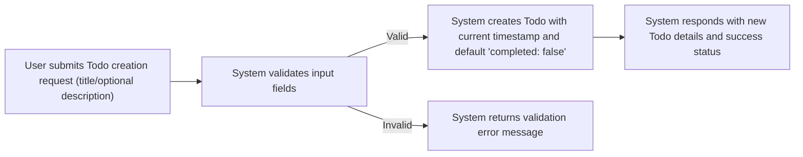
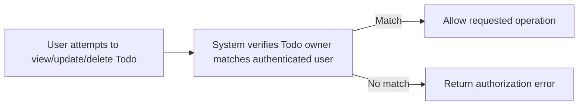

# Functional Requirements for Todo List Service

## Core Functional Requirements

1. WHEN a user is authenticated, THE system SHALL allow the user to create, view, update, and delete their own Todo items.
2. WHEN a user attempts any Todo operation, THE system SHALL require a valid authentication token and SHALL immediately reject requests from unauthenticated or invalid users with clear error messaging.
3. WHEN a Todo operation is performed, THE system SHALL ensure that users can only access and manipulate their own Todo items. Access to other users' items SHALL always be denied, with explicit error responses.
4. WHEN a Todo is created, THE system SHALL record the following mandatory and optional fields:
   - Title (required, 1-100 characters, not blank)
   - Description (optional, up to 1000 characters)
   - Completion status (boolean, default false)
   - Creation and last update timestamps (system-managed, immutable on creation)
5. WHEN listing Todos, THE system SHALL return only Todos owned by the authenticated user. Results SHALL be sorted by creation date (default newest first) and SHALL support optional filtering by completion status (completed/uncompleted/all).
6. WHEN a user marks a Todo as completed/uncompleted, THE system SHALL update the status accordingly and update the modification timestamp.
7. WHEN a user deletes a Todo, THE system SHALL perform a permanent, irreversible removal of that item and confirm deletion in the response.
8. WHEN a user requests all their Todos, THE system SHALL return all Todo items for that user in a single response, paginated as needed.
9. WHEN a user submits a request with missing or invalid data (e.g., blank title, invalid status), THE system SHALL return a validation error with a message indicating which field and rule is violated.
10. WHEN errors or invalid actions occur (e.g., unauthorized access, resource not found), THE system SHALL provide user-friendly, actionable error messages for each scenario.
11. WHEN any operation is performed under normal load conditions (≤100 concurrent users), THE system SHALL complete the action and respond within 2 seconds.

## User Actions & System Reactions

- WHEN a user successfully authenticates, THE system SHALL grant access to Todo management endpoints and allow creation, retrieval, update, and deletion of Todos with appropriate limits and permissions.
- WHEN a user creates a Todo, THE system SHALL validate that the title meets length and non-blank requirements, description does not exceed maximum, and initialize completed as false. Upon success, system SHALL return the created Todo with all metadata.
- WHEN a user requests their Todo list, THE system SHALL return only those Todo items belonging to the authenticated user. If more than 50 Todos exist, system SHALL apply pagination and supply total count.
- WHEN a user attempts to view, update, or delete a Todo, THE system SHALL verify that the authenticated user is the owner before allowing the operation.
- WHEN a user updates a Todo, THE system SHALL permit modification of only the title, description, or completion status fields, update the modification timestamp, and return the updated Todo details.
- WHEN a user deletes a Todo, THE system SHALL perform immediate deletion and return a confirmation message indicating successful and permanent removal.
- WHEN a user tries to access or edit another user's Todo, THE system SHALL return an explicit authorization error and prevent all action regardless of endpoint.
- WHEN a user provides a filter for completed or uncompleted Todos, THE system SHALL apply the filter strictly and return accurate results.
- WHEN a user submits invalid or missing information (e.g., blank title or excessive description), THE system SHALL return validation errors identifying the specific problem for correction.
- WHEN Tempo constraints are relevant, THE system SHALL complete all CRUD operations in under 2 seconds, and respond appropriately if the requirement cannot be met.

## Validation & Business Rules

| Field             | Rule                                                       |
|-------------------|------------------------------------------------------------|
| Title             | Required, 1-100 characters, must not be blank              |
| Description       | Optional, max 1000 characters                              |
| Completion        | Boolean (true or false only)                               |
| Owner             | System derived: must be authenticated user                 |
| createdAt         | System managed, immutable after creation                   |
| updatedAt         | System managed, updates on modification                    |

- WHEN creating a Todo, THE system SHALL reject any title that is empty, only whitespace, or exceeds the allowed length and provide a message clarifying input expectations.
- WHEN updating a Todo, THE system SHALL permit changes only to title, description, and completion status, and SHALL NOT allow modification of owner or creation timestamp. Attempts otherwise SHALL return an error.
- IF a user attempts to update or delete a Todo that does not exist or is not owned by the user, THEN THE system SHALL return a "not found" or "unauthorized" error as appropriate, never exposing the existence of other users' items.
- IF a user submits excessive or invalid input for any field (e.g., too long title), THEN THE system SHALL return a validation error, specifying the constraint breached.
- IF authentication is missing or invalid, THEN THE system SHALL return a 401 Unauthorized error, with a message prompting correct authentication.
- WHEN deleting a Todo, THE system SHALL ensure the item is permanently removed and not recoverable.
- WHILE processing under expected load, THE system SHALL keep all response times for CRUD actions under 2 seconds, and monitor/log any exceptions.
- IF a request would return more than 50 Todos, THEN system SHALL paginate results, reporting total count and current page to the user.

### Example: Todo Creation Flow

```mermaid
graph LR
    A["User submits Todo creation request (title/optional description)"] --> B["System validates input fields"]
    B -->|"Valid"| C["System creates Todo with current timestamp and default 'completed: false'"]
    B -->|"Invalid"| D["System returns validation error message"]
    C --> E["System responds with new Todo details and success status"]
```

### Example: Todo Access Validation

```mermaid
graph LR
    A["User attempts to view/update/delete Todo"] --> B["System verifies Todo owner matches authenticated user"]
    B -->|"Match"| C["Allow requested operation"]
    B -->|"No match"| D["Return authorization error"]
```

## Acceptance Criteria

1. WHEN an authenticated user requests their Todo list, THE system SHALL return only that user's Todos, correctly ordered and filtered, paginated if necessary.
2. WHEN a user attempts to view, update, or delete a Todo item they do not own, THEN THE system SHALL deny the operation and respond with a clear authorization error, never leaking any information about other users' data.
3. WHEN a user creates a Todo with a valid title, THE system SHALL persist the Todo with completed set to false, record all timestamps, and return all data fields per rules.
4. WHEN a user creates a Todo with invalid title (missing, blank, too long), THEN THE system SHALL return a validation error specifying which rule was violated.
5. WHEN a user marks a Todo as completed or uncompleted, THE system SHALL update the completion status, reflect the modification timestamp, and return updated Todo data.
6. WHEN a user deletes their Todo, THE system SHALL remove it immediately, make it inaccessible, and confirm the deletion.
7. IF a user performs any Todo action without valid authentication, THEN THE system SHALL reject the request with a clear 401 Unauthorized error.
8. WHEN more than 50 Todos are requested, THE system SHALL paginate results with total count and current page indicators.
9. All success and error responses SHALL provide user-friendly, actionable messages suitable for end-user presentation and testable in acceptance tests.
10. All actions SHALL complete within 2 seconds under standard conditions; if not, the event SHALL be logged for review.

---

This requirements specification is the authoritative business-level reference for all backend implementation and testing of the Todo List application. Every rule and process described herein must be enforced in all backend APIs, services, and workflows, and all requirements are to be interpreted strictly from the user's perspective. No technical artifacts, database schemas, or protocols are to be included in this document; it serves as the exhaustive business requirements definition for developers.