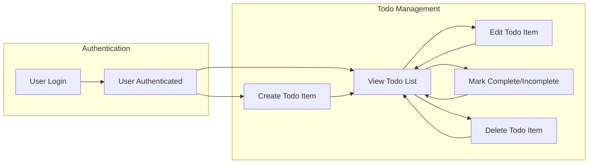

# Minimal Todo List Application – Requirements Analysis

## Introduction & Purpose
Deliver a minimal, production-ready Todo List backend service enabling registered users to privately manage their own list of todo items. Every requirement is framed in natural business language for immediate use by backend engineers. The goal is functional clarity: no unnecessary features beyond the essential todo workflow.

## Business Model Overview
### Why This Service Exists
The service empowers individuals to keep track of their personal tasks in a fast, reliable, privacy-focused digital environment. Value is delivered through immediate usability, data accuracy, and robust user privacy—each user has exclusive access to their own todos. The initial version will refrain from monetization, focusing on utility and daily engagement. Growth is expected through the ease of use, clarity of operation, and user trust.

### Revenue Strategy
No direct monetization or paid features are present in the minimal version. Monetization options, integrations, or premium features may be considered in future versions after initial adoption metrics are achieved.

### Growth Plan
Feature set is deliberately minimal, prioritizing frictionless onboarding and immediate time-to-value for individuals. Growth will be measured by increased daily adoption and task completion rates. User retention is encouraged by seamless experience and reliability.

### Success Metrics
- Number of daily and weekly active users
- Number of todo items added or completed per user
- User retention at 7, 30, and 90 days post-registration
- System reliability by share of successful request completions

## User Actors & Authentication
### User Actor Definition
- **user**: A registered, authenticated user with a private todo list. Users manage, organize, and track only their own todo items. No user can access or view another's data under any circumstance.

### Authentication Requirements
- THE system SHALL require authentication (e.g., secure email/password login) from all actors before any todo data is accessed or modified.
- WHEN a user registers, THE system SHALL initialize and link a todo list exclusively to their account.
- IF any unauthenticated request is made to todo endpoints, THEN THE system SHALL block the action and explain the reason for rejection.
- THE system SHALL enforce session- or JWT-token-based access control with user scoping applied to every action.

## Minimal Functional Requirements (EARS Format)
### Core Todo Management
- THE system SHALL allow each user to create new todo items including a textual description.
- THE system SHALL allow each user to fetch and view all of their own todo items only.
- THE system SHALL allow each user to revise the text of any of their existing todo items.
- THE system SHALL allow each user to mark any of their todo items as complete or incomplete, toggling the state as needed.
- THE system SHALL allow each user to permanently delete any of their own todo items regardless of completion state.
- IF a user attempts to view, update, or delete any todo item that does not belong to them, THEN THE system SHALL refuse the operation with a clear forbidden explanation.

### Data Validation & Item State Transitions
- THE system SHALL require that todo item text is not empty or whitespace-only, and SHALL reject any invalid submissions.
- WHEN an item is marked as complete, THE system SHALL timestamp the event and store this information.
- THE system SHALL allow toggling of todo items between complete and incomplete, storing updated timestamps as required.
- THE system SHALL automatically track the creation timestamp and last modified date for every todo item for audit purposes.

### Permissions & Access
- THE system SHALL restrict all todo actions strictly to the authenticated user's own data.
- IF a user is unauthenticated, THEN the system SHALL deny the requested action and provide a suitable error message.

## Use Cases & User Scenarios
1. **Add Task**: WHEN an authenticated user submits a new todo text, THE system SHALL create and append this to the user's list and provide immediate confirmation.
2. **View Todos**: WHEN an authenticated user requests their todo list, THE system SHALL return all items currently in their list, ordered by newest first.
3. **Edit Todo**: WHEN a user submits updated text for a todo they own, THE system SHALL apply the change and confirm success.
4. **Mark Complete/Incomplete**: WHEN a user toggles a task between complete/incomplete, THE system SHALL record and confirm the new state, including timestamps.
5. **Delete Task**: WHEN a user requests deletion of their todo, THE system SHALL remove it from all subsequent results for that user.
6. **Concurrency**: IF two or more update/delete actions are issued for the same todo simultaneously, THEN THE system SHALL resolve the operation using last-write-wins or a similar technique to prevent data corruption.

## Business Rules & Constraints
- No user may view or modify another user's data under any condition.
- Todo item text is required, cannot be empty or whitespace, and must be unique for that user when created within a 1-minute window.
- The system SHALL not exceed a maximum of 255 characters per todo's description. Longer texts are rejected with a validation error.
- Returned lists of todos are automatically ordered by creation time, newest first.

## Error Handling & User Feedback
- IF required fields are missing, too long, or invalid, THEN THE system SHALL respond with error messages describing the correction required.
- IF a todo update or deletion is requested for a nonexistent or inaccessible item, THEN THE system SHALL reply with a not found or forbidden error, as appropriate.
- IF an internal server problem occurs, THE system SHALL reply with a generic error and suggest retrying later.

## Performance & Non-Functional Expectations
- THE system SHALL respond to every normal todo list action within 1 second.
- THE system SHALL be available at minimum 99.5% of the time, with exceptions only for planned maintenance.
- All data, including audit timestamps, SHALL be retained securely and be accessible only to the correct user.
- THE system SHALL prevent any data leak or cross-user exposure, maintaining strict privacy at all times.

## Mermaid Visualization of User Flows

```mermaid
graph LR
  subgraph "Authentication"
    A["User Login"] --> B["User Authenticated"]
  end
  subgraph "Todo Management"
    B --> C["Create Todo Item"]
    B --> D["View Todo List"]
    D --> E["Edit Todo Item"]
    D --> F["Mark Complete/Incomplete"]
    D --> G["Delete Todo Item"]
  end
  C --> D
  E --> D
  F --> D
  G --> D
```

## Document Constraints
- Only essential todo features described above are permitted in the minimal application.
- Features such as sub-tasks, labels, prioritization, or external integrations are expressly excluded from the MVP, and must not be implemented.
- Technical details like API endpoints or DB schemas are outside the scope of this requirements document.

---

*Developer Note: This document specifies only the business rules and logic for the minimal Todo List backend application. Technical implementation (API, DB, deployment, etc.) will be covered by development phases that follow.*