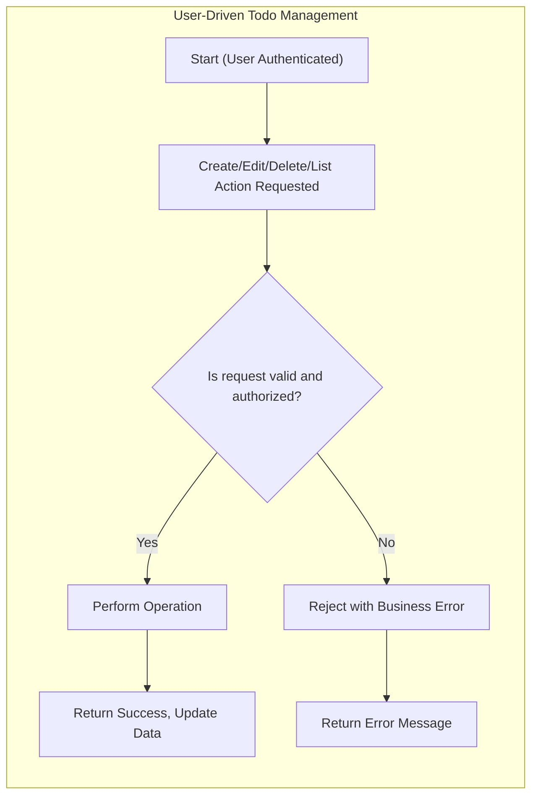

# Functional Requirements for Todo List Application

## Requirement Writing Principles

All requirements are written using the EARS (Easy Approach to Requirements Syntax) methodology. EARS ensures natural-language requirements are specific, clear, and testable. Each functional requirement is fully expressed in EARS template, using keywords WHEN, WHILE, IF, THEN, WHERE, THE, SHALL. All field- or item-specific rules are presented in clear, measurable terms. No implementation-level or UI requirements are included, focusing strictly on business rules and user intent.

## Actionable Items and CRUD Operations

### Create Todo
- WHEN a todoUser submits a new todo item with valid data, THE system SHALL create a new todo belonging exclusively to that user.
- WHEN a todoUser attempts to create a todo, THE system SHALL require a non-empty title field not exceeding 200 characters.
- WHEN a todoUser creates a todo, THE system SHALL accept an optional description field not exceeding 2000 characters.
- WHEN a new todo is created, THE system SHALL set its completion status as "incomplete".
- WHEN a new todo is created, THE system SHALL automatically assign the creation date and associate the todo with the creating user.

### Read/List Todos
- WHEN a todoUser requests a list of todos, THE system SHALL return only todos created by that specific user in descending order of creation date.
- WHEN a todoUser requests details for a specific todo, THE system SHALL return the full data for that todo only if it belongs to the requesting user.
- IF a todoUser requests details for a todo that does not exist or does not belong to them, THEN THE system SHALL notify the user of an access error and provide no data.

### Update/Edit Todos
- WHEN a todoUser edits their own todo, THE system SHALL allow modification of the title to a non-empty string up to 200 characters.
- WHEN a todoUser edits their own todo, THE system SHALL allow modification of the description to a string up to 2000 characters or to null (to delete/clear the description).
- WHEN a todoUser attempts to modify a todo that is not theirs, THEN THE system SHALL deny the action and notify the user of insufficient permissions.
- WHEN a todoUser updates a todo, THE system SHALL update the last modified date for that todo.

### Complete Todo
- WHEN a todoUser marks a todo as complete, THE system SHALL set its status as "completed" and record the completion date.
- WHEN a completed todo is reactivated (marked as incomplete), THE system SHALL remove the completion date and set the status as "incomplete".
- WHEN a user attempts to complete or uncomplete a todo that is not theirs, THEN THE system SHALL deny the action and notify the user of insufficient permissions.

### Delete Todo
- WHEN a todoUser deletes one of their todos, THE system SHALL permanently remove that todo from the user's todo list and database.
- IF a todoUser attempts to delete a todo not owned by them, THEN THE system SHALL deny the action and notify the user of insufficient permissions.
- WHEN a todo is deleted, THE system SHALL ensure all references to that todo are removed for that user.

## Constraints and Validation

### Input Field Constraints
- THE title field SHALL be required, non-empty after whitespace trimming, and have a maximum of 200 characters.
- THE description field SHALL be optional but must not exceed 2000 characters if provided.
- THE system SHALL reject creation or updates where the title or description exceed allowed character lengths.

### Uniqueness and Ownership
- THE system SHALL ensure each todo belongs exclusively to its creator (todoUser).
- THE system SHALL prevent users from viewing, editing, completing, or deleting todos that are not their own.
- WHEN a duplicate todo is created (identical title and description within the same day by the same user), THE system SHALL allow the operation unless non-functional requirements require change.

## Edge Case Handling

- IF a todoUser submits a todo without a title or only whitespace, THEN THE system SHALL reject the request and return a validation error specifying the title is required.
- IF a todoUser attempts to create or update a todo with a title or description exceeding length limits, THEN THE system SHALL reject the request and specify which field is too long.
- IF a todoUser attempts any operation on a todo not owned by them, THEN THE system SHALL deny access and provide a suitable error.
- IF a todo is deleted or not found, THEN THE system SHALL notify the user and confirm the item is no longer accessible.
- IF a todoUser attempts to complete a todo that is already completed, THEN THE system SHALL maintain the status without error.
- IF a todoUser attempts to uncomplete a todo that is already marked as incomplete, THEN THE system SHALL maintain the status without error.

## Success Criteria

- All requirements are satisfied when each CRUD operation, business rule, and validation is implemented exactly as described, and every outcome is testable through clear pass/fail criteria derived from above.
- WHEN a todoUser performs valid operations, THE system SHALL complete the action and confirm to the user that the change was successful.
- WHEN a todoUser performs an invalid or unauthorized operation, THE system SHALL reject and return a clear business error without altering any data.
- WHEN displaying todo lists or details, THE system SHALL ensure no cross-user data is ever returned.

## Summary Table of Major Requirements

| Requirement Area | EARS Example |
|------------------|-------------|
| Create Todo      | WHEN a todoUser submits valid data, THE system SHALL create a new todo for that user. |
| Edit Todo        | WHEN a todoUser edits their todo, THE system SHALL update fields if they meet business rules. |
| Complete Todo    | WHEN a todoUser completes their todo, THE system SHALL set it as completed and timestamp the action. |
| Delete Todo      | WHEN a todoUser deletes their todo, THE system SHALL remove it permanently. |
| View Todos       | WHEN a todoUser requests todos, THE system SHALL return only their own. |
| Validation Error | IF a field exceeds limits, THEN THE system SHALL reject the request with a suitable error. |
| Permission Error | IF a user acts on another's todo, THEN THE system SHALL deny access and notify the user. |

## Mermaid Diagram: Todo CRUD User Flow

```mermaid
graph LR
    subgraph "User-Driven Todo Management"
        A["Start (User Authenticated)"] --> B["Create/Edit/Delete/List Action Requested"]
        B --> C{"Is request valid and authorized?"}
        C -->|"Yes"| D["Perform Operation"]
        C -->|"No"| E["Reject with Business Error"]
        D --> F["Return Success, Update Data"]
        E --> G["Return Error Message"]
    end
```

All requirements above are mandatory and constitute the full functional business contract for backend developers. No requirement may be omitted or relaxed without explicit business review and documentation update.